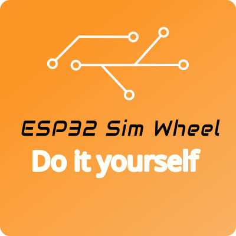

#

    

## Open-source wireless steering wheel or button box for ESP32 boards

This project provides open hardware and software for a sim-racing wheel or button box, featuring:

- 🛜 **Wireless connectivity** via **Bluetooth Low Energy**,
  with no configuration effort.

- 🔌 **Wired connectivity** is also available via **USB**.

- 🗲 Powered by rechargeable **batteries**, wheel base or USB cable.

- 🪫 **State of charge** (for batteries).

- 🧰 Support for many types of **input hardware**:
  button matrices, multiplexed switches, GPIO expanders, shift registers,
  rotary encoders, funky switches...

- 🧑‍🍳 Easy to adapt to your needs:
  a range of off-the-shelf electronics designs are available
  to cover a wide range of applications,
  or you can build your own **custom device**.

- ⎇ **Alternate mode** (mode selector).
  While engaged, any input is reported as an alternate,
  doubling the number of effective inputs.
  Much like your keyboard's SHIFT key.

- 🏎️ **Clutch paddles** that can be mapped to one of five functions by user preference:
  - **F1-style clutch** with bite-point calibration.
  - **Launch control** with bite-point calibration and user-selected master paddle.
  - Alternate mode.
  - Regular button.
  - Individual analog axes.

  Dead zones and polarity of each axis are configurable.

- ⛕ **ALT buttons** that can be mapped to one of two functions by user preference:
  - Alternate mode.
  - Regular button.

- 🕹️ A **directional pad or funky switch**
  may be mapped to one of two functions by user preference:
  - Navigation controls.
  - Regular buttons.
    Navigation controls cannot be assigned to car functions in some simulators.
    This solves that problem.

- 🎮 **Custom button map**.
  The user can customize the button numbering on this wheel to match other wheels.
  This way, the simulator does not force the user to reconfigure
  inputs every time these wheels are swapped.
  You can set your own "factory defaults" too.

- ∿ Adjustable **pulse width** for rotary encoders (by user preference).
  Some simulators may miss a rotation due to their own polling interval.
  This feature alleviates this problem.

- ⛐ **Telemetry** using [SimHub](https://www.simhubdash.com/).
  The supported hardware for display includes RGB LED strips and single-color LEDs "out-of-the-box".
  The firmware is extensible, allowing users to develop their own display hardware.
  The display hardware is also capable of notifying events, such as low battery.

- ⚙️ **Neutral gear** ("virtual" button).
  You can set a button combination to engage a "virtual" button for *neutral gear*.

- 💤 **Automatic shutdown** when not in use.

- 👍 **Quality control** (you don't want your wheel to fail in the middle of a race).

- 🗎 **Extensive documentation**.

- 💰 **Low budget**.

- ✅ **Fully operational**.

- 👷‍♀️State-of-the-art software engineering (no amateur code).

- 🛤️ Printed circuit board designs (not tested, work in progress).

There is a [companion app](https://github.com/afpineda/SimWheelESP32Config) for user preferences,
not mandatory but needed for some features.
A [SimHub plugin](https://github.com/afpineda/SimWheelESP32-SimHub-Plugin/releases)
is required for telemetry.
This plugin can also configure basic user preferences.

> [!IMPORTANT]
> Please start with the [documentation index](./doc/Index_en.md).

## (🇪🇸) Volante inalámbrico de simulador o caja de botones, de fuentes abiertas, para placas ESP32

Este proyecto proporciona hardware y software abierto para un volante de simulación
o una caja de botones con las siguientes características:

- 🛜 **Conectividad inalámbrica** a través de **Bluetooth de baja energía**
  y sin esfuerzo de configuración.

- 🔌 **Conectividad por cable** también disponible mediante **USB**.

- 🗲 Alimentación mediante **baterías** recargables, base del volante o cable USB.

- 🪫 **Estado de la carga** (para baterías).

- 🧰 Soporte para muchos tipos de **hardware de entrada**:
  matrices de botones, interruptores multiplexados,
  expansores de GPIO, registros de desplazamiento,
  codificadores rotativos, funky switches...

- 🧑‍🍳 Fácil de adaptar a sus necesidades:
  Se dispone de una gama de diseños electrónicos listos
  para usar que cubren diversas aplicaciones,
  o puede construir su propio **dispositivo personalizado**.

- ⎇ **Modo alternativo** (selector de modo).
  Mientras está activado, cualquier entrada se reporta como una entrada alternativa,
  duplicando su número en consecuencia.
  Similar a la tecla SHIFT de un teclado.

- 🏎️ **Levas de embrague** que pueden ser configuradas en una de cinco funciones:
  - **Embrague tipo F1** con calibración del punto de mordida
  - **Control de lanzada** con calibración del punto de mordida y leva maestra elegida por el usuario.
  - Modo alternativo
  - Botón normal y corriente
  - Ejes analógicos independientes.

  Tanto las zonas muertas como la polaridad de cada eje se pueden configurar.

- ⛕ **Botones "ALT"** que pueden ser configurados en una de dos funciones:
  - Modo alternativo
  - Botón normal y corriente.

- 🕹️ Una **cruceta direccional o funky switch**
  puede ser configurada en una de dos funciones:
  - Controles de navegación
  - Botones normales y corrientes.
    Los controles de navegación no se pueden asignar a funciones del coche en algunos simuladores.
    Esto solventa dicho problema.

- 🎮 **Mapa de botones definido por el usuario**.
  El usuario puede ajustar la numeración de los botones de manera que
  coincida con cualquier otro volante.
  De esta manera, el simulador no fuerza al usuario a configurar
  las entradas cada vez que intercambia los volantes.

- ∿ **Ancho de pulso** ajustable para los codificadores rotativos (mediante preferencias de usuario).
  Algunos simuladores pueden perderse rotaciones debido a su propio intervalo de muestreo.
  Esta característica alivia este problema.

- ⛐ **Telemetría** mediante [SimHub](https://www.simhubdash.com/).
  El hardware compatible para la visualización incluye tiras LED RGB y LED monocolor «listos para usar».
  El firmware es extensible, lo que permite a los usuarios desarrollar su propio hardware de visualización.
  El hardware de visualización también es capaz de notificar eventos tales como batería baja.

- ⚙️ **Punto muerto** (botón "virtual").
  Puede asignar una combinación de botones para activar un botón "virtual"
  como *punto muerto* (marcha neutra).

- 💤 **Apagado automático** cuando no se usa.

- 👍 **Controles de calidad**
  (no queremos que el volante falle en medio de una carrera).

- 🗎 **Documentación extensa**.

- 💰 **Costes contenidos**.

- ✅ **Totalmente operativo**.

- 👷‍♀️Ingeniería software según el estado de la cuestión (nada de código de aficionado).

- 🛤️ Diseños de placa de circuitos (sin probar, trabajo en curso).

Existe una [aplicación auxiliar](https://github.com/afpineda/SimWheelESP32Config) para las preferencias de usuario,
no obligatoria, pero necesaria para algunas funcionalidades.
Un [plugin para SimHub](https://github.com/afpineda/SimWheelESP32-SimHub-Plugin/releases)
es necesario para la telemetría.
Este plugin también puede configurar las preferencias básicas del usuario.

> [!IMPORTANT]
> Por favor, comience por el [índice de documentación (en inglés)](./doc/Index_en.md).
