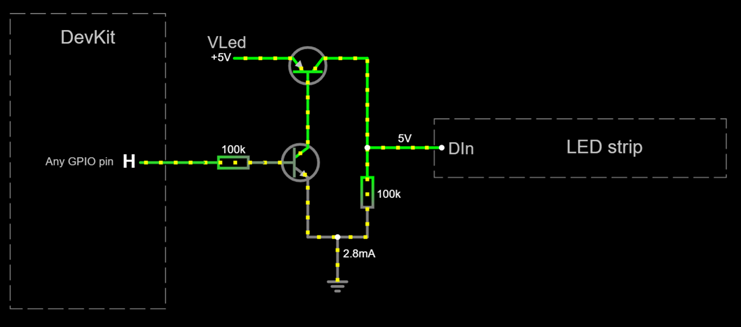

# Working with LEDs

An LED is a special type of diode.
While most diodes have a low forward voltage of around 0.6 volts,
LEDs have a high forward voltage depending on the color of the light:

- Red: 1.6 to 2.0 volts.
- Green: 1.9 to 4.0 volts.
- Blue: 2.5 to 3.7 volts.

An RGB LED is the physical combination of three LEDs: red, green and blue.
As a result, a forward voltage of around 3.7 volts is required to light them.

However, the ESP32 hardware operates at 3.3 volts,
which is not enough to light some of these LEDs.

For this reason, you may need a different power source,
which is labelled `VLed` in this project.
There are a number of options available:

- **5 volts power sources (and higher)**

    Wheel bases and USB cables already operate at 5 volts,
    which is enough to power any LED.
    Attach `VLed` to `5V` if available.

    Higher voltages will work as long as you use a proper
    **current limiting** resistor for each LED.
    When working with LED strips,
    make sure your power source is within its specifications.

- **External powerboost module/shield**

    As described in the [power subsystem](./hardware/subsystems/Power/Power_en.md),
    some external power boost modules provide both 5.0 and 3.3 volt outputs.
    Attach `VLed` to the `5V` output.

- **Builtin powerboost module/shield**

    If your DevKit board has built-in battery support,
    there is no 5V output.
    Connect `VLed` directly to the positive pole of the battery.
    This is **not optimal** as some LEDs will go off
    before the battery is discharged.

## Single-wire RGB LED strips (NeoPixel and the like)

These LED strips are controlled by a single pin labelled `Din`
which is wired to the first LED in the strip.
This pin requires a minimum voltage of 3.5 volts.
The ESP32 operates at 3.3 volts, which is insufficient.
To overcome this limitation, a "level shifter" circuit is required.
We are using the most simple level shifter available:
a pull resistor attached to a GPIO pin in *open drain* mode (`Dout`).

[Test this circuit at falstad.com](https://falstad.com/circuit/circuitjs.html?ctz=CQAgjCAMB0l3BWcMBMcUHYMGZIA4UA2ATmIxAUgoqoQFMBaMMAKACcQG8rvPenCUZPEgsAHpzC8MKSQBZyGJHPCCAIgHsArgBcWAd0mCBRkIRWiASnyommYWSapU5tIc+gJxktJyKcMPD9sEBUpEAA1ABk6ABNvJhC8QTAkPGJQ8CC1AEkAOxYAI05sBEd+KSQUbHJRYoYUFTkMlGIqZllRCQbiIIY5PsbbOWUQXzU6ADcAaQBLPQlmIOSxuBB0zN8ogFE1AB0AZwOdNlmABwNTYmMwFJQg0QBzUwc+29VnKASHMxVZQnIYVkCAi33akBSKUgGSBIAA4gA5NSXEz8Xi8FAoio3HFfQxcHi2NDLZwJbDvMAySTEMJKTI-AAUGjOdDyh1ibAAhrM2UdZgBbLQAG05OlmGjyAEoWAc-Ph1kSqa8hBATlo6Cxng0lfc-Eq5BYvvVcCpzHLZKkHiwgA)

Needed parts:

- 100K-ohms resistor (x1)
