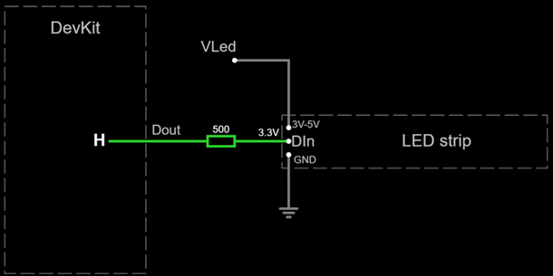

# Working with LEDs and RGB LED strips

An LED is a special type of diode.
While most diodes have a low forward voltage of around 0.6 volts,
LEDs have a high forward voltage depending on the color of the light:

- Red: 1.6 to 2.0 volts.
- Green: 1.9 to 4.0 volts.
- Blue: 2.5 to 3.7 volts.

An RGB LED is the physical combination of three LEDs: red, green and blue.
As a result, a forward voltage of around 3.5 volts is required to light them.

The ESP32 hardware operates at 3.3 volts,
which is not enough to light some of these LEDs.
For this reason, you may need a different power source,
which is labelled `VLed` in this project.
There are a number of options available:

- **3.3V power sources**

    Some LEDs will work with a 3.3 volt power supply.
    Attach `VLed` to `3V3`.

> [!IMPORTANT]
> If your RGB LED strip seems to work with a 3.3V power supply,
> but shows **wrong colors**,
> then you need a 5V power supply.
> The main symptom is a red pixel when it should be white.
> If you don't have a 5V power supply available,
> you may set the global brightness to a low value
> (more on this later) as a workaround.

- **5 volts power sources (and higher)**

    Wheel bases and USB cables already operate at 5 volts,
    which is enough to power any LED.
    Attach `VLed` to `5V` if available.

    Higher voltages will work as long as you use a proper
    **current limiting** resistor for each LED.
    When working with **LED strips**,
    make sure your power source is within its specifications.

- **External powerboost module/shield**

    As described in the [power subsystem](./hardware/subsystems/Power/Power_en.md),
    some external power boost modules provide both 5.0 and 3.3 volt outputs.
    Attach `VLed` to the `5V` output.

- **Builtin powerboost module/shield**

    If your DevKit board has built-in battery support,
    there is no 5V output.
    Connect `VLed` directly to the positive pole of the battery.
    This is **not optimal** as some LEDs will go off
    before the battery is discharged.

## RGB LED strips

> [!WARNING]
> In addition to this notes, always follow
> [Adafruit's advice](https://learn.adafruit.com/adafruit-neopixel-uberguide/best-practices)
> when working with LED strips.

LED strips are controlled by a single output-capable pin labelled `Dout` in this project.
Some LED strips can work with 3.3V logic, others cannot.
If your LED strip does not work with 3.3V logic,
you will need a small "level shifter" circuit, which is described below.

- **No level shifter (3.3V logic)**

  Wire `Dout` to `Din` in the first pixel via a 300 to 500 ohm resistor.
  The resistor should be at the end of the wire closest to the LED strip,
  not the DevKit board.
  This resistor can be omitted **only**
  if your LED strip already has a resistor in `Din`.
  Otherwise your LED strip could burn out.

  

  [Show at falstad.com](https://falstad.com/circuit/circuitjs.html?ctz=CQAgjCAMB0l3BWcMBMcUHYMGZIA4UA2ATmIxAUgoqoQFMBaMMAKAHcQnDOxuuRCAFigsAHjzScinDHinYQwsHIBqAGToATMTwV5uYJHmKLwcgCIBJAHYsARp2wIUnPFSZ4kKbOUj2pwoImKMRUzC5+4gwhcgyCsSiC7oJIwpLmdABuANIAlgAuOsxy+iBoVMamkmoAouYAOgDOjfkATrkADuw83MR8vOAocn4A5j2DsQO8VDM6TC5CZVSE5Eou2CoMCCpzYGGQBgaQJmsgAOIAcubd-G6ci3coN3f8rwN+rffCL2BDIHe0OAsNQSEruRIVGbgEAAMwAhgAbRp0EDYaAKSI8WQgDAuJgpHGpcDccwAewAroUgA)

  Needed parts:

  - 300 to 500 ohm resistor (x1)

- **Level shifter (5V logic)**

  `Din` requires a minimum voltage of 3.5 volts.
  The ESP32 operates at 3.3 volts, which is insufficient.
  To overcome this limitation, a "level shifter" circuit is required.
  We are using the most simple level shifter available:
  a pull resistor attached to a GPIO pin in *open drain* mode (`Dout`).

  

  [Test this circuit at falstad.com](https://falstad.com/circuit/circuitjs.html?ctz=CQAgjCAMB0l3BWcMBMcUHYMGZIA4UA2ATmIxAUgoqoQFMBaMMAKACcQG8rvPenCUZHBYAPTmF4YUEgCzkMSWeEEARAPYBXAC4sA7hMEDDIQssgsASnyrGmYGcapVZtIc+gIxEtJyKcMPD9sEGVJEAA1ABk6ABNvJhC8QTAkPGJQ8CDVAEkAOxYAI05sBEd+SSQUbHILYoYUZVkMlGIqZhkLcQbiIIZZPsbbWSUQX1U6ADcAaQBLXXFmIOSxuBB0zN8ogFFVAB0AZwPtNlmAB30TYiMwFJQgiwBzEwc+25VnKASHU2UZQnIYRkCAi33akBSKUgGSBIAA4gA5VSXYz8Xi8FAoio3HFfAxcHi2NDLZwJbDvMDSCTEMKKTI-AAU6jOdDyh1ibAAhrM2UdZgBbTQAG052lm6jyAEoWAc-Ph1kSqa93CATpo6Cxng0lfc-ErZOYvvVcMozHKZKkHiwgA)

  Needed parts:

  - 1K-ohms resistor (x1)

Each individual RGB pixel is controlled by a (very small) chip, called *pixel driver*.
This project supports the following:

- [WS2811](https://www.alldatasheet.com/datasheet-pdf/pdf/1132633/WORLDSEMI/WS2811.html)
  drivers. *Note*: not tested.
- The [WS2812 family](http://world-semi.com/ws2812-family/), including:
  [WS2812](https://www.alldatasheet.com/datasheet-pdf/pdf/1134521/WORLDSEMI/WS2812.html)
  and
  [WS2812B](https://www.alldatasheet.com/datasheet-pdf/pdf/1179113/WORLDSEMI/WS2812B.html)
- The [WS2815 family](http://world-semi.com/ws2815-family/).
  *Note*: not tested.
- [SK6812](https://cdn-shop.adafruit.com/product-files/1138/SK6812%20LED%20datasheet%20.pdf)
  drivers. *Note*: not tested.
- [UCS1903](https://www.led-stuebchen.de/download/UCS1903_English.pdf)
  drivers. *Note*: not tested.

> [!NOTE]
> The popular RGB LED strips based on the **WS2812B** driver require
> a 5V power supply and a level shifter.
> However, I made it work with the brightness workaround,
> no level shifter and a 3.3V power supply.
