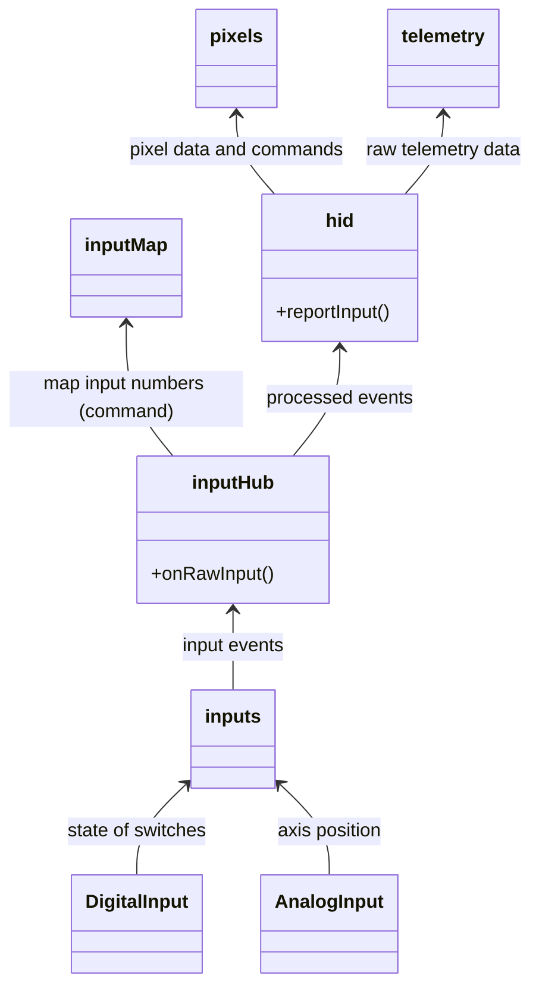
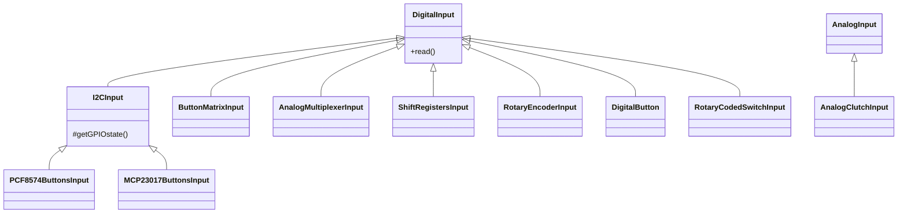
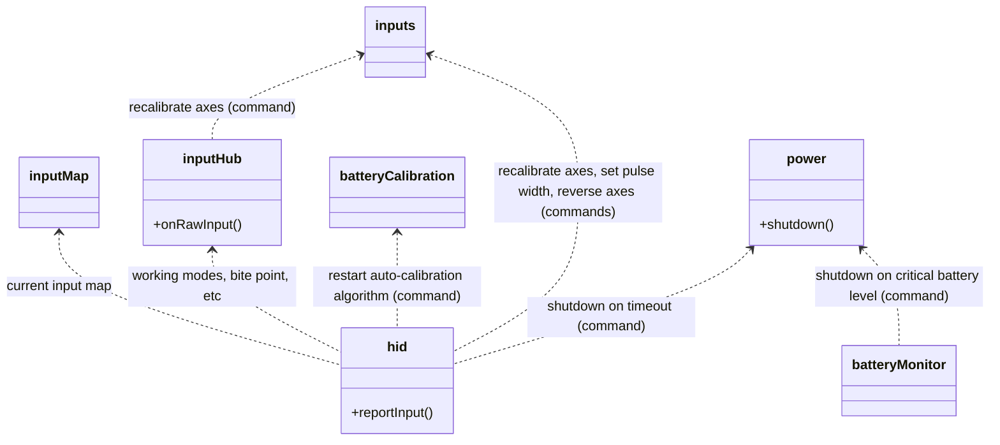
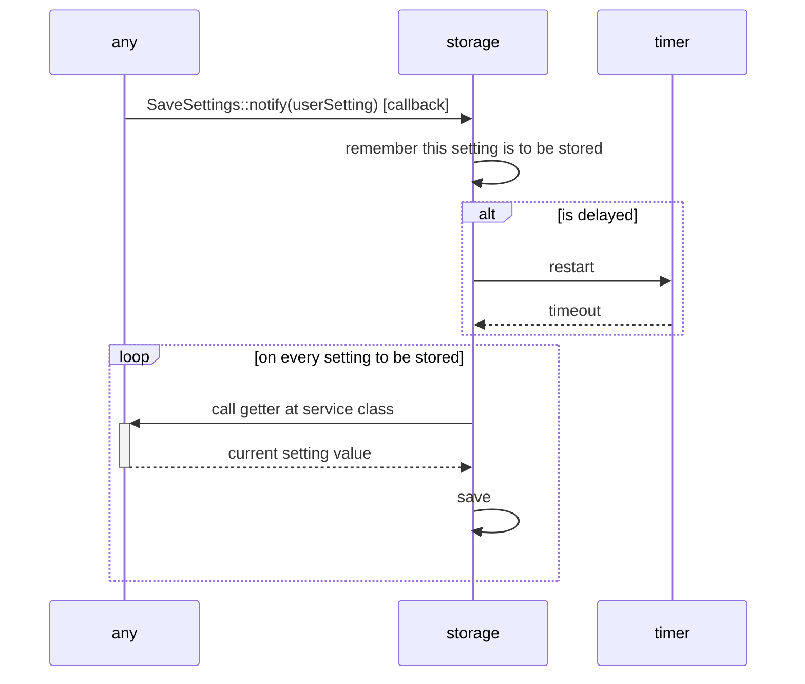
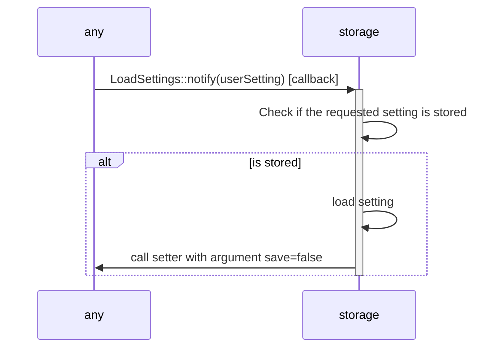
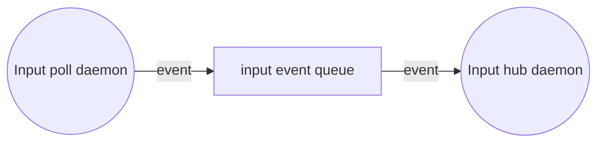

# Firmware (software) architecture

The *system* have been broken down into several *subsystems*:

- `batteryCalibration`:
  Everything related to battery profiling.
- `batteryMonitor`:
  Everything related to the measurement of available battery charge.
- `firmware`:
  Performs initialization and launches execution.
- `hid`:
  Everything related to the HID protocol.
- `inputs`:
  Everything related to hardware inputs and their events.
- `inputHub`:
  Everything related to the combined state of all inputs and their treatment.
  Translates input events into a HID report.
- `inputMap`:
  Translates firmware-defined input numbers to user-defined input numbers.
- `pixels`:
  Everything related to pixel control.
- `power`:
  Everything related to power management.
- `storage`:
  Manages long-term storage of user settings in flash memory.
- `telemetry`:
  Holds received telemetry data (this subsystem is trivial).
- `ui`:
  Everything related to the user interface, if available.

Each subsystem is implemented through one or more code abstractions:

- **A "public" namespace**, matching the subsystem name.
  Contains code available for firmware customization.
- **An "internal" namespace**, matching the pattern `internals::<subsystem>`.
  Contains code for internal operation,
  not exposed for customization.
- **A "Service class"**, matching the pattern `<subsystem>Service`.
  Does not contain code, just an interface.
  A "service provider" descendant class is in charge of the actual implementation.
  For performance reasons, only non-critical code is placed in a service provider.
- Auxiliary classes and type names (do not belong to any namespace).
- Auxiliary namespaces which belong to `internals`, but do not name a subsystem:
  - `internals::hal`:
    Utilities for ESP32 hardware operation.

## Code structure

Those code abstractions are found in code artifacts:
header files (.hpp) and translation units (.cpp).
Some header files contain both a declaration and an implementation,
thus not requiring a translation unit.

- Header files:

  - Core:

    - `SimWheel.hpp`: declares all *public namespaces*.
    - `SimWheelTypes.hpp`:
      declares all type names required by public namespaces.
    - `SimWheelInternals.hpp`: declares all *internal namespaces* (except auxiliary)
    - `InternalTypes.hpp`:
      declares all type names required by internal namespaces.
    - `InternalServices.hpp`: declares all service classes.

  - Auxiliary:

    - `HAL.hpp`:
      declares the `internals::hal` namespace.
    - `HID_definitions.hpp`:
      required by the internal namespace `internals::hid`.
    - `InputSpecification.hpp`:
      required by the public namespace `inputs`.
    - `InputValidation.hpp` and `InputHardware.hpp`:
      required by the internal namespace `internals::inputs`.
    - `OutputHardware.hpp`:
      required by the `pixels` subsystem and `SimWheelUI.hpp`.
    - `SimWheelUI.hpp`:
      declares out-of-the-box user interfaces for telemetry display
      and notifications.
    - `Testing.hpp`:
      common utilities for Arduino-only test sketches.

- Translation units:

  - Core:

    Each subsystem is implemented in a *cpp* file with its name,
    including a public namespace, an internal namespace and a service class (if any).
    However, some of them have alternate implementations.
    Those files are named following this pattern: `<subsystem>_<implementation>.cpp`.

  - Auxiliary:

    Provide implementation for the matching header file.
    For example, `InputHardware.cpp` implements all declarations
    found in `InputHardware.hpp`.

### Exceptions to this rule

- `hid::configure()` is implemented in `hidCommon.cpp`.
- The `HidService` service class is implemented in `hidCommon.cpp`.

## Principle of single responsibility

| Code artifact            | Reason to change                                                       |
| ------------------------ | ---------------------------------------------------------------------- |
| batteryCalibration.cpp   | SOC algorithm                                                          |
| batteryMonitor.cpp       | Battery management capabilities                                        |
| firmware.cpp             | Firmware initialization                                                |
| HAL.cpp                  | Underlying ESP-IDF API                                                 |
| hid_«implementation».cpp | Underlying HID stack                                                   |
| hidCommon.cpp            | Features available through the companion app or SimHub                 |
| InputHardware.cpp        | Input hardware design                                                  |
| inputHub.cpp             | Device operation through specific button press combinations            |
| inputMap.cpp             | Firmware-defined or user-defined input numbers                         |
| inputs.cpp               | Input hardware settings                                                |
| OutputHardware.cpp       | Output hardware design                                                 |
| pixels.cpp               | Pixel control capabilities or available UI notifications               |
| power.cpp                | Underlying power management capabilities                               |
| SimWheelUI.cpp           | Out-of-the-box user interfaces for telemetry display and notifications |
| storage.cpp              | User settings that require long-term storage                           |
| telemetry.cpp            | Telemetry data                                                         |
| ui.cpp                   | Support for custom user interfaces                                     |

## Approach to dependency injection

Three kinds of dependency injections are found in this project:

- Static (dependencies are injected at compile time):

  A translation unit is replaced by another one implementing the same declarations.
  Thus, dependencies are injected at compile time in the build process.
  Static dependency injection does not provide dependency inversion,
  but is required for performance concerns.

- Dynamic (dependencies are injected at run time):

  - Service classes:

    They follow the dependency injection design pattern,
    but using static classes (not parameter injection nor constructor injection),
    since all of them require a singleton instance.
    This pattern involves virtual methods and there is a performance
    penalty in them. However, this pattern achieves dependency inversion.

    *Note*: Each service class is also a mock for itself.
    If no dependency is injected, the mock is automatically injected
    without a runtime failure. This simplifies testing.

  - Publish-subscribe events:

    An "event" class decouples the caller from the callee.
    The caller triggers the event (static method `notify()`) which,
    in turn, runs a number of subscribed callbacks unknown to the caller.
    This pattern removes static dependencies completely
    and there is almost no performance penalty.

  The procedure for dynamic dependency injection is this:

  1. The main program (an Arduino sketch file)
     calls `firmware::run()`.
  2. This method calls all `internals::<subsystem>::getReady()` methods.
  3. Each `getReady()` method subscribe to the required events and
     inject an instance for its service class.
     However, other dependencies are not injected yet,
     thus can not be called.
     For this reason, they typically subscribe to the `OnStart` event.
  4. `firmware::run()` triggers `OnStart::notify()`.
  5. Each `OnStart` callback is executed.
     At this point, all dependencies are available to them.
     Each subsystem performs initialization and
     may call other subsystems if required.

## Internal dependencies

Only **most relevant information** is shown below.
A solid arrow means a static dependency.
A dotted arrow means a dynamic dependency through a service class.

### Core

Each box represents a subsystem (not a class).



[Render this diagram at mermaid.live](https://mermaid.live/view#pako:eNp1krtuAyEQRX9lROUo9g-gNJFcJEWauIu2GS_jXSRegiFry_K_h33YJnKyDcvl3OEOcBatVySkaA2mtNXYRbSNg_JNCmgXMic4z9qlXnp1aHz3PgIPjre8v3oAnr37xGECV09_FOq1quBIwUf-n2YyZInjqRaDPpJJs3IL8LLZLPnlPAJ9k-MaSxO01Z1mNNOeEhIjE_gDpEFz29MjX3UuAY-67O-TZu1dhX5guCcY40iwRZqDuGz3FBOsWm8tOrU0Op5E7ZEQom8pJVK_ss_tTmixyHkOChmhFIOl6ALfDuzORxwqefSJtbAULWpVHsN0GY3gvgCNkOVX0QGz4UY07lJQzOx3J9cKyTHTWkSfu17IA5pUZjmUirQ8pisS0H15bxfo8gNIDNOG)

### Hardware inputs

Each box represents a C++ class.



[Render this diagram at mermaid.live](https://mermaid.live/view#pako:eNp9kl9vgjAUxb8KuXvZMjQoMP5kLxtuiw9kRt8WXhqp2ARbUm4zneO7rxZZcIvwUjj5nR56eo-wFjmFGNYlqesZI4Uku4xb-jGKNZ8mc14pPLaiZd0UFN8W8_caCdLbu1Zu-pYZKxiS8tJ2LynJ_-B90Hr8Ho2sZ4UoeEpQsr2Rr4FPnJSiSFWJrCrpnspBerVlG1zSgtVIZT2ILgUSeXjhp1qGNz0r7S9fg7r6huMSHZavPhmutz2685r-DL1IXkM_8NrIehBNk8XUdSbBf7at7oz3ykxK1eWDDTsqd4TlejLMFWaAW7qjGcT6NacbopvPIOONRolCsTrwNcQoFbVBVbkejfMsXYovOUMhO00KVWwh3pCy1l8V4R9C_BqoQdPzdJ4WbaBc30oiFEeIfWOB-Ah7iKNo7AZe5IW-64aOG0U2HCD2nGjsRw8T33cCXYbveI0NXybEGYeB3qGQpzOeEpsfJRj8-w)

### Internal services

Each box represents a subsystem (not a class).



[Render this diagram at mermaid.live](https://mermaid.live/view#pako:eNp9k7Fu3DAMhl-F0JSgbh7AyNYWaIdb0q3wwpOYs1BLFCgqThDcu1e-s1uf69aLberjz18U9W4sOzKtsQPm_NnjSTB0EepziYCPqWiG92vs_NfS13JcFgE-cHzC8dsUv7vfyei9W8FCiUX_TR9RleTtwNEry66FGfmEgz8Kque4iyUeSVaVc1_U8Rg3Za_Y48PDZLSFhYKqqj4QF4U7yyFgdPfbjFuzt8lWvHqLwwLBQC80bLXmTk9iS2dbELLz3gjwlfJ_ki6et3wDmRRSGTLB6J32TUVeSPJGLs96Ow1daWdFUcCi_NGuCBxOXLfYh11304TMGgAtjCw_fTxBqHNX7R19dZrYR22A1K7yDpj-1LZFhKJeVyBgMo0JJAG9q8N7OdnOaE-BOtPWT0fPWAbtTBfPFZ0sf3-L1rQqhRpTkqsdmsf9NvjFTQe4xITLqTftM9YGNiZh_MEcfv_ThT3MN2h6nX8BATIdXw)

## Event system

- Initialization and load/save settings:

  ```mermaid
  flowchart LR
    OnStart@{ shape: stadium }
    LoadSettings@{ shape: stadium }
    SaveSettings@{ shape: stadium }
    OnSettingsSaved@{ shape: stadium }
    any@{ shape: procs }
    firmware -- notify --> OnStart -- subscribed --> any
    any -- notify --> SaveSettings -- subscribed --> storage
    any -- notify --> LoadSettings -- subscribed --> storage
    storage -- notify --> OnSettingsSaved
    OnSettingsSaved -- subscribed --> ui
  ```

  [Render this diagram at mermaid.live](https://mermaid.live/view#pako:eNqFUslugzAQ_RVrziQiAprgQ1Wp7S1VpXKruDh4AEvBRl6aUsS_15ClaZsoPs3y3pvF00OhOAIFQsqt2hU105as33JJ_HuVmfX-Q09MzVqkxFjGhWvIsM-vFeMZWitkZa6CMvaBN0G-0gEywvlVHJPdT67VqjDHTCl0s2MayWxGpLKi7Lx1fxxhjBq3MYUWG-RTxkudNP-Qzlu-wDRWaVbhNfb5Vm6xD87_ps-3cXFFF5SdyCUE0KBumOD-T_uRmYOtscEcqDc5lsxtbQ65HDyUOauyThZArXYYgGs5s_gkWKVZ8zv4zIXv9RjTylU10JJtjfdaJt-VOhFwgr7s72o6L09AyVE_Kict0GSiAO3hE2iazqNlnMarJIpWYZSmAXRA4zCdJ-ndIknCZRQukjAeAviaioTz1dIrVHqccaw4fAPImedh)

- Battery level and shutdown:

  ```mermaid
  flowchart LR
    OnShutDown@{ shape: stadium }
    OnBatteryLevel@{ shape: stadium }
    OnLowBattery@{ shape: stadium }
    ui_pixels@{ shape: procs, label: "ui / pixels" }
    power -- notify --> OnShutDown
    batteryMonitor -- notify --> OnBatteryLevel
    batteryMonitor -- notify --> OnLowBattery
    OnShutDown -- subscribed --> ui_pixels
    OnBatteryLevel -- subscribed --> hid
    OnLowBattery -- subscribed --> ui_pixels
  ```

  [Render this diagram at mermaid.live](https://mermaid.live/view#pako:eNqNkstqwzAQRX9FzNqhey9KKenOodDsgqCMrXEskDVGj7rG-N_rR52kTRqqlWY4V9K9mh4KVgQplIbbokIXRPYmrRjXq91XMWy5tU-98BU2lAofUOlYi2FFnjEEcl1GH2TuYBm33-SfUNTvjf4k489E47jwiTCYk0mFhKjFg1ggCauu4Zac2GyE5aDLbtw9Xjx9YfLl7h1bHfgavjTxL8HZzu-oJtTH3BdO56Rm_GTsVmY3-Eqr69junQsJ1ORq1Gr8x37SSggV1SRhSk1RidEECdIOI4ox8L6zBaTBRUogNgoDbTUeHdY_my9qcr_2HMdjBWmJxo9Vg_bAXJ9qmtndMkzzTA1f4nzM_w)

  *OnShutDown* is a notification, not a command.
  However, the *ui* subsystem translates this event into a command
  for all user interface instances.
  To command a shutdown, the firmware needs to call
  `PowerService::call::shutdown()`.

- Connection/disconnection:

  ```mermaid
  flowchart LR
    OnConnected@{ shape: stadium }
    OnDisconnected@{ shape: stadium }
    ui_pixels@{ shape: procs, label: "ui / pixels" }
    hid -- notify --> OnConnected
    hid -- notify --> OnDisconnected
    OnConnected -- subscribed --> ui_pixels
    OnDisconnected -- subscribed --> ui_pixels
  ```

  [Render this diagram at mermaid.live](https://mermaid.live/view#pako:eNqFkctqw0AMRX9FaO3QvRehkHTXUmh2ZSDIM3IsmIeZB20w_vfaDm5S-tJKVxzBvdKAOhjGGlsb3nRHMcPji_Iw1bPfBe9ZZzb3A6SOeq4hZTJSHIwrs5ek_8WKHHt5Z5uuRB-DThVYatjWoLAI3MEFUrjudWJgswEfsrTnqdvemvodufX0LctMp9IkHaVZ1PZq76dQf_FYoePoSMx0wWHeVpg7dqxwzmS4pWKzQuXHCaWSw-HsNdY5Fq6w9IYy74VOkdzX4YORHOI6i6GcOqxbsmlSPfnXENyn5oV9urxx-eb4AeOSno0)

## Save settings



[Render this diagram at mermaid.live](https://mermaid.live/view#pako:eNplUjFuwzAM_AqhqUWTD2jI1I6dsrXuwMiMI1SWXIkyYAT5eynZTuF0k0535PHEqzKhJaVVop9M3tCrxS5i33iAASNbYwf0DOinRyhxiNjRI8y2p1hAkcD-cFh5Go440pGYre-S1j6wPU9POVFcwGf4NOjcCc33VymwCLdFIvXUnygCX2yCNCtBjhzgRJVHbeOrAcfloSWHU8EAtjWr01Ixsfif3ysG-03LgoVcCeRrHRfCAMEDjRSnu4mtg4duLyUPDWVA6EQgXVAypDhaQ2AcpjRramwi2P8ZMDlGKokvjUZ0mf7Pc-cnCXpxq3ZKBurRtvLH1wI2ii-SYaO0HFs6Y3bcqMbfhIqZw3HyRmmOmXYqDy3yuhJb8K210m7FYsjdRekzuiQ32YOPEPr7nSr3fV60um-3X6lH3Co)

## Load settings



[Render this diagram at mermaid.live](https://mermaid.live/view#pako:eNp1kU1OAzEMha9iZQWiXCAS3QA7WHUHw8Iknpmo-RkSp2hU9e4kmQ6ICnbJy_Pn5_goVNAkpEj0kckrejA4RHSdB5gwslFmQs-Afr6UEoeIA1W5vMLtdnuzahKeAuodMRs_JCl9YNPPVzlRPIvX8KrQ2ndU-7dKgLW0cn4w9yOpPZgeeCSINWJi0pAWCJjUrKQXBFq-lP7h2hJvpfxlLANJqAGbiSJ8Gh4B45Ad1dHxQHc92kRLMfnWThMqNgdkWmFiIxxFh0aXLz5WTyfKKI46IctRU4_Zcic6fypWzBx2s1dCcsy0EXnShXXeyG_xUZvSYdViyMMoZEu0EWU7LyG47zs17_Oy57bu0xdaGq72)

## Brief description of most relevant subsystems

For a detailed description, see the documentation generated by Doxigen.

### DigitalInput and descendant classes

There is a dedicated daemon that read the state of those inputs in a loop, every few milliseconds.
Since many inputs are read at the same time, the combined state of all of them is reported to `inputHub`.
Nothing is reported if there are no input events, this is, a state change since the previous iteration.

### AnalogInput

It works in a similar way to `DigitalInput`, but for analog inputs,
which are limited to two clutch paddles with potentiometers.

### Inputs

This is the place where inputs are set up and a number assigned to them.
Use the `add*()` methods to set up any kind of inputs (button matrices, rotary encoders, etc) and their pins.
Analog clutch paddles are set here, too.

The assigned input number will be mapped to a user-defined HID button number,
which will be reported to the hosting computer when needed.
If there is no user-defined map, it defaults to the following rule:

```text
if (alt mode engaged) then
   HID button number = raw input number + 64
else
   HID button number = raw input number
```

### `inputHub` and `inputMap`

Almost all the logic behind the behavior of the sim wheel is implemented at these subsystems.

### User interface (`ui` subsystem)

This subsystems provides a generic way to notify events to the user,
if a user interface is available, and to display telemetry data.
It does not depend on a particular hardware,
so anything could be implemented:
a single LED, sounds, an OLED, etc.
By default, it does nothing.
To provide a particular user-interface implementation,
derive a new class from `AbstractUserInterface`,
then provide instances to `ui::add()`.

All notifications are queued, serialized and executed
in a very low priority separate thread: the *frameserver* daemon.
The caller thread does not wait for them.
There is a *frameserver* daemon for each `AbstractUserInterface` instance.

If there were two or more user interfaces (for example, display and sounds),
they should be implemented in separate classes, not to mix their code.

`AbstractUserInterface` may work in two, non-exclusive, modes:

- As a simple message queue

  For user interfaces not needing a perpetual loop or for one-time notifications.
  This is the default behavior.
  For example:

  ```c
  void MyImpl::onStart() {
      turnLedOn();
  }

  void MyImpl::onConnected() {
      // blink 2 times
      delay(250);
      turnLedOff();
      delay(250);
      turnLedOn();
      delay(250);
      turnLedOff();
      delay(250);
      turnLedOn();
  }
  ```

- As a frame server

  For user interfaces in need of a perpetual loop or for persistent notifications.
  If there are no pending notifications,
  `AbstractUserInterface::serveSingleFrame()` will be called at timed intervals.
  A non-zero frames-per-second value must be returned by `getMaxFPS()`.
  For example:

  ```c++
  void MyImpl::onStart() {
    discovering = false;
  }

  void MyImpl::onBLEdiscovering() {
      discovering = true;
  }

  void MyImpl::onConnected() {
      discovering = false;
      turnLedOn();
  }

  void MyImpl::serveSingleFrame(uint32_t elapsedMs) {
    // Called one time per second (more or less)
    // For perfect timing, use elapsedMs
    if (discovering)
      switchLed();
  }

  uint8_t MyImpl::getMaxFPS()
  {
    return 1; // one frame per second
  }
  ...

  void setup()
  {
      ...
      ui::add<MyImpl>(ledPin);
      ...
  }
  ```

> [!NOTE]
> `AbstractUserInterface::onLowBattery()` is already
> called at timed intervals as long as such a condition persists.

#### Telemetry display

The telemetry display is also implemented in the `AbstractUserInterface`.
The *frameserver* daemon will call `onTelemetryData()`
when new telemetry is detected or
when no telemetry is received for 2 seconds.

There are two possible patterns to this end:

- Buffered output:

  `AbstractUserInterface::onTelemetryData()` gets called first.
  This method draws telemetry data into a frame buffer for later display.
  The double-buffer technique may be used.

  `AbstractUserInterface::serveSingleFrame()` gets called then.
  This method copies the frame buffer to the display hardware.

- Non-buffered output

  `AbstractUserInterface::onTelemetryData()` gets called
  to do all the painting.
  `AbstractUserInterface::serveSingleFrame()` does nothing.

### BatteryMonitor

This subsystem is in charge of interfacing the underlying hardware for "state of charge" (SOC) estimation.
A daemon calculates the SOC at timed intervals according to this algorithm:

1. Measure some battery property, depending on the underlying hardware:

   - *Voltage divider* or *battery monitor*: indirect voltage.
   - *Fuel gauge*: state of charge.

2. Determine if the battery is attached or not.
3. Compute the state of charge:

   - *Voltage divider* or *battery monitor*:
     the *BatteryCalibration* subsystem translates a voltage into a state of charge.
   - *Fuel gauge*: computation is already done by the chip itself.

4. If there is a change in the state of charge (1% or more),
   notify the new value to the hosting PC.
5. Notify low battery levels.
6. Shutdown on very low battery levels.

#### Fuel gauges

Fuel gauges from Maxim/Analog Devices are powered from the battery itself.
As a result, they don't respond to I2C commands if the battery is not attached.
This way, we know there is no battery.

### BatteryCalibration

Provides an estimation of the "state of charge" given an indirect battery voltage.

#### Most accurate algorithm

Battery calibration is required for accurate battery levels.
Calibration goes from full charge to battery depletion,
taking a sample of battery voltage every minute.
All possible voltages are divided into 32 evenly distributed ranges, called *quantum*.
Calibration data is just a set of counters of voltage samples for each quantum.
The sum of all counters is equivalent to 100% battery charge.
Calibration data is stored in flash memory.

Let's be $V_{min}(i)$ the minimum voltage that falls into quantum $i$ (a natural number),
$a < b \iff V_{min}(a)<V_{min}(b)$.
Let's be $QSIZE = V_{min}(i+1)-V_{min}(i)+1$ (the same for every quantum).
Let's be $S(i)$ the count of samples for quantum number $i$.
Let's say we have a battery voltage $V_n$ that falls into the quantum number $n$ (0-index).

$BatteryLevel = \frac{ (\sum_{i=0}^{n-1}S(i)) + \frac{S(n)*(V_n-V_{min}(n))}{QSIZE} }{ \sum_{j=0}^{31}S(j) } * 100$

Note that "most accurate" does not mean "accurate".
Battery voltage is not enough for accurate SOC.

#### Auto-calibrated algorithm

If calibration data is not available,
a rough estimation is provided based on LiPo batteries characterization data taken from here:
[https://blog.ampow.com/lipo-voltage-chart/](https://blog.ampow.com/lipo-voltage-chart/).
However, actual battery voltages may not match the characterization data due to:

1) inaccurate ADC readings,
2) voltage drop due to the involved transistors (if any) and
3) unexpected impedances at the voltage divider.

For this reason, the highest voltage ever read is taken as an auto-calibration parameter.
The expected voltage reading is mapped linearly to the absolute maximum voltage ever read.
The battery needs a full charge before this algorithm provides any meaningful result.

(See [LiPoBatteryCharacterization.ods](./LiPoBatteryCharacterization.ods))

### Hid

All data interchange between the device and the host computer is conducted through the HID protocol.
This involves:

- State of buttons, axes and the alike.
- Device capabilities.
- Configuration: clutch paddles, "ALT" buttons, battery calibration, etc.
- Telemetry and pixel control.

See the [HID notes](./HID_notes.md) for more details.

## About digital inputs and input events

Every hardware input is assigned a single number starting from 0 and up to 63.

The state of an input is represented by a single bit,
1 meaning a pressed button, 0 meaning a released button.
So, the combined state of all inputs is represented as a 64-bits word,
where the n-th bit represents the n-th input number.
This is called an *input bitmap*.
Least significant bit is numbered as zero.
For example, the word `00000000 ... 00000101` means that buttons 0 and 2 are pressed,
and the others are released.

An input can also be identified by a bitmap. For example, the button number 3 can be expressed as `...01000`.

### Event processing

Input events are captured in the **Input poll daemon**:
it checks the state of all inputs every 50 ms (more or less).
This period is short enough not to miss any event,
but long enough to prevent other threads from starvation.
It also plays a critical role in debouncing
(bouncing occurs during the subsequent 30 milliseconds, more or less,
after a mechanical switch is activated).

Event processing takes long, so later input events would be missed while processing sooner ones.
To prevent this, input events are posted into a queue.



[Render this diagram at mermaid.live](https://mermaid.live/view#pako:eNpVjssOgjAQRX-lmRUk9AdYuNKEJi5Al9ZFpYM06QObqcYQ_l1AXbCbnHvuzYzQBo1QQmfDq-1VJHY8Sc-YqLNM-CERG4K1TCt0wef5EjUXswb4RE_skTDhda1U_0qfbpuGqBnnP5_zHWvWmS0TFRTgMDpl9PzPuCgSqEeHEsr51NipZEmC9NOsqkTh_PYtlBQTFpAGrQj3Rt2jclt40IZC_LLpAwzyT0k)

Event capture is detached from event processing at the **input hub daemon**,
which runs most of the code. Note that such a daemon is implemented inside `inputs.cpp`,
not `inputHub.cpp`.

Raw inputs are transformed into a HID input report in a sequence of "filters" or steps:

1. Detect and execute user commands, if any.
   If a command is detected and executed, this sequence is interrupted.
2. Depending on user settings, transform analog axis input into buttons input or vice-versa.
3. Execute clutch bite point calibration when requested.
4. Determine if ALT mode is engaged.
5. Compute F1-style clutch position.
6. Transform DPAD inputs into navigational input, depending on user settings.
7. Detect the neutral gear "virtual" button.
8. Map raw button inputs into user-defined inputs, if any, or use default mapping.

#### A note on rotary encoders

Each detent of a rotary encoder generates two input events in quick succession:
a button press and then, release.
Decoding is implemented by hardware interrupts,
but input events are read in the *input poll daemon*.
In summary:

1. `DT` and `CLK` signals are decoded in an interrupt service routine.
   If a rotation event is detected (clockwise or counter-clockwise),
   that event is pushed into a simple bit-oriented queue.
2. The *input poll daemon* extracts an event from the queue,
   then modifies the state of the corresponding button as pressed.
3. At the next iteration, it will reset the state of that button as non-pressed,
   thus simulating a press-then-release sequence of events.

The bit-oriented queue shows the following properties:

- Implemented as a [circular buffer](https://en.wikipedia.org/wiki/Circular_buffer).
- Thread-safe.
- Unnoticeable memory footprint.
- Size for 64 rotation events.
  If the queue were full, latest events would be discarded.
- Since each rotary is polled every 50 ms,
  it is unlikely for the queue to get full.

## About automatic shutdown

In a battery-operated system, when there is no Bluetooth connection,
the systems goes to advertising.
If no connection is made in a certain time lapse,
the system goes to deep sleep or power off.

## About connectivity

The firmware relies in the
[HID](https://en.wikipedia.org/wiki/Human_interface_device) standard to provide connectivity.
The device will appear as a
[Gamepad](https://en.wikipedia.org/wiki/Gamepad) to the hosting computer.
The *hid* namespace is in charge of that.
However, this project provides several alternate implementations:

- *hid_NimBLE.cpp*: BLE using the
  [NimBLE stack](https://mynewt.apache.org/latest/network/).
  Requires an additional Arduino
  [library](https://www.arduino.cc/reference/en/libraries/nimble-arduino/).
- *hid_ESPBLE.cpp*: BLE using the native ESP-Arduino stack.
  Does not require additional libraries, but it takes way more flash memory than *NimBLE*.
- *hid_USB.cpp*: wired USB implementation.
- *hid_dummy.cpp*: dummy implementation with no actual behavior.
  Provided to troubleshoot the custom firmware and for testing.

## Concurrency

System concurrency comes from these OS task and daemons:

- *Main task*: Performs initialization, then goes dormant.
- *Input poll daemon*. May call:
  - `inputs` and auxiliary classes.
  - `storage`.
- *Input hub daemon*. May call:
  - `inputHub`
  - `inputMap`
  - `inputs`
  - `hid`
  - `storage`
- *Battery monitor daemon*. May call:
  - `batteryMonitor`
  - `batteryCalibration`
  - `hid`
  - `ui`
  - `storage`
  - `power`
- *OS timers*. May call:
  - `inputs`
  - `storage`
  - `ui`
- *Bluetooth/USB stack*. May call:
  - `hid`
  - `inputs`
  - `batteryMonitor`
  - `batteryCalibration`
  - `pixels`
  - `storage`
  - `ui`
- *Frameserver*. May call:
  - `ui`
  - The `AbstractUserInterface` descendants (which may call `pixels`)

*Notes*:

- There is no synchronization between the *frameserver* and the *Bluetooth/USB stack*,
  except for the basic atomicity of 32-bit writes.
  Performance takes precedence over consistency.
  Only the *Bluetooth/USB stack* updates the `telemetry::data` variable.
  `telemetry::data.frameID` is always written the last.
  The *frameserver* looks for a change in that field
  in order to invoke `AbstractUserInterface::onTelemetryData()`.
