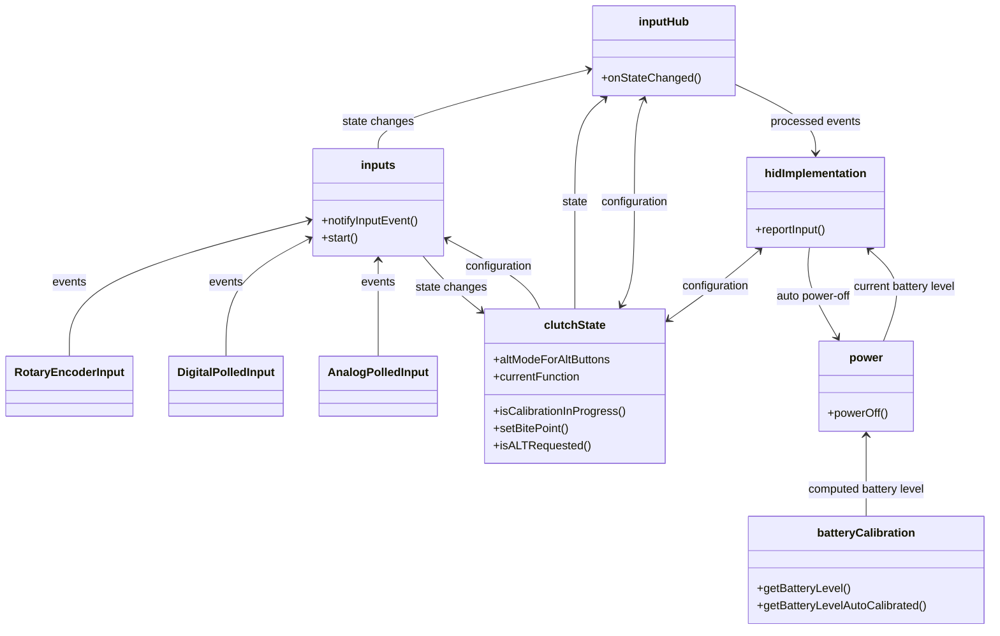
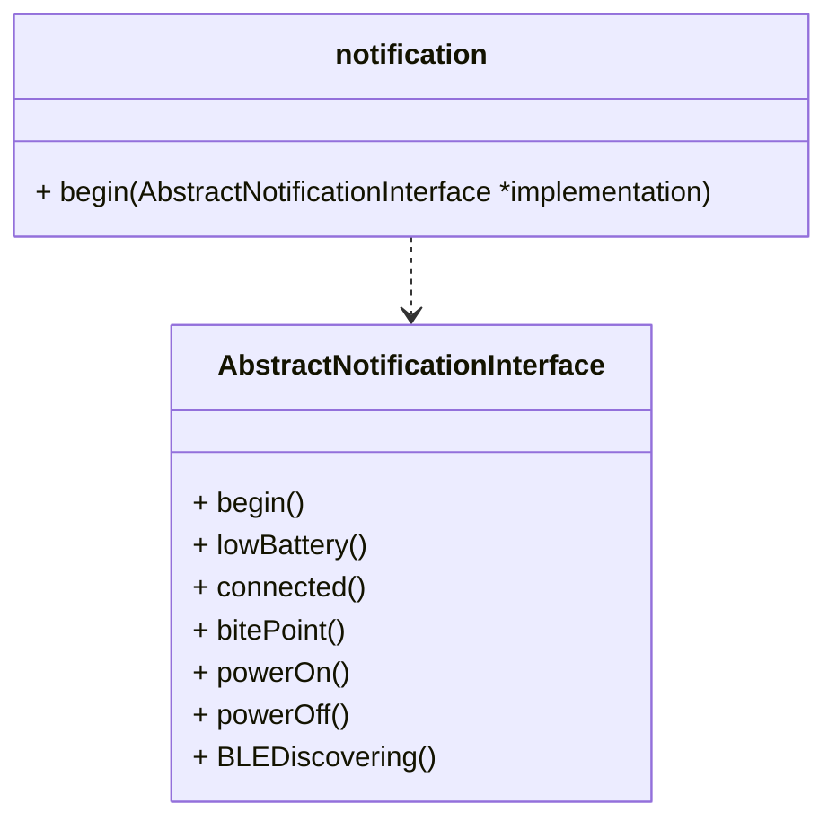

# Firmware (software) architecture

## Modules

The _system_ have been broken into several _modules_ that have been implemented as C++ namespaces. All of them are defined at _SimWheel.h_:

- **batteryCalibration**: Everything related to the estimation of battery charge.
- **capabilities**: Everything realated to the capabilities of the hardware and firmware.
- **clutchState**: Implements the behavior of clutch paddles, holds their state and their configuration.
- **hidImplementation**: Everything related to the HID protocol.
- **inputs**: Everything related to hardware inputs and their events.
- **inputHub**: Everything related to the combined state of all inputs and their treatment. Translates input events into a HID report.
- **notify**: Everything related to the notification of some events to the user if an user interface is available.
- **power**: Everything related to power management.

Each namespace is implemented in a single _cpp_ file with its name, however, some of them have alternate implementations in order to enable unit and integration testing. Those files are named following this pattern: `<namespace><underscore><implementation>.cpp`. Some implementations are:

- _mock_: dummy implementation with no actual behavior.
- _serial_: implementation providing output to the serial port instead of the OLED.

All modules can be found at the `/common` folder.

### Auxiliary modules

Some namespaces are implemented with the help of auxiliary modules which are not exposed at _SimWheel.h_, one _cpp_ file for each:

- *adcTools*: Reading of ADC pins.
- *ButtonMatrixInput.cpp*: Everything related to button/switch matrices.
- *debugUtils.cpp*: Minor utilities for debugging and testing.
- *PolledInput*: Related to inputs that must be read in a polling (or sampling) loop.
- *RotaryEncoderInput.cpp*: Everything related to rotary encoders.
- *SerialNotification*: For the testing of user notifications through the USB serial interface.

### Module dependencies

Only most relevant information is shown below:

[Render this graph at mermaid.live](https://mermaid.live/view#pako:eNqNlN1u4yAQhV8FcbXV1i9gVZXSNlUjddWo3UvfEBg7SBi8MLSKorz7Ana8ZLHa-spmvvk5zJGPlBsBtKZcMeceJOss6xtNwpNOyKtBZg9rHTG70YNHkodlPHHkOB0S8lMblO0hket30Pjjag65UGr-PhVlnvyOHGfY6DdkCPd7pjsQi1lceeT7hGWJ0t0zJXeWoTR6o7fWdBacy-cAvJMIWyMvxpNu9fz7Ff54cPivYwgwhb-C_EdjVwrvPKLRbg5yb22Q-eg1jw0XxtxLsekHBX3A0lDZsBYGYzHd1qLEwXyAzfj0_dK2i_COIYI9ZPKzzC6IHuPP8A4qk_dfZOXRnEsUFz8v6qaqpuXXxKUN8LQpl3EuUaWDagLRGSX6IDuJTG2NUiA-R1eaKdN9RVbVbe6Sr0a9QLnRrez8eJEL6su6JXT7_ZIRLpxSk8EaHtwL4kJeaalvNSvTYlbyVE1Y2Pv4Xpm2JZ80OmdM1j_7jqhonzFv9G1kS1PG0fqgOmgqMuk17cH2TIrwT0rmbSjuQ_uG1uFVQMu8woY2-hRQP4ggdS0kGktrtB6uaZTxdtCc1i1TDs7Q9GubTk9_AWA1rEk)

Many modules have a `begin()` method that must be called at system startup (`main()`or `setup()`). The calling order is defined by the previous diagram, where bottom modules must be called first.

### Definitions (header files)

All header files can be found at the `/include` folder.
Most relevant are:

- **SimWheel.h**: definition of all modules (namespaces).
- **SimWheelTypes.h**: common constants and types for all modules.
- **debugUtils.h**: constants and utilities for unit testing.

## Brief description of most relevant modules

For detailed description, see the doxigen's documentation at _SimWheel.h_.

### RotaryEncoderInput

Each detent of a rotary encoder generates two input events in quick succession: a button press and then, release. This requires a dedicated thread for every rotary encoder, but they are dormant most of the time. Decoding is implemented by hardware interrupts.

### DigitalPolledInput and descendant classes

There is a dedicated daemon that read the state of those inputs in a loop, every few milliseconds. Since many inputs are read at the same time, the combined state of all of them is reported to `inputHub` or `clutchSate` (for digital clutch paddles when not configured to work as regular buttons). Nothing is reported if there are no input events, this is, a state change since the previous iteration.

### AnalogPolledInput

It works in a similar way to `DigitalPolledInput`, but for analog inputs, which are limited to two clutch paddles with potentiometers. Changes are notified to `clutchSate`.

### Inputs

This is the place where inputs are set up and a number assigned to them. The assigned input number will be reported to the hosting computer when needed.
Use the `add*()` methods to set up any kind of inputs (button matrices, rotary encoders, etc) and their pins.
Analog or digital clutch paddles are set here, too.

### InputHub and clutchState

Almost all the logic behind the behavior of the sim wheel is implemented at these modules.
Wheel's functions are mapped to input numbers at `InputHub`, using the `set*()` methods.

### Capabilities

This module holds static data about device capabilities. For example, it tells if the device has clutch paddles or not.
Such data is set from other modules at startup. This module is trivial, so it is not shown in the previous diagram. It may be called from any other module.

### Notifications

This module provides a generic way to notify events to the user, if a user interface is available. It does not depend on a particular hardware, so, anything could be implemented in the future: a single LED, sounds, an OLED, etc. By default, it does nothing. To provide a particular user-interface implementation, derive a new class from `AbstractNotificationInterface` and provide an instance to `notify::begin()`.

All notifications are queued, serialized and executed in a separate thread. The calling thread does not wait for them. 
For this reason, some notifications may be missed if the queue is full.

### BatteryCalibration

#### Accurate algorithm

Battery calibration is required for accurate battery levels. Calibration goes from full charge to battery depletion, taking a sample of battery voltage every minute. All possible voltages are divided into 32 evenly distributed ranges, called _quantums_. Calibration data is just a set of counters of voltage samples for each quantum. The sum of all counters is equivalent to 100% battery charge. Calibration data is stored in flash memory.

Let's be $V_{min}(i)$ the minimum voltage that falls into quantum $i$ (a natural number), $a < b \iff V_{min}(a)<V_{min}(b)$. Let's be $QSIZE = V_{min}(i+1)-V_{min}(i)+1$ (the same for all quantums). Let's be $S(i)$ the count of samples for quantum number $i$. Let's say we have a battery voltage $V_n$ that falls into the quantum number $n$ (0-index).

$BatteryLevel = \frac{ (\sum_{i=0}^{n-1}S(i)) + \frac{S(n)*(V_n-V_{min}(n))}{QSIZE} }{ \sum_{j=0}^{31}S(j) } * 100$

#### Auto-calibrated algorithm

If calibration data is not available, a rough estimation is provided based on LiPo batteries characterization data taken from here: [https://blog.ampow.com/lipo-voltage-chart/](https://blog.ampow.com/lipo-voltage-chart/). However, actual battery voltages may not match the characterization data due to 1) inaccurate ADC readings and 2) voltage drop due to the involved transistors. For this reason, the highest voltage ever read is taken as an auto-calibration parameter. The expected voltage reading is mapped linearly to the absolute maximum voltage ever read. The battery needs a full charge before this algorithm provides any meaningful result.

(See [LiPoBatteryCharacterization.ods](./LiPoBatteryCharacterization.ods))

### HidImplementation

All data interchange between the device and the host computer is conducted through the HID protocol. This involves:
- State of buttons, axes and the alike.
- Device capabilities.
- Configuration: clutch paddles, "ALT" buttons, battery calibration, etc.

See [HID notes](./HID_notes.md) for more details.

## About digital inputs and input events

Every input is assigned a single number starting from 0 and up to 63.

The state of an input is represented by a single bit, 1 meaning a pressed button, 0 meaning a released button. So, the combined state of all inputs is represented as a 64-bits word, where the n-th bit represents the n-th input number. This is called an _input bitmap_. Least significant bit is numbered as zero.
For example, the word `00000000 ... 00000101` means that buttons 0 and 2 are pressed, and the others are released.

An input can also be identified by a bitmap. For example, the button number 3 can be expressed as `...01000`.

### Input masks

A mask is a 64-bits word where each bit represent a button number (the same as input bitmaps), but a bit set to 1 means that an input is not set and _must be ignored_ in the corresponding bitmap. Input masks are used in combination with bitmaps to build a combined state. For example:

| State              | Bitmap   | Bitmask  |
| ------------------ | -------- | -------- |
| (A) previous state | 11000001 | 11111111 |
| (B) partial state  | 00000010 | 11111100 |
| (C) new state      | 11000010 | 11111111 |

where `bitmap(C) = bitmap(B) OR (bitmask(B) AND bitmap(A))` being AND/OR bitwise operators.

### Event processing

Input events are captured from hardware interrupts or daemons. Most relevant are:

- **Rotary encoder daemons**: simulates a button press on each "detent". These daemons are dormant most time. They react to hardware interrupts.
- **Input poller daemon**: it checks the state of polled inputs every 50 ms. This period is short enough not to miss any event, but long enough to prevent other threads from starvation.

Event processing takes long, so later input events would be missed while processing sooner ones. To prevent this, input events are posted into a queue.

[Render this graph at mermaid.live](https://mermaid.live/view#pako:eNptj8sOgkAMRX-l6QoS-QEWriSRxIXg0nFRmSokzAxOOhpi_Hd5yELjrj333DR9YuU0Y4qX1j2qmrzArlQWoMyiqHRCvge2o-NBExtn43iM830U5bYLAp1r25-wODZTxHe2ArfAgU9TabuU6nD-apQZJMnHT5I1FPONP7D4ZvkWV2jYG2r08MVzVBRKzYYVpsOo-UKhFYXKvgY1dJqEM92I85iKD7xCCuIOva2WfXY2DV09mRm-3lPKX_4)

Event capture is detached from event processing at the **input hub daemon**, which runs most of the code. Note that such a daemon is implemented inside `inputs.cpp`, not `inputHub.cpp`.

## About auto power off

When there is no bluetooth connection, the systems goes to advertising. If no connection is made in a certain time lapse, the system goes to deep sleep or power off.
