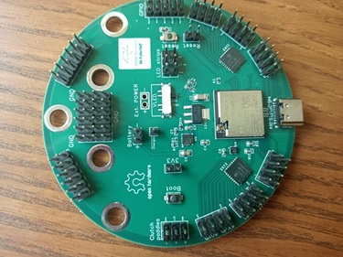

# Know your ESP32 DevKit board

You may choose any devkit board you want
as long as it is based on Expressif's "ESP32" architecture and features BLE support.
To be more precise, "ESP32" or "ESP32S3" boards,
since they are supported by
[NimBLE-Arduino](https://github.com/h2zero/NimBLE-Arduino).
Expressif's "ESP32C3" boards are not recommended since they have a single CPU core.
They work, but this project takes advantage of dual core architectures.

Alternatively, you may use any "ESP32S3" board for a purely wired implementation,
since those are *USB-capable*.
"USB-capable" means your devkit is able to work as a fully-featured USB device.
Note that most USB ports found in devkit boards are just serial port devices,
not fully featured ones, so check a data sheet before purchasing.
Right now, this project does not support both
USB and BLE connectivity at the same time in the same device.

Pure "ESP32" boards are widely available and 100% functional,
however, they are a bit outdated and may drop support soon.
My advice is to go with the latest boards.
Some interesting DevKit boards for this project are:

- Those designed and sold by [Unexpected Maker](https://unexpectedmaker.com/shop?category=Development+Boards),
  like "Feather S3", "Tiny S3" or "TinyPico".
  Those are open hardware, as well.
  - The [OMGS3](https://esp32s3.com/omgs3.html) DevKit board features a built-in "fuel gauge",
    which is supported by this project. Unfortunately, that board is for surface-mounting only.
- [Adafruit Feather 32u4 Bluefruit LE](https://www.adafruit.com/product/2829).
- [Wemos boards](https://www.wemos.cc/). *Note*:
  - The "D32" series are also known as "Lolin32" and found by that name at many retailers.
  - Wemos "Lolin32 Lite" is an outdated and deprecated board.
    However, very cheap clones are still sold at some retailers.
  - "S3 mini" is a very interesting board if you don't need built-in battery support.
- [Sparkfun Thing Plus](https://www.sparkfun.com/products/17381).
- [Some LilyGO boards](http://www.lilygo.cc/) even if their built-in display is not used.
  - "T7 S3" is a very interesting board, close to "Wemos S3 mini",
    but features built-in battery support
    (credits to user [@WallK](https://github.com/WallK) for pointing this out).

You need to balance two key aspects: **size and pin availability**.
The larger the board, the higher the count of available pins,
so you can fit more buttons, paddles, etc,
but the greater is the space required inside the sim wheel's housing.

In order to reduce size and circuit complexity,
it is recommended to use GPIO expanders (will be explained later)
and small devkit boards like Unexpected Maker's "TinyPico" or LilyGO's "T-QT".

This project makes extensive use of the official "ESP32-DevKit-C" and "ESP32S3-DevKit-C" boards
for testing and development purposes,
but that is not the best choice due to its excessive size.

> ♨️
>
> This project features a [custom DevKit board](../pcb/CustomDevKit/CustomDevKit.md)
> having all you need for simracing (except for the external antenna).
>
> 

## Flash memory requirements

At the time of writing,
this project requires 50%-80% of the flash memory capacity of a "standard" ESP32 DevKit,
which is **4 MB**.
However, the firmware size may increase further.
In case of extreme need,
you may still reconfigure the partition table to make more room for the firmware:

- In Arduino IDE, go to "tools" ("Arduino: board configuration" in VSCode),
  then "partition scheme".
- Select "Huge APP (3MB No OTA/1MB SPIFFS)".

However, my advice is to go for a 8 MB DevKit board, just in case.

## The two lies

Technically, DevKit boards are interfaced through General Purpose Input/Output (GPIO) pins.
However, there are two lies in this sentence:

- General Purpose: Some  pins are *specific purpose*, to name some:
  I2C and UART pins. Some of those pins can not be used as general-purpose pins.
- Input/Output: some pins can not be used for input, others can not be used for output.

This is not the only annoyance:

- Boot will fail if certain pins are set to high voltage.
- Some input pins lack internal pull-up or pull-down resistors that others have.
- Some pins can be used as inputs, but in pull-up mode only.
- Not all pins can wake up the system from deep sleep.
- Not all pins can be used for analog input.

As a result, some devices can not be connected to any arbitrary pin,
so a **pin-out plan** is needed. To develop such a plan,
you need to know which constraints apply to your DevKit board. Look for a data sheet.

### Pure "ESP32" boards

The following article explains which pins can be used and how:
[https://randomnerdtutorials.com/esp32-pinout-reference-gpios/](https://randomnerdtutorials.com/esp32-pinout-reference-gpios/).
However, we can get more specific:

- **GPIO #36, #39, #34 and #35**:

  - Input only.
  - No pull resistors.

  | Intended use                    | Suitable?                           |
  | ------------------------------- | ----------------------------------- |
  | Battery Monitor                 | yes                                 |
  | Fuel gauge                      | no                                  |
  | LEDs or LED strips              | no                                  |
  | Rotary encoder (bare bone)      | yes, with external pull-up resistor |
  | Rotary encoder (KY-040)         | yes                                 |
  | Button matrix selector pin      | no                                  |
  | Button matrix input             | yes (see note 1)                    |
  | Multiplexer selector            | no                                  |
  | Multiplexer input               | yes, with external pull-up resistor |
  | GPIO expander                   | no                                  |
  | PISO shift register input       | yes                                 |
  | PISO shift register, other pins | no                                  |
  | Single button                   | yes, with external pull-up resistor |
  | Wake up pin                     | yes                                 |
  | power latch pin                 | no                                  |

  *Note 1*:
  - When using positive logic (circuit design provided in this project),
    you must attach an external pull-down resistor.
  - When using negative logic (circuit design not provided in this project),
    you must attach an external pull-up resistor.

- **GPIO #12**:

  - Not suitable for any **externally** pulled-up input since boot will fail,
    including:
    - Single button.
    - KY-040 rotary Encoder.

- **GPIO #6, #7, #8, #9, #10 and #11**

  - **UNUSABLE**. Do not attach anything to those pins.

- **GPIO #16 and #17**

  - Boards based on **ESP32-WROVER-B** requires these pins for PSRAM,
    so they are **not usable**.
  - Safe to use in other cases (ESP32-WROOM-32).

- **GPIO #0**:

  - Despite being described as pulled-up,
    it seems to work in other modes.
  - The board will enter "bootloader mode"
    if this pin is set to low voltage at startup.

- **GPIO #1 and #3**:

  - These pins are used by the USB serial port.
    They should be reserved for firmware upload and debugging via the serial monitor.
    However, this project does not enforce this usage
    as there are a few situations where other uses are appropriate.

### ESP32-S3 boards

- **GPIO #0**

  - The board will enter "bootloader mode" if this pin is set to low voltage at startup.
  - Connected to the on-board "boot" button.
  - Avoid other uses.

- **GPIO #43 and #44**

  - Connected to the primary USB port header (USB to UART bridge).
  - These pins are used by the USB serial port.
    They should be reserved for firmware upload and debugging via the serial monitor.
    However, this project does not enforce this usage
    as there are a few situations where other uses are appropriate.

- **GPIO #45 and #46**

  - Bootstrap pins better to avoid.
  - GPIO #46 is input-only.

- **GPIO #19 and #20**

  - Connected to the secondary USB port header (USB data pins).
  - **NOT USABLE** if USB connectivity is required.
  - Better to avoid in any case.

- **GPIO #35, #36 and #37**

  - Connected to PSRAM, thus **NOT USABLE** unless there is no PSRAM.

- **GPIOs #26 to #32 (inclusive)**

  - Connected to SPI Flash, thus **NOT USABLE**.

More information
[here](https://www.luisllamas.es/en/esp32-s3-hardware-details-pinout/)
and
[here](https://docs.espressif.com/projects/esp-idf/en/latest/esp32s3/hw-reference/esp32s3/user-guide-devkitc-1.html).

### ESP32-C3 boards

- **GPIOs #11 to #17 (inclusive)**

  - Connected to SPI Flash, thus **NOT USABLE**.

More information
[here](https://www.studiopieters.nl/esp32-c3-pinout/)
and
[here](https://docs.espressif.com/projects/esp-dev-kits/en/latest/esp32c3/esp32-c3-devkitc-02/index.html).

## Uploading firmware to your DevKit board

In order to upload a firmware to a DevKit board, certain pins, called "bootstrap" pins are used.
If some device is attached to those pins, it may get in the way.
You should detach the board from the circuit before uploading, just in case.

In Arduino IDE, you need to configure the "board manager" with the proper parameters.
Most times, you only need to select the correct board and go with the default parameters.
Most times, those boards are "ESP32 Dev Module" or "ESP32S3 Dev Module".
However, check the manufacturer's data sheet.
When using the USB implementation, set USB-Mode to "USB-OTG (TinyUSB)".

### Entering bootloader mode

Some DevKit boards refuses to upload firmware unless you put them in "bootloader mode".
To enter boot mode you have to either:

- press the "reset" button while pressing the "boot" button, then release both.
- keep the "boot" button pressed while Arduino IDE is uploading the firmware.

If your DevKit board does not feature a "boot" button, drive `GPIO #0` to `GND` instead.

If your DevKit board does not feature a "reset" button, drive `EN` to `GND` instead.

It is said that some boards require a small capacitor between `EN` and `GND` pins to avoid this annoyance.
I can not say if that is true.

See [Expressif's documentation on "Select Bootloader Mode"](https://docs.espressif.com/projects/esptool/en/latest/esp32/advanced-topics/boot-mode-selection.html)
for further information.

### Troubleshooting firmware bugs

If you go for a custom firmware and it does not work,
your only chance to know what is happening is the *serial monitor* at Arduino IDE.

Check the guide on [troubleshooting](../Troubleshooting_en.md).
