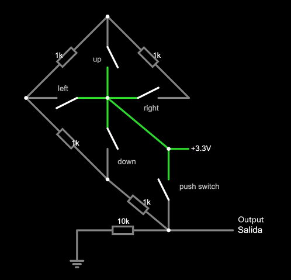
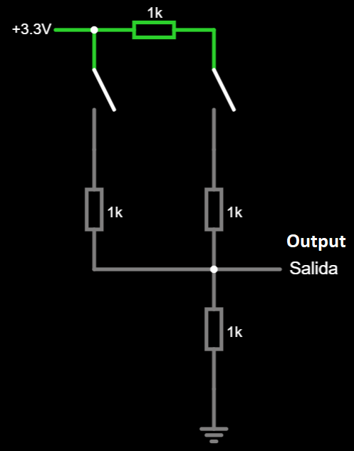
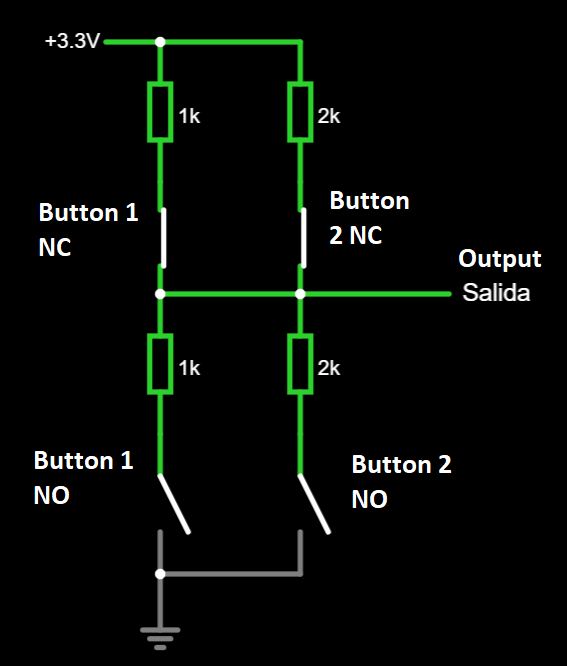
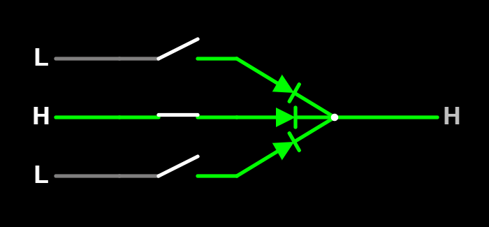
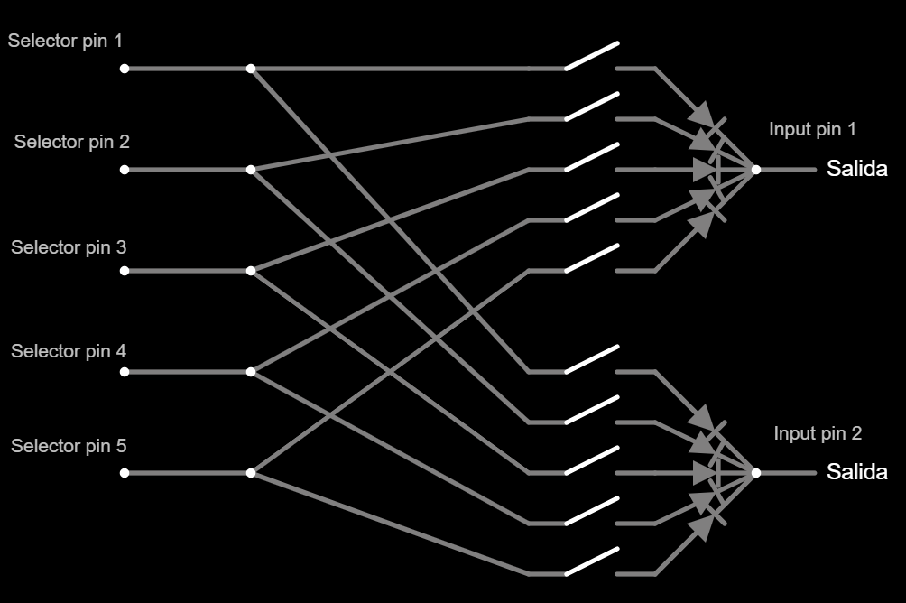
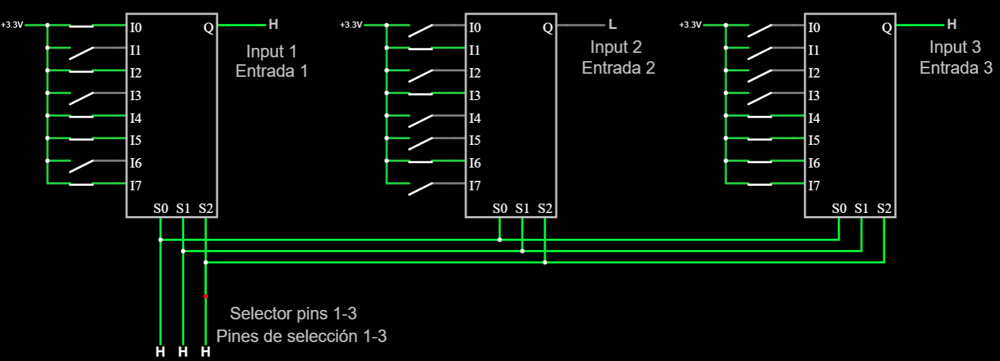
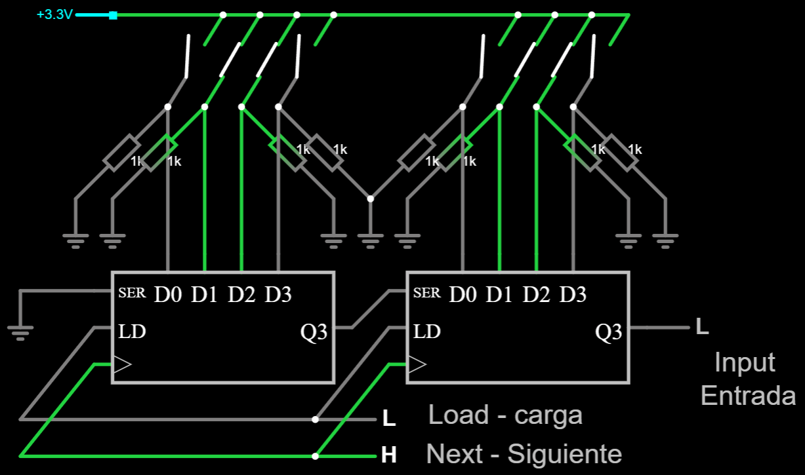

# Input hardware suitable (or not) for a sim wheel or button box

This article discuss different options to provide enough inputs to a sim wheel or button box, taking into account the limitations of a DevKit board:

- Limited number of input pins. Not all pins are suitable.
- Noise in analog readings.
- Battery drainage.

## Switches

Depending on how they are activated, may be classified as:

- **Momentary switches** ("MOM"): they automatically return to the previous state and come in various shapes: push buttons, push levers and roller levers to name some of them.

- **Non-momentary switches**: once activated, they keep that state, and have to be manually reversed to the previous state. They also come in several shapes. They are suitable for this project, however, they offer no advantage over momentary switches and requires more complex software, so they are not used here.

Depending on how the circuit is closed, momentary switches may be classified as:

- **Normally closed** (NC): the switch is closed if not pressed, letting current flow. This is not recommended to prevent battery drain.
- **Normally open** (NO): the switch is open if not pressed.
- **NO-NC** (both): they have 3 or 4 terminals and may be used both as NO and NC at the same time. Note that NC terminals are closed while NO terminals are open, and vice versa. This has an interesting application with voltage dividers (see below).

Switches are prone to [bouncing](https://circuitdigest.com/electronic-circuits/what-is-switch-bouncing-and-how-to-prevent-it-using-debounce-circuit) due to its mechanical nature.
This project provides debouncing by software means.

## Incremental Rotary Encoders

They come in two flavors:

- **Bare bone**: just a mechanical device with no pull resistors. They have 5 terminals: `common GND`, `A` and `B` (related to rotation) plus `SW GND` and `SW` (related to the built in push button). Those terminals are floating when idle. In this case, the label `GND` means nothing: it is just one of the two terminals of a switch.
- **KY-040**: a bare bone rotary encoder with pull-up resistors. They have 5 terminals: `Vcc` and `Gnd`, related to the power source, `CLK` (or `A`) and `DT` (or `B`), related to rotation, and `SW`, related to the integrated push button. `CLK`, `DT` and `SW` terminals are set to high voltage when idle.

[See pinout at pinterest.com (thanks to Abhishek Ghosh)](https://in.pinterest.com/pin/436145545160682538/)

Both encoders are supported in this project, as long as the proper input pins are used.

Rotary encoders can be very noisy, despite of debouncing techniques, some rotations may be missed. This project has eradicated this problem as far as we know.

## Absolute rotary switches

They are similar in shape to rotary encoders, but they work in a complete different way. A N-position rotary switch is just the same as N **non-momentary** switches where one and only one of them is closed at all times. **This makes them unpractical**, since the PC side will detect a button as "always on". When trying to configure another button in the simulator, that one will get in the way. 

We could alleviate the situation by instructing the firmware to report a button press only if there is a change in the position of the rotary switch. However, the simulator will never known what such position is at first.

## Rotary Potentiometers

They are similar in shape to rotary encoders and absolute rotary switches, but they are a completely different thing:

- There is no "on" and "off" position because they provide a continuous analog output.
- Can not rotate 360 degrees.
- Current is drained at all times, which is bad for batteries.
- Prone to failure after 10.000 usage cycles or so.

As a result, **rotary potentiometers are discouraged**. However, some wheel cases are equipped with potentiometers at the clutch paddles, so we have to live with it. For example, the [GT2 steering wheel kit from 3DRap](https://www.3drap.it/product/gt2-steering-wheel-kit-by-3drap-thrustmaster-logitech-and-osw-adapters/). Potentiometers are supported in this project in two ways:

- As an analog axis, attached to an ADC pin.
- As a replacemente for switch buttons, in case you are short of ADC pins.

## Directional pads (DPADs) and 4-way joysticks

They are just 4 (sometimes 8) push buttons arranged as a cross. Note that one and only one of them can be closed at a time, or none of them. Do not confuse 4-way joysticks with 2-axis joysticks, the later are just two potentiometers that drain current at all times. Not suitable for this project.

## Funky switches

A funky switch is just the physical combination of a rotary encoder, a 4-way joystick and a push button into a single device. A note of caution here: funky switches are priced around 4 dollars at AliExpress, but 30 dollars at some other retailers. The main disadvantage of funky switches is that can't be mounted into a panel (they lack a nut).

# Input circuitry

When using a GPIO as a digital input, just one switch can be accommodated in it. There are not enough input pins to accommodate all the required inputs in this way, so another technique must come into place. There are several choices:

- **Analog circuits**. Some GPIO pins are equipped with analog-to-digital converters (ADC), so they may be used as analog inputs. The idea is to share a single pin with a number of inputs by setting different voltages. However, ADCs are not perfect. There is a severe *limitation* on the number of inputs that can be detected by the software *without error*. Every single analog circuit should be "calibrated" in software. The calibration procedure will determine a range of voltages where every single input is detected. Even if two circuits seem identical, they may set different voltages for the same inputs. This is due to resistors not being perfect. However, you may come into a calibration that suits all identical circuits.

- **Button (or switch) matrices**. Those are digital circuits, so they are not prone to error. Given $N$ suitable pins, a button matrix can hold up to $(N/2)^2$ buttons.

- **Multiplexed switches**. Those are digital circuits, so they are not prone to error. The number of switches this circuit can hold depends on which [multiplexer](https://en.wikipedia.org/wiki/Multiplexer) is chosen and how they are combined. For example, four multiplexers, three selectors each, can hold $4*2^{3}=32$ buttons with $4+3=7$ pins. This project does not support multiplexed switches right now.

- **PISO shift registers**. *"PISO"* means *"parallel input - serial output"*. Those are digital circuits, so they are not prone to error. There is almost *no limit* to the number of switches this circuit can hold and it takes just 3 pins. This project does not support shift registers right now. 

## Analog circuits

In global terms, analog circuits may seem a good idea, but they **may fail** to identify the correct inputs due to:

- Voltage drops, when another part of the circuit is draining current.
- Resistor tolerance.
- Imprecise and noisy readings at the ADC.

Note that analog circuits must be connected to ADC pins. Many pins are not suitable.

There are other kinds of analog circuits that have been discarded, too, because they drain current at all times.  

### Voltage ladders

A voltage ladder can accommodate a reasonable large number of inputs into a single pin, but one and only one of them can be detected at a time. This may seem a disadvantage, but it is *perfect* for directional pads, rotary switches and funky switches.

This is a voltage ladder for a 7-way funky switch. 

[Test this circuit at Falstad.com](https://falstad.com/circuit/circuitjs.html?ctz=CQAgjCAMB0l3BWcMBMcUHYMGZIA4UA2ATmIxAUgoqoQFMBaMMAKAGcQUFDweuewAFkFRwIAGYBDADZs67Tt3DCQ2PCKEiqEKbPkd+yjSjxHROmXIWHNivhhTmJl+QHc7Z7AkcoUWlgBKqt6cfiCCcKFaohGq0NiiVDAILABOHpiOYCZm2vBp4Dm2Njx5cAUlquq5yOUcXo4NwT5h2s56FUqZzT1lkCwA8j1NgnhUTUkFTU1ophO15QDmnPg9s+GRkwAeqiSceOSC2BAoxFTGIAAOAK5sABYAOmxsrgCWAC4AxncsO8cJYEIImw2AEhEOhRAqVeizu71+4AwpjAIPAxA0oPCkOkdHE8J2KFRB04gh4Zyx2RA10uCO6fjmkS4EAuABMAPauAB2LCAA)

This circuit does not involve rotation because no external circuit is needed for that (requires two different pins, apart from `GND`, as any other bare bone rotary encoder).

And this is a voltage ladder for 7 push buttons or a 7-steps absolute rotary switch:

[Test this circuit at Falstad.com](https://falstad.com/circuit/circuitjs.html?ctz=CQAgjCAMB0l3BWcMBMcUHYMGZIA4UA2ATmIxAUgoqoQFMBaMMAKAGcQ8qAWPTqsCj4CQAMwCGAGzZ124ISF7y+g4eDFSZLAE79l+1VGRwdBhWAyF9A+KYtXDKFN2vHIppy8cYUrsLY57RRVLPw1pWQ5PYJBowxEJCLlMXyUUsMStDmw0GJyBBQTNWV10w3y-W10K8sIVQrc5bDq8lvj1TNkAdxBm+r5uJXiWAHlFIYVBvi4jd2q2hT7Y5yN-WwBzXpbopZQEKyp3HqWlCqUj3ty0nxiL9LSV85Ye6KHQp56giYHhZ-0lGZPABKWx+ijAVnORm4VGw0Gwsyg0AQLCAA)

Note that both circuits are identical except for the number of switches, despite their differences in physical layout.

Almost any resistor can be used. However high impedance resistors are recommended to avoid excessive battery drainage.

### Voltage dividers (for push buttons)

A voltage divider may accommodate two buttons into a single wire, but no more. This conclusion came from experimentation.
Unlike voltage ladders, a voltage divider is able to detect any combination of buttons pushed at the same time.

Different resistors may be used, but they have to be tested. As a rule of thumb, each pull-up resistor should duplicate the impedance of the previous one.

Voltage dividers do not provide any advantage over button matrices, but are prone to error, so they are discouraged.

#### 2 buttons

This voltage divider can be built using 1Kohms resistors only:

[Test this circuit at Falstad.com](https://falstad.com/circuit/circuitjs.html?ctz=CQAgjCAMB0l3BWcMBMcUHYMGZIA4UA2ATmIxAUgoqoQFMBaMMAKACURcAWEPKlBIV5URILlWzRsUGTAQsATp0g8+YuMJlh4LAM7LVEleAxCqEAGYBDADa66e9VTXjzprSGt2HS7iaF+mChaOkqu-k4gQSFwLADuBlEYweHRkIqR0eHYhHgx6QDymcliamlQLADmkTl54eEiLEA)

#### More buttons?

More buttons could be accommodated into a voltage ladder by using NO-NC push buttons. This has not been tested. The idea is to enable a pull-up resistor using the NC terminals, while disabling a pull-down resistor using the NO terminals and vice versa.

This circuit illustrates the concept for two NO-NC physical buttons:

No physical button is pressed in the previous image. Note that both switches in a single column can not be closed nor opened at the same time because they are part of the same physical button.

[Test this circuit at Falstad.com](https://falstad.com/circuit/circuitjs.html?ctz=CQAgjCAMB0l3BWcMBMcUHYMGZIA4UA2ATmIxAUgoqoQFMBaMMAKACUQUFCRCAWTvl4CqVPlWzRsUGTAQsATp27DlPMHxHI4LAM5rwmg2jyyQAMwCGAG111FxoVx4o8pqmHh7jbg9kLu4BY2diwA5n4BBuKiUCwA7o6m2P6C7gkG-CApPFmQDjmqhRpaaDr6xUaFJmZWtvZK1ULVvlRl+YnO2VGF-ukVqa7JqX0yEHWhAPLZg0KapjWiLEA)

## Button Matrix

A button matrix is composed by two groups of pins:

- Selector pins (also named *output* or *column* pins): they activate a single part of the circuit.
- Input pins (also named *row* pins): they provide the state of that part of the circuit.

The idea is to scan each part of the circuit by enabling one and only one of the selector pins, and then moving to the next one. After a few rounds, the state of every button is collected. So, yes, a button matrix is able to detect input from multiple buttons pushed at the same time, without error. The maximum number of buttons that a matrix can hold equals to the number of *row* pins multiplied by the number of *column* pins. If $N$ pins are available, the maximun number of buttons is obtained through $N/2$ selector pins.

The main disadvantage of button matrices is wiring: a lot of wiring is required which is prone to human error. Correct orientation of diodes is also critical. Note that diodes are a critical part of the circuit and can not be suppressed.

There are multiple correct variations of button matrices. The one proposed here is this:

- Input pins are pulled down (internally). As a result, pins GPIO36, GPIO39, GPIO34 and GPIO35 can not be used unless an external pull-down resistor is provided.
- Selector pins are set to HIGH for reading, and LOW otherwise. Note that certain pins are not suitable for output.
- Diodes are faced toward the input pins.

This is the logical circuit attached to a single input pin using 3 selector pins:

[Test this circuit at Falstad.com](http://falstad.com/circuit/circuitjs.html?ctz=CQAgjCAMB0l3BWcMBMcUHYMGZIA4UA2ATmIxAUgoqoQFMBaMMAKABkQUUAWcYlcISph+UMQDMAhgBsAznWqR2nHp27ChaqsJBS5CpEo5deKPHkFUzF7bpnzFLWSt4iB2NHwE698py60QDyt1MSpfOn8TTnMgz2sxCAiWABM44VF1EKsQFLopAFdpABdU9MCswIE8wpKy4JiLSp4cmski0oBZEGbQ7mJCQKtoBBYgA)

This is the electrical circuit for 5 selector pins and 2 input pins:

You should be able to extrapolate such a circuit to any other size. This is a [button matrix at falstad.com](https://falstad.com/circuit/circuitjs.html?ctz=CQAgjCAMB0l3BWcMBMcUHYMGZIA4UA2ATmIxAUgoqoQFMBaMMAKABMQG09xDOxCVBoQAsIFCDZ0AZgEMArgBsALu36De6odgkSpcpao5MwEgVs6jxkmQpUsA7hYY7nVyCwDOnbpq74QPCpgkDlFTzovC3MmDSCocFDZcMjvEzM+dMCQiDCIlgBZNzFYoWYJKhRoBEL1SxKY8oSqmu9Xc1d4qlzk-LTzRr4uhLzU+r8rYZ6UxzqXCVjxjw52zJirPVtDNUXBzldNg3tjKz3hMUO7VSLTHnPwFDumyuqosAw+AY-shKpRt8emluP26SRm3ni5niUzB+ScwPmDzu7jU70+n0B90u2w4wIGmIONiORh++ORFyJV1qmAWGwwC2e4lebTQmh0VGGf16Yxpml5nNhPJQYnMKGFIJG3NmvMRMpRK1Zovp42xx3EyqVC0J+ipHDFIr4copOu2RRE6zE5rWpmazJAIlOfAdYhh-28Vs0HtdUrahB4HT9EumcPtMVcHvuy3tjtDmQ2lJxsc9Yd0CbV2ED5gj8ZN9iKCA09wLZRtL1aIEE-r4lYlXPBFA05mLtcFUQQNqbNu9MyczcRfflFYCTcLOa2aubI+0qdzJPbGQbQjHxJYABlF0iQPTuoCQqNqB4nFl4vcurNOhzL1BZmifvqQefA-F2Q+nM6fvPXxYTwIdzxD3UP4Yv+N6ApCgLAgB-KVBqu6zF6VAepBszNvEk5wUev6brsGF1HiEG4fhPC8shTgkYCSG4ZRPDoSBb6TIhGwBABGY8M+gaPHR4jivE96+AB0JXpx15HgxKrMbMWIBHxElkeKvjvvxa7RhcASEPJzGSikB6Sb4J6+MJAH+MReBsZUpkiXeFmseIFkATW8QiCIJlcTZwlOS517rh5tk8DWhlaREOlAA) for 18 buttons.

Almost any kind of diode is suitable for this circuit, but the fast switching [Schottky diodes](https://en.wikipedia.org/wiki/Schottky_diode) with low forward voltage are perfect. For example: 1N4148.

## Multiplexed switches

This circuit is quite similar to a button matrix, but it requires a number of multiplexers, an extra cost which also takes some space in the PCB. Two groups of pins are required:

- Selector pins: they choose a single switch from each multiplexer.
- Input pins: they provide the state of the selected switch at each multiplexer.

The idea is to scan each switch in a loop. First, the required selector pins are enabled. Second, inputs pins are read.  After a few rounds, the state of every button is collected so it is able to detect input from multiple buttons pushed at the same time, without error.

There are two kinds of multiplexers:

- **Analog multiplexers**: the selected switch is electrically connected to the input pin, whatever voltage it has. They work straight with switches.

- **Digital multiplexers**: the voltage at the selected switch is copied to the input pin, but they are not "electrically connected". Does not work straight with switches because they have an undetermined voltage when open. In order to work with switches, an external pull resistor is required for each switch, which is unpractical.

This is the logical circuit for 3 selector pins and 3 input pins using analog multiplexers:

Which can hold up to 24 push buttons. [Test this circuit at Falstad.com](https://falstad.com/circuit/circuitjs.html?ctz=CQAgjCAMB0l3BWcMBMcUHYMGZIA4UA2ATmIxAUgoqoQFMBaMMAKDDwBYQUUu8rMKEPyghsLAM7dewqmBR5ZoqgDMAhgBsJdSdK7Mh8xQdER1WnVJ76O+heFvKQ57buvgMhcPbCfTzzVcrGTRje1CnF0s9bg45cLjIwOj3QW9FNLkAizcZXDtFfKScgHd0pSNweSgWMsqTesdIWvKwR3q-ZrqfP0qIrvKIvsSB4fiMjCFR8MnyouaAJXKRFao1kETsaGwnGAQWABluPEUOQi4FRQQm8Gztamaj7DQN87EX664sqIfDsQQhBwwF5sACKDczMlfgBZMScJS2RQiATQfawvBvETEezI7iolhLQj4JQIIlKdabba7fFlIkTIR0sSQL4tRm8Khs2YDNnEtkjVnE3xeHmKbmCxyMoU1WmC6qSpoCpEc2VTXQYZlMriM+a3KJqjVpTlTUR6qTqi6JPnrSE5M0G3nE-q65L6-R+SWdE0uu02LXir7O20gc1VBkq4pBYMakSM3E21zsLghkQYMG48RlS5wi4nV4ssrPKjYQiFF5xNYtLPYeGeQrwgaFjZwWRUcvSltNqj8Isl9ugwHA4TPDaDgZ4YdArzjoTF0UtRtthdvBtgyf-QHLlgADzhXg4ZAohC8lFbsRAAGU6Bo6ABjAAuAHsAE4AHQkAAcAJYAOwkb7ADDiDucTEN4e4EN4oEWiAACS37vgArne-7bsIxBeMwoHoaB8iAmecGIchEgoKhxbkACoGMggE5ngACj+dB-hIAAmdBvto143jen4AM-fv+gGkcQ+jURsxDGKSGxngAot+d5PmozFqChO4nDYWG5mAq4yXJClKW+JEFqug79mIvYDLW2bBr2s7tlW8JVuZqFgMWhj7g4R7gNpMiyfJinKRIQHgNgvRgDhtg4TwUkyARSFvuIiZVPCIjyMO6a6MwyVyPgSr+KaSX6NUYA5aGeXegVDj6CVbQBvG0SZW6GHVZ6dUZYlQwlU6qjlQ1sTZbm7IRvV7WzMVA1cl6Qa9UUY2FBq6x6nUJUpdV1SjKthjVQqS2ae0zVeOtmm9J1xKHRkgqdfyO0ZIks3cFyLR3Wkd3zASyC5itiS4q2RZUusewsLCLmOClcS5Si+xlJZ1Z2Bwdb5h2bZGD9FZlNOI4Ydg1RrqMWMDpj1S2dMIhIwoPZzt0cNWfIVNEywQA) (this simulator does not feature analog multiplexers, so let's pretend digital multiplexers are analog ones). Input pins must enable an internal pull-down resistor.

The number of required pins could be further reduced, in some cases, by placing another multiplexer for the input pins. 

## Shift registers

The idea behind shift registers is to capture the state of every button in parallel and send it through a single input pin, in sequence. This can be done because shift registers have memory. There are just 3 pins involved:

- Load (LD): a pulse at this pin will capture the state of all buttons at the same time and store it into memory as individual bits.
- Input: read the value of a single bit (this is, the state of a single button)
- Clock (CLK): a pulse at this pin will move to the next bit, this is, the state of the next button.

Tipicall shift registers stores 8 bits, but they may be chained together to achieve any number of bits. This is an electrical circuit for two shift registers, 4 bits each one:

Note that pulldown resistors are needed for each button, which is unpractical. It will require extra space at the PCB, too.

[Test this circuit at Falstad.com](https://falstad.com/circuit/circuitjs.html?ctz=CQAgjCAMB0l3BWcMBMcUHYMGZIA4UA2ATmIxAUgoqoQFMBaMMAKDD0JG207Ty8L8+IPGGIAWEJOzRsUNhxFVhzFCGGiJUrrPkB3LpEkpxVbr3zyATuHGTx-QpLAp+VMPBYBnW-f5i1Bmw1dxAAMwBDABsvOhYDMDspfySwDE5IePB07M40zgdrXOSQYjzXKGQ4b2LClBMQIJDKyJi4m2E6vH8K908DTqFLfKKTKkLg916qzJ9B9QROJsqqVtiasZLXfmXQtbiE4kDg9QbdrPrJZZRFxpPMgdvr7ruQrIDX0qX7lgBzECc4AqgLAhCo4JYACUvp9CrtKqYdHJwVBoAgWABZChg9SIsFCRHKNHvCz8PDKSwPJS49ycSb6Lg8GnqDBqelU0FcNAstnczIAGR5XLMTPZLWisSRDPJQs52AQbwM5iFmDZCoZcvVqq46oFQvlbNFuvA4QldClmQAHgD2CzHBgIK4IMZJABJAB2AAcAK4AFxY1rBdMg5BIZg82gaAFF3b6rBEACYRANcDBmBqUaSYSOSfkAe0TAB0vAxiwBjCJWX7J608fjy-gIbD1wjO3EgABydEtvuLpa8AGUAJa-b1DuixuL-TkqXiE+T-MpA-hL0EozL-bbL9QvNcrP7C7f0vcQgaIuqIkZU8RLwo3vI5DcUHIuRsvnEQ-4IVIVb-OD8LjqaivkB4AAdecInFu5wGAgLifH+nzXjKyxwccipSJBagOFQ5w+PeJSIfCED7DU4iAoUaFIeKbQsDYBGUS+0weNUBjkX4Uggo+dGcRxiEgX01T4Scd4ofcNHrPRIn1uqAkzFk4gnCMinYW4ClwCUpjuNx+EaXeWGVCRZo8VpJTHsxnhAA)

## Summary of input hardware

| Circuitry            | Required pins                | Number of switches | Best suited for                           | Advantages                  | Disadvantages                    |
|:--------------------:|:----------------------------:|:------------------:|:-----------------------------------------:|:---------------------------:|:-------------------------------- |
| None                 | 1                            | 1                  | Rotary encoders                           | Easy and error-free         | Not enough pins for many buttons |
| Button Matrix        | $N$                          | $(N/2)^{2}$        | Push buttons and DPADS                    | Many buttons and error-free | Complex wiring                   |
| Multiplexers         | $S$ selectors and $I$ inputs | $2^{S}*I$          | Push buttons and DPADS                    | Many buttons and error-free | Extra cost and space at the PCB  |
| Voltage ladder       | 1                            | enough             | DPADS, rotary switches and funky switches | Single pin for many inputs  | Requires calibration             |
| Voltage divider      | 1                            | 2                  | Push buttons                              | None                        | Prone to error                   |
| PISO shift registers | 3                            | unlimited          | Push buttons and DPADS                    | Many buttons and error-free | Extra cost and space at the PCB  |

Input circuitry takes some space inside the housing. Their physical layout must be carefully designed to fit into the steering wheel (or button box).
