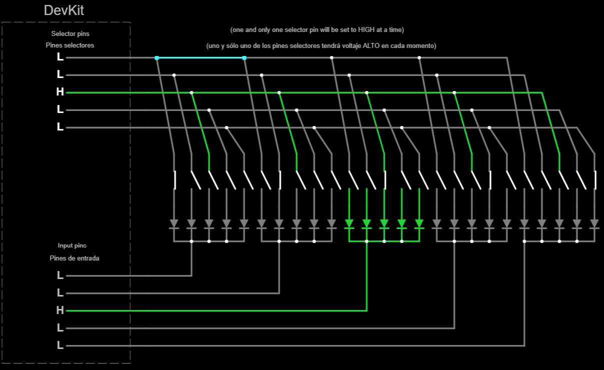
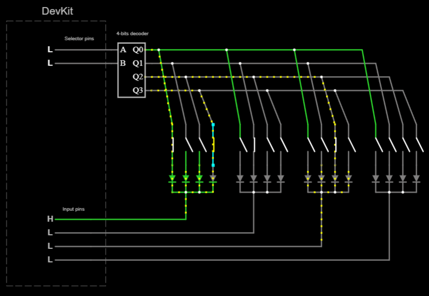
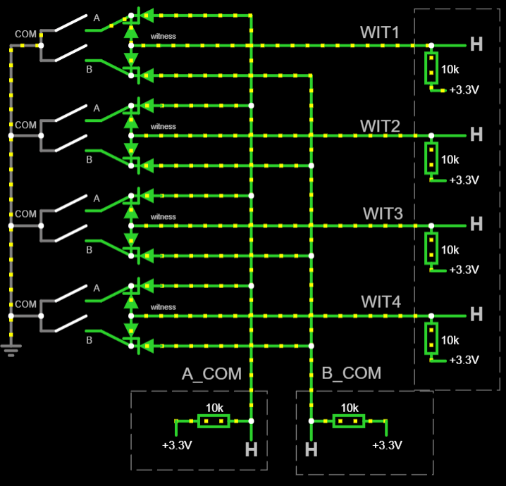

# Input hardware suitable (or not) for a sim wheel or button box

This article discuss different options to provide enough inputs to a sim wheel or button box, taking into account the limitations of a DevKit board:

- Limited number of input pins.
- Noise in analog readings.
- Battery drainage.

## Switches

Depending on how they are activated, may be classified as:

- **Momentary switches** ("MOM"): they automatically return to the previous state and come in various shapes: push buttons, push levers and roller levers to name some of them.

- **Non-momentary switches**: once activated, they keep that state, and have to be manually reversed to the previous state. They also come in several shapes. They are suitable for this project, however, they offer no advantage over momentary switches and requires more complex software, so they are not used here.

Depending on how the circuit is closed, momentary switches may be classified as:

- **Normally closed** (NC): the switch is closed if not pressed, letting current flow. This is not recommended to prevent battery drain.
- **Normally open** (NO): the switch is open if not pressed.
- **NO-NC** (both): they have 3 or 4 terminals and may be used both as NO and NC at the same time. Note that NC terminals are closed while NO terminals are open, and vice versa. This has an interesting application with voltage dividers (see below).

Switches are prone to [bouncing](https://circuitdigest.com/electronic-circuits/what-is-switch-bouncing-and-how-to-prevent-it-using-debounce-circuit) due to its mechanical nature.
This project provides debouncing by software means.

### A note on backlit switches

You may use them, but they are not recommended for battery-based systems.

- Single-color backlit switches: there is no need for specific firmware support. All you need is wiring.
- Programable RGB backlit switches: this project does not provide specific support for them.

## Incremental Rotary Encoders

Most rotary encoders feature a *built-in* push button. Those are the ones described here.
However, you may choose a rotary encoder without a push button.

They come in three flavors:

- **Bare-bone**: just a mechanical device with no pull resistors. They have 5 terminals: `common GND`, `A` and `B` (related to rotation) plus `SW GND` (sometimes `SW COM`) and `SW` (related to the built in push button). Those terminals are floating when idle. In this case, the label `GND` means nothing: it is just one of the two terminals of a switch.
- **KY-040**: a bare-bone rotary encoder with pull-up resistors. They have 5 terminals: `Vcc` and `Gnd`, related to the power source, `CLK` (or `A`) and `DT` (or `B`), related to rotation, and `SW`, related to the integrated push button. `CLK`, `DT` and `SW` terminals are set to high voltage when idle.
- **I2C** or "chainable": a bare-bone rotary encoder with additional circuitry in order to offer an *I2C* serial interface.
  A reasonable number of them can be chained together, using just two GPIO pins. An example is the [Adafruit I2C QT Rotary Encoder](https://learn.adafruit.com/adafruit-i2c-qt-rotary-encoder/overview).
  You could even build your own (see [https://github.com/wagiminator/ATtiny412-I2C-Rotary-Encoder](https://github.com/wagiminator/ATtiny412-I2C-Rotary-Encoder)).

See pin-out at [pinterest.com (thanks to Abhishek Ghosh)](https://in.pinterest.com/pin/436145545160682538/)

*Bare-bone* and *KY-040* encoders are supported by this project, as long as the proper input pins are used.

Rotary encoders can be very noisy. Despite debouncing techniques, some rotations may be missed. This project has eradicated this problem, as far as I know.

## Absolute rotary switches

They are similar in shape to rotary encoders, but they work in a complete different way. A N-position rotary switch is just the same as N **non-momentary** switches where one and only one of them is closed at all times. **This makes them unpractical**, since the PC side will detect a button as "always on". When trying to configure another button in the simulator, that one will get in the way.

We could alleviate the situation by instructing the firmware to report a button press only if there is a change in the position of the rotary switch. However, the simulator will never know what such a position is at first.
In this sense, there is **no specific support** to absolute rotary switches in this project.
However, they work, but not recommended.

### A note about *"mode selectors"*

You may find absolute rotary switches in some commercial SIM wheels that do not report input to the host computer. Instead, they allow the user to choose a behavior for other inputs (typically, a pair of rotary encoders). This project features *mode selectors*, but in another way:

- Assigned to simple on/off switches only, which are called **"ALT" buttons**.
- There are just two modes: *regular* and *"alternate"*.
- The selected mode affects all other inputs.
- You can have as many "ALT" buttons as you want (or none), but they all work just the same.
  Typically, you place an "ALT" button on each end of the SIM wheel (left and right).

Depending on user preferences:

- "ALT buttons" may work as independent regular buttons as well.
- Clutch paddles may work as "ALT buttons" as well.

## Rotary Potentiometers

They are similar in shape to rotary encoders and absolute rotary switches, but they are a completely different thing:

- There is no "on" and "off" position because they provide a continuous analog output.
- Can not rotate 360 degrees.
- Current is drained at all times, which is bad for batteries.
- Prone to failure after 10.000 usage cycles or so.

As a result, rotary potentiometers are discouraged. However, some wheel cases are equipped with potentiometers at the clutch paddles, so we have to live with it. For example, the [GT2 steering wheel kit from 3DRap](https://www.3drap.it/product/gt2-steering-wheel-kit-by-3drap-thrustmaster-logitech-and-osw-adapters/). Potentiometers are supported by this project in two ways:

- As an analog axis for each clutch paddle, attached to an ADC pin.
- As a replacement for switch buttons, in case you are short of ADC pins.

### Substitutes for potentiometers

Please, note that rotary potentiometers may be replaced by any other device which behalves just the same:

- Some kinds of (so called) *digital potentiometers*
- Some kinds of Hall-Effect sensors

This project will work with them, but still refer to them as "potentiometers".

## Directional pads (DPADs) and 4-way joysticks

They are just 4 (sometimes 8) push buttons arranged as a cross. Note that one and only one of them can be closed at a time, or none of them.
Do not confuse 4-way joysticks with 2-axis joysticks, the later are just two potentiometers that drain current at all times (not suitable for this project).
DPADs are supported by this project.

## Funky switches

A funky switch is just the physical combination of a rotary encoder, a 4-way joystick and a push button into a single device.
A note of caution here: funky switches are priced around 4 dollars at AliExpress, but 30 dollars at some other retailers.
The main disadvantage of funky switches is that can't be mounted into a panel (they lack a nut).
Funky switches are supported by this project.

**Warning**: misleading terminal tags have been reported at some ALPS funky switches (more information later).

## Magnets (magnetic shift paddles and the alike)

Magnetic shift paddles are a common choice for sim wheels these days due to their "feel" but, in the end, most of them are equipped with roller lever switches like any other shift paddle. However, magnets could be used as contactless switches, thus beating the lifetime of any mechanical switch.

Any mechanical switch may be replaced with [Hall-effect (HE)](https://en.wikipedia.org/wiki/Hall_effect_sensor) sensors. Note that there are many different kinds of HE sensors, not all suitable for this application. Discrete (or "digital") HE sensors/switches, like the widely available [KY-003](https://sensorkit.joy-it.net/en/sensors/ky-003) will work, but note that the sensor itself have to be positioned very close to the magnet.

## Input circuitry for switches

When using a GPIO as a digital input, just one switch can be accommodated in it. There are not enough input pins to accommodate all the required inputs in this way, so another technique must come into place. There are several choices:

- **Analog circuits**. Some GPIO pins are equipped with analog-to-digital converters (ADC), so they may be used as analog inputs. The point is to share a single pin with a number of inputs by setting different voltages. However, ADCs are not perfect. There is a severe *limitation* on the number of inputs that can be detected by the software *without error*. Every single analog circuit should be "calibrated" in software. The calibration procedure will determine a range of voltages where every single input is detected. Even if two circuits seem identical, they may set different voltages for the same inputs. This is due to resistors not being perfect. Analog circuits are not supported by this project and will never be.

- **Button (or switch) matrices**. Those are digital circuits, so they are not prone to error. Given $N$ suitable pins, a button matrix can hold up to $(N/2)^2$ buttons.

- **Multiplexed switches**. Those are digital circuits, so they are not prone to error. The number of switches this circuit can hold depends on which [multiplexer](https://en.wikipedia.org/wiki/Multiplexer) is chosen and how they are combined. For example, four multiplexers, three selectors each, can hold $4*2^{3}=32$ buttons with $4+3=7$ pins.

- **PISO shift registers**. *"PISO"* means *"parallel input - serial output"*. Those are digital circuits, so they are not prone to error. There is almost *no limit* to the number of switches this circuit can hold and it takes just 3 pins.

- **GPIO expanders**. Each GPIO expander will add a bunch of GPIO pins to the system. Those extra GPIO pins could be used by any input hardware,
  including switches and rotary encoders. GPIO expanders are interfaced through standard serial-communication protocols
  ([I2C](https://es.wikipedia.org/wiki/I%C2%B2C) or [SPI](https://es.wikipedia.org/wiki/Serial_Peripheral_Interface)).

- **Slave DevKit board**. If a single DevKit board does not have enough GPIO pins, two or more will.
  A "master" board would coordinate the others ("slaves") using the I2C or UART buses.
  The total count of GPIO pins depends on each DevKit. Unfortunately, the total count of "slave" boards would be limited by the power source.
  Those additional GPIO pins could be used by any input hardware, including switches, rotary encoders, and other input hardware.

### Analog circuits

There are some articles in the Internet claiming a lot of switches in a single pin. It may work in a circuit simulator or in a specific application but, in global terms, **they don't work properly**. I came to this conclusion after a lot of testing. Analog circuits may seem a good idea, but they **fail** to identify the correct inputs due to:

- Voltage drops, when another part of the circuit is draining current.
- Resistor tolerance and thermal noise.
- Imprecise and noisy readings at the ADC.

Note that analog circuits must be connected to ADC pins. Many pins are not suitable.

There are other kinds of analog circuits that have been discarded, too, because they drain current at all times.

- *Voltage ladders*

  A voltage ladder can accommodate a reasonable large number of inputs into a single pin, but one and only one of them can be detected at a time. This may seem a disadvantage, but it is *perfect* for directional pads, rotary switches and funky switches.

  This is a voltage ladder for a 7-way funky switch.

  

  [Test this circuit at Falstad.com](https://falstad.com/circuit/circuitjs.html?ctz=CQAgjCAMB0l3BWcMBMcUHYMGZIA4UA2ATmIxAUgoqoQFMBaMMAKAGcQUFDweuewAFkFRwIAGYBDADZs67Tt3DCQ2PCKEiqEKbPkd+yjSjxHROmXIWHNivhhTmJl+QHc7Z7AkcoUWlgBKqt6cfiCCcKFaohGq0NiiVDAILABOHpiOYCZm2vBp4Dm2Njx5cAUlquq5yOUcXo4NwT5h2s56FUqZzT1lkCwA8j1NgnhUTUkFTU1ophO15QDmnPg9s+GRkwAeqiSceOSC2BAoxFTGIAAOAK5sABYAOmxsrgCWAC4AxncsO8cJYEIImw2AEhEOhRAqVeizu71+4AwpjAIPAxA0oPCkOkdHE8J2KFRB04gh4Zyx2RA10uCO6fjmkS4EAuABMAPauAB2LCAA)

  This circuit does not involve rotation because no external circuit is needed for that (requires two different pins, apart from `GND`, as any other bare-bone rotary encoder).

- *Voltage dividers*

  A voltage divider may accommodate two buttons into a single wire, but no more. This conclusion came from experimentation.
  Unlike voltage ladders, a voltage divider is able to detect any combination of buttons pushed at the same time.

  Different resistors may be used, but they have to be tested. As a rule of thumb, each pull-up resistor should duplicate the impedance of the previous one. This voltage divider can be built using 1 Kohms resistors only:

  

  [Test this circuit at Falstad.com](https://falstad.com/circuit/circuitjs.html?ctz=CQAgjCAMB0l3BWcMBMcUHYMGZIA4UA2ATmIxAUgoqoQFMBaMMAKACURcAWEPKlBIV5URILlWzRsUGTAQsATp0g8+YuMJlh4LAM7LVEleAxCqEAGYBDADa66e9VTXjzprSGt2HS7iaF+mChaOkqu-k4gQSFwLADuBlEYweHRkIqR0eHYhHgx6QDymcliamlQLADmkTl54eEiLEA)

  More buttons could be accommodated into a voltage ladder by using NO-NC push buttons. The idea is to enable a pull-up resistor using the NC terminals, while disabling a pull-down resistor using the NO terminals and vice versa.

### Button Matrix

A button matrix is composed by two groups of pins:

- Selector pins (also named *output* or *column* pins): they activate a single part of the circuit.
- Input pins (also named *row* pins): they provide the state of that part of the circuit.

The idea is to scan each part of the circuit by enabling one and only one of the selector pins, and then moving to the next one. After a few rounds, the state of every button is collected. So, yes, a button matrix is able to detect input from multiple buttons pushed at the same time, without error. The maximum number of buttons that a matrix can hold equals to the number of *row* pins multiplied by the number of *column* pins. If $N$ pins are available, the maximum number of buttons is obtained through $N/2$ selector pins.

The main disadvantage of button matrices is wiring: a lot of wiring is required which is prone to human error. Correct orientation of diodes is also critical. Note that diodes are a critical part of the circuit and can not be suppressed.

There are multiple correct variations of button matrices. The one proposed here is this:

- Input pins are pulled down (internally). On *ESP32-WROOM-32* boards, pins GPIO36, GPIO39, GPIO34, and GPIO35 cannot be used unless an external pull-down resistor is provided.
- Selector pins are set to HIGH for reading, and LOW otherwise. Note that certain pins may not be suitable for output.
- Diodes are faced toward the input pins.

This is a button matrix with 5 selector pins and 5 input pins, giving 25 inputs, enough for most setups:

[Test this circuit at falstad.com](https://falstad.com/circuit/circuitjs.html?ctz=CQAgjCAMB0l3BWcMBMcUHYMGZIA4UA2ATmIxAUgoqoQFMBaMMAKABkQUAWKvX-qIIBmAQwA2AZzohs0bFBYBZTjxBc+IDeqpUU0BEpW0wKTcdO79h7rS5czFO4L0GAHiEL3VYbPK5-wUwBlOjE6AGMAFwB7ACcAHQkABwBLADsJFncEe0IIMC5TTzVAkAAFdLoJRKkwqLiqrJAMQjUUPECO-wh7ExAASTSkgFdIxNSMpry1BFMwBB6EJF7TCrSqxIATOkS6NMjYkU2Ra1UEFodz1ssDZRsPfAdCR5uWCU48DpQEVvaO7FmgiookkdDeMjQnB+EKoAIs4BAIKk4LhUNaqNRVAgSLB72weHs33RBJkgKxiPEyPeC1MRIofUxCJx4O0aLUGkZwMpuLU6jZdn+ZKZ3JZYF+0K4YtJ8OxIvehAwtOhCtMnIpoPBGEghOhWvsjNlGveOHFrRN0sEhqpzUIX11tot5OZ8tUdM8sKFVp5zztrR9juFRooFzpVwDXvBOR1rSj4fV1rAkGhdMT0LVzpAxHabKzgpl8Z5xGeOeLBoL4NIStalbjGcT3DZ9f1nvL7zwRbZ7fRLYzeGKdL7zfhXKDeGwVc049rcrMumhfA9+eZmw+edXailpm2omGYkiLBX48XMI3vxA25Eu-3h8BGMBkrPF6vB5kJIxJIfnHPdB3e5fn9RT9Py3H9Lz-FcBQtSDgO-X9r3ZY9WRgp9wPpVVARpU8vxQ+DY1RWNkNA58VzDfCLkIuCX39VF-QosD4PdC1GLo4iPEVJj2JY1C9QtHiuPg81UXNfiXxaNcxKwkDKJXBcLVkkSZKnVEx1MBTNGKZTijUrs5I7NTcwtAz9NLQEiyofSs0Myy1KbC1bJspNuzmRzJNg+iWAAd07XRPjZSBPPXADIU-fyvKPLDAKlUKoKlfEvCigK4qwoCEq86CpSQ1KEKwzCQoC3KpQIrKipjcistoqVmPK1RPxVLDorqz8+Ky5qzWwVo8q8iTP3krLetaFT6oCwaeq0vqxoGvSsqMqUzKGry5s-GtOszaypXsrKNtaVMOoSgAjThHkYhgiHAJB-OyXRAnkZYoRAAAROgADcAGkUn3Ly-nABlITpaKkrQLpN2hf7IQKIc-MSwEwAuAGQfyvoYZjJw-oC1lwbQyGvNjQHg1NBQ0r5ZhVI0VG0qlLQ+TJti5guHjqcYjG6up+nHnNBnHmJjxXXh7GLg0f1qcGpH1OjAnZ3AJxBqF-tHh0lmHS52SWfahwJOpmsRdsjXiwxmtqe1zmXI17MubmoWOw0AzqfuUn5x0AKB3MimHfJgbaH5128bV1WNGi80NB0v3He8Povq56Lw76SCI7Rom+n9WOvMTvoJKTm0OjN02+kj7wnHCjHQaxJx0acaLS9yPP7AaquJcL4a4El+w5vrz7vFh6GLn+zuY0RruEdpv12JFhrh-5qcR+GieLk1-u290R4AZeRKSVxnHl+xlG2e1Q6On9nfccHXfxaP3HDb3xLgti4Lg7Cm-dBq2-sqAjRMPL1+w7OHOAqqv0zjLkOthK5AJPo3Hqjcwy5w9u7aB4t7j+gMv6aKiDHgzWuOwIw31TAaAjsIbkMg5AKA4PcDGOCy6BikAQ+Q-liHt3duALueDQRUKIZgw+C895MMobIahTRsDEAgL4ZokByCqxWCAAAFNEdYiQRBpE2IkaRYgACeiiZESFqBEGICRkjpESB5FIYgxCJD2jsDRdAxgSBiIkAAEv0AA4jY2RliRCJEiCkAAtnQAAlHwrg5BCCmBaH6W6fQJHDDSNERIqiNEAGexBRIkBExJ2xEgJOqLo9YGTNH1FiBsKxexNixAAIeJCetEPcIgABWZiACCbAAAqAB5XYaREjhCOK4iQHjoheP2NEXxQA)

Almost any kind of diode is suitable for this circuit, but the fast switching [Schottky diodes](https://en.wikipedia.org/wiki/Schottky_diode) with low forward voltage are perfect. For example: 1N4148.

#### Encoded button matrix

This alternative further reduces the number of required pins by adding a *line decoder* chip to the circuit design.
Selector pins first indicate a particular switch in a binary-encoded format.
The specified switch will then be enabled in each group by the line decoder.
Input pins finally indicate whether the chosen switch is closed in each group.

The following example uses a 4-bits line decoder, requires 6 pins instead of 8, and gives 16 inputs:

[Test this circuit at falstad.com](https://falstad.com/circuit/circuitjs.html?ctz=CQAgjCAMB0l3BWcMBMcUHYMGZIA4UA2ATmIxAUgoqoQFMBaMMAKAEIQAROgYwHsAJnQBOAHQDOAFgkAjAJYAXcVBABBADQAhEAEVI6nWAMoD2Lr0EiJ08fKVRIE0QEcJYeKIB2kME9fifOC93Pwk4EM9mUIDwrxY0PApiFBBCSVTJKjSQPDBkkGxoM25+ITEpWUVlQrMqOpYAGSSU7MlJROy6kAAzAEMAG3E6AqKoRuaQYkIQNsSplSo+weGasYB3cBR2mbhN7YRCeo33PETMqhPEhBREyBYN5LPdx5n5u42MQieqT7PO+-AYDQ4EOmzwF1B70moLAMKBEKOOV2sKoUwR61SpxBVHB6KhlzBe0SQNuAJeJOQWIpUN+hPJNwxX2JDNp1IB7gO0M2sK5ULw83mHOmbwBOGF0354sZWPmYt57MgWwygLw6X+Gzw2Wy7iV6pAGEgavSmqN0o66QNpvxYFVyqBPK2iPtUqB20dGNdzK9VHd+Ju6LA2CBIF9Ct16SFIcyHsgnMF+ESoeOCcJzGBScBwJRgOuUcRJuVkrzGKLAoZGfpc1BFZhoNIKQzuOxOWwDejNK+hKbGblss7GZJVHO4CDKWHfu2w8HOydKB5U623w98JnObHu3xKanK-HCs5U63G7JoOH9dXUJep5PR4181PDN3Gt2w7wrfPos7L+fN-12Gmw9pR99UNZU5VDAQR2DbA-0g9cfRAIQ+gAV36BQWAg6doOmadhxSRDehQtCMMXAoYM9Vc8LoZDUPQ7lpiwuiKIQqiCJojCwFzBjmFzXDmOoojMyoLid12Sj+NogkuMPeD8MIiTY3osiFKY2S2MmfIGLPXjVIEtFSPFIdRL41jdIZTSHyMnTaKLBii20li5Ig18Ulst97PEpzdls78ZIctTaQYwDLL8gS5UCmD3JMlhlHI91yIYi4egGIZorBH1o0wmDEqWFKYtHYtAygrLwCS5ZUrPd0zwSkqcroVLIzi5TqogWr6pTRqsWa0rcsYuK50U6ZsuSuqYo4tsLjG-SVBa4b6pXOKV2qxZZuUIt3Rs4qZrK5QXkqsziuW7boXS1FQS61rVrfda3yW7qRqRE6Hqmoajtpd0As2u7UrA6MwoOr6AA9UhAlBiExISx02GYGDscQJCEUoRA-P50gQNoZn+GQKAwMHCDnApJCQBh0juIH2jHCAEAQCB0YjFIAGU6H6XgFD4coAAc5E8cQWDJhkmDBygICYf8QyQbgADcAGlFDJB95jR9JJBFZMsWuK50fVj0SIOWhNchFgAFkKFp1pJ06ENoAQI2TaVu9JzeS3reNxWKAffYGR9K2bdd3WZn2SEnd5mYsH9sxrjBtpReDABJTx2aQhQJE57mWCAA)

The market's typical line decoders use addresses that are 8 bits long. One of these would allow you to use just six pins to achieve 24 inputs.

This alternative is not supported by this project since *multiplexed switches* (see below) are quite similar and simpler.

### Multiplexed switches

This circuit is quite similar to a button matrix, but it requires a number of multiplexers. However, it requires less wiring. Two groups of pins are required:

- Selector pins: they choose a single switch from each multiplexer.
- Input pins: they provide the state of the selected switch at each multiplexer.

The idea is to scan each switch in a loop. First, the required selector pins are enabled. Second, inputs pins are read.  After a few rounds, the state of every button is collected so it is able to detect input from multiple buttons pushed at the same time, without error.

There are two kinds of multiplexers:

- **Analog multiplexers**: the selected switch is electrically connected to the input pin, whatever voltage it has. They work straight with switches thanks to the internal pull resistors at the DevKit board. Input pins require pull resistors, but that is not the case for each separate switch.

- **Digital multiplexers**: the voltage at the selected switch is copied to the input pin, but they are not "electrically connected". Does not work straight with switches because they have an undetermined voltage when open. In order to work with switches, an external pull resistor is required for each separate switch, which is unpractical. Digital multiplexers are not supported by this project and will never be.

This is the logical circuit for 3 selector pins and 3 input pins using analog "8 to 1" multiplexers which can hold 24 push buttons:

[Test this circuit at Falstad.com](https://falstad.com/circuit/circuitjs.html?ctz=CQAgjCAMB0l3BWcMBMcUHYMGZIA4UA2ATmIxAUgoqoQFMBaMMAKDDwBYQUUu8rMKEPyghsLAM7dewqmBR5ZoqgDMAhgBsJdSdK7Mh8xQdER1WnVJ76O+heFvKQ57buvgMhcPbCfTzzVcrGTRje1CnF0s9bg45cLjIwOj3QW9FNLkAizcZXDtFfKScgHd0pSNweSgWMsqTesdIWvKwR3q-ZrqfP0qIrvKIvsSB4fiMjCFR8MnyouaAJXKRFao1kETsaGwnGAQWABluPEUOQi4FRQQm8Gztamaj7DQN87EX664sqIfDsQQhBwwF5sACKDczMlfgBZMScJS2RQiATQfawvBvETEezI7iolhLQj4JQIIlKdabba7fFlIkTIR0sSQL4tRm8Khs2YDNnEtkjVnE3xeHmKbmCxyMoU1WmC6qSpoCpEc2VTXQYZlMriM+a3KJqjVpTlTUR6qTqi6JPnrSE5M0G3nE-q65L6-R+SWdE0uu02LXir7O20gc1VBkq4pBYMakSM3E21zsLghkQYMG48RlS5wi4nV4ssrPKjYQiFF5xNYtLPYeGeQrwgaFjZwWRUcvSltNqj8Isl9ugwHA4TPDaDgZ4YdArzjoTF0UtRtthdvBtgyf-QHLlgADzhXg4ZAohC8lFbsRAAGU6Bo6ABjAAuAHsAE4AHQkAAcAJYAOwkb7ADDiDucTEN4e4EN4oEWiAACS37vgArne-7bsIxBeMwoHoaB8iAmecGIchEgoKhxbkACoGMggE5ngACj+dB-hIAAmdBvto143jen4AM-fv+gGkcQ+jURsxDGKSGxngAot+d5PmozFqChO4nDYWG5mAq4yXJClKW+JEFqug79mIvYDLW2bBr2s7tlW8JVuZqFgMWhj7g4R7gNpMiyfJinKRIQHgNgvRgDhtg4TwUkyARSFvuIiZVPCIjyMO6a6MwyVyPgSr+KaSX6NUYA5aGeXegVDj6CVbQBvG0SZW6GHVZ6dUZYlQwlU6qjlQ1sTZbm7IRvV7WzMVA1cl6Qa9UUY2FBq6x6nUJUpdV1SjKthjVQqS2ae0zVeOtmm9J1xKHRkgqdfyO0ZIks3cFyLR3Wkd3zASyC5itiS4q2RZUusewsLCLmOClcS5Si+xlJZ1Z2Bwdb5h2bZGD9FZlNOI4Ydg1RrqMWMDpj1S2dMIhIwoPZzt0cNWfIVNEywQA). This simulator does not feature analog multiplexers, so let's pretend digital multiplexers are analog ones. Input pins are supposed to enable an internal pull-down resistor. Actual implementation in this project uses negative logic and internal pull-up resistors.

The number of required pins could be further reduced, in some cases, by placing another multiplexer for the input pins.

### Shift registers

The idea behind shift registers is to capture the state of every button in parallel and send it through a single input pin, in sequence. This can be done because shift registers have memory. There are just 3 pins involved:

- Load (LD): a pulse at this pin will capture the state of all buttons at the same time and store it into memory as individual bits.
- Input: read the value of a single bit (this is, the state of a single button)
- Clock (CLK): a pulse at this pin will move to the next bit, this is, the state of the next button.

Typical shift registers stores 8 bits, but they may be chained together to achieve almost any number of bits. This is an electrical circuit for two shift registers, 4 bits each one:

Note that pull resistors are needed for each button, which is unpractical.
It will require extra space at the PCB, too.
In this sense, shift registers offer no advantage over analog multiplexers.

[Test this circuit at Falstad.com](https://falstad.com/circuit/circuitjs.html?ctz=CQAgjCAMB0l3BWcMBMcUHYMGZIA4UA2ATmIxAUgoqoQFMBaMMAKDD0JG207Ty8L8+IPGGIAWEJOzRsUNhxFVhzFCGGiJUrrPkB3LpEkpxVbr3zyATuHGTx-QpLAp+VMPBYBnW-f5i1Bmw1dxAAMwBDABsvOhYDMDspfySwDE5IePB07M40zgdrXOSQYjzXKGQ4b2LClBMQIJDKyJi4m2E6vH8K908DTqFLfKKTKkLg916qzJ9B9QROJsqqVtiasZLXfmXQtbiE4kDg9QbdrPrJZZRFxpPMgdvr7ruQrIDX0qX7lgBzECc4AqgLAhCo4JYACUvp9CrtKqYdHJwVBoAgWABZChg9SIsFCRHKNHvCz8PDKSwPJS49ycSb6Lg8GnqDBqelU0FcNAstnczIAGR5XLMTPZLWisSRDPJQs52AQbwM5iFmDZCoZcvVqq46oFQvlbNFuvA4QldClmQAHgD2CzHBgIK4IMZJABJAB2AAcAK4AFxY1rBdMg5BIZg82gaAFF3b6rBEACYRANcDBmBqUaSYSOSfkAe0TAB0vAxiwBjCJWX7J608fjy-gIbD1wjO3EgABydEtvuLpa8AGUAJa-b1DuixuL-TkqXiE+T-MpA-hL0EozL-bbL9QvNcrP7C7f0vcQgaIuqIkZU8RLwo3vI5DcUHIuRsvnEQ-4IVIVb-OD8LjqaivkB4AAdecInFu5wGAgLifH+nzXjKyxwccipSJBagOFQ5w+PeJSIfCED7DU4iAoUaFIeKbQsDYBGUS+0weNUBjkX4Uggo+dGcRxiEgX01T4Scd4ofcNHrPRIn1uqAkzFk4gnCMinYW4ClwCUpjuNx+EaXeWGVCRZo8VpJTHsxnhAA)

Actual implementation in this project uses negative logic and pull-up resistors.

Note that the `SER` (serial input) pin of the last shift register in the chain may hold another switch. If you have $S$ shift registers, $N$ bits each, you can have up to $(N*S)+1$ switches.

### GPIO expanders

A GPIO expander is just a chip that will add a bunch of GPIO pins to the system, while offering a serial interface to the DevKit board in order to work with them.
For example, the widely available [MCP23017/MCP23S17](./esp32reference/MCP23017_datasheet.pdf) expander adds 16 GPIO pins each.
You can wire up to eight of them, thus adding up to 128 GPIO pins.
The [PCF8574](./esp32reference/PCF8574_datasheet.pdf) expander is another example that adds 8 GPIO pins each.

This project supports the *MCP23017* and the *PCF8574* GPIO expanders at the *I2C* interface, but for switches only.
They require just two pins, no matter how many chips you need.

### *Slave* DevKit boards

This approach is quite similar to GPIO expanders. Each "slave" board would work as a GPIO expander *on steroids*.

The main disadvantage is the need for, at least, one custom firmware for the slave devices.
Another disadvantage (and limitation) is power consumption.
Typical power sources are unable to provide more than 500 mA of current.
According to [this article](https://deepbluembedded.com/esp32-sleep-modes-power-consumption/#esp32-active-mode),
an ESP32 board requires 130 mA for BLE operation. That makes room for one master and two slaves.
Size is another concern. Each "slave" board holds a USB plug, an LDO regulator, and other circuitry not needed for this purpose,
but it takes room.

The main advantage is that each slave device can hold anything, including other input circuitry.

The *I2C* bus seems to be the best approach for master-slave intercommunication.

This project does not support *slave* DevKit boards right now.

## Summary of input circuitry for switches

|      Circuitry       |        Required pins         | Number of switches |                     Advantages                      | Disadvantages                            |         Supported by this project          |
| :------------------: | :--------------------------: | :----------------: | :-------------------------------------------------: | :--------------------------------------- | :----------------------------------------: |
|         None         |              1               |         1          |           Very easy and straight-forward            | Not enough pins for many buttons         |                    yes                     |
|    Button Matrix     |             $N$              |    $(N/2)^{2}$     |     Well-known and no additional chip required      | Complex wiring. Low switch-to-pin ratio. |                    yes                     |
|     Multiplexers     | $S$ selectors and $I$ inputs |     $2^{S}*I$      |               Low circuit complexity                | Still low switch-to-pin ratio.           |                analog only                 |
|    Voltage ladder    |              1               |       enough       |             Single pin for many inputs              | Prone to error                           |                     no                     |
|   Voltage divider    |              1               |         2          |                        None                         | Prone to error                           |                     no                     |
| PISO shift registers |              3               |  almost unlimited  |              High switch-to-pin ratio               | Excessive circuit complexity and size    |                    yes                     |
|    GPIO expanders    |   SPI: 4 or more, I2C:  2    |  almost unlimited  | The best switch-to-pin ratio and overall simplicity | None                                     | yes (only for switches and I2C interfaces) |
|     Slave boards     |           2 (I2C)            | Depends on DevKit  |              "Infinite possibilities"               | Complex firmware and excessive size      |                     no                     |

Input circuitry takes some space inside the housing. Their physical layout must be carefully designed to fit into the steering wheel (or button box).

## Input circuitry for incremental rotary encoders

Each rotary encoder requires two GPIO pins to work.
There are not enough input pins to accommodate a (relatively) large number of rotary encoders in this way,
so another technique must come into place.

Encoding signals are very short in nature and unpredictable.
So, those techniques that work with switches do not work with rotary encoders.

There are several choices:

- The **best approach** is to add input circuitry for **switches**, so you can free up some pins for the rotary encoders.

- **I2C rotary encoders**. Already described above. The main disadvantage of this approach is vendor dependence.
  If you have two I2C encoders from different vendors, it is guaranteed that they can be wired together,
  but there is no guarantee that they will accept the same set of commands. They are expensive, too.
  The great advantage of this approach is pin expenditure: just two pins for all rotary encoders.
  Another advantage is no need for extra circuitry, just wiring.

- **GPIO expanders**. Already described above. Very close in nature to *I2C rotary encoders* and the same advantage.
  Could hold switches along with rotary encoders.
  Unlike switches, rotary encoders require hardware interrupts from the GPIO expanders in order to work properly.

- **Rotary encoder matrix**. All encoders share `DT/A` and `CLK/B` input pins. Other input pins, called *witnesses*, tell which one is being operated.
  Unfortunately, this circuit is **unable to detect input from two or more rotary encoders at the same time**.
  Another disadvantage is the need for four diodes at each rotary encoder. Given $N$ rotary encoders, just $N+2$ input pins are required.
  This circuit is **not a recommendable option**.

- **Slave DevKit boards**. Already described above.

### Rotary encoder matrix

The idea behind this circuit is to share two input pins for all the `A` and `B` signals (tagged `A_COM` and `B_COM` below).
Hardware interrupts are enabled at those two lines. On each signal change, the firmware will read all the *witness* signals (tagged `WITn` below)
in order to know which rotary encoder caused that change. Unfortunately, the firmware cannot tell in case that two or more *witness* signals are activated
at the same time, thus ignoring all input.

The following circuit exposes the idea with four rotary encoders, saving two GPIO pins:

[Test this circuit at Falstad.com](https://falstad.com/circuit/circuitjs.html?ctz=CQAgjCAMB0l3BWcMBMcUHYMGZIA4UA2ATmIxAUgoqoQFMBaMMAKACMQUEAWEJybCGzckuQZBYAnThhR9CvTHKaEoyeFJlyUKRbK1qw8CdKXgUeA2AyqqRjaf3Zt+vFTvH25y7j29sxOJeDNw+kLxkQniWEgAe4JEoYEgoAZxglrwZIADqAJIAKtws8WCk5hC6EGC6IFmW+QXYJQmqFpzYPhD1uYUoLWWqDPqplgwkdeANhawAsgY6-mictVQo0AgsAO58YG21ZotQLPNmNT7L52rrmzsq3lbtEqdOcs5UztcbJwbjS1R-L63XaqT5mT4SO57eR6ZQKY6lBApYiVMqcYi8HoAIQA+gBhADysxabWIcgwa2ISB6AEF8USfmBuP5sKomf5CDFON9pOyhKyVizbOo4NtwMzOAg2RLsALIeKsoQ7BKuLYxXz4Xy9u51RKGJ8Nbx5fdVQrJWqoWylWbtcdLSBNRL4cbofq5Hy3cd5m5+aofayuTdNP65b7DJ4dj6ynIQxaQD7iH67GS7fH3GmQInUz6GFmfTr7dGM0WXao81Qs6W1PnU-dc0m+JWxUwbA8W-sjc3rKDlN2HnE+Jh0uQmCsqLxLFsAJYAFwAdnQAM6L5uhQUg9fGn26AFr01btb4PhrkssRe7FVHhjbo92EAAMwAhgAbRd0M8XxTcAHb7+GB8vm+XaXmMfJHC6Kq1EwKp-gO16WGUYwEJwkDdMgIA0i09aSoIuZrFKkxGCAWLAYoUF9uBWFDjUECjjUmLxiA07zkuK53Ce7T3FcB5miECHWjxzDKGuTbntBWQ1HwUaSXeT6vu+YlanqUYSrJgHvlCEpCZ+-akW2SmdvE8HIMoyFGNS6GYUZWbJCOxB2NaWRUCRmlZJxfbcXpnztkIchwVmhC0fZDoMURJFGdEDpSXIxCEVQmGub5OlrhBio6RCH7iXUSHjlyEByUBilaUMUbCvl6nNqVx5cjxa58SFtZrt50IZUZQ5cLsnCZIxzELsuVEjhgtG0ZykyTrOfVsdVMIboCEgACazVm9XYXI810E+ACuz4ziwi0rfCK1ZmtG2Pttu37XVh11WCIDrVtO2VbuYw3X5T1Sc9jZqkVvDXj+-3-gVCk6StOYpeAAHyXpf0g860OHR6KVYZFeHRVJ5BORhWHLdgSCo56mMubDv19nNLAAEq-C14Qbumf7YNA4hqDAwI+YCPkZZTZj+jTNbjh8jPM1A3xc-ofa+OArZ0wLTPuCLCxODTZjS0IgvpizLAAOa7K2Rw+fuxz7a63mvZwd2nede209Nazmw9F0btdljwid9tW-cy0iW0dtnY9RtWp9tqu77DtcSm9VFsHlv++a02mlHj1c7UsodkIo0qwzsvC5slMfKGAZC-TavM98l0XDbZv3SH7tNcJzuKD70fTVc9XHY3fvN5xJ7Wgnod7lBJ4pr3NeWHre4EcPRnWO6aLQbFNRyJjhLElPIwk9wsVDkvDKr8oOAXrFwzjuhy9YdP6R40ym-ZNvxJAA)

As usual, negative logic is in place. Note that each pair of switches is a rotary encoder.
The dotted rectangles represent internal GPIO configuration at the DevKit board and are not part of the circuit.

## Summary of input circuitry for rotary encoders

For $N$ rotary encoders:

|       Circuitry       | Required pins |                  Advantages                  |             Disadvantages             | Supported by this project |
| :-------------------: | :-----------: | :------------------------------------------: | :-----------------------------------: | :-----------------------: |
|         None          |     $N*2$     |          Easy and straight-forward           | Must free up some pins by other means |            yes            |
|     I2C encoders      |       2       |                  Effortless                  |      Cost and vendor dependence       |            No             |
|    GPIO expanders     |       2       | Could hold both switches and rotary encoders |      Require hardware interrupts      |            No             |
| Rotary encoder matrix |     $N+2$     |                     None                     |  Unable to detect simultaneous input  |            No             |
|     Slave boards      |    2 (I2C)    |          Easy and straight-forward           |       Complex firmware and size       |            No             |
