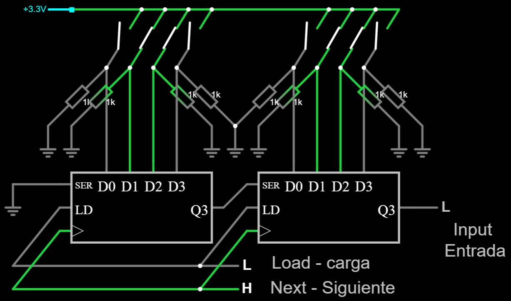

# Hardware de entrada adecuado (o no) para un volante o caja de botones

Este artículo analiza diferentes opciones para proporcionar suficientes entradas a un volante o caja de botones, teniendo en cuenta las limitaciones de una placa DevKit:

- Número limitado de pines de entrada. No todos los pines son adecuados.
- Ruido en las lecturas analógicas.
- Drenaje de la batería.

## Interruptores

Dependiendo de cómo se activen, se pueden clasificar en:

- **Interruptores momentáneos** ("MOM"): vuelven automáticamente al estado anterior y se presentan en distintas formas: pulsadores, palancas de empuje y palancas de fin de carrera, por nombrar algunas.

- **Interruptores no momentáneos**: una vez activados, mantienen ese estado, y hay que revertirlos manualmente al estado anterior. También se presentan en varias formas. Son adecuados para este proyecto, sin embargo, no ofrecen ninguna ventaja sobre los interruptores momentáneos y requieren un software más complejo, por lo que no se utilizan aquí.

Dependiendo de cómo se cierre el circuito, los interruptores momentáneos se pueden clasificar en:

- __Normalmente cerrado__ (NC): el interruptor se cierra si no se presiona, dejando pasar la corriente. Esto no se recomienda para evitar que se agote la batería.
- __Normalmente abierto__ (NO): el interruptor está abierto si no está presionado.
- __NO-NC__ (ambos): tienen 3 o 4 terminales y se pueden utilizar tanto como NO como NC a la vez. Tenga en cuenta que los terminales NC están cerrados mientras que los terminales NO están abiertos y viceversa. Esto tiene una aplicación interesante con divisores de voltaje (ver más abajo).

Los interruptores son propensos a [rebotar](https://circuitdigest.com/electronic-circuits/what-is-switch-bouncing-and-how-to-prevent-it-using-debounce-circuit) debido a su naturaleza mecánica.
Este proyecto proporciona amortiguación por medio de software.

## Codificadores rotatorios incrementales

Vienen en dos sabores:

- **Desnudo**: solo un dispositivo mecánico sin resistencias de pull-up. Tienen 5 terminales: `GND común`, `A` y `B` (relacionados con la rotación) más `SW GND` y `SW` (relacionados con el pulsador incorporado). Esos terminales están flotando cuando están inactivos. En este caso, la etiqueta `GND` no significa nada: es solo uno de los dos terminales de un interruptor.
- **KY-040**: un codificador rotatorio desnudo con resistencias pull-up. Tienen 5 terminales: `Vcc` y `Gnd`, relacionados con la fuente de alimentación, `CLK` (o `A`) y `DT` (o `B`), relacionados con la rotación, y `SW`, relacionados con el pulsador integrado. Los terminales `CLK`, `DT` y `SW` están configurados en alto voltaje cuando están inactivos.

[Ver pinout en pinterest.com (gracias a Abhishek Ghosh)](https://in.pinterest.com/pin/436145545160682538/)

Ambos codificadores son compatibles con este proyecto, siempre que se utilicen los pines de entrada adecuados.

Los codificadores rotatorios pueden ser muy ruidosos. A pesar de las técnicas antirrebote, es posible que se pierdan algunas rotaciones. Este proyecto ha erradicado este problema hasta donde sabemos.

## Interruptores rotativos absolutos

Tienen una forma similar a los codificadores rotatorios, pero funcionan de una manera completamente diferente. Un interruptor rotativo de N posiciones es lo mismo que N interruptores **no momentáneos** donde uno y solo uno de ellos está cerrado en todo momento. **Esto los hace poco prácticos**, ya que el lado del PC detectará un botón como "siempre pulsado". Al intentar configurar otro botón en el simulador, ese se interpondrá en el camino.

Podríamos aliviar la situación instruyendo al firmware para que informe la pulsación de un botón solo si hay un cambio en la posición del interruptor rotativo. Sin embargo, el simulador nunca sabrá cuál es esa posición inicialmente.

## Potenciómetros rotativos

Tienen una forma similar a los codificadores rotatorios y los interruptores rotativos absolutos, pero son algo completamente diferente:

- No hay posición de "encendido" y "apagado" porque proporcionan una salida analógica continua.
- No se puede girar 360 grados.
- La corriente se drena en todo momento, lo que es malo para las baterías.
- Propenso a fallar después de 10.000 ciclos de uso más o menos.

Como resultado, **se desaconsejan los potenciómetros**. Sin embargo, algunas carcasas están equipadas con potenciómetros en las paletas del embrague, por lo que tenemos que vivir con ello. Por ejemplo, el [kit de volante GT2 de 3DRap](https://www.3drap.it/product/gt2-steering-wheel-kit-by-3drap-thrustmaster-logitech-and-osw-adapters/). Los potenciómetros son compatibles con este proyecto de dos formas:

- Como ejes analógicos, conectados a un pin ADC.
- Como reemplazo de un interruptor, en caso de que ande corto de pines ADC.

## Pads direccionales (DPAD) y joysticks de 4 direcciones

Son solo 4 (a veces 8) pulsadores dispuestos en forma de cruz. Tenga en cuenta que uno y solo uno de ellos puede cerrarse a la vez, o ninguno de ellos. No confunda los joysticks de 4 direcciones con los de 2 ejes, estos últimos son solo dos potenciómetros que drenan corriente en todo momento. No apto para este proyecto.

## Interruptores funky

Un interruptor funky es solo la combinación física de un codificador rotatorio, un joystick de 4 vías y un botón pulsador en un solo dispositivo. Una nota de precaución aquí: los interruptores funky tienen un precio de alrededor de 4 dólares en AliExpress, pero 30 dólares en algunos otros minoristas. La principal desventaja de los interruptores funky es que no se pueden montar en un panel (carecen de una tuerca).

# Circuitería de entrada

Cuando se usa un pin GPIO como entrada digital, solo se puede acomodar un interruptor en él. No hay suficientes pines para acomodar todas las entradas requeridas de esta manera, por lo que debe implementarse otra técnica. Hay varias opciones:

- **Circuitos analógicos**. Algunos pines GPIO están equipados con convertidores de analógico a digital (ADC), por lo que pueden usarse como entradas analógicas. La idea es compartir un solo pin con varias entradas configurando diferentes voltajes. Sin embargo, los ADC no son perfectos. Existe una _limitación_ severa en el número de entradas que el software puede detectar _sin error_. Cada circuito analógico debe estar "calibrado" en el software. El procedimiento de calibración determinará un rango de voltajes donde se detecta cada entrada individual. Incluso si dos circuitos parecen idénticos, pueden establecer diferentes voltajes para las mismas entradas. Esto se debe a que las resistencias no son perfectas. Sin embargo, puede llegar a una calibración que se adapte a todos los circuitos idénticos.

- **Matrices de botón (o interruptor)**. Son circuitos digitales, por lo que no son propensos a errores. Con $N$ pines adecuados, una matriz de botones puede contener hasta $(N/2)^2$ botones.

- **Multiplexores**. Son circuitos digitales, por lo que no son propensos a errores. La cantidad de interruptores que puede contener este circuito depende de qué [multiplexor](https://es.wikipedia.org/wiki/Multiplexor) se elija y cómo se combinen. Por ejemplo, cuatro multiplexores, tres selectores cada uno, pueden contener $4*2^{3}=32$ botones con $4+3=7$ pines. Este proyecto no admite multiplexores en este momento.

- **Registros de desplazamiento PISO**. _"PISO"_ significa _"parallel input - serial output"_. Son circuitos digitales, por lo que no son propensos a errores. Casi *no hay límite* en el número de interruptores que puede albergar y sólo necesita 3 pines. Este proyecto no admite registros de desplazamiento en este momento.

## Circuitos analógicos

En términos globales, los circuitos analógicos pueden parecer una buena idea, pero **pueden fallar** al identificar las entradas correctas debido a:

- Caídas de voltaje, cuando otra parte del circuito está drenando corriente.
- Tolerancia de las resistencias.
- Lecturas imprecisas y ruidosas en el ADC.

Tenga en cuenta que los circuitos analógicos deben conectarse a los pines ADC. Muchos pines no son adecuados.

Hay otros tipos de circuitos analógicos que también se han descartado porque consumen corriente en todo momento.

### Escaleras de voltaje

Una escalera de voltaje puede acomodar una cantidad razonablemente grande de entradas en un solo pin, pero solo una de ellas puede detectarse a la vez. Esto puede parecer una desventaja, pero es *perfecto* para pads direccionales, interruptores rotatorios e interruptores funky.

Esta es una escalera de voltaje para un interruptor funky de 7 vías.

[Prueba de este circuito en Falstad.com](https://falstad.com/circuit/circuitjs.html?ctz=CQAgjCAMB0l3BWcMBMcUHYMGZIA4UA2ATmIxAUgoqoQFMBaMMAKAGcQUFDweuewAFkFRwIAGYBDADZs67Tt3DCQ2PCKEiqEKbPkd+yjSjxHROmXIWHNivhhTmJl+QHc7Z7AkcoUWlgBKqt6cfiCCcKFaohGq0NiiVDAILABOHpiOYCZm2vBp4Dm2Njx5cAUlquq5yOUcXo4NwT5h2s56FUqZzT1lkCwA8j1NgnhUTUkFTU1ophO15QDmnPg9s+GRkwAeqiSceOSC2BAoxFTGIAAOAK5sABYAOmxsrgCWAC4AxncsO8cJYEIImw2AEhEOhRAqVeizu71+4AwpjAIPAxA0oPCkOkdHE8J2KFRB04gh4Zyx2RA10uCO6fjmkS4EAuABMAPauAB2LCAA)

Este circuito no implica rotación porque no se necesita un circuito externo para eso (requiere dos pines diferentes, además de 'GND', como cualquier otro codificador rotatorio básico).

Y esta es una escalera de voltaje para 7 pulsadores o un interruptor rotativo absoluto de 7 pasos:

[Prueba de este circuito en Falstad.com](https://falstad.com/circuit/circuitjs.html?ctz=CQAgjCAMB0l3BWcMBMcUHYMGZIA4UA2ATmIxAUgoqoQFMBaMMAKAGcQ8qAWPTqsCj4CQAMwCGAGzZ124ISF7y+g4eDFSZLAE79l+1VGRwdBhWAyF9A+KYtXDKFN2vHIppy8cYUrsLY57RRVLPw1pWQ5PYJBowxEJCLlMXyUUsMStDmw0GJyBBQTNWV10w3y-W10K8sIVQrc5bDq8lvj1TNkAdxBm+r5uJXiWAHlFIYVBvi4jd2q2hT7Y5yN-WwBzXpbopZQEKyp3HqWlCqUj3ty0nxiL9LSV85Ye6KHQp56giYHhZ-0lGZPABKWx+ijAVnORm4VGw0Gwsyg0AQLCAA)

Tenga en cuenta que ambos circuitos son idénticos excepto por la cantidad de interruptores, a pesar de sus diferencias en el diseño físico.

Se puede usar casi cualquier resistencia. Sin embargo, se recomiendan resistencias de alta impedancia para evitar un drenaje excesivo de la batería.

### Divisores de voltaje (para pulsadores)

Un divisor de voltaje puede acomodar dos botones en un solo cable, pero no más. Esta conclusión provino de la experimentación.
A diferencia de las escaleras de voltaje, un divisor de voltaje puede detectar cualquier combinación de botones presionados al mismo tiempo.

Se pueden usar diferentes resistencias, pero deben probarse. Como regla general, cada resistencia pull-up debe duplicar la impedancia de la anterior.

Los divisores de voltaje no brindan ninguna ventaja sobre las matrices de botones, pero son propensos a errores, por lo que se desaconsejan.

#### 2 botones

Este divisor de voltaje se puede construir usando resistencias de 1Kohms solamente:

[Prueba de este circuito en Falstad.com](https://falstad.com/circuit/circuitjs.html?ctz=CQAgjCAMB0l3BWcMBMcUHYMGZIA4UA2ATmIxAUgoqoQFMBaMMAKACURcAWEPKlBIV5URILlWzRsUGTAQsATp0g8+YuMJlh4LAM7LVEleAxCqEAGYBDADa66e9VTXjzprSGt2HS7iaF+mChaOkqu-k4gQSFwLADuBlEYweHRkIqR0eHYhHgx6QDymcliamlQLADmkTl54eEiLEA)

#### ¿Más botones?

Se podrían acomodar más botones en una escalera de voltaje usando botones pulsadores NO-NC. Esto no ha sido probado. La idea es habilitar una resistencia pull-up usando los terminales NC, mientras se desactiva una resistencia pull-down usando los terminales NO y viceversa.

Este circuito ilustra el concepto de dos botones físicos NO-NC:

No se presiona ningún botón físico en la imagen anterior. Tenga en cuenta que ambos interruptores en una sola columna no se pueden cerrar ni abrir al mismo tiempo porque son parte del mismo botón físico.

[Prueba de este circuito en Falstad.com](https://falstad.com/circuit/circuitjs.html?ctz=CQAgjCAMB0l3BWcMBMcUHYMGZIA4UA2ATmIxAUgoqoQFMBaMMAKACUQUFCRCAWTvl4CqVPlWzRsUGTAQsATp27DlPMHxHI4LAM5rwmg2jyyQAMwCGAG111FxoVx4o8pqmHh7jbg9kLu4BY2diwA5n4BBuKiUCwA7o6m2P6C7gkG-CApPFmQDjmqhRpaaDr6xUaFJmZWtvZK1ULVvlRl+YnO2VGF-ukVqa7JqX0yEHWhAPLZg0KapjWiLEA)

## Matriz de botones

Una matriz de botones está compuesta por dos grupos de pines:

- Pines selectores (también llamados pines de _salida_ o de _columna_): activan una sola parte del circuito.
- Pines de entrada (también llamados pines de _fila_): proporcionan el estado de esa parte del circuito.

La idea es escanear cada parte del circuito habilitando uno y solo uno de los pines selectores, y luego pasar al siguiente. Después de algunas rondas, se ha recopilado el estado de cada botón. Por tanto, sí, una matriz de botones puede detectar la entrada de varios botones presionados al mismo tiempo, sin errores. El número máximo de botones que puede contener una matriz es igual al número de pines de _fila_ multiplicado por el número de pines de _columna_. Si hay $N$ pines disponibles, el número máximo de botones se obtiene a través de $N/2$ pines selectores.

La principal desventaja de las matrices de botones es el cableado: se requiere mucho cableado, lo que es propenso a errores humanos. La orientación correcta de los diodos también es fundamental. Tenga en cuenta que los diodos son una parte crítica del circuito y no se pueden suprimir.

Hay múltiples variaciones correctas de matrices de botones. La que se propone aquí es esta:

- Los pines de entrada están tirados (internamente) a tierra. Como resultado, los pines GPIO36, GPIO39, GPIO34 y GPIO35 no se pueden usar a menos que se proporcione una resistencia pull-down externa.
- Los pines selectores están configurados en ALTO para lectura y BAJO en caso contrario. Tenga en cuenta que ciertos pines no son adecuados para salida.
- Los diodos están orientados hacia los pines de entrada.

Este es el circuito lógico conectado a un solo pin de entrada usando 3 pines selectores:

[Prueba de este circuito en Falstad.com](http://falstad.com/circuit/circuitjs.html?ctz=CQAgjCAMB0l3BWcMBMcUHYMGZIA4UA2ATmIxAUgoqoQFMBaMMAKABkQUUAWcYlcISph+UMQDMAhgBsAznWqR2nHp27ChaqsJBS5CpEo5deKPHkFUzF7bpnzFLWSt4iB2NHwE698py60QDyt1MSpfOn8TTnMgz2sxCAiWABM44VF1EKsQFLopAFdpABdU9MCswIE8wpKy4JiLSp4cmski0oBZEGbQ7mJCQKtoBBYgA)

Este es el circuito eléctrico para 5 pines selectores y 2 pines de entrada:

Debería poder extrapolar dicho circuito a cualquier otro tamaño. Este es un [matriz de botón en falstad.com](https://falstad.com/circuit/circuitjs.html?ctz=CQAgjCAMB0l3BWcMBMcUHYMGZIA4UA2ATmIxAUgoqoQFMBaMMAKABMQG09xDOxCVBoQAsIFCDZ0AZgEMArgBsALu36De6odgkSpcpao5MwEgVs6jxkmQpUsA7hYY7nVyCwDOnbpq74QPCpgkDlFTzovC3MmDSCocFDZcMjvEzM+dMCQiDCIlgBZNzFYoWYJKhRoBEL1SxKY8oSqmu9Xc1d4qlzk-LTzRr4uhLzU+r8rYZ6UxzqXCVjxjw52zJirPVtDNUXBzldNg3tjKz3hMUO7VSLTHnPwFDumyuqosAw+AY-shKpRt8emluP26SRm3ni5niUzB+ScwPmDzu7jU70+n0B90u2w4wIGmIONiORh++ORFyJV1qmAWGwwC2e4lebTQmh0VGGf16Yxpml5nNhPJQYnMKGFIJG3NmvMRMpRK1Zovp42xx3EyqVC0J+ipHDFIr4copOu2RRE6zE5rWpmazJAIlOfAdYhh-28Vs0HtdUrahB4HT9EumcPtMVcHvuy3tjtDmQ2lJxsc9Yd0CbV2ED5gj8ZN9iKCA09wLZRtL1aIEE-r4lYlXPBFA05mLtcFUQQNqbNu9MyczcRfflFYCTcLOa2aubI+0qdzJPbGQbQjHxJYABlF0iQPTuoCQqNqB4nFl4vcurNOhzL1BZmifvqQefA-F2Q+nM6fvPXxYTwIdzxD3UP4Yv+N6ApCgLAgB-KVBqu6zF6VAepBszNvEk5wUev6brsGF1HiEG4fhPC8shTgkYCSG4ZRPDoSBb6TIhGwBABGY8M+gaPHR4jivE96+AB0JXpx15HgxKrMbMWIBHxElkeKvjvvxa7RhcASEPJzGSikB6Sb4J6+MJAH+MReBsZUpkiXeFmseIFkATW8QiCIJlcTZwlOS517rh5tk8DWhlaREOlAA) para 18 botones.

Casi cualquier tipo de diodo es adecuado para este circuito, pero los [diodos Schottky](https://es.wikipedia.org/wiki/Diodo_Schottky) de conmutación rápida con bajo voltaje directo son perfectos. Por ejemplo: 1N4148.

## Multiplexores

Este circuito es bastante similar a una matriz de botones, pero requiere varios multiplexores, un coste adicional que también ocupa espacio en la PCB. Se requieren dos grupos de pines:

- Pines selectores: eligen un solo interruptor de cada multiplexor.
- Pines de entrada: proporcionan el estado del interruptor seleccionado en cada multiplexor.

La idea es escanear cada interruptor en un bucle. En primer lugar, se habilitan los pines selectores requeridos. En segundo lugar, se leen los pines de entrada. Después de algunas rondas se ha recopilado el estado de todos los botones. Puede detectar varios botones presionados al mismo tiempo, sin errores.

Hay dos tipos de multiplexores:

- **Multiplexores analógicos**: el interruptor seleccionado se conecta eléctricamente al pin de entrada, sea cual sea el voltaje que tenga. Funcionan directamente con interruptores.

- **Multiplexores digitales**: el voltaje en el interruptor seleccionado se copia al pin de entrada, pero no están "conectados eléctricamente". No funciona directamente con interruptores porque tienen un voltaje indeterminado cuando están abiertos. Para trabajar con interruptores, se requiere una resistencia de pull-down externa para cada interruptor, lo cual no es práctico.

Este es el circuito lógico para 3 pines selectores y 3 pines de entrada usando multiplexores analógicos:

Que puede albergar hasta 24 pulsadores. [Prueba de este circuito en Falstad.com](https://falstad.com/circuit/circuitjs.html?ctz=CQAgjCAMB0l3BWcMBMcUHYMGZIA4UA2ATmIxAUgoqoQFMBaMMAKDDwBYQUUu8rMKEPyghsLAM7dewqmBR5ZoqgDMAhgBsJdSdK7Mh8xQdER1WnVJ76O+heFvKQ57buvgMhcPbCfTzzVcrGTRje1CnF0s9bg45cLjIwOj3QW9FNLkAizcZXDtFfKScgHd0pSNweSgWMsqTesdIWvKwR3q-ZrqfP0qIrvKIvsSB4fiMjCFR8MnyouaAJXKRFao1kETsaGwnGAQWABluPEUOQi4FRQQm8Gztamaj7DQN87EX664sqIfDsQQhBwwF5sACKDczMlfgBZMScJS2RQiATQfawvBvETEezI7iolhLQj4JQIIlKdabba7fFlIkTIR0sSQL4tRm8Khs2YDNnEtkjVnE3xeHmKbmCxyMoU1WmC6qSpoCpEc2VTXQYZlMriM+a3KJqjVpTlTUR6qTqi6JPnrSE5M0G3nE-q65L6-R+SWdE0uu02LXir7O20gc1VBkq4pBYMakSM3E21zsLghkQYMG48RlS5wi4nV4ssrPKjYQiFF5xNYtLPYeGeQrwgaFjZwWRUcvSltNqj8Isl9ugwHA4TPDaDgZ4YdArzjoTF0UtRtthdvBtgyf-QHLlgADzhXg4ZAohC8lFbsRAAGU6Bo6ABjAAuAHsAE4AHQkAAcAJYAOwkb7ADDiDucTEN4e4EN4oEWiAACS37vgArne-7bsIxBeMwoHoaB8iAmecGIchEgoKhxbkACoGMggE5ngACj+dB-hIAAmdBvto143jen4AM-fv+gGkcQ+jURsxDGKSGxngAot+d5PmozFqChO4nDYWG5mAq4yXJClKW+JEFqug79mIvYDLW2bBr2s7tlW8JVuZqFgMWhj7g4R7gNpMiyfJinKRIQHgNgvRgDhtg4TwUkyARSFvuIiZVPCIjyMO6a6MwyVyPgSr+KaSX6NUYA5aGeXegVDj6CVbQBvG0SZW6GHVZ6dUZYlQwlU6qjlQ1sTZbm7IRvV7WzMVA1cl6Qa9UUY2FBq6x6nUJUpdV1SjKthjVQqS2ae0zVeOtmm9J1xKHRkgqdfyO0ZIks3cFyLR3Wkd3zASyC5itiS4q2RZUusewsLCLmOClcS5Si+xlJZ1Z2Bwdb5h2bZGD9FZlNOI4Ydg1RrqMWMDpj1S2dMIhIwoPZzt0cNWfIVNEywQA) (este simulador no dispone de multiplexores analógicos, por lo que fingiremos que los multiplexores digitales son los analógicos). Los pines de entrada deben habilitar una resistencia pull-down interna.

La cantidad de pines requeridos podría reducirse aún más, en algunos casos, colocando otro multiplexor para los pines de entrada.

## Registros de desplazamiento

La idea tras los registros de desplazamiento es capturar el estado de cada botón en paralelo y enviarlo a través de un único pin, en secuencia. Se puede hacer gracias a que los registros de desplazamiento tienen memoria. Solamente hay tres pines involucrados:
- Load (LD): un pulso en este pin capturará el estado de todos los botones al mismo tiempo y lo almacenará en memoria como bits individuales.
- Input: lee el valor de un único bit (es decir, el estado de un único botón).
- Clock (CLK): un pulso en este pin transitará al siguiente bit, es decir, al estado del siguiente botón.

Habitualmente los registros de desplazamiento almacenan 8 bits, pero se pueden encadenar juntos para alcanzar cualquier número de bits. Este es un circuito eléctrico para dos registros de desplazamiento con 4 bits cada uno:

Observe que son necesarias resistencias de pulldown para cada botón, lo que no es práctico. Además, necesitará espacio extra en la placa perforada.

[Pruebe este circuito en Falstad.com](https://falstad.com/circuit/circuitjs.html?ctz=CQAgjCAMB0l3BWcMBMcUHYMGZIA4UA2ATmIxAUgoqoQFMBaMMAKDD0JG207Ty8L8+IPGGIAWEJOzRsUNhxFVhzFCGGiJUrrPkB3LpEkpxVbr3zyATuHGTx-QpLAp+VMPBYBnW-f5i1Bmw1dxAAMwBDABsvOhYDMDspfySwDE5IePB07M40zgdrXOSQYjzXKGQ4b2LClBMQIJDKyJi4m2E6vH8K908DTqFLfKKTKkLg916qzJ9B9QROJsqqVtiasZLXfmXQtbiE4kDg9QbdrPrJZZRFxpPMgdvr7ruQrIDX0qX7lgBzECc4AqgLAhCo4JYACUvp9CrtKqYdHJwVBoAgWABZChg9SIsFCRHKNHvCz8PDKSwPJS49ycSb6Lg8GnqDBqelU0FcNAstnczIAGR5XLMTPZLWisSRDPJQs52AQbwM5iFmDZCoZcvVqq46oFQvlbNFuvA4QldClmQAHgD2CzHBgIK4IMZJABJAB2AAcAK4AFxY1rBdMg5BIZg82gaAFF3b6rBEACYRANcDBmBqUaSYSOSfkAe0TAB0vAxiwBjCJWX7J608fjy-gIbD1wjO3EgABydEtvuLpa8AGUAJa-b1DuixuL-TkqXiE+T-MpA-hL0EozL-bbL9QvNcrP7C7f0vcQgaIuqIkZU8RLwo3vI5DcUHIuRsvnEQ-4IVIVb-OD8LjqaivkB4AAdecInFu5wGAgLifH+nzXjKyxwccipSJBagOFQ5w+PeJSIfCED7DU4iAoUaFIeKbQsDYBGUS+0weNUBjkX4Uggo+dGcRxiEgX01T4Scd4ofcNHrPRIn1uqAkzFk4gnCMinYW4ClwCUpjuNx+EaXeWGVCRZo8VpJTHsxnhAA)

## Resumen del hardware de entrada

|         Circuitería         |       Pines requeridos        | Número de interruptores |                Más adecuado para                 |            Ventajas            | Desventajas                                  |
| :-------------------------: | :---------------------------: | :---------------------: | :----------------------------------------------: | :----------------------------: | :------------------------------------------- |
|           Ninguna           |               1               |            1            |             Codificadores rotativos              |      Fácil y sin errores       | No hay suficientes pines para muchos botones |
|      Matriz de botones      |              $N$              |       $(N/2)^{2}$       |                Pulsadores y DPADS                |  Muchos botones y sin errores  | Cableado complejo                            |
|        Multiplexores        | $S$ selectores y $E$ entradas |        $2^{S}*E$        |                Pulsadores y DPADS                |  Muchos botones y sin errores  | Coste extra y espacio en la PCB              |
|     Escalera de voltaje     |               1               |       suficientes       | DPADS, interruptores giratorios y funky switches | Pin único para muchas entradas | Requiere calibración                         |
|     Divisor de voltaje      |               1               |            2            |                    Pulsadores                    |            Ninguno             | Propenso a error                             |
| Registros de desplazamiento |               3               |        ilimitado        |                Pulsadores y DPADS                |  Muchos botones y sin errores  | Coste extra y espacio en la PCB              |

El circuito de entrada ocupa algo de espacio dentro de la carcasa. Su disposición física debe estar cuidadosamente diseñada para encajar en el volante (o botonera).