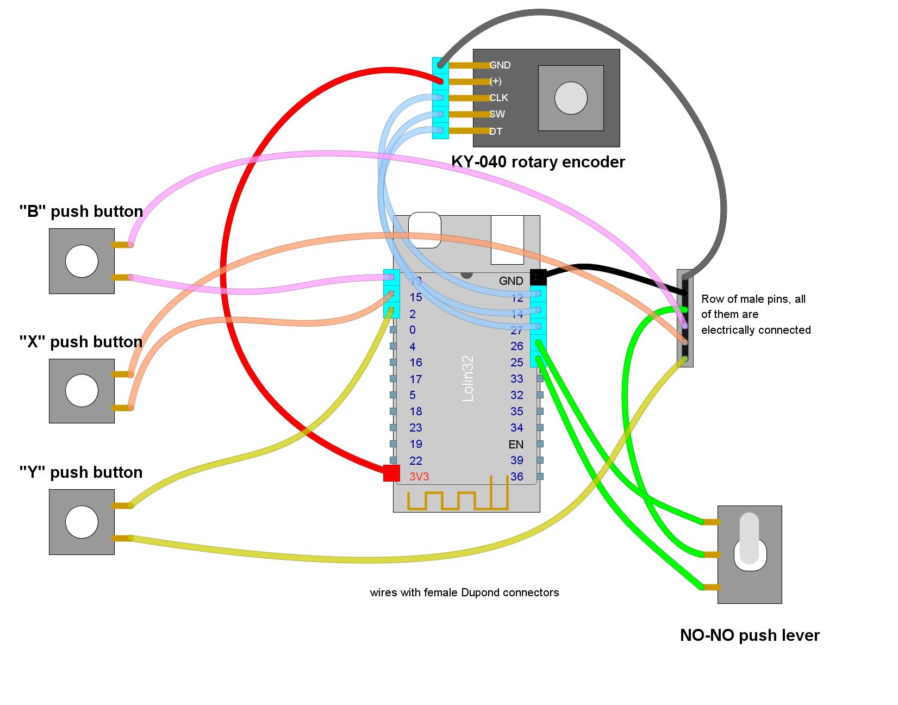

# Ready to deploy design: the "teabox"

Read this document from start to end before building anything.
Ensure you understand everything.

This setup has been tested.

## Hardware features

- Bluetooth Low Energy
- Powered through USB cable

> [!TIP]
> No need to sacrifice a USB port on your PC.
> You can get power from an auxiliary port  on the steering wheel base
> or from a USB charger.

- Two-way switch lever
- Rotary encoder
- 3 push buttons

## Button mapping

- *Rotary encoder clockwise/counter-clockwise*:
  - In "regular buttons" mode: Left/Right thumb stick button.
  - In "navigation" mode: DPAD left/right.
- *Switch lever*:
  - In "regular buttons" mode: left/right shoulder button.
  - In "navigation" mode: DPAD up/down.
- *Rotary encoder push button*: "A".
- *Other buttons*: "B", "X" and "Y".

*Note*: previous firmware versions up to 2.3.5 showed a different button mapping.

## Security lock

Press buttons "B", "X" and "Y" at the same time and none of the others.

## Needed parts

|                     **Item**                     | **Quantity** | Notes                            |
| :----------------------------------------------: | :----------: | -------------------------------- |
|            Lolin32 Lite DevKit board             |      1       | Pin headers **already** soldered |
| Wires with female Dupond connectors at both ends |      15      |                                  |
|         NO-NO **momentary** switch lever         |      1       | See below                        |
|       Push buttons (NO momentary switches)       |      3       | Small size is best               |
|              KY-040 Rotary encoder               |      1       |                                  |
|                 Micro-USB cable                  |      1       | For power                        |
|               A squared can of tea               |      1       | Housing                          |
|           A row of 6 male pins headers           |      1       | Common pole (ground)             |

Other parts (quantity unknown):

- Isolation tape.
- Welding tin.

Additional notes:

- A "NO-NO switch lever" is the physical combination of two normally-open switches into one device. The push lever has three positions: rest, up/left and down/right. There are three terminals, being the one in the middle a common pole for both NO switches. Make sure this is a momentary switch: the lever must automatically return to rest after activation.
- You may use any tinplate-made box as housing. The name of this design comes from a popular tea brand that sells square-shaped tea cans.

## Pin-out plan for the Lolin32 lite board

| **GPIO** | **Input**  | **Output** |       **Usage**        | **Notes**                              |
| -------- | ---------- | ---------- | :--------------------: | -------------------------------------- |
| **36**   | OK         |            |                        | input only (no internal pull resistor) |
| **39**   | OK         |            |                        | input only (no internal pull resistor) |
| **34**   | OK         |            |                        | input only (no internal pull resistor) |
| **35**   | OK         |            |                        | input only (no internal pull resistor) |
| **32**   | OK         | OK         |                        |                                        |
| **33**   | OK         | OK         |                        |                                        |
| **25**   | OK         | OK         |   switch lever down    |                                        |
| **26**   | OK         | OK         |    switch lever up     |                                        |
| **27**   | OK         | OK         | ROTARY_SW (button "A") |                                        |
| **14**   | OK         | OK         |       ROTARY_DT        | outputs PWM signal at boot             |
| **12**   | OK         | OK         |       ROTARY_CLK       | boot fail if pulled high               |
| **13**   | OK         | OK         |       button "B"       |                                        |
| **15**   | OK         | OK         |       button "X"       | outputs PWM signal at boot             |
| **2**    | OK         | OK         |       button "Y"       | connected to on-board LED              |
| **0**    | pulled up? | OK         |                        | outputs PWM signal at boot             |
| **4**    | OK         | OK         |                        |                                        |
| **16**   | OK         | OK         |                        |                                        |
| **17**   | OK         | OK         |                        |                                        |
| **5**    | OK         | OK         |                        | outputs PWM signal at boot             |
| **18**   | OK         | OK         |                        |                                        |
| **23**   | OK         | OK         |                        |                                        |
| **19**   | OK         | OK         |                        |                                        |
| **22**   | OK         | OK         |                        |                                        |

## Common ground pole for all switches (not counting the KY-040 rotary encoder)

Use welding tin to build an electrical connection between all pins of the row,
at the short side of them.
Use isolation tape to cover the welding tin.

## External wiring

There is no circuit, just wiring.
Open the [layout](./Teabox.diy) using
[DIY Layout Creator](https://github.com/bancika/diy-layout-creator).

Notes and build tips:

- Dupond connectors are not suitable for the switches:
  cut one end of the wire and solder it to the proper terminal.
- Your KY-040 rotary may use a different pin-out than the one shown here.
  Check first.
- Use isolation tape to cover all unused pins and exposed solder points.

## Firmware upload

At Arduino IDE, configure the board manager for "WEMOS LOLIN32 Lite".

1. Detach the DevKit board from the circuit before continuing.
2. Plug the USB cable to the Devkit board and upload the
   [sketch](../../../../src/Firmware/Teabox/Teabox.ino) with Arduino IDE.
3. Attach the DevKit board to the circuit. Keep the USB cable plugged in.
4. Open the serial monitor (Arduino IDE).
5. Reset.
6. Check there are no error messages.
