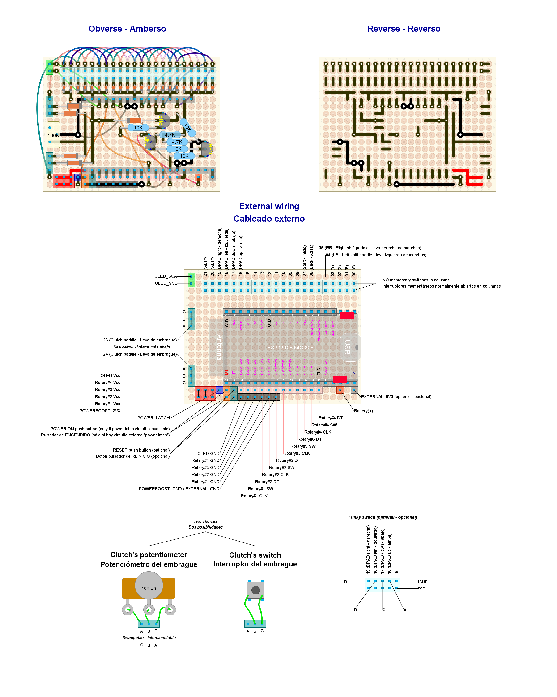

# Ready to deploy design #1

Read this document from start to end before building anything. Ensure you understand everything.

**This setup has not been tested at the system level**. If you try, please, let me know.

## Hardware features

- Bluetooth Low Energy
- Powered through external power source (quick release): DC +5V ~ +7V - 500 mA.
- Analog clutch paddles (potentiometers).
- Shift paddles (x2)
- Optional: "ALT" buttons (x2)
- Optional: DPAD, funky switch or 4 push buttons arranged in a cross
- Relative rotary encoders (with push button): x4 + optional funky switch
- Up to additional 12 push buttons

## Button mapping

- *Bite point calibration*: rotary #1 clockwise and counter-clockwise (while holding one and only one clutch paddle).
- *Next clutch function*: `START` and `Left shift paddle`.
- *ALT buttons mode*: `START` and `Right shift paddle`.
- *Recalibrate clutch paddles*: `START`, `Left shift paddle` and `Right shift paddle`.

## Needed parts

| **Item**                                           | **Quantity**                                | Notes                                                                 |
|:--------------------------------------------------:|:-------------------------------------------:| --------------------------------------------------------------------- |
| Bare bone Rotary encoder                           | 4                                           |                                                                       |
| Standard perfboard sized 24x18 holes               | 1                                           | Double side required                                                  |
| Roller lever switch                                | 2                                           | For shift paddles (maybe they are included with your wheel's case)    |
| Linear potentiometer (10K-ohms to 100K-ohms)       | 2                                           | For clutch paddles (maybe they are included with your wheel's case)   |
| D-Pad, funky switch or push buttons                | 1 D-pad or 1 funky switch or 4 push buttons | For directional input (optional). See notes below for a funky switch. |
| Push buttons                                       | up to 12                                    | General purpose inputs (up to you)                                    |
| Pin header (female)                                | 35                                          | For a DevKit board with male pins already soldered                    |
| Pin header (male or female up to you)              | 72                                          | For external wiring                                                   |
| Schottky diodes                                    | 25                                          | 1N4148 recommended                                                    |
| 10k-ohms resistor                                  | 2                                           |                                                                       |
| ESP32-WROOM-32UE/E (DevKit-C)                      | 1                                           | Male pins already soldered. Choose built-in/external antenna.         |
| External Antenna with U.FL, MHF I or AMC connector | 1                                           | Only required if ESP32-WROOM-32UE is chosen                           |
| Power connector depending on your quick release    | 1                                           | See below                                                             |

Other parts (quantity unknown):

- Thin wire.
- Wire with Dupond terminals (for external wiring). A kit for protoboards will do the job. ¿Male or female? the opposite to pin headers.
- Welding tin.

Additional notes:

- Chose an appropriate male/female power connector depending on your wheel base. Make sure to identify the positive and negative terminals correctly. If you have a *Simagic QR*, negative is the yellow wire and positive is the green one.
- Optional funky switch: ALPS RKJ series, 7-way.

## Pin-out plan for the ESP32-DevKit-C board

| **GPIO** | **Input**  | **Output** | **Usage**         | **Notes**                              |
| -------- | ---------- | ---------- |:-----------------:| -------------------------------------- |
| **36**   | OK         |            | Left pot          | input only (no internal pull resistor) |
| **39**   | OK         |            | Right pot         | input only (no internal pull resistor) |
| **34**   | OK         |            | ROT1_A            | input only (no internal pull resistor) |
| **35**   | OK         |            | ROT1_B            | input only (no internal pull resistor) |
| **32**   | OK         | OK         | ROT2_A            |                                        |
| **33**   | OK         | OK         | ROT2_B            |                                        |
| **25**   | OK         | OK         | ROT3_A            |                                        |
| **26**   | OK         | OK         | ROT3_B            |                                        |
| **27**   | OK         | OK         | ROT4_A            |                                        |
| **14**   | OK         | OK         | ROT4_B            | outputs PWM signal at boot             |
| **12**   | OK         | OK         |                   | boot fail if pulled high               |
| **13**   | OK         | OK         | Matrix input 5    |                                        |
| **9**    | x          | x          | **UNUSABLE**      | connected to the integrated SPI flash  |
| **10**   | x          | x          | **UNUSABLE**      | connected to the integrated SPI flash  |
| **11**   | x          | x          | **UNUSABLE**      | connected to the integrated SPI flash  |
| **6**    | x          | x          | **UNUSABLE**      | connected to the integrated SPI flash  |
| **7**    | x          | x          | **UNUSABLE**      | connected to the integrated SPI flash  |
| **8**    | x          | x          | **UNUSABLE**      | connected to the integrated SPI flash  |
| **15**   | OK         | OK         | Matrix input 1    | outputs PWM signal at boot             |
| **2**    | OK         | OK         |                   | connected to on-board LED              |
| **0**    | pulled up? | OK         |                   | outputs PWM signal at boot             |
| **4**    | OK         | OK         | Matrix selector 1 |                                        |
| **16**   | OK         | OK         | Matrix selector 2 |                                        |
| **17**   | OK         | OK         | Matrix selector 3 |                                        |
| **5**    | OK         | OK         |                   | outputs PWM signal at boot             |
| **18**   | OK         | OK         | ENCODER_A         |                                        |
| **19**   | OK         | OK         | ENCODER_B         |                                        |
| **21**   | OK         | OK         | Matrix input 3    |                                        |
| **3**    | pulled up  | RX pin     |                   | HIGH at boot                           |
| **1**    | TX pin     | OK         | Matrix selector 4 | debug output at boot                   |
| **22**   | OK         | OK         | Matrix input 4    |                                        |
| **23**   | OK         | OK         | Matrix selector 5 |                                        |

## Circuit layout

Open the [circuit layout](./setup1.diy) using [DIY Layout Creator](https://github.com/bancika/diy-layout-creator).

This layout includes the following subsystems (read for an in-depth explanation):

- [Analog clutch paddles](../../subsystems/AnalogClutchPaddles/AnalogClutchPaddles_en.md).
- [Power](../../subsystems/Power/Power_en.md) through an external power source.
- [Switches](../../subsystems/Switches/Switches_en.md).
- [Relative rotary encoder](../../subsystems/RelativeRotaryEncoder/RelativeRotaryEncoder_en.md).

Notes and build tips:

- Some components may look very small, not matching their actual size. This is not a mistake. They must be placed in vertical position, so they lie in a minimal surface of the perfboard. All resistors and diodes should fit in 1x4 holes when they lay in horizontal position.
- There is a lot of wiring, which is prone to human error. Check wiring and traces twice before soldering.

### External wiring

- Each input has an assigned number in the circuit layout. Certain inputs have a particular function, so attach them properly.
- The `POTn_GND` and `POTn_VCC` terminals of each potentiometer are interchangeable. If the clutch (or axis) goes to 100% when idle, swap those terminals.
- Note that the pin headers on the left and right clutch paddles are symmetrical, not identical.
- Optional funky switch:
  - The involved terminals are:
    - For rotation: `ENCODER_A`, `ENCODER_B` and `ENCODER_COM`.
    - For push buttons: `A`, `B`, `C`, `D`, `PUSH` and `COM`.
  - Do not confuse `COM` with `ENCODER_COM` since `COM` is physically closer to `ENCODER_A/B` than `ENCODER_COM`.
- Bare bone rotary encoders:
  - The involved terminals are:
    - For rotation: `A` or `CLK` attached to `ROTn_A`, `B` or `DT` attached to `ROTn_B`, `COM` attached to `ROTn_COM`.
    - The built-in push button must be wired to the button matrix just like any other push button, being `SW` and `SW GND` the involved terminals. `SW` attached to the upper row of pin headers, `SW COM` attached to the lower row of pin headers.
  - Do not confuse `COM` and `SW COM`.
  - `ROT1` is mandatory. The others are optional.

**Under no circumstances should you plug an USB cable and an external power source at the same time**. You could damage the DevKit board.

## Firmware upload

1. Detach the DevKit board from the circuit before continuing.
2. Plug the USB cable to the Devkit board and upload the [sketch](../../../../src/Firmware/Setup1/Setup1.ino) with Arduino IDE.
3. Attach the DevKit board to the circuit. Keep the USB cable plugged in.
4. Open the serial monitor (Arduino IDE).
5. Reset.
6. Check there are no error messages.
