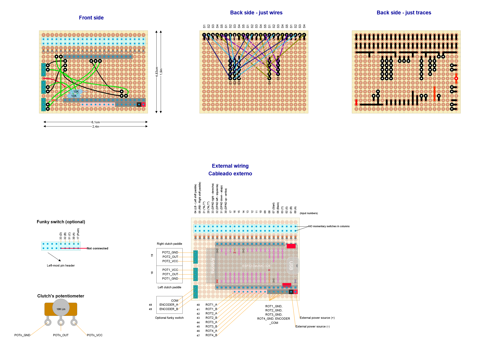

# Ready to deploy design #1

Read this document from start to end before building anything. Ensure you understand everything.

## Hardware features

- Bluetooth Low Energy

- Powered through rechargeable batteries or external power source (but not both at the same time)

- Battery monitor

- OLED

- Push buttons and paddles:
  
  - Clutch paddles equipped with potentiometers or switches (x2)
  - Shift paddles (x2)
  - "ALT" buttons (x2)
  - Optional: DPAD, Funky switch or 4 push buttons arranged in a cross
  - Up to 14 general purpose push buttons

- Relative rotary encoders (with push button): x4

- If a power latch circuit is available at the powerboost module:
  
  - Power ON push button.
  - Full auto-power off (no deep sleep mode).

- Reset button (optional)

## Button mapping

- _Enter/exit configuration Menu_: press and hold both built-in push buttons of rotary encoders #1 and #2, wait for two seconds, then release both buttons.

- _Power on_:
  
  - If a external power latch circuit is available: press POWER ON button.
  - Otherwise: press both built-in push buttons of rotary encoders #1 and #2.

- _Menu navigation_:
  
  - _Next option_: rotary #1 clockwise
  - _Previous option_: rotary #1 counter-clockwise
  - _Select_: push button of rotary #1
  - _Cancel_: push button of rotary #2

- _Bite point calibration_: rotary #1 clockwise and counter-clockwise (while holding one and only one clutch paddle).

## Needed parts

|                      **Item**                      |                **Quantity**                 | Notes                                                                       |
| :------------------------------------------------: | :-----------------------------------------: | --------------------------------------------------------------------------- |
|               KY-040 Rotary encoder                |                      4                      |                                                                             |
|        Standard perfboard sized 24x18 holes        |                      1                      |                                                                             |
|                    Roller lever                    |                      2                      | For shift paddles (maybe they are included with your wheel's case)          |
|           Potentiometer or roller lever            |                      2                      | For clutch paddles (maybe they are included with your wheel's case)         |
|        D-Pad, funky switch or push buttons         | 1 D-pad or 1 funky switch or 4 push buttons | For directional input (optional). See notes below for a funky switch.       |
|                    Push buttons                    |                  up to 14                   | General purpose inputs (up to you)                                          |
|                    Push button                     |                      1                      | For power on. Not required if there is no external power latch circuit      |
|                    Push button                     |                      1                      | For RESET. Optional.                                                        |
|                Pin header (female)                 |                     35                      | For a DevKit board with male pins already soldered                          |
|       Pin header (male or female up to you)        |                     63                      | For external wiring                                                         |
|                  Schottky diodes                   |                     27                      | 1N4148 recommended                                                          |
|                  NPN transistors                   |                      1                      | BC637 recommended                                                           |
|                  PNP transistors                   |                      2                      | BC640 recommended                                                           |
|                 10k-ohms resistor                  |                      4                      |                                                                             |
|           4k7-ohms resistor 1% tolerance           |                      2                      | Any other impedance will work, but more than 1K-ohms is recommended.        |
|       Trim potentiometer 100k-ohms (linear)        |                      1                      | Vertically operated and 3 pins in zig-zag. Recommended Bourns Trimpot 3266. |
|           ESP32-WROOM-32UE/E (DevKit-C)            |                      1                      | Male pins already soldered. Choose built-in/external antenna.               |
| External Antenna with U.FL, MHF I or AMC connector |                      1                      | Only required if ESP32-WROOM-32UE is chosen                                 |
|    Powerboost module/shield for LiPo batteries     |                      1                      | 3V3 and 500mA or more. Recommended with built in power latch circuit.       |
|                 "1S" LiPo Battery                  |                      1                      | Must fit into the powerboost module.                                        |
|   Both male and female GX16 (5 pins) connectors    |             1 male and 1 female             | For the charging port                                                       |
|         Micro-USB spiral cable long enough         |                      1                      | For charging                                                                |
|         OLED (I2C interface, 3.3V capable)         |                      1                      | 128x64 pixels with a 132x64 controller (see below)                          |

Other parts (quantity unknown):

- Thin cable.
- Cable with Dupond terminals (for external wiring). A cable kit for protoboards will do the job. ¿Male or female? the opposite to pin headers.
- Welding tin. 

Notes:

- **Optional funky switch**: ALPS [RKJXT1F42001](https://tech.alpsalpine.com/prod/e/html/multicontrol/switch/rkjxt/rkjxt1f42001.html). **Replaces** rotary encoder #4, D-PAD and push button #15.
- Ensure trim potentiometer is "vertically operated".
- Choose a suitable OLED as recommended at the [display subsystem](../../subsystems/Display/Display_en.md). If your OLED does not match the one listed before, minor software tweaks are required as explained in that subsystem.
- Choose a powerboost module as recommended at the [power subsystem](../../subsystems/Power/Power_en.md).
- If battery is not required, exclude the obvious parts: Powerboost module/shield, LiPo battery and push button for POWER ON.

## Pinout plan for the ESP32-DevKit-C board

| **GPIO** | **Input**  | **Output** |     **Usage**     | **Notes**                              |
| -------- | ---------- | ---------- | :---------------: | -------------------------------------- |
| **36**   | OK         |            |    ROTARY1_CLK    | input only (no internal pull resistor) |
| **39**   | OK         |            |    ROTARY1_SW     | input only (no internal pull resistor) |
| **34**   | OK         |            |    ROTARY1_DT     | input only (no internal pull resistor) |
| **35**   | OK         |            |    ROTARY2_CLK    | input only (no internal pull resistor) |
| **32**   | OK         | OK         |    ROTARY2_SW     |                                        |
| **33**   | OK         | OK         |    ROTARY2_DT     |                                        |
| **25**   | OK         | OK         |    ROTARY3_CLK    |                                        |
| **26**   | OK         | OK         |  Matrix input 5   |                                        |
| **27**   | OK         | OK         |    ROTARY3_DT     |                                        |
| **14**   | OK         | OK         |    ROTARY4_CLK    | outputs PWM signal at boot             |
| **12**   | OK         | OK         |      battEN       | boot fail if pulled high               |
| **13**   | OK         | OK         |    ROTARY4_DT     |                                        |
| **9**    | x          | x          |   **UNUSABLE**    | connected to the integrated SPI flash  |
| **10**   | x          | x          |   **UNUSABLE**    | connected to the integrated SPI flash  |
| **11**   | x          | x          |   **UNUSABLE**    | connected to the integrated SPI flash  |
| **6**    | x          | x          |   **UNUSABLE**    | connected to the integrated SPI flash  |
| **7**    | x          | x          |   **UNUSABLE**    | connected to the integrated SPI flash  |
| **8**    | x          | x          |   **UNUSABLE**    | connected to the integrated SPI flash  |
| **15**   | OK         | OK         |  Matrix input 1   | outputs PWM signal at boot             |
| **2**    | OK         | OK         |     battREAD      | connected to on-board LED              |
| **0**    | pulled up? | OK         | Matrix selector 1 | outputs PWM signal at boot             |
| **4**    | OK         | OK         |  Matrix input 2   |                                        |
| **16**   | OK         | OK         | Matrix selector 2 |                                        |
| **17**   | OK         | OK         | Matrix selector 3 |                                        |
| **5**    | OK         | OK         | Matrix selector 4 | outputs PWM signal at boot             |
| **18**   | OK         | OK         | Matrix selector 5 |                                        |
| **19**   | OK         | OK         |  Matrix input 3   |                                        |
| **21**   | OK         | OK         |     OLED SDA      |                                        |
| **3**    | pulled up  | RX pin     |    ROTARY3_SW     | HIGH at boot                           |
| **1**    | TX pin     | OK         |    POWER_LATCH    | debug output at boot                   |
| **22**   | OK         | OK         |     OLED SCL      |                                        |
| **23**   | OK         | OK         |  Matrix input 4   |                                        |

## Circuit layout

Open the [circuit layout](./setup1.diy) using [DIY Layout Creator](https://github.com/bancika/diy-layout-creator).

This layout includes the following subsystems (read for an in-depth explanation):

- [Power](../../subsystems/Power/Power_en.md) through a powerboost module/shield.
- [Power latch](../../subsystems/PowerLatch/PowerLatch_en.md).
- [Battery monitor](../../subsystems/BatteryMonitor/BatteryMonitor_en.md).
- [Switches](../../subsystems/Switches/Switches_en.md).
- [Relative rotary encoder](../../subsystems/RelativeRotaryEncoder/RelativeRotaryEncoder_en.md) KY-040 type.
- [Display](../../subsystems/Display/Display_en.md).

Notes and build tips:

- Your actual transistors may use a different pinout, so check first.
- Ensure you do not confuse PNP with NPN transistors.
- Some components may look very small, not matching their actual size. This is not a mistake. They must be placed in vertical position, so they lie in a minimal surface of the perfboard. All resistors and diodes should fit in 1x4 holes when they lay in horizontal position.
- There is a lot of wiring, which is prone to human error. Check wiring and traces twice before soldering. Note that switch #17 is attached to a single wire unlike the others (this is not a mistake).
- Never use `POWERBOOST_3V3` and `POWERBOOST_GND` along with `EXTERNAL_5V0` and `EXTERNAL_GND`. This will damage your board. Choose one pair.

### External wiring

Each input has an assigned number in the circuit layout. Certain inputs have a particular function, so attach them properly.

If a battery is not required:

- Leave `Battery(+)` and `POWER_LATCH` unattached.
- If the external power source does not provide 3.3V, leave `POWERBOOST_GND` and `POWERBOOST_3V3` unattached.
- If the external power source provides 5 to 12V, attach an USB cable or both `EXTERNAL_5V0` and `EXTERNAL_GND`. Look at the [power subsystem](../../subsystems/Power/Power_en.md) for requirements.

**Under no circumstances should you plug a powerboost module along with an external power source at the same time**. You could damage the DevKit board.

***Warning***

If rotary encoders numbered #1 or #2 are not required, their pin headers must be wired to `3V3`. This applies to `ROTARY1_CLK`, `ROTARY1_SW`, `ROTARY1_DT` and `ROTARY2_CLK`. Otherwise, you will get ghost inputs.

***Funky switch***

Funky switch (optional) is wired this way:

| Funky switch terminal |         Pin header          |
| :-------------------: | :-------------------------: |
|           A           |  top row pin of input #16   |
|           B           |  top row pin of input #18   |
|           C           |  top row pin of input #17   |
|           D           |  top row pin of input #19   |
|         Push          |  top row pin of input #15   |
|          com          | bottom row pin of input #15 |
|       Encoder A       |        Rotary #4 CLK        |
|       Encoder B       |        Rotary #4 DT         |
|      Encoder com      |        Rotary #4 GND        |

## Firmware upload

You may want to calibrate your battery first. See the [Battery calibration procedure](../../../../src/Firmware/BatteryTools/BatteryCalibration/README_en.md).

1. Detach the DevKit board from the circuit before continuing. 
2. Plug the USB cable to the Devkit board and upload the [sketch](../../../../src/Firmware/Setup1/Setup1.ino) with Arduino IDE.
3. Attach the DevKit board to the circuit. Keep the USB cable plugged in.
4. Open the serial monitor (Arduino IDE).
5. Reset.
6. Check there are no error messages.