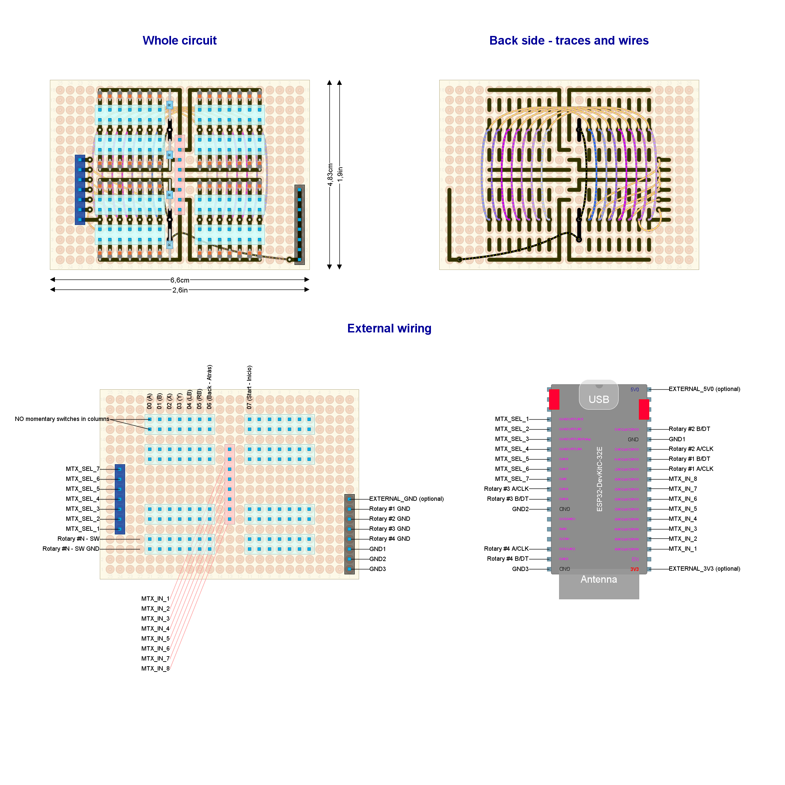

# Ready to deploy design #2

Read this document from start to end before building anything. Ensure you understand everything.

**This setup has not been tested at the system level**. If you try, please, let me know.

## Hardware features

- Bluetooth Low Energy

- Powered through USB (or, optionally, external power source)

- Button box (64 inputs):
  
  - Up to 52 general porpouse push buttons.
  - Up to 4 relative rotary encoders (with push button).

## Needed parts

| **Item**                                           | **Quantity** | Notes                                                         |
|:--------------------------------------------------:|:------------:| ------------------------------------------------------------- |
| Barebone Rotary encoder                            | up to 4      |                                                               |
| Standard perfboard sized 24x18 holes               | 1            |                                                               |
| Push buttons                                       | up to 52     | General porpouse (up to you)                                  |
| Pin header (male or female up to you)              | 136          | For external wiring                                           |
| Schottky diodes                                    | 56           | 1N4148 recommended                                            |
| Resistor (any impedance 4K to 100K-ohms)           | 4            |                                                               |
| ESP32-WROOM-32UE/E (DevKit-C)                      | 1            | Male pins already soldered. Choose built-in/external antenna. |
| External Antenna with U.FL, MHF I or AMC connector | 1            | Only required if ESP32-WROOM-32UE is choosen                  |
| Micro-USB cable long enough                        | 1            | For power                                                     |

Other parts (quantity unknown):

- Thin cable.
- Cable with Dupond terminals (for external wiring). Some cable kits for protoboards will do the job. ¿Male or female? the opposite to pin headers.
- Welding tin.

## Pinout plan for the ESP32-DevKit-C board

| **GPIO** | **Input**  | **Output** | **Usage**         | **Notes**                               |
| -------- | ---------- | ---------- |:-----------------:| --------------------------------------- |
| **36**   | OK         |            | _Matrix input_ 1  | input only (no internal pull restistor) |
| **39**   | OK         |            | _Matrix input_ 2  | input only (no internal pull restistor) |
| **34**   | OK         |            | _Matrix input_ 3  | input only (no internal pull restistor) |
| **35**   | OK         |            | _Matrix input_ 4  | input only (no internal pull restistor) |
| **32**   | OK         | OK         | Matrix input 5    |                                         |
| **33**   | OK         | OK         | Matrix input 6    |                                         |
| **25**   | OK         | OK         | Matrix input 7    |                                         |
| **26**   | OK         | OK         | Matrix input 8    |                                         |
| **27**   | OK         | OK         | ROTARY1_A         |                                         |
| **14**   | OK         | OK         | ROTARY1_B         | outputs PWM signal at boot              |
| **12**   | OK         | OK         | ROTARY2_A         | boot fail if pulled high                |
| **13**   | OK         | OK         | ROTARY2_B         |                                         |
| **9**    | x          | x          | **UNUSABLE**      | connected to the integrated SPI flash   |
| **10**   | x          | x          | **UNUSABLE**      | connected to the integrated SPI flash   |
| **11**   | x          | x          | **UNUSABLE**      | connected to the integrated SPI flash   |
| **6**    | x          | x          | **UNUSABLE**      | connected to the integrated SPI flash   |
| **7**    | x          | x          | **UNUSABLE**      | connected to the integrated SPI flash   |
| **8**    | x          | x          | **UNUSABLE**      | connected to the integrated SPI flash   |
| **15**   | OK         | OK         | Matrix selector 1 | outputs PWM signal at boot              |
| **2**    | OK         | OK         | Matrix selector 2 | connected to on-board LED               |
| **0**    | pulled up? | OK         | Matrix selector 3 | outputs PWM signal at boot              |
| **4**    | OK         | OK         | Matrix selector 4 |                                         |
| **16**   | OK         | OK         | Matrix selector 5 |                                         |
| **17**   | OK         | OK         | Matrix selector 6 |                                         |
| **5**    | OK         | OK         | Matrix selector 7 | outputs PWM signal at boot              |
| **18**   | OK         | OK         | ROTARY3_A         |                                         |
| **19**   | OK         | OK         | ROTARY3_B         |                                         |
| **21**   | OK         | OK         | _UNUSED_          |                                         |
| **3**    | pulled up  | RX pin     | _UNUSED_          | HIGH at boot                            |
| **1**    | TX pin     | OK         | _UNUSED_          | debug output at boot                    |
| **22**   | OK         | OK         | ROTARY4_A         |                                         |
| **23**   | OK         | OK         | ROTARY4_B         |                                         |

## Circuit layout

Open the [circuit layout](./setup2.diy) using [DIY Layout Creator](https://github.com/bancika/diy-layout-creator).

This layout includes the following subsystems (read for an in-depth explanation):

- [Power](../../subsystems/Power/Power_en.md) through an external power source.
- [Switches](../../subsystems/Switches/Switches_en.md) through a button matrix.
- [Relative rotary encoder](../../subsystems/RelativeRotaryEncoder/RelativeRotaryEncoder_en.md) barebone type.

Notes and build tips:

- Some components may look very small, not matching their actual size. This is not a mistake. They must be placed in vertical position, so they lie in a minimal surface of the perfboard. All resistors and diodes should fit in 1x4 holes when they lay in horizontal position.
- There is a lot of wiring, which is prone to human error. Check wiring and traces twice before soldering.
- Choose one and only one power source (USB, `EXTERNAL_5V0` or `EXTERNAL_3V3`). Your board could get damaged if using two power sources at the same time. `EXTERNAL_GND` must be used along with `EXTERNAL_5V0` or `EXTERNAL_3V3` (but not both).

### External wiring

- Rotary's built in push buttons are wired to the button matrix (terminals `SW` and `SW GND`) as any other push button.
- Each input has an assigned number in the circuit layout. Certain inputs have a particular function, so attach them properly.

## Firmware upload

1. Detatch the DevKit board from the circuit before continuing. 
2. Plug the USB cable to the Devkit board and upload the [sketch](../../../../src/Firmware/Setup2/Setup2.ino) with Arduino IDE.
3. Attach the DevKit board to the circuit. Keep the USB cable plugged in.
4. Open the serial monitor (Arduino IDE).
5. Reset.
6. Check there are no error messages.
