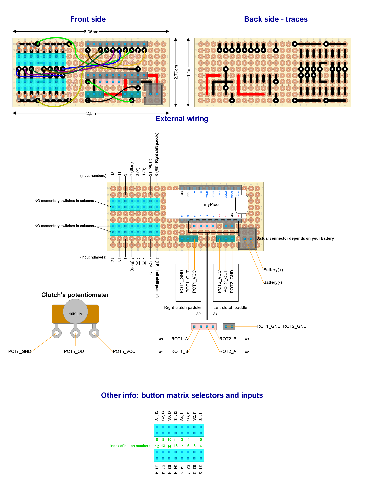

# Ready to deploy design #3

Read this document from start to end before building anything. Ensure you understand everything.

**This setup has not been tested at the system level**. If you try, please, let me know.

## Hardware features

- Bluetooth Low Energy
- Powered through rechargeable batteries
- Built-in battery monitor
- Analog clutch paddles (potentiometers).
- Shift paddles (x2)
- "ALT" buttons (x2)
- Relative rotary encoders (with push button): x2
- Up to 10 additional push buttons

## Button mapping

- *Bite point calibration*: rotary #1 clockwise and counter-clockwise (while holding one and only one clutch paddle).
- *Next clutch function*: `START` and `Left shift paddle`.
- *ALT buttons mode*: `START` and `Right shift paddle`.
- *Recalibrate clutch paddles*: `START`, `Left shift paddle` and `Right shift paddle`.
- *Power on*: rotary #1 clockwise or counter-clockwise.

## Needed parts

| **Item**                                      | **Quantity**        | Notes                                                               |
| --------------------------------------------- |:-------------------:| ------------------------------------------------------------------- |
| Bare bone rotary encoder                      | 2                   |                                                                     |
| Roller lever                                  | 2                   | For shift paddles (maybe they are included with your wheel's case)  |
| Linear potentiometer 10 K-ohms or higher      | 2                   | For clutch paddles (maybe they are included with your wheel's case) |
| Push buttons                                  | up to 10            | General purpose inputs (up to you)                                  |
| Schottky diodes                               | 16                  | 1N4148 recommended                                                  |
| Standard perfboard sized 24x10 holes          | 1                   |                                                                     |
| Unexpected Maker's TinyPico Devkit board      | 1                   | With male pins already soldered                                     |
| Pin header (female)                           | 20                  | For a DevKit board with male pins already soldered                  |
| Pin header (male or female up to you)         | 28                  | For external wiring                                                 |
| LiPo Battery 4.2V (max)                       | 1                   | Must fit TinyPico's specification. Capacity and size up to you      |
| Both male and female GX16 (5 pins) connectors | 1 male and 1 female | For the charging port                                               |
| Micro-USB/USB-C spiral cable long enough      | 1                   | For charging. Must match your TinyPico USB connector.               |
| External Antenna with U.FL connector          | 1                   | Only required if TinyPico V3 with U.FL is chosen                    |
| On-board battery connector                    | 1                   | Depends on your battery                                             |

Other parts (quantity unknown):

- Thin wire.
- Wire with Dupond terminals (for external wiring). A kit for protoboards will do the job. ¿Male or female? the opposite to pin headers.
- Welding tin.

Other notes:

- The GX16 connector may be replaced by any other kind. The GX16 features a knot that prevents accidental unplug. The 5 pins flavor allows to build a fully capable USB port, not just a charging port, if you want.

## Pin-out plan for the TinyPico DevKit board

| **GPIO** | **Input** | **Output** | **Usage**         | **Notes**                  |
| -------- | --------- | ---------- |:-----------------:| -------------------------- |
| **25**   | OK        | OK         | Left pot          |                            |
| **26**   | OK        | OK         | Right pot         |                            |
| **27**   | OK        | OK         | ROT1_A            |                            |
| **15**   | OK        | OK         | ROT1_B            | outputs PWM signal at boot |
| **14**   | OK        | OK         | ROT2_A            | outputs PWM signal at boot |
| **4**    | OK        | OK         | ROT2_B            |                            |
| **23**   | OK        | OK         | Matrix input 1    |                            |
| **19**   | OK        | OK         | Matrix input 2    |                            |
| **18**   | OK        | OK         | Matrix input 3    |                            |
| **5**    | OK        | OK         | Matrix input 4    | outputs PWM signal at boot |
| **22**   | OK        | OK         | Matrix selector 1 |                            |
| **21**   | OK        | OK         | Matrix selector 2 |                            |
| **32**   | OK        | OK         | Matrix selector 3 |                            |
| **33**   | OK        | OK         | Matrix selector 4 |                            |

## Circuit layout

Open the [circuit layout](./setup3.diy) using [DIY Layout Creator](https://github.com/bancika/diy-layout-creator).

This layout includes the following subsystems (read for an in-depth explanation):

- [Power](../../subsystems/Power/Power_en.md) through a powerboost module already built in the DevKit board.
- [Battery monitor](../../subsystems/BatteryMonitor/BatteryMonitor_en.md) through a built in voltage divider.
- [Switches](../../subsystems/Switches/Switches_en.md).
- [Relative rotary encoder](../../subsystems/RelativeRotaryEncoder/RelativeRotaryEncoder_en.md) bare bone type.
- [Analog clutch paddles](../../subsystems/AnalogClutchPaddles/AnalogClutchPaddles_en.md).

Notes and build tips:

- Some components may look very small, not matching their actual size. This is not a mistake. They must be placed in vertical position, so they lie in a minimal surface of the perfboard.
- There is a lot of wiring, which is prone to human error. Check wiring and traces twice before soldering.

### External wiring

- Each input has an assigned number in the circuit layout. Certain inputs have a particular function, so attach them properly.
- The `POTn_GND` and `POTn_VCC` terminals of each potentiometer are interchangeable. If the clutch (or axis) goes to 100% when idle, swap those terminals.
- Note that the pin headers on the left and right clutch paddles are symmetrical, not identical.
- `Battery(+)` is the positive pole of the battery.
- `Battery(-)` is the negative pole of the battery.
- Attach `Battery(+)` and `Battery(-)` properly. **Take care not to swap those terminals**.
- Bare bone rotary encoders: their built-in push button must be wired to the button matrix just like any other push button, being `SW` and `SW GND` the involved terminals.
- Battery charge port:
  - Cut the USB cable near the Micro-USB/USB-C end, but leave enough length to reach the GX16 plug.
  - Make sure matching GX16 pins in both male and female connectors are soldered to the same wire (same color).
  - Red and black wires are mandatory. Others are optional.

## Firmware upload

**You should calibrate your battery first**. See the [Battery calibration procedure](../../../../src/Firmware/BatteryTools/BatteryCalibration/README.md).

1. Plug the USB cable to the Devkit board and upload the [sketch](../../../../src/Firmware/Setup3/Setup3.ino) with Arduino IDE.
2. Open the serial monitor (Arduino IDE).
3. Reset.
4. Check there are no error messages.
