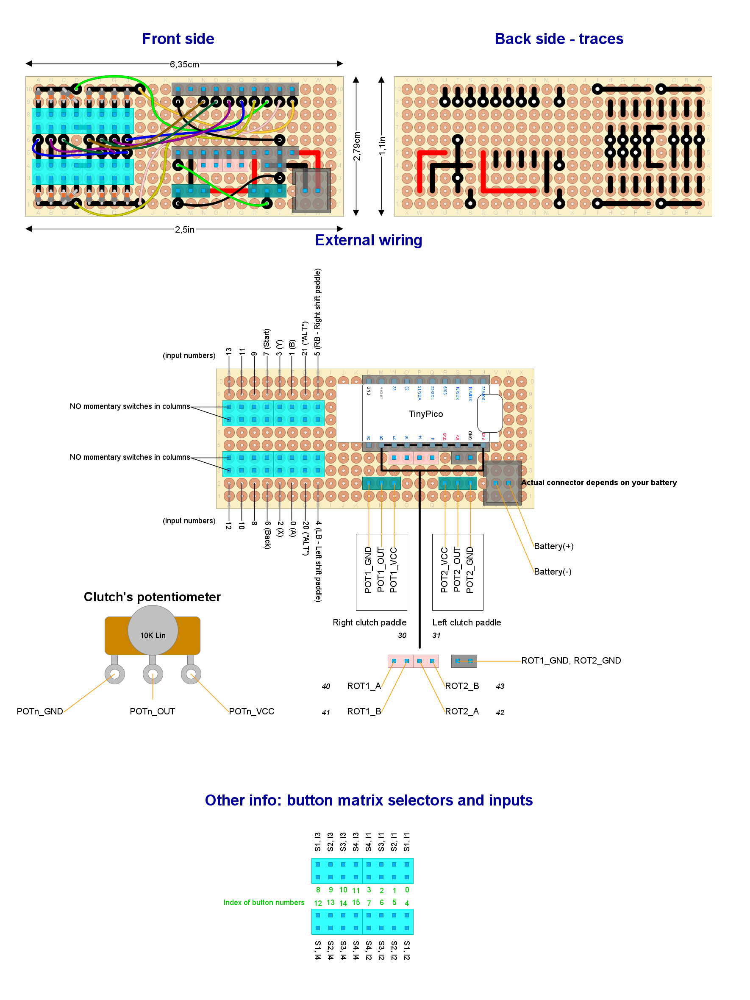

# Diseño listo para implementar #3

Lea este documento de principio a fin antes de construir cualquier cosa. Asegúrese de entenderlo todo.

**Esta configuración no ha sido probada a nivel de sistema**. Si lo intenta, por favor, hágamelo saber.

## Características del hardware

- Bluetooth de bajo consumo

- Alimentado a través de baterías recargables o fuente de alimentación externa (pero no ambas al mismo tiempo)

- Monitor de batería

- OLED

- Pulsadores y levas:
  
  - Levas de embrague equipadas con potenciómetros o interruptores (x2)
  - Levas de cambio (x2)
  - Botones "ALT" (x2)
  - Opcional: DPAD, interruptor Funky o 4 pulsadores dispuestos en cruz
  - Hasta 14 pulsadores de propósito general

- Codificadores rotativos relativos (con pulsador): x4

- Si un circuito "power latch" está disponible en el módulo powerboost:
  
  - Pulsador de encendido.
  - Apagado automático completo (sin modo de suspensión profunda).

- Botón de reinicio (opcional)

## Asignación de botones

- _Entrar/salir del menú de configuración_: presione y mantenga presionados ambos botones integrados de los codificadores rotatorios #1 y #2, espere dos segundos y luego suelte ambos botones.

- _Encendido_:
  
  - Si hay disponible un circuito de "power latch" externo: presione el botón ENCENDIDO.
  - De lo contrario: presione los dos botones incorporados de los codificadores rotatorios #1 y #2.

- _Menú de navegación_:
  
  - _Opción siguiente_: rotatorio #1 en sentido horario
  - _Opción anterior_: rotatorio #1 en sentido antihorario
  - _Select_: pulsador del rotatorio #1
  - _Cancelar_: pulsador del rotatorio #2

- _Calibración del punto de mordida_: rotatorio #1 en sentido horario y antihorario (mientras se sujeta una y sólo una leva de embrague).

## Piezas necesarias

|                   **Artículo**                   |                 **Cantidad**                 | Notas                                                                                              |
| :----------------------------------------------: | :------------------------------------------: | -------------------------------------------------------------------------------------------------- |
|          Codificador rotatorio desnudo           |                      4                       |                                                                                                    |
|    Placa perforada estándar de 24x18 agujeros    |                      1                       |                                                                                                    |
|          Interruptor de fin de carrera           |                      2                       | Para levas de cambio (quizás se incluyen con la carcasa del volante)                               |
|  Potenciómetro o interruptor de fin de carrera   |                      2                       | Para levas de embrague (quizás se incluyen con la carcasa del volante)                             |
|      D-Pad, interruptor funky o pulsadores       | 1 D-pad o 1 interruptor funky o 4 pulsadores | Para entrada direccional (opcional). Consulte las notas a continuación para el interruptor funky.  |
|                    Pulsadores                    |                   hasta 14                   | Entradas de propósito general (a su elección)                                                      |
|                     Pulsador                     |                      1                       | Para encendido. No se requiere si no hay un circuito de "power latch" externo                      |
|                     Pulsador                     |                      1                       | Para REINICIAR. Opcional.                                                                          |
|            Cabezal de pines (hembra)             |                      35                      | Para una placa DevKit con pines macho ya soldados                                                  |
|  Cabezal de pines (macho/hembra a su elección)   |                      81                      | Para cableado externo                                                                              |
|                 Diodos Schottky                  |                      27                      | 1N4148 recomendado                                                                                 |
|                 Transistores NPN                 |                      1                       | BC637 recomendado                                                                                  |
|                 Transistores PNP                 |                      1                       | BC640 recomendado                                                                                  |
|            resistencia de 10k-ohmios             |                      2                       | Conectadas a transistores NPN/PNP                                                                  |
|             resistencia de 40k-okms              |                      4                       | Cualquier otra impedancia de hasta 100K-ohmios funcionará. Para pull-up en GPIO #36, #39, #34, #35 |
|    Resistencia de 4k7 ohmios 1% de tolerancia    |                      2                       | Cualquier otra impedancia funcionará, pero se recomienda más de 1K-ohmios.                         |
|   Potenciómetro de ajuste 100k-ohmios (lineal)   |                      1                       | Accionamiento vertical y 3 pines en zig-zag. Bourns Trimpot 3266 recomendado.                      |
|          ESP32-WROOM-32UE/E (DevKit-C)           |                      1                       | Pines macho ya soldados. Elija antena incorporada/externa.                                         |
|  Antena Externa con conector U.FL, MHF I o AMC   |                      1                       | Solo se requiere si se elige ESP32-WROOM-32UE                                                      |
|   Módulo/escudo Powerboost para baterías LiPo    |                      1                       | 3V3 y 500mA o más. Recomendado con circuito "power latch" integrado.                               |
|                Batería LiPo "1S"                 |                      1                       | Debe caber en el módulo powerboost.                                                                |
|     Conectores GX16 macho y hembra (5 pines)     |              1 macho y 1 hembra              | Para el puerto de carga                                                                            |
| Cable espiral Micro-USB lo suficientemente largo |                      1                       | Para cargar                                                                                        |
|    OLED (interfaz I2C, compatible con 3,3 V)     |                      1                       | 128x64 píxeles con un controlador de 132x64 (ver más abajo)                                        |

Otras partes (cantidad desconocida):

- Cable fino.
- Cable con terminales Dupond (para cableado externo). Un juego de cables para placas de prototipado hará el trabajo. ¿Masculino o femenino? lo contrario a los cabezales de pines.
- Estaño de soldadura.

Notas:

- **Interruptor funky opcional**: ALPS [RKJXT1F42001](https://tech.alpsalpine.com/prod/e/html/multicontrol/switch/rkjxt/rkjxt1f42001.html). **Reemplaza** al codificador rotatorio #4, D-PAD y pulsador #15.
- Asegúrese de que el potenciómetro de ajuste esté "operado verticalmente".
- Elija una pantalla OLED adecuada según lo recomendado en el [subsistema de pantalla](../../subsystems/Display/Display_es.md). Si su pantalla OLED no coincide con la lista anterior, se requieren ajustes menores de software como se explica en ese subsistema.
- Elija un módulo powerboost como se recomienda en el [subsistema de energía](../../subsystems/Power/Power_es.md).
- Si no se requiere batería, excluya las partes obvias: módulo/escudo powerboost, batería LiPo y botón pulsador para ENCENDIDO.

## Plan de patillaje para la placa ESP32-DevKit-C

| **GPIO** | **Entrada** | **Salida** |       **Uso**        | **Notas**                                         |
| -------- | ----------- | ---------- | :------------------: | ------------------------------------------------- |
| **36**   | OK          |            |      ROTARY1_A       | solo entrada (sin resistencia de pull-up interna) |
| **39**   | OK          |            |      ROTARY1_B       | solo entrada (sin resistencia de pull-up interna) |
| **34**   | OK          |            |      ROTARY2_A       | solo entrada (sin resistencia de pull-up interna) |
| **35**   | OK          |            |      ROTARY2_B       | solo entrada (sin resistencia de pull-up interna) |
| **32**   | OK          | OK         |      ROTARY3_A       |                                                   |
| **33**   | OK          | OK         |      ROTARY3_B       |                                                   |
| **25**   | OK          | OK         |      ROTARY4_A       |                                                   |
| **26**   | OK          | OK         |      ROTARY4_B       |                                                   |
| **27**   | OK          | OK         |      ROTARY1_SW      |                                                   |
| **14**   | OK          | OK         |      ROTARY2_SW      | emite señal PWM en el arranque                    |
| **12**   | OK          | OK         |        battEN        | el arranque falla a voltaje alto                  |
| **13**   | OK          | OK         | Entrada de matriz 5  |                                                   |
| **9**    | x           | x          |   **INUTILIZABLE**   | conectado al flash SPI integrado                  |
| **10**   | x           | x          |   **INUTILIZABLE**   | conectado al flash SPI integrado                  |
| **11**   | x           | x          |   **INUTILIZABLE**   | conectado al flash SPI integrado                  |
| **6**    | x           | x          |   **INUTILIZABLE**   | conectado al flash SPI integrado                  |
| **7**    | x           | x          |   **INUTILIZABLE**   | conectado al flash SPI integrado                  |
| **8**    | x           | x          |   **INUTILIZABLE**   | conectado al flash SPI integrado                  |
| **15**   | OK          | OK         | Entrada de matriz 1  | emite señal PWM en el arranque                    |
| **2**    | OK          | OK         |       battREAD       | conectado al LED integrado                        |
| **0**    | pull-up?    | OK         | Selector de matriz 1 | emite señal PWM en el arranque                    |
| **4**    | OK          | OK         | Entrada de matriz 2  |                                                   |
| **16**   | OK          | OK         | Selector de matriz 2 |                                                   |
| **17**   | OK          | OK         | Selector de matriz 3 |                                                   |
| **5**    | OK          | OK         | Selector de matriz 4 | emite señal PWM en el arranque                    |
| **18**   | OK          | OK         | Selector de matriz 5 |                                                   |
| **19**   | OK          | OK         | Entrada de matriz 3  |                                                   |
| **21**   | OK          | OK         |       SDA OLED       |                                                   |
| **3**    | pull-up     | RX         |      ROTARY3_SW      | ALTO en el arranque                               |
| **1**    | TX          | OK         |     POWER_LATCH      | salida de depuración en el arranque               |
| **22**   | OK          | OK         |       SCL OLED       |                                                   |
| **23**   | OK          | OK         | Entrada de matriz 4  |                                                   |

## Disposición del circuito

Abra el [diseño del circuito](./setup3.diy) usando [DIY Layout Creator](https://github.com/bancika/diy-layout-creator).

Este diseño incluye los siguientes subsistemas (lea para obtener una explicación detallada):

- [Energía](../../subsystems/Power/Power_es.md) a través de un módulo/escudo powerboost.
- [Power latch](../../subsystems/PowerLatch/PowerLatch_es.md).
- [Monitor de batería](../../subsystems/BatteryMonitor/BatteryMonitor_es.md).
- [Interruptores](../../subsystems/Switches/Switches_es.md).
- [Codificador rotatorio relativo](../../subsystems/RelativeRotaryEncoder/RelativeRotaryEncoder_es.md) tipo desnudo.
- [Pantalla](../../subsystems/Display/Display_es.md).

Notas y consejos de construcción:

- Sus transistores pueden usar un patillaje diferente, así que verifiquelo primero.
- Asegúrese de no confundir transistores PNP con transistores NPN.
- Algunos componentes pueden parecer muy pequeños y no coincidir con su tamaño real. Esto no es un error. Deben colocarse en posición vertical, de modo que queden en una superficie mínima de la placa perforada. Todas las resistencias y diodos deben caber en agujeros de 1x4 cuando estén en posición horizontal.
- Hay mucho cableado, que es propenso a errores humanos. Verifique el cableado y las trazas dos veces antes de soldar.
- Nunca use `POWERBOOST_3V3` y `POWERBOOST_GND` junto con `EXTERNAL_5V0` y `EXTERNAL_GND`. Esto dañará su placa. Elija un par.

### Cableado externo

Cada entrada tiene un número asignado en el esquema del circuito. Ciertas entradas tienen una función particular, así que conéctelas correctamente.

Si no se requiere una batería:

- Deje `Battery(+)` y `POWER_LATCH` sin conectar.
- Si la fuente de alimentación externa no proporciona 3,3V, deje `POWERBOOST_GND` y `POWERBOOST_3V3` sin conectar.
- Si la fuente de alimentación externa proporciona de 5 a 12V, conecte un cable USB o bien tanto `EXTERNAL_5V0` como `EXTERNAL_GND`. Mire el [subsistema de energía](../../subsystems/Power/Power_es.md) para conocer los requisitos.

**Bajo ninguna circunstancia debe conectar un módulo powerboost junto con una fuente de alimentación externa al mismo tiempo**. Podría dañar la placa DevKit.

***Interruptor funky***

El interruptor Funky (opcional) se conecta de esta manera:

| Funky interruptor de terminal |           Encabezado de alfiler           |
| :---------------------------: | :---------------------------------------: |
|               A               | pin de la fila superior de la entrada #16 |
|               B               | pin de la fila superior de la entrada #18 |
|               C               | pin de la fila superior de la entrada #17 |
|               D               | pin de la fila superior de la entrada #19 |
|             Push              | pin de la fila superior de la entrada #15 |
|              com              | pin de la fila inferior de la entrada #15 |
|           Encoder A           |                Rotary #4 A                |
|           Encoder B           |                Rotary #4 B                |
|          Encoder com          |               Rotary #4 GND               |

## Subida de firmware

Es posible que desee calibrar su batería primero. Consulte el [Procedimiento de calibración de la batería](../../../../src/Firmware/BatteryTools/BatteryCalibration/README_es.md).

1. Desconecte la placa DevKit del circuito antes de continuar.
2. Conecte el cable USB a la placa Devkit y cargue el [boceto](../../../../src/Firmware/Setup3/Setup3.ino) con Arduino IDE.
3. Conecte la placa DevKit al circuito. Mantenga el cable USB enchufado.
4. Abra el monitor serie (Arduino IDE).
5. Reinice.
6. Verifique que no haya mensajes de error.