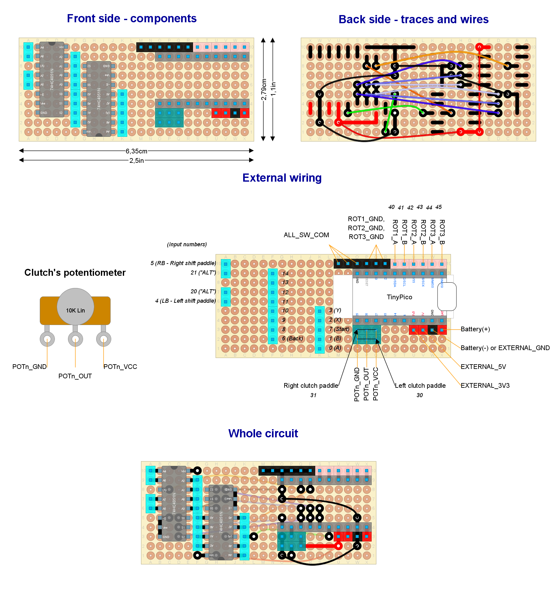

# Ready to deploy design #4

Read this document from start to end before building anything. Ensure you understand everything.
**This setup has not been tested at the system level**. If you try, please, let me know.

## Hardware features

- Bluetooth Low Energy
- Powered through rechargeable batteries **or** external power source (but not both)
- Built-in battery monitor
- Analog clutch paddles (potentiometers) x2.
- Shift paddles (x2)
- "ALT" buttons (x2)
- Relative rotary encoders (with push button): x3
- Up to 10 additional push buttons

## Button mapping

- *Bite point calibration*: rotary #1 clockwise and counter-clockwise (while holding one and only one clutch paddle).
- *Next clutch function*: `Left shift paddle` and `START`.
- *ALT buttons mode*: `Right shift paddle` and `START`.
- *Recalibrate clutch paddles*: `Left shift paddle`, `Right shift paddle` and `START`.
- *Power on*: rotary #1 clockwise or counter-clockwise.

## Needed parts

Common:

| **Item**                                 | **Quantity** | Notes                                                                                   |
| ---------------------------------------- | :----------: | --------------------------------------------------------------------------------------- |
| Bare bone rotary encoder                 |      3       | With built-in push button                                                               |
| Roller lever                             |      2       | For shift paddles (maybe they are included with your wheel's case)                      |
| Linear potentiometer 10 K-ohms or higher |      2       | For clutch paddles (maybe they are included with your wheel's case)                     |
| Push buttons                             |   up to 10   | General purpose inputs (up to you)                                                      |
| Analog multiplexer                       |      2       | 74HC4051N (*mandatory*)                                                                 |
| Standard perfboard sized 24x10 holes     |      1       |                                                                                         |
| Unexpected Maker's TinyPico Devkit board |      1       | With male pins already soldered                                                         |
| Pin header (female)                      |      20      | For a DevKit board with male pins already soldered                                      |
| Pin header (male or female up to you)    |      39      | For external wiring                                                                     |
| External Antenna with U.FL connector     |      1       | Only required if TinyPico V3 with U.FL is chosen                                        |
| Wires with Dupond plug in one end        |      2       | Male or female matching your pin headers (for the battery or the external power source) |

Battery-operated:

| **Item**                                      |    **Quantity**     | Notes                                                          |
| --------------------------------------------- | :-----------------: | -------------------------------------------------------------- |
| LiPo Battery 4.2V (max)                       |          1          | Must fit TinyPico's specification. Capacity and size up to you |
| Both male and female GX16 (5 pins) connectors | 1 male and 1 female | For the charging port                                          |
| Micro-USB/USB-C spiral cable long enough      |          1          | For charging. Must match your TinyPico USB connector.          |
| Battery connector                             |          1          | Depends on your battery                                        |

External power source:

| **Item**           | **Quantity** | Notes                                 |
| ------------------ | :----------: | ------------------------------------- |
| External connector |      1       | Depends on your external power source |

Other parts (quantity unknown):

- Thin wire.
- Wire with Dupond terminals (for external wiring). A kit for protoboards will do the job. ¿Male or female? the opposite to pin headers.
- Welding tin.

Other notes:

- The GX16 connector may be replaced by any other kind. The GX16 features a knot that prevents accidental unplug. The 5 pins flavor allows to build a fully capable USB port, not just a charging port, if you want.

## Pin-out plan for the TinyPico DevKit board

| **GPIO** | **Input** | **Output** |       **Usage**        | **Notes**                  |
| -------- | --------- | ---------- | :--------------------: | -------------------------- |
| **25**   | OK        | OK         |        Left pot        |                            |
| **26**   | OK        | OK         |       Right pot        |                            |
| **27**   | OK        | OK         | Multiplexer selector 1 |                            |
| **15**   | OK        | OK         | Multiplexer selector 2 | outputs PWM signal at boot |
| **14**   | OK        | OK         | Multiplexer selector 3 | outputs PWM signal at boot |
| **4**    | OK        | OK         |     "start" button     |                            |
| **23**   | OK        | OK         |         ROT3_B         |                            |
| **19**   | OK        | OK         |         ROT3_A         |                            |
| **18**   | OK        | OK         |         ROT2_B         |                            |
| **5**    | OK        | OK         |         ROT2_A         | outputs PWM signal at boot |
| **22**   | OK        | OK         |         ROT1_B         |                            |
| **21**   | OK        | OK         |         ROT1_A         |                            |
| **32**   | OK        | OK         |  Multiplexer input 1   |                            |
| **33**   | OK        | OK         |  Multiplexer input 2   |                            |

## Circuit layout

Open the [circuit layout](./setup4.diy) using [DIY Layout Creator](https://github.com/bancika/diy-layout-creator).

This layout includes the following subsystems (read for an in-depth explanation):

- [Power](../../subsystems/Power/Power_en.md) through a powerboost module already built in the DevKit board or an external power source.
- [Battery monitor](../../subsystems/BatteryMonitor/BatteryMonitor_en.md) through a built in voltage divider.
- [Switches](../../subsystems/Switches/Switches_en.md) through analog multiplexers.
- [Relative rotary encoder](../../subsystems/RelativeRotaryEncoder/RelativeRotaryEncoder_en.md) bare bone type.
- [Analog clutch paddles](../../subsystems/AnalogClutchPaddles/AnalogClutchPaddles_en.md).

Notes and build tips:

- The packaging of the analog multiplexers will show a small circle next to pin #1, which is tagged as `A4` here.

### External wiring

- Each input has an assigned number in the circuit layout. Certain inputs have a particular function, so attach them properly.
- The `POTn_GND` and `POTn_VCC` terminals of each potentiometer are interchangeable. If the clutch (or axis) goes to 100% when idle, swap those terminals.
- Push buttons:
  - There are three `ALL_SW_COM` pins. They are intended for the left, center and right sides of the steering wheel, but you may use any of them.
  - Wire `ALL_SW_COM` to just one terminal of each push button *in a chain*.
  - Wire the other terminal of each push button to one of the light-blue pins.
  - Bare bone rotary encoders: their built-in push button must be wired like any other push button, being `SW` and `SW COM` the involved terminals.
- In a battery-operated setup:
  - Solder the battery connector to the standalone wires with Dupond plugs in the other end.
  - `Battery(+)` is the positive pole of the battery.
  - `Battery(-)` is the negative pole of the battery.
  - Attach `Battery(+)` and `Battery(-)` properly. **Take care not to swap those terminals**.
  - Battery charge port:
    - Cut the USB cable near the Micro-USB/USB-C end, but leave enough length to reach the GX16 plug.
    - Make sure matching GX16 pins in both male and female connectors are soldered to the same wire (same color).
    - Red and black wires are mandatory. Others are optional.
- In an externally powered setup:
  - Solder the external connector to the standalone wires with Dupond plugs in the other end.
  - Leave `Battery(+)` unwired (obviously).
  - `EXTERNAL_5V` is the positive terminal of the external power source. Any DC source from +5V to +7V is suitable.
  - `EXTERNAL_GND` is the negative (or ground) terminal of the external power source.
  - Leave `EXTERNAL_3V3` unwired, unless you have a 3.3 volts externally regulated power source (very uncommon). In such a case, leave `EXTERNAL_5V` unwired.
  - You may use the USB plug as an external power source, instead. But, in such a case, leave `EXTERNAL_3V3`, `EXTERNAL_5V` and `EXTERNAL_GND` unwired.
- Rotary encoder #1 is mandatory.

## Firmware upload

At Arduino IDE, configure the board manager for "TinyPICO".

**You should calibrate your battery first**. See the [Battery calibration procedure](../../../../src/Firmware/BatteryTools/BatteryCalibration/README.md).

1. Plug the USB cable to the Devkit board and upload the [sketch](../../../../src/Firmware/Setup4/Setup4.ino) with Arduino IDE.
2. Open the serial monitor (Arduino IDE).
3. Reset.
4. Check there are no error messages.
