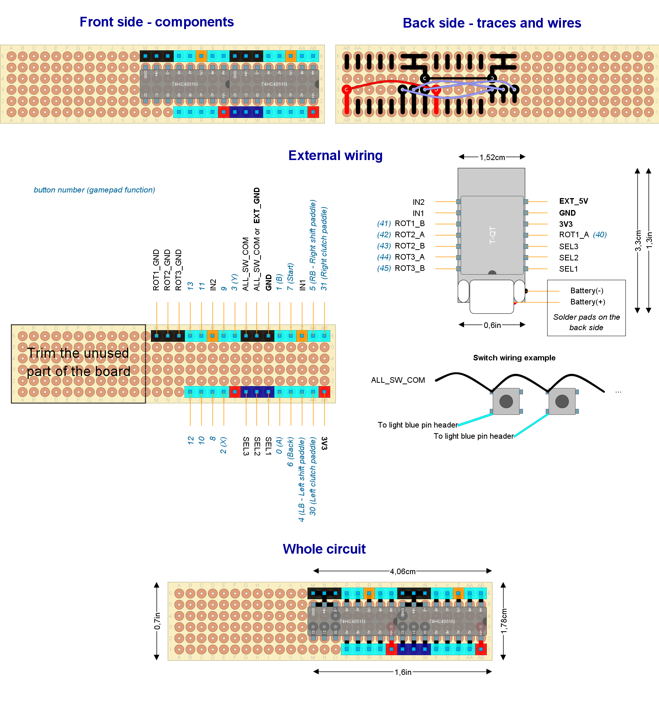

# Ready to deploy design #5

Read this document from start to end before building anything. Ensure you understand everything.
This setup was tested (with an external power source only).

## Hardware features

- Bluetooth Low Energy
- Powered through rechargeable batteries **or** external power source (but not both)
- Built-in battery monitor
- Digital clutch paddles (x2)
- Shift paddles (x2)
- Relative rotary encoders (with push button): x3
- Up to 9 additional push buttons

## Button mapping

- *Bite point calibration*: rotary #1 clockwise and counter-clockwise (while holding one and only one clutch paddle).
- *Next clutch function*: `Left shift paddle` and `START`.
- *Power on*: rotary #1 clockwise or counter-clockwise.

## Needed parts

Common:

| **Item**                               | **Quantity** | Notes                                                                         |
| -------------------------------------- | :----------: | ----------------------------------------------------------------------------- |
| Bare bone rotary encoder               |      3       | With built-in push button                                                     |
| Roller lever                           |      4       | For shift and clutch paddles (maybe they are included with your wheel's case) |
| Push buttons                           |   up to 9    | General purpose inputs (up to you)                                            |
| Analog multiplexer                     |      2       | 74HC4051N (*mandatory*)                                                       |
| Standard perfboard sized 28x6 holes    |      1       |                                                                               |
| LilyGO T-QT PRO DevKit board           |      1       | With male pins already soldered                                               |
| Pin header (male or female up to you)  |      29      | For external wiring                                                           |
| External Antenna with proper connector |      1       | Optional                                                                      |

Battery-operated:

| **Item**                                      |    **Quantity**     | Notes                                                    |
| --------------------------------------------- | :-----------------: | -------------------------------------------------------- |
| LiPo Battery 4.2V (max)                       |          1          | Must fit T-QT specification. Capacity and size up to you |
| Both male and female GX16 (5 pins) connectors | 1 male and 1 female | For the charging port                                    |
| USB-C spiral cable long enough                |          1          | For charging. Must match your T-QT USB connector.        |
| Battery connector                             |          1          | Should be included in your T-QT purchase                 |

External power source:

| **Item**           | **Quantity** | Notes                                 |
| ------------------ | :----------: | ------------------------------------- |
| External connector |      1       | Depends on your external power source |

Other parts (quantity unknown):

- Wire with Dupond terminals (for external wiring). A kit for protoboards will do the job. ¿Male or female? the opposite to pin headers. Sacrifice some of them for other wiring.
- Welding tin.

Other notes:

- The GX16 connector may be replaced by any other kind. The GX16 features a knot that prevents accidental unplug. The 5 pins flavor allows to build a fully capable USB port, not just a charging/power port, if you want.
- Recommended male 90-degrees [bended pin headers](https://duckduckgo.com/?q=bended+pin+header&iax=images&ia=images).
- The packaging of the analog multiplexers will show a small circle next to pin #1, which is tagged as `A4` here.
- You may choose another perfboard as long as it features 17x6 holes. A single-sided board is all right.
- There are several flavors of the T-QT DevKit board. Choose the **"PRO"** flavor, since it features a built-in powerboost module, unless you don't need the battery.
- The T-QT DevKit board is sold with some wires included for the (optional) battery.
- You may substitute the clutch paddles (and their roller levers) with two push buttons or two lever switches.

## Pin-out plan for the T-QT DevKit board

| **GPIO** | **Input** | **Output** |       **Usage**        | **Notes**                  |
| -------- | --------- | ---------- | :--------------------: | -------------------------- |
| **34**   | OK        | OK         |  Multiplexer input 2   |                            |
| **33**   | OK        | OK         |  Multiplexer input 1   |                            |
| **39**   | OK        | OK         |         ROT1_B         |                            |
| **38**   | OK        | OK         |         ROT2_A         | outputs PWM signal at boot |
| **37**   | OK        | OK         |         ROT2_B         | outputs PWM signal at boot |
| **36**   | OK        | OK         |         ROT3_A         |                            |
| **35**   | OK        | OK         |         ROT3_B         |                            |
| **48**   | OK        | OK         | Multiplexer selector 1 |                            |
| **18**   | OK        | OK         | Multiplexer selector 2 |                            |
| **17**   | OK        | OK         | Multiplexer selector 3 | outputs PWM signal at boot |
| **16**   | OK        | OK         |         ROT1_A         |                            |

## Circuit layout

Open the [circuit layout](./setup5.diy) using [DIY Layout Creator](https://github.com/bancika/diy-layout-creator).



This layout includes the following subsystems (read for an in-depth explanation):

- [Power](../../subsystems/Power/Power_en.md) through a powerboost module already built in the DevKit board or an external power source.
- [Battery monitor](../../subsystems/BatteryMonitor/BatteryMonitor_en.md) through a built in voltage divider.
- [Switches](../../subsystems/Switches/Switches_en.md) through analog multiplexers.
- [Relative rotary encoder](../../subsystems/RelativeRotaryEncoder/RelativeRotaryEncoder_en.md) bare bone type.

Notes and build tips:

- Some components may look very small, not matching their actual size. This is not a mistake. They must be placed in vertical position, so they lie in a minimal surface of the perfboard.
- You may trim the unused space in the perfboard.

### External wiring

- Each input has an assigned number in the circuit layout. Certain inputs have a particular function, so attach them properly.
- Push buttons:
  - There are two `ALL_SW_COM` pins. They are intended for the left and right sides of the steering wheel, but you may use any of them.
  - Wire `ALL_SW_COM` to just one terminal of each push button *in a chain*.
  - Wire the other terminal of each push button to one of the light-blue pins.
  - Bare bone rotary encoders: their built-in push button must be wired like any other push button, being `SW` and `SW COM` the involved terminals.
- In a battery-operated setup:
  - Solder the battery connector to the small solder pads on the back of the T-QT devkit board.
  - `Battery(+)` is the positive pole of the battery.
  - `Battery(-)` is the negative pole of the battery.
  - Attach `Battery(+)` and `Battery(-)` properly. **Take care not to swap those terminals**. There are two small solder pads on the back of the T-QT for them.
  - `EXT_GND` is used as `ALL_SW_COM`.
  - Battery charge port:
    - Cut the USB cable near the USB-C end, but leave enough length to reach the GX16 plug.
    - Make sure matching GX16 pins in both male and female connectors are soldered to the same wire (same color).
    - Red and black wires are mandatory. Others are optional.
- In an externally powered setup:
  - Solder the external connector to Dupond wires matching the pin header of `EXT_5V` and `EXT_GND`.
  - Leave `Battery(+)` and `Battery(-)` unwired (obviously).
  - `EXT_5V` is the positive terminal of the external power source. Any DC source from +5V to +7V is suitable.
  - `EXT_GND` is the negative (or ground) terminal of the external power source.
- Rotary encoder #1 is mandatory as well as the *Start* button.

## Firmware upload

At Arduino IDE, configure the board manager as this:

- Board: "ESP32S3Dev"
- USB CDC on boot: "Enabled".

You may need to edit the [sketch](../../../../src/Firmware/Setup5/Setup5.ino).

In a battery-operated setup:

- **You should calibrate your battery first**. See the [Battery calibration procedure](../../../../src/Firmware/BatteryTools/BatteryCalibration/README.md).
- Locate the `#define BATTERY_ENABLE_READ_GPIO` directive and rewrite, so it looks as follow:

  ```c
  #define BATTERY_ENABLE_READ_GPIO GPIO_NUM_4
  ```

When using an external power source:

- Locate the `#define BATTERY_ENABLE_READ_GPIO` directive and rewrite, so it looks as follow:

  ```c
  // #define BATTERY_ENABLE_READ_GPIO GPIO_NUM_4
  ```

1. Plug the USB cable to the DevKit board and upload the [sketch](../../../../src/Firmware/Setup5/Setup5.ino) with Arduino IDE. If required, in order to enter "boot mode" click the reset button while holding "IO0".
2. Open the serial monitor (Arduino IDE).
3. Reset.
4. Check there are no error messages.
