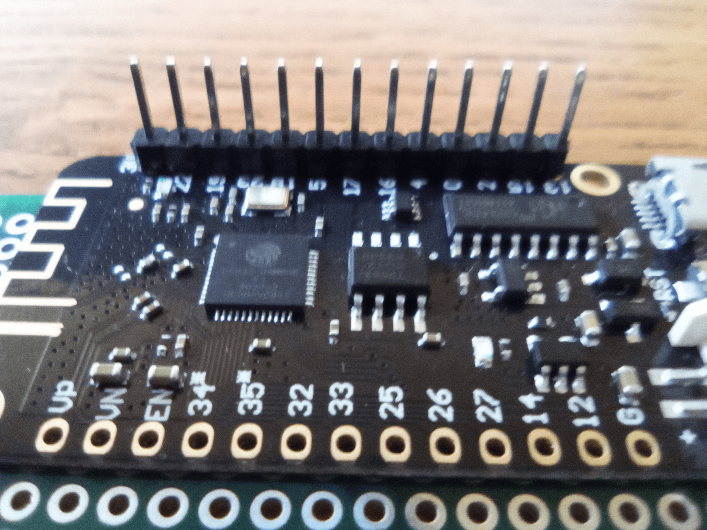
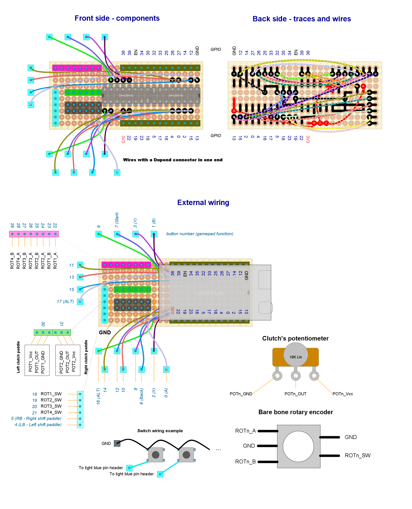

# Ready to deploy design #6

Read this document from start to end before building anything. Ensure you understand everything.

This setup has been tested.

## Hardware features

- Bluetooth Low Energy
- Powered through external power source
- Analog clutch paddles (potentiometers) x2
- Shift paddles (x2)
- "ALT" buttons (x2)
- Relative rotary encoders (with push button): x4
- Up to 14 additional push buttons

## Button mapping

- *Bite point calibration*: rotary #1 clockwise and counter-clockwise (while holding one and only one clutch paddle).
- *Next clutch function*: `Rotary #1 push button` and `Left shift paddle`.
- *ALT buttons mode*: `Rotary #1 push button` and `Right shift paddle`.
- *Recalibrate clutch paddles*: `Left shift paddle`, `Right shift paddle` and `Rotary #1 push button`.

Do not hold `Rotary #2 push button` at startup, or it won't boot (but may be used to force "bootloader mode").

## Needed parts

|                     **Item**                     | **Quantity** | Notes                                                               |
| :----------------------------------------------: | :----------: | ------------------------------------------------------------------- |
|            Lolin32 Lite DevKit board             |      1       | NO PIN HEADERS already soldered                                     |
|            Row of 13 male pin headers            |    2 rows    | Maybe they are included in your Lolin32 Lite purchase               |
|       Standard perfboard sized 24x10 holes       |      1       | Double side recommended                                             |
| Kit of Dupond wires the kind used in protoboards |    1 kit     | See below                                                           |
|                Analog multiplexer                |      2       | 74HC4051N (*mandatory*)                                             |
|               Roller lever switch                |      2       | For shift paddles (maybe they are included with your wheel's case)  |
|       Linear potentiometer (any impedance)       |      2       | For clutch paddles (maybe they are included with your wheel's case) |
|             Bare bone Rotary encoder             |      4       |                                                                     |
|                   Push buttons                   |   up to 16   | General purpose inputs (up to you)                                  |
|                Female pin header                 |      26      | In order to attach the DevKit board to the main board               |
|              Other male pin headers              |      32      | For external wiring                                                 |
| Power connector depending on your quick release  |      1       | See below                                                           |
|               Male micro-USB plug                |      1       | For power                                                           |

Other parts (quantity unknown):

- Thin wire. You may sacrifice some unused Dupond wires in replacement.
- Welding tin.

Additional notes:

- Chose an appropriate male/female power connector depending on your quick release. Make sure to identify the positive and negative terminals correctly. If you have a *Simagic QR*, negative is the yellow wire and positive is the green one.
- For the male micro-USB plug you may reuse an spare USB cable. Cut one end.
- Make sure you have enough Dupond wires in your kit. You may use them both for internal and external wiring. Check they have the proper length for your needs.

## Pin-out plan for the ESP32-DevKit-C board

| **GPIO** | **Input**  | **Output** |       **Usage**        | **Notes**                              |
| -------- | ---------- | ---------- | :--------------------: | -------------------------------------- |
| **36**   | OK         |            |        Left pot        | input only (no internal pull resistor) |
| **39**   | OK         |            |       Right pot        | input only (no internal pull resistor) |
| **34**   | OK         |            |                        | input only (no internal pull resistor) |
| **35**   | OK         |            |                        | input only (no internal pull resistor) |
| **32**   | OK         | OK         |         ROT1_A         |                                        |
| **33**   | OK         | OK         |         ROT1_B         |                                        |
| **25**   | OK         | OK         |         ROT2_A         |                                        |
| **26**   | OK         | OK         |         ROT2_B         |                                        |
| **27**   | OK         | OK         |         ROT3_A         |                                        |
| **14**   | OK         | OK         |  Multiplexer input 1   | outputs PWM signal at boot             |
| **12**   | OK         | OK         |         ROT3_B         | boot fail if pulled high               |
| **13**   | OK         | OK         |         ROT4_A         |                                        |
| **15**   | OK         | OK         |         ROT4_B         | outputs PWM signal at boot             |
| **2**    | OK         | OK         |        ROT1_SW         | connected to on-board LED              |
| **0**    | pulled up? | OK         |        ROT2_SW         | outputs PWM signal at boot             |
| **4**    | OK         | OK         |        ROT3_SW         |                                        |
| **16**   | OK         | OK         | Multiplexer selector 1 |                                        |
| **17**   | OK         | OK         | Multiplexer selector 2 |                                        |
| **5**    | OK         | OK         | Multiplexer selector 3 | outputs PWM signal at boot             |
| **18**   | OK         | OK         |        ROT4_SW         |                                        |
| **23**   | OK         | OK         |  Shift Paddle switch   |                                        |
| **19**   | OK         | OK         |  Shift Paddle switch   |                                        |
| **22**   | OK         | OK         |  Multiplexer input 2   |                                        |

## Power cable

You have to build this by yourself. One end requires a male micro-USB plug. The other end requires a proper connector matching that of your quick release. You can find the USB pin-out in [the Internet](https://duckduckgo.com/?q=micro+usb+pinout&iax=images&ia=images). Note that just the `5V` (positive terminal) and `GND` (negative terminal) pins need to be wired, but the USB plug features 5 pins. If you have an already wired plug, the red wire is `5V` and the black one is `GND`.

| USB Tag | USB male plug | USB wire color |   Your QR plug    | Simagic QR plug (if applies) |
| :-----: | :-----------: | :------------: | :---------------: | :--------------------------: |
|   5V    |    pin #1     |      red       | positive terminal |          green wire          |
|   GND   |    pin #5     |     black      | negative terminal |         yellow wire          |

## Pin headers for the DevKit board

You also have to build this by yourself. The DevKit board will be mounted upside-down into the main board. So you have to solder the male pin headers facing up, as shown in the following picture:

## Circuit layout

Open the [circuit layout](./setup6.diy) using [DIY Layout Creator](https://github.com/bancika/diy-layout-creator). If you nead a clear view of the back traces, hide the wires in DIY by hitting `CTRL+5`.

This layout includes the following subsystems (read for an in-depth explanation):

- [Analog clutch paddles](../../subsystems/AnalogClutchPaddles/AnalogClutchPaddles_en.md).
- [Power](../../subsystems/Power/Power_en.md) via USB connector.
- [Switches](../../subsystems/Switches/Switches_en.md) through analog multiplexers.
- [Relative rotary encoder](../../subsystems/RelativeRotaryEncoder/RelativeRotaryEncoder_en.md).

Notes and build tips:

- There is a lot of wiring, which is prone to human error. Check wiring and traces twice before soldering.
- We are using some Dupond wires instead of pin headers, so you have to cut the connector at one end. This simplifies the circuit a lot. **Put a label** on those wires using a piece of paper and adhesive tape in order to know which is which.
- Note that the striped wires are soldered on the back side while the others are soldered on the front side.
- The packaging of the analog multiplexers will show a small circle next to pin #1, which is tagged as `A4` here.
- Make sure to place the analog multiplexers properly. Note that both multiplexers are placed symmetrically, not pointing to the same place.
- When finished, put some isolation tape at the back of the main circuit board.

### External wiring

- There are many redundant `GND` pin headers. Use them as you wish, but it is easier to wire all the required terminals together *in a chain* to a single `GND` pin.
- Each input has an assigned number in the circuit layout. Certain inputs have a particular function, so attach them properly.
- The `POTn_GND` and `POTn_VCC` terminals of each potentiometer are interchangeable. If the clutch (or axis) goes to 100% when idle, swap those terminals.
- Note that the pin headers on the left and right clutch paddles are symmetrical, not identical.
- Bare bone rotary encoders:
  - The involved terminals are:
    - For rotation: `A` or `CLK` attached to `ROTn_A`, `B` or `DT` attached to `ROTn_B`, `COM` attached to `GND`.
    - The built-in push button must be wired as any other push button, being `SW` and `SW COM` the involved terminals. `SW` attached to their reserved pin headers and `SW COM` attached to `GND`.
  - You may wire `COM` and `SW COM` together, since both must be attached to `GND`.
  - Rotary encoder #1 is mandatory.

## Firmware upload

At Arduino IDE, configure the board manager for "WEMOS LOLIN32 Lite".

1. Detach the DevKit board from the circuit before continuing.
2. Plug the USB cable to the Devkit board and upload the [sketch](../../../../src/Firmware/Setup1/Setup6.ino) with Arduino IDE.
3. Attach the DevKit board to the circuit. Keep the USB cable plugged in.
4. Open the serial monitor (Arduino IDE).
5. Reset.
6. Check there are no error messages.
