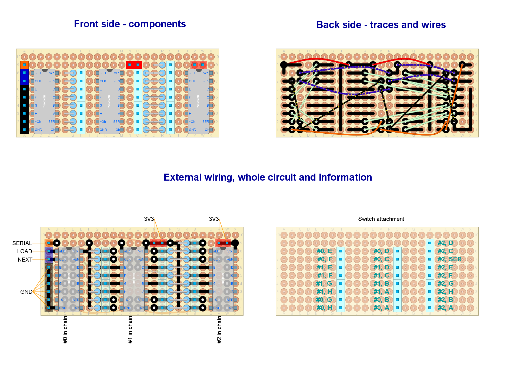

# Ready to deploy design #8

Read this document from start to end before building anything. Ensure you understand everything.
This setup was not tested at the system level.

## Hardware features

- USB connectivity.
- Powered through USB cable
- Relative rotary encoders (with push button): x4
- Up to 21 additional push buttons

## Needed parts

Common:

| **Item**                               | **Quantity** | Notes                                               |
| -------------------------------------- | :----------: | --------------------------------------------------- |
| Bare bone rotary encoder               |      4       | With built-in push button                           |
| Push buttons                           |   up to 21   | General purpose inputs (up to you)                  |
| PISO shift register                    |      3       | 74HC165N (*mandatory*)                              |
| Resistors                              |      25      | Any impedance in the range from 1K-ohms to 10K-ohms |
| Standard perfboard sized 24x10 holes   |      1       | Single-sided or double-sided                        |
| LilyGO T-QT PRO DevKit board           |      1       | With male pins already soldered                     |
| Pin header (male or female up to you)  |      37      | For external wiring                                 |
| External Antenna with proper connector |      1       | Optional                                            |
| USB-C cable                            |      1       | Fitting T-QT 's USB header                          |

Other parts (quantity unknown):

- Wire with Dupond terminals (for external wiring). A kit for protoboards will do the job. ¿Male or female? the opposite to pin headers. Sacrifice some of them for other wiring.
- Welding tin.

Other notes:

- The packaging of the shift registers will show a small circle next to pin #1, which is tagged as `~LD` here.

## Pin-out plan for the T-QT DevKit board

| **GPIO** | **Input** | **Output** | **Usage** | **Notes**                  |
| -------- | --------- | ---------- | :-------: | -------------------------- |
| **34**   | OK        | OK         |   NEXT    |                            |
| **33**   | OK        | OK         |   LOAD    |                            |
| **39**   | OK        | OK         |  SERIAL   |                            |
| **38**   | OK        | OK         |  ROT1_A   | outputs PWM signal at boot |
| **37**   | OK        | OK         |  ROT1_B   | outputs PWM signal at boot |
| **36**   | OK        | OK         |  ROT2_A   |                            |
| **35**   | OK        | OK         |  ROT2_B   |                            |
| **48**   | OK        | OK         |  ROT3_A   |                            |
| **18**   | OK        | OK         |  ROT3_B   |                            |
| **17**   | OK        | OK         |  ROT4_A   | outputs PWM signal at boot |
| **16**   | OK        | OK         |  ROT4_B   |                            |

## Circuit layout

We are reusing the [shift registers example](../../subsystems/Switches/ShiftRegister.diy) from the [switches](../../subsystems/Switches/Switches_en.md) subsystem as a satellite circuit:

[External wiring](./Setup8.diy) goes as follows:

This layout includes the following subsystems (read for an in-depth explanation):

- [Power](../../subsystems/Power/Power_en.md) through an external power source (USB cable).
- [Switches](../../subsystems/Switches/Switches_en.md) through shift registers.
- [Relative rotary encoder](../../subsystems/RelativeRotaryEncoder/RelativeRotaryEncoder_en.md) bare bone type.

Notes and build tips:

- Some components may look very small, not matching their actual size. This is not a mistake. They must be placed in vertical position, so they lie in a minimal surface of the perfboard.

### External wiring

- Each input has an assigned number in the circuit layout. Certain inputs have a particular function, so attach them properly.
- Push buttons:
  - There are several `COM` pins. You may use any of them.
  - Wire `COM` to just one terminal of each push button *in a chain*.
  - Wire the other terminal of each push button to one of the light-blue pins.
  - Bare bone rotary encoders: their built-in push button must be wired like any other push button, being `SW` and `SW COM` the involved terminals.

## Firmware upload

At Arduino IDE, configure the board manager as this:

- Board: "ESP32S3Dev"
- USB CDC on boot: "Enabled".

1. Plug the USB cable to the DevKit board and upload the [sketch](../../../../src/Firmware/Setup8/Setup8.ino) with Arduino IDE. If required, in order to enter "boot mode" click the reset button while holding "IO0".
2. Reset.
3. Check that a new USB device is recognized at the host computer, named "ButtonBox-8".
