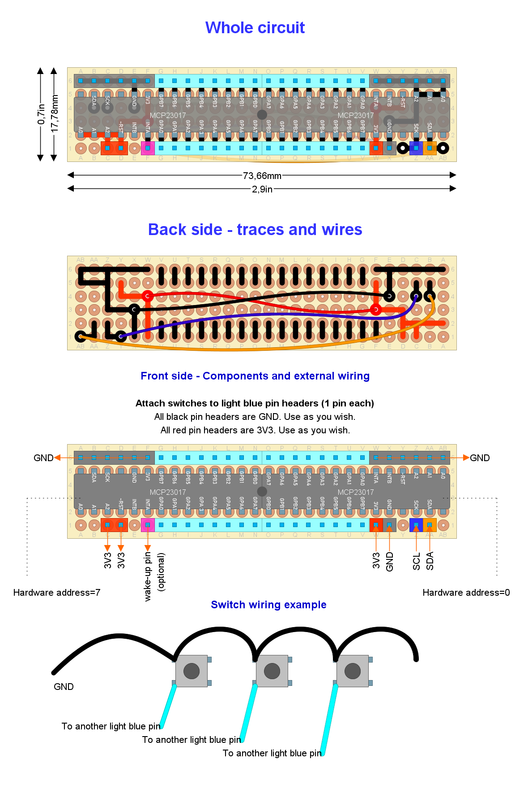

# Ready to deploy design #9

Read this document from start to end before building anything. Ensure you understand everything.

**This setup has not been tested at the system level**. If you try, please, let me know.

## Hardware features

- Bluetooth Low Energy.
- Externally powered through USB cable or quick-release.
- Analog clutch paddles (potentiometers).
- Up to 7 relative rotary encoders (*without* push button). Up to 8 if no funky switch is in place.
- Optional funky switch or DPAD (but not both).
- Shift paddles (x2).
- "ALT" buttons (x2).
- Up to 28 additional push buttons.

## Button mapping

- *Bite point calibration*: rotary #1 clockwise and counter-clockwise (while holding one and only one clutch paddle).
- *Next clutch function*: `START` and `Left shift paddle`.
- *ALT buttons mode*: `START` and `Right shift paddle`.
- *Recalibrate clutch paddles*: `Left shift paddle`, `Right shift paddle` and `START`.

You may use the [companion app](https://github.com/afpineda/SimWheelESP32Config) as an alternative to those button combinations.

## Needed parts

| **Item**                                                          | **Quantity** | Notes                                                                       |
| ----------------------------------------------------------------- | :----------: | --------------------------------------------------------------------------- |
| Bare bone rotary encoder (without push button)                    |   up to 7    | You may place an additional rotary encoder if no funky switch is in place   |
| Roller lever                                                      |      2       | For shift paddles (maybe they are included with your wheel's case)          |
| Linear potentiometer 10 K-ohms or higher                          |      2       | For clutch paddles (maybe they are included with your wheel's case)         |
| Push button                                                       |   up to 28   | You may place an additional push button if no funky switch/DPAD is in place |
| ALPS funky switch or DPAD                                         |      1       | **Optional**                                                                |
| Standard-sized perfboard 28x6 holes                               |      1       | Single-side or double-side (does not matter)                                |
| Wemos (aka "Lolin") S3 mini (DevKit board)                        |      1       | **No pins** already soldered                                                |
| MCP23017 GPIO expander                                            |      2       | Mandatory. Do not substitute with other brand                               |
| Single-row 90-degree bended pin header (male or female up to you) |      52      | For external wiring at the satellite circuit (see below)                    |
| Double-row 90-degree bended pin header (male or female up to you) |      32      | For external wiring at the DevKit board                                     |
| Power connector                                                   |      1       | Depends on your power source                                                |

Other parts (quantity unknown):

- Thin wire.
- Wire with Dupond terminals (for external wiring). A kit for protoboards will do the job. ¿Male or female? the opposite to pin headers.
  Make sure they are long enough. You need more than 30 of them.
- Welding tin.

Other notes:

- In case you are wondering what a 90-degree bended pin header looks like:
  - [single row](https://duckduckgo.com/?q=single+row+90+degree+bended+pin+header&iar=images&iax=images&ia=images)
  - [double row](https://duckduckgo.com/?q=double+row+90+degree+bended+pin+header&iar=images&iax=images&ia=images)

## Pin-out plan for the Wemos S3 mini

| **GPIO** | **Input** | **Output** | **Usage**    | **Notes**                |
| -------- | --------- | ---------- | ------------ | ------------------------ |
| **1**    | OK        | OK         | Push         |                          |
| **2**    | OK        | OK         | ROT1_A       |                          |
| **3**    | OK        | OK         | ROT1_B       |                          |
| **4**    | OK        | OK         | ROT2_A       |                          |
| **5**    | OK        | OK         | ROT2_B       |                          |
| **12**   | OK        | OK         | ROT3_A       |                          |
| **6**    | OK        | OK         | ROT3_B       |                          |
| **13**   | OK        | OK         | ROT4_A       |                          |
| **7**    | OK        | OK         | ROT4_B       |                          |
| **11**   | OK        | OK         | ROT5_A       |                          |
| **8**    | OK        | OK         | ROT5_B       |                          |
| **10**   | OK        | OK         | ROT6_A       |                          |
| **9**    | OK        | OK         | ROT6_B       |                          |
| **14**   | OK        | OK         | POT1_OUT     | ADC2_CH3                 |
| **15**   | OK        | OK         | POT2_OUT     | ADC2_CH4                 |
| **17**   | OK        | OK         | D (Right)    |                          |
| **16**   | OK        | OK         | ENCODER_B    |                          |
| **18**   | OK        | OK         | C (Down)     |                          |
| **21**   | OK        | OK         | ENCODER_A    |                          |
| **34**   | OK        | OK         | B (Lef)      |                          |
| **35**   | OK        | OK         | SDA          | Default I2C bus          |
| **38**   | OK        | OK         | A (Up)       |                          |
| **36**   | OK        | OK         | SCL          | Default I2C bus          |
| **37**   | OK        | OK         | ROT7_A       |                          |
| **RX**   | OK        | RX pin     | **UNUSABLE** | Attached to the USB port |
| **33**   | OK        | OK         | ROT7_B       |                          |
| **TX**   | TX pin    | OK         | **UNUSABLE** | Attached to the USB port |

## Circuit layout

We are reusing the [GPIO expanders example](../../subsystems/Switches/MCP23017Switches.diy) as a *satellite circuit*.



Open the [wiring layout](./Setup9.diy) using [DIY Layout Creator](https://github.com/bancika/diy-layout-creator).


This design includes the following subsystems (read for an in-depth explanation):

- [Power](../../subsystems/Power/Power_en.md) through a external power source.
- [Switches](../../subsystems/Switches/Switches_en.md) by the means of GPIO expanders and directly-attached.
- [Relative rotary encoder](../../subsystems/RelativeRotaryEncoder/RelativeRotaryEncoder_en.md) bare bone type.
- [Analog clutch paddles](../../subsystems/AnalogClutchPaddles/AnalogClutchPaddles_en.md).

Notes and build tips:

- We are using 90-degree blended pin headers in order to make it easier to fit the electronics into the wheel's housing.
  You may replace them with directly-soldered wires. You have to solder the double-row pin headers to the DevKit board yourself.
- Check wiring and traces twice before soldering.
- You may use bare-bone rotary encoders with push buttons, too. In such a case, wire `SW` and `SW GND` terminals as switches.
- A funky switch or DPAD is optional. If you choose not to wire any of them, it's recommended to attach a switch to `Push`.
- You may use an additional regular rotary encoder instead of a funky switch (adding up to 8 rotary encoders).
  In such a case, the `A` terminal is equivalent to `ENCODER_A`, and the `B` terminal is equivalent to `ENCODER_B`.
  However, you must **modify the sketch** ([Setup9.ino](../../../../src/Firmware/Setup9/Setup9.ino))
  in this way. Locate the following text line:

  ```c++
  #define USE_FUNKY true
  ```

  and replace with the following text line:

  ```c++
  #define USE_FUNKY false
  ```

- Cover the back of the satellite circuit and the DevKit board with cardboard and isolation tape. This prevents unnoticed short-circuits.

### External wiring

- Certain inputs have a particular function as shown in the following table, so **attach them properly**.

  | Location          | Tag                          | Particular function       |
  | ----------------- | ---------------------------- | ------------------------- |
  | DevKit            | Push                         | "A" button in Windows     |
  | DevKit            | A (Up)                       | Navigation                |
  | DevKit            | B (Left)                     | Navigation                |
  | DevKit            | C (Down)                     | Navigation                |
  | DevKit            | D (Right)                    | Navigation                |
  | Satellite circuit | Address = 7, switch index 0  | Left SHIFT paddle         |
  | Satellite circuit | Address = 7, switch index 1  | Right SHIFT paddle        |
  | Satellite circuit | Address = 7, switch index 15 | "ALT" button              |
  | Satellite circuit | Address = 7, switch index 14 | "ALT" button              |
  | Satellite circuit | Address = 0, switch index 15 | "Start" button in Windows |
  | Satellite circuit | Address = 0, switch index 14 | "Back" button in Windows  |
  | Satellite circuit | Address = 0, switch index 13 | "B" button in Windows     |
  | Satellite circuit | Address = 0, switch index 12 | "X" button in Windows     |
  | Satellite circuit | Address = 0, switch index 11 | "Y" button in Windows     |

- The `GND` and `3V3` terminals of each potentiometer are interchangeable. If the clutch (or axis) goes to 100% when idle, swap those terminals.
  They are attached to the satellite circuit (same tags).
- `EXT_5V` is the positive pole of your power source.`EXT_GND` is the negative pole of your power source.
  Attach them properly. **Take care not to swap those terminals**.
  If you have a *Simagic QR*, `EXT_GND` is the yellow wire and `EXT_5V` is the green one.
- Alternatively, you may use a USB cable as the power source (attached to the USB header).
  However, **under no circumstances** should you power the board using the USB header and the `EXT_` terminals simultaneously.
- The actual wiring of your (optional) funky switch **may not match** the one shown here. Look for a data sheet.
- **Misleading tags** have been reported at some ALPS funky switches. Be warned.
  Those show erroneously swapped `COM` and `PUSH` tags, at least, in their data sheet. Check first. If you come into one of them, swap those terminals.
- The `COM` terminals of all rotary encoders (and the `ENCODER_COM` terminal of the funky switch) must be attached to `GND` at the satellite circuit.
- Wire one terminal of each switch together *in a chain* to a single `GND` pin (as shown in the diagram above).
  If there are not enough `GND` pins in the satellite circuit, use this trick.

## Firmware upload

At Arduino IDE, configure the board manager for **"LOLIN S3 Mini (esp32)"**.
Configure "Core Debug Level" to "Error".

1. Plug the USB cable to the Devkit board and upload the [sketch](../../../../src/Firmware/Setup9/Setup9.ino) with Arduino IDE.
2. Open the serial monitor (Arduino IDE).
3. Reset.
4. Check there are no error messages.
