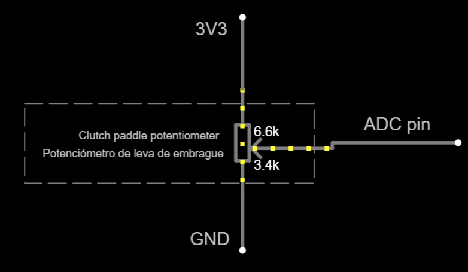

# Subsystem for analog clutch paddles

This subsystem is optional. Take into account that this subsystem is not "battery-friendly".

## Purpose

To provide two **potentiometers** as analog inputs to the system. The position of each potentiometer is translated into a logical axis position, which the user can map to several functions:

- Regular buttons: on/off.
- Two autonomous axes: this way, each clutch paddle may work as a regular clutch, a throttle, a brake or any other input.
- F1-style clutch: the position of both axes are combined into a single axis.
- "ALT" buttons.

This subsystem requires two ADC pins. If not available, potentiometers may still be used as digital clutch paddles as shown in the [switches subsystem](../Switches/Switches_en.md).

## Circuit design

There is no circuit involved, just wiring:



Notes:

- An ADC-capable pin is required for each clutch paddle.
- `3V3` and `GND` are interchangeable.
- An high impedance potentiometer is advisable (10 K-ohms or more). Potentiometers will drain current at all times, which is bad for batteries.

## Firmware customization

Customization takes place at file [CustomSetup.ino](../../../../src/Firmware/CustomSetup/CustomSetup.ino).
Place a single call to `inputs::setAnalogClutchPaddles()` inside `simWheelSetup()`:

- First parameter is the ADC pin number for the left clutch paddle.
- Second parameter is the ADC pin number for the right clutch paddle.
- Third parameter is an arbitrary button number for the left clutch paddle, in the range 0 to 63.
- Fourth parameter is an arbitrary button number for the right clutch paddle, in the range 0 to 63.

Those button numbers will be reported in "regular buttons" mode. Do not have any other meaning.

For example:

```c
void simWheelSetup()
{
    ...
    inputs::setAnalogClutchPaddles(GPIO_NUM_12, GPIO_NUM_13, 40, 41);
    ...
}
```

Note that `inputs::setDigitalClutchPaddles()` is incompatible and must not be called.

## Autocalibration

By default, both potentiometers are expected to work in the full range of voltage. Many times, this is not the case due to a physical limit on the rotation of a potentiometer. In such a case, the user should ask for "recalibration". Once both potentiometers are moved from end to end, the actual ranges of voltage will be noted and saved to flash memory after a short delay.
