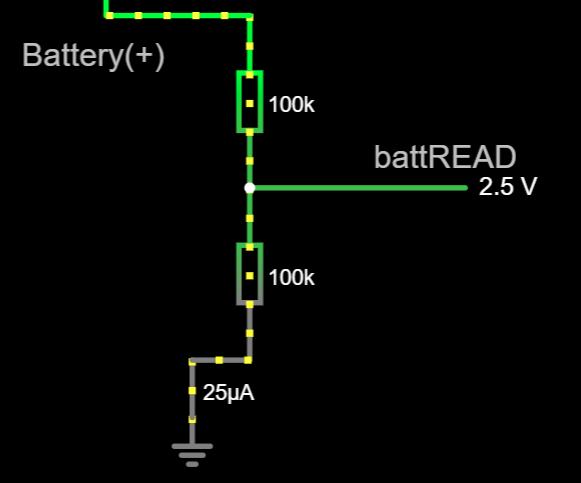

# Battery monitor subsystem

This subsystem is for a **battery-operated** setup.

## Purpose

The purpose of this subsystem is to provide an estimation of how much battery charge is left, so the user knows when to plug the charging cable in.
The battery level is a percentage of charge left in the range 0% to 100% (also known as "state of charge" or "SoC").
Battery level is known to the hosting PC through Bluetooth Low Energy.

There are two alternative implementations to choose from:

- Battery monitor: recommended since it avoids excessive battery drainage.
- Simple voltage divider: can be found in some ESP32 DevKit boards as a built-in feature. It drains current at all times.

## Limitations

Please, be aware that **accurate battery SoC can not be achieved** in this project (nor in most home-made electronics).
SoC estimation is harder than you may think.
For SoC, consumer electronics use a combination of complex circuitry, factory measurements and software (even Artificial Intelligence).
This is out of scope for a home-made project.

For further reading, look at this article:
[Battery Management System (BMS): Effective Ways to Measure State-of-Charge and State-of-Health](https://www.integrasources.com/blog/battery-management-system-bms-state-charge-and-state-health/)

## Working principles

A battery monitor needs to read the output voltage of the battery (*not* the powerboost output voltage), this is,
the voltage at the positive terminal (the negative terminal is wired to ground - `GND`).
As the battery gets discharged, that voltage will go down. The output voltage of a LiPo battery is in this range (more or less):

- 4.0V to 5.0V when the powerboost module is charging the battery.
- 3.7V when the battery is fully charged.
- Over 2.4V or less when the battery is discharged. The powerboost module will cut power to avoid over discharge.

In some way, this output voltage should be read through an ADC pin, however, there are two restrictions:

- The output voltage of the battery exceeds 3.3V and would damage the DevKit board, so that voltage has to drop down to a suitable range.
- Reading the output voltage could discharge the battery itself, so the battery monitor should not draw any relevant current.

The firmware will read the battery level every few minutes and it takes only a few milliseconds long.

**Warning**: this subsystem is designed to work with batteries below 5 volts ("1S" Lithium-Polymer or LiPo batteries).
Higher voltages may damage your DevKit board.
Some adjustments are required for other kind of batteries.

## Circuit: battery monitor

The circuit is switched on and off by the means of an NPN-PNP pair. It will not draw any relevant current except for a few milliseconds every few minutes.

### Design (1)

The circuit has the following inputs:

- **Battery (+)** pin (battery positive terminal): a wire has to be soldered to that terminal at the powerboost module.
- **battEN** pin: enables or disables the circuit. Attached to an output-capable GPIO pin at the DevKit board.

And one output:

- **battREAD** pin: provides the current battery level. Attached to an ADC-capable GPIO pin at the DevKit board.

`GND` pin is shared with the main circuit, wired to `GND` at the powerboost module.


[This simulation at falstad.com](https://falstad.com/circuit/circuitjs.html?ctz=CQAgjCAMB0l3BWcMBMcUHYMGZIA4UA2ATmIxAUgoqoQFMBaMMAKABcQmwVxieHCAFl48eEGJTAFc2DAgSCMg4nijQE2DXjxZshMIJKFVYOCAAmdAGYBDAK4AbNiwDmnbD1zCGHkB6oBLADunHhUYaFUTIRQLABOUCARVGAYMSmm8PGJqekgmDxUaPCQ2UxpIpzMYnw5JaUJAsLVnELgFSn1we6ekN6+BeDdRRj8A6OxIU35E9NoqqUc0y3TEdhVnBIG2IL4CHhgsnjKSAwSeoQY3NjMCEKQ+shUlraOzgAyVRVgtQwod5UUiBbA4AM50PzQdalKaCVTJJKBADyOW+gma30mPRm-Dag1KAA8qn0qsROBgydEQMIYgAjGxsNh0OIATwAFAAdAAOAEoWES-ghyGBCKc0GJjNTwKp6YyAKIAOX5IBI4FF4GUatUzRlDLYACU5QBBAAiLAAypEqjFolERYkYiDwYkMCx9daom0mL82gFqbREgF1G6PZw4ZwUChvOG-bspX6JCHbdjvWNCok49hoOQE8H3cm7bUE-6-IG1AgkyK7TbI957bGqFnoYG86H7X8o2qy3GUNmy4n81W-Pwfp501Qe1D+8GBYMBPx-hAGAgyc0qABZI0ADWVPkE-EUEcoYeEa5AAGEABY2OIuACWADsXBzQQB6F-nm8uGwP8wAe13bBNAjVRBSif4pVMC9r1vOhzBfd9QU-W8bHMGxAJ2PxvEjTxyDPE071BABjGCXDghCXxNOhiK-VD0NpdxDHJExMJjXdCAXDJQNSSCYnNO8AFtHAZcjQVlJlWRfAA3P8nBsMjdyucBwEjKVmhiAA1WS2BsAArOgX0sF9ZWZABbmwX1BQThP-XcRRpUC8CQJSdRAAAhPVmXZbk+SAA) shows how it works, but note that the rectangle is not part of the circuit.

Needed parts:

- 100K-ohms resistor (x2)
- 110K-ohms resistor (x1), **1% tolerance**.
- 200K-ohms resistors (x1), **1% tolerance**.
- A bipolar junction transistor (x1), NPN type: any kind should work (for example: [BC637](https://www.onsemi.com/pdf/datasheet/bc637-d.pdf)).
- A bipolar junction transistor (x1), PNP type: any kind should work (for example: [BC640](https://www.onsemi.com/pdf/datasheet/bc640-d.pdf)).

In fact, any impedance will work as long as `battEN` is below 3.3 volts at all times (assuming `battery(+)` is always below 5 volts). However, the higher the voltage drop, the less the accuracy in battery levels (state of charge).

Pay attention to the pin-out of your transistors. It *may not match* the one shown here.

Look at this [layout design](./BatteryMonitor.diy) using [DIY Layout Creator](https://github.com/bancika/diy-layout-creator).


## Circuit: simple voltage divider

This kind of circuit is built into some ESP32 boards. For example:

- [Tinypico](https://www.tinypico.com/)
- [Adafruit Feather 32u4 Bluefruit LE](https://www.adafruit.com/product/2829)
- [Wemos D32 boards](https://www.wemos.cc/en/latest/d32/d32.html)

In such a case, there is no need to build this subsystem. However, we also provide the design in case you are short of available GPIO pins for the previous alternative.

### Design (2)

The circuit has the same inputs and outputs as the previous alternative, except for `BattEN`, which is not needed.

- **Battery (+)** pin (battery positive terminal). Not exposed and not needed in the alluded boards.
- **battREAD** pin: provides the current battery level. May be exposed or not in the alluded boards. If not exposed, it will be wired internally to a certain GPIO. If exposed (with another name, for sure), you must wire it externally to an ADC-capable GPIO. Check the datasheet.



[This simulation at falstad.com](https://falstad.com/circuit/circuitjs.html?ctz=CQAgjCAMB0l3BWcMBMcUHYMGZIA4UA2ATmIxAUgoqoQFMBaMMAKAHMQHsURcAWTt15ooUFgHdOeKtKlV5LAE6jZVMBkKjm8SEq0bRmHlTQ6Jgnvwsgj4cyYw8uPW7skNZqkKpYB5fZpgfALqgWIAHpxgkAJcnBjEogKaAEYAhgAuGXSKAJ4AFAA6AA4AlCyRTJjIeJx8tcwQIbUAQpnZeUVlFSAk4IRIQYlghLXNIOlZAEoAogCCACIsAMpyokyE8qKaAGZpADYAznSiGCxTUZt1tUzETvWiVHy0j1DQCOeXVM6cKCixQi2zxAAi2MA+Fw23xGUTul1ewOw0HIYPenyh-VhPBhQKo2Fe4PRIy2DD+oIReOg+NREK+wl+-3puJsyIJaMhxJBNzAcIezJQVLZH0qtgYfE0pIQEDF+JCVAAsnMABo9Lh8JzYaUoSi-MbIEAAYQAFmlFGwAJYAOzYhUOAHpbQbTWw0paACYAe1V2GwSCqvx1DEScsNJrNdDdtodhydZrSbrS3uwAkDfx4CFl+oW5sOAGMw2wI1HbQs6HnnfHEylBOLOIRscneqDVfW6uAwNyQZjluaALYAV32mSLh0mHVytoAbh79hk0oXVRgIOpwH8bE9MQA1GdzgBWdFtboPo+HigAt2lbYc+4P416gA) shows how it works, but note that the rectangle is not part of the circuit.

Needed parts:

- 110K-ohms resistor (x1), 1% tolerance.
- 200K-ohms resistor (x1), 1% tolerance.

In fact, any impedance above 100K-ohms will work as long as `battEN` is below 3.3 volts at all times. Do not use lower impedance or this circuit will drain your battery quicker than the DevKit board itself.

## Firmware customization

Only a rough estimation of battery charge can be provided out of the box. Battery level will be unreliable until the battery is fully charged for the first time.

For better battery levels, a battery calibration procedure must be followed, which is extensively documented [here](../../../../src/Firmware/BatteryTools/BatteryCalibration/README.md) along with the required Arduino sketch. **This is not mandatory but highly recommended**.

Customization takes place at file [CustomSetup.ino](../../../../src/Firmware/CustomSetup/CustomSetup.ino).
Ensure the following line of code is in place:

```c
#define ENABLE_BATTERY_MONITOR
```

### Battery monitor (design 1)

Locate the line `#define BATTERY_ENABLE_READ_GPIO` and write a GPIO number to the right, where `battEN` is attached to. Locate the line `#define BATTERY_READ_GPIO` and write a GPIO number to the right, where `battREAD` is attached to. For example:

```c
#define BATTERY_ENABLE_READ_GPIO 0
#define BATTERY_READ_GPIO 36
```

### Simple voltage divider (design 2)

Locate the line `#define BATTERY_READ_GPIO` and write a GPIO number to the right, where `battREAD` is attached to. Set `BATTERY_ENABLE_READ_GPIO` as shown below:

```c
#define BATTERY_ENABLE_READ_GPIO -1
#define BATTERY_READ_GPIO 36
```
