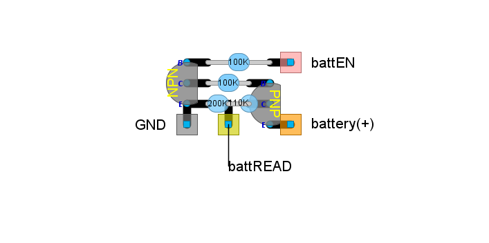
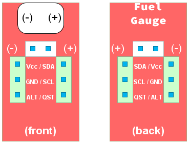

# Battery monitor subsystem

This subsystem is for **battery-operated** systems, only.

**Warning**:
this subsystem is designed to work with batteries below 5 volts ("1S" Lithium-Polymer or LiPo batteries).
Higher voltages may damage your DevKit board.

## Purpose

The purpose of this subsystem is to provide an estimation of how much battery charge is left,
so the user knows when to plug the charging cable in.
The battery level is a percentage of charge left in the range 0% to 100% (also known as "state of charge" or "SoC").
Battery level is known to the hosting PC through Bluetooth Low Energy.

There are several (exclusive) **alternate implementations** to choose from:

- *Simple voltage divider*: can be found in some ESP32 DevKit boards as a built-in feature.
- *Battery monitor*: avoids battery drainage thanks to additional on/off circuitry.
- *"Fuel gauge" chip*: provides state-of-the-art SoC estimation.

The firmware will read the battery level every few minutes and it takes only a few milliseconds long.

## Simple voltage divider or battery monitor

### Limitations

**Accurate battery SoC cannot be achieved** in this project
(or in most home-made electronics) using these implementations.
SoC estimation is harder than you may think.
For SoC, consumer electronics use a combination of complex circuitry, factory measurements and software (even Artificial Intelligence).
This is out of scope for a home-made project.

For further reading, look at this article:
[Battery Management System (BMS): Effective Ways to Measure State-of-Charge and State-of-Health](https://www.integrasources.com/blog/battery-management-system-bms-state-charge-and-state-health/)

### Working principles

A battery monitor needs to read the output voltage of the battery (*not* the powerboost output voltage), this is,
the voltage at the positive terminal (the negative terminal is wired to ground - `GND`).
As the battery gets discharged, that voltage will go down. The output voltage of a LiPo battery is in this range (more or less):

- 4.0V to 5.0V when the powerboost module is charging the battery.
- 3.7V when the battery is fully charged.
- Over 2.4V or less when the battery is discharged.
  The powerboost module will cut power to avoid over discharge.

In some way, this output voltage should be read through an ADC pin, however, there are two restrictions:

- The output voltage of the battery exceeds 3.3V and would damage the DevKit board, so that voltage has to drop down to a suitable range.
- Reading the output voltage could discharge the battery itself, so the battery monitor should not draw any relevant current.

### Battery monitor

This circuit is switched on and off by the means of an NPN-PNP pair.
It will not draw any relevant current except for a few milliseconds every few minutes.

This circuit uses the following terminals:

- **Battery (+)** (battery positive terminal): a wire has to be soldered to that terminal at the powerboost module.
- **battEN** pin: enables or disables the circuit. Attached to an output-capable GPIO pin at the DevKit board.
- **battREAD** pin: provides the current battery level. Attached to an ADC-capable GPIO pin at the DevKit board.

`GND` pin is shared with the main circuit, wired to `GND` at the powerboost module.


[This simulation at falstad.com](https://falstad.com/circuit/circuitjs.html?ctz=CQAgjCAMB0l3BWcMBMcUHYMGZIA4UA2ATmIxAUgoqoQFMBaMMAKABcQmwVxieHCAFl48eEGJTAFc2DAgSCMg4nijQE2DXjxZshMIJKFVYOCAAmdAGYBDAK4AbNiwDmnbD1zCGHkB6oBLADunHhUYaFUTIRQLABOUCARVGAYMSmm8PGJqekgmDxUaPCQ2UxpIpzMYnw5JaUJAsLVnELgFSn1we6ekN6+BeDdRRj8A6OxIU35E9NoqqUc0y3TEdhVnBIG2IL4CHhgsnjKSAwSeoQY3NjMCEKQ+shUlraOzgAyVRVgtQwod5UUiBbA4AM50PzQdalKaCVTJJKBADyOW+gma30mPRm-Dag1KAA8qn0qsROBgydEQMIYgAjGxsNh0OIATwAFAAdAAOAEoWES-ghyGBCKc0GJjNTwKp6YyAKIAOX5IBI4FF4GUatUzRlDLYACU5QBBAAiLAAypEqjFolERYkYiDwYkMCx9daom0mL82gFqbREgF1G6PZw4ZwUChvOG-bspX6JCHbdjvWNCok49hoOQE8H3cm7bUE-6-IG1AgkyK7TbI957bGqFnoYG86H7X8o2qy3GUNmy4n81W-Pwfp501Qe1D+8GBYMBPx-hAGAgyc0qABZI0ADWVPkE-EUEcoYeEa5AAGEABY2OIuACWADsXBzQQB6F-nm8uGwP8wAe13bBNAjVRBSif4pVMC9r1vOhzBfd9QU-W8bHMGxAJ2PxvEjTxyDPE071BABjGCXDghCXxNOhiK-VD0NpdxDHJExMJjXdCAXDJQNSSCYnNO8AFtHAZcjQVlJlWRfAA3P8nBsMjdyucBwEjKVmhiAA1WS2BsAArOgX0sF9ZWZABbmwX1BQThP-XcRRpUC8CQJSdRAAAhPVmXZbk+SAA) shows how it works, but note that the rectangle is not part of the circuit.

Needed parts:

- 100K-ohms resistor (x2)
- 110K-ohms resistor (x1), **1% tolerance**.
- 200K-ohms resistors (x1), **1% tolerance**.
- A bipolar junction transistor (x1), NPN type: any kind should work (for example: [BC637](https://www.onsemi.com/pdf/datasheet/bc637-d.pdf)).
- A bipolar junction transistor (x1), PNP type: any kind should work (for example: [BC640](https://www.onsemi.com/pdf/datasheet/bc640-d.pdf)).

In fact, any impedance will work as long as `battREAD` is below 3.3 volts at all times (assuming `battery(+)` is always below 5 volts).
However, the higher the voltage drop, the less the accuracy in battery levels (state of charge).

Pay attention to the pin-out of your transistors. It *may not match* the one shown here.

Look at this [layout design](./BatteryMonitor.diy) using [DIY Layout Creator](https://github.com/bancika/diy-layout-creator).



### Simple voltage divider

This kind of circuit is built into some ESP32 boards.
In such a case, there is no need to build this subsystem.
However, we also provide the design in case you are short of available GPIO pins for the previous alternative.
The circuit uses the same terminals, except for `BattEN`, which is not needed.

- **Battery (+)** pin (battery positive terminal). Usually not exposed in the alluded boards.
- **battREAD** pin: provides the current battery voltage. May be exposed or not in the alluded boards.
  If not exposed, it will be wired internally to a certain GPIO.
  If exposed (with another tag, for sure), you must wire it externally to an ADC-capable GPIO. Check the datasheet.


[This simulation at falstad.com](https://falstad.com/circuit/circuitjs.html?ctz=CQAgjCAMB0l3BWcMBMcUHYMGZIA4UA2ATmIxAUgoqoQFMBaMMAKAHMQHsURcAWTt15ooUFgHdOeKtKlV5LAE6jZVMBkKjm8SEq0bRmHlTQ6Jgnvwsgj4cyYw8uPW7skNZqkKpYB5fZpgfALqgWIAHpxgkAJcnBjEogKaAEYAhgAuGXSKAJ4AFAA6AA4AlCyRTJjIeJx8tcwQIbUAQpnZeUVlFSAk4IRIQYlghLXNIOlZAEoAogCCACIsAMpyokyE8qKaAGZpADYAznSiGCxTUZt1tUzETvWiVHy0j1DQCOeXVM6cKCixQi2zxAAi2MA+Fw23xGUTul1ewOw0HIYPenyh-VhPBhQKo2Fe4PRIy2DD+oIReOg+NREK+wl+-3puJsyIJaMhxJBNzAcIezJQVLZH0qtgYfE0pIQEDF+JCVAAsnMABo9Lh8JzYaUoSi-MbIEAAYQAFmlFGwAJYAOzYhUOAHpbQbTWw0paACYAe1V2GwSCqvx1DEScsNJrNdDdtodhydZrSbrS3uwAkDfx4CFl+oW5sOAGMw2wI1HbQs6HnnfHEylBOLOIRscneqDVfW6uAwNyQZjluaALYAV32mSLh0mHVytoAbh79hk0oXVRgIOpwH8bE9MQA1GdzgBWdFtboPo+HigAt2lbYc+4P416gA) shows how it works, but note that the rectangle is not part of the circuit.

Needed parts:

- 110K-ohms resistor (x1), 1% tolerance.
- 200K-ohms resistor (x1), 1% tolerance.

In fact, any impedance above 100K-ohms will work as long as `battREAD` is below 3.3 volts at all times.
Do not use lower impedance or this circuit will drain your battery quicker than the DevKit board itself.
The higher the voltage drop, the less the accuracy in battery levels (state of charge).

This alternative will deplete your battery very slowly, even when the system is in a deep sleep state or not powered.
An [external power latch circuit](../PowerLatch/PowerLatch_en.md) will **not prevent** this.

An incomplete list of DevKits featuring a built-in voltage divider follows, along with their internal wiring:

| DevKit                                                                      | battREAD |
| --------------------------------------------------------------------------- | -------- |
| [Tinypico](https://www.tinypico.com/)                                       | GPIO #35 |
| [TinyS3](https://esp32s3.com/tinys3.html)                                   | GPIO #10 |
| [Adafruit Feather 32u4 Bluefruit LE](https://www.adafruit.com/product/2829) | GPIO #9  |
| [Wemos D32](https://www.wemos.cc/en/latest/d32/d32.html)                    | GPIO #35 |
| [LilyGo T7S3](https://www.lilygo.cc/products/t7-s3)                         | GPIO #2  |

## Fuel gauge

A "fuel gauge" (not to be taken literally) is a specialized chip for accurate state of charge measurement.

This project supports the popular [MAX17043](https://www.analog.com/media/en/technical-documentation/data-sheets/MAX17043-MAX17044.pdf)
and other [compatible fuel gauges](https://www.analog.com/en/parametricsearch/12979#/p0=max1704)
made by Maxim/Analog Devices.
As long as those chips accept the same set of commands over the I2C connection,
the firmware will work with them.

Note that those chips are not sold in through-hole packaging,
so you should buy a pre-made module instead,
or a DevKit featuring a compatible built-in fuel gauge.

This is the pre-made module used for testing in this project:


There is no circuit involved here, just wiring:

| Pin tag in the MAX1704x module | Wired to                           |
| ------------------------------ | ---------------------------------- |
| `SDA`                          | `SDA` (DevKit)                     |
| `SCL`                          | `SCL` (DevKit)                     |
| `GND`                          | `GND`(DevKit or satellite circuit) |
| `Vdd`                          | `3V3`(DevKit or satellite circuit) |
| `(-)`                          | Negative pole of the battery       |
| `(+)`                          | Positive pole of the battery       |
| `ALT`                          | Nothing (not needed)               |
| `QST`                          | Nothing (not needed)               |



If you are wiring a chip with no pre-made module:

| Pin tag in the MAX1704x chip | Wired to                           |
| ---------------------------- | ---------------------------------- |
| `SDA`                        | `SDA` (DevKit)                     |
| `SCL`                        | `SCL` (DevKit)                     |
| `GND`                        | Negative pole of the battery       |
| `Vdd`                        | `3V3`(DevKit or satellite circuit) |
| `CTG`                        | `GND`(DevKit or satellite circuit) |
| `CELL`                       | Positive pole of the battery       |
| `~ALERT`                     | Nothing (not needed)               |
| `QSTRT`                      | `GND`(DevKit or satellite circuit) |
| Exposed pad                  | `GND`(DevKit or satellite circuit) |

## Firmware customization (simple voltage divider or battery monitor)

Only a rough estimation of battery charge can be provided out of the box.
Battery level will be unreliable until the battery is fully charged for the first time.

For better results, a battery calibration procedure must be followed,
which is extensively documented [here](../../../../src/Firmware/BatteryTools/BatteryCalibration/README.md) along with the required Arduino sketch.
**This is not mandatory but highly recommended**.

Customization takes place at file [CustomSetup.ino](../../../../src/Firmware/CustomSetup/CustomSetup.ino).
Ensure the following line of code is in place:

```c
#define ENABLE_BATTERY_MONITOR
```

### Battery monitor (design 1)

Locate the line `#define BATTERY_ENABLE_READ_GPIO` and write a GPIO number to the right,
where `battEN` is attached to. Locate the line `#define BATTERY_READ_GPIO` and
write a GPIO number to the right, where `battREAD` is attached to. For example:

```c
#define BATTERY_ENABLE_READ_GPIO 0
#define BATTERY_READ_GPIO 36
```

### Simple voltage divider (design 2)

Locate the line `#define BATTERY_READ_GPIO` and write a GPIO number to the right,
where `battREAD` is attached to. Set `BATTERY_ENABLE_READ_GPIO` as shown below:

```c
#define BATTERY_ENABLE_READ_GPIO -1
#define BATTERY_READ_GPIO 36
```

## Firmware customization (fuel gauge)

Just call `batteryMonitor::begin()` with no parameters.
However, if your chip uses a non-standard I2C address,
you must provide the proper 7-bit address as the first parameter.
The expected (standard) 7-bit address is 36 (hexadecimal).

Your chip/module will share the I2C bus with [GPIO expanders](../Switches/Switches_en.md#gpio-expanders), if any.

**Note**: If the chip/module is not powered or not found in the I2C bus, the system will boot normally.
You will get just a warning: "Fuel gauge not found in the I2C bus"
(only if Arduino IDE is configured to core debug level "warning" or higher).

## Further firmware customization

Regardless of the implementation you choose, you may set the following parameters (not mandatory).

### Polling interval

Place a call to `batteryMonitor::setPeriod()`.
The first parameter is a time interval in seconds.
By default, this is set to 180 seconds (3 minutes).
It sets the time interval between measurements.

### Power off on critical battery levels

Place a call to `batteryMonitor::setPowerOffSoC()`.
The first parameter is a percentage of battery charge (0% to 100%).
If the measured state of charge is below the given parameter,
the system will go into deep sleep or power off before it stops working.
This prevents the system from depleting the battery even if there is not enough power
to keep it working.
By default, this is set to 4%.
Do not set too high.

Call `batteryMonitor::setPowerOffSoC(0)` to disable this feature.

## Unknown state of charge

The firmware will be unable to compute a proper state of charge in the following situations:

- The battery is not linked to the battery monitor/voltage divider/fuel gauge,
  and the system is powered by a different source.
- The battery monitor/voltage divider/fuel gauge is not properly wired to the DevKit board.
- The fuel gauge is not powered.
- The actual I2C address of the fuel gauge is not what this firmware expects.
- The fuel gauge is not compatible with this firmware.

In those cases, you will get a constant state of charge of 66% at the host computer.
