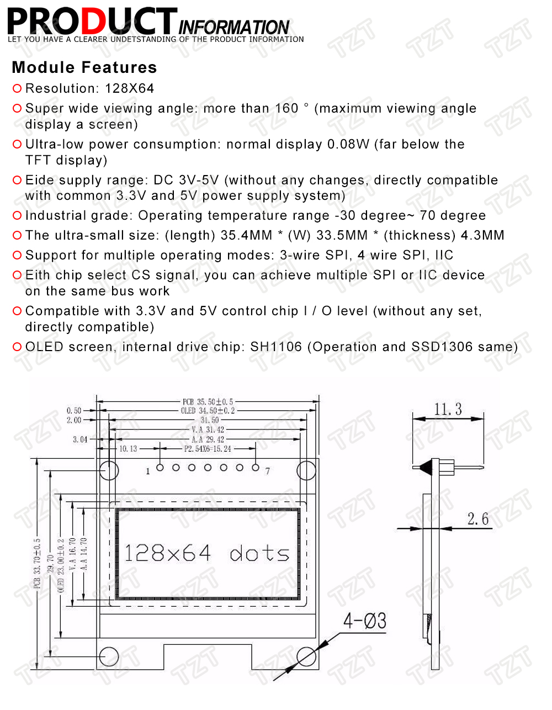

# Display subsystem

**You don't build this subsystem**, just buy one.

## Purpose

The purpose of this subsystem is to display messages in a small OLED, a part of the user interface required by the configuration menu. This subsystem is **optional**. If not in place, no configuration menu will be available, thus the only way for the user to configure her/his wheel is through [**AT commands**](./../../../firmware/UARTProtocol_en.md).

## Buying guide

The display must fit all of these requirements:

- Suitable for a 3.3V power source.
- Interfaced through the [I2C protocol](https://en.wikipedia.org/wiki/I%C2%B2C).
- Supported by the [ss_oled library](https://github.com/bitbank2/ss_oled). Take a look at their documentation.

Note that **what you buy may not match exactly what the vendor says**. This should not be a problem if you know what happens. Take a look at the [troubleshooting](#troubleshooting) section.

Recommend resolution is 128x64 and recommended size is 1.3 inches. This is the OLED used for testing in this project: 



## External wiring

- `VDD` or `Vcc` wired to 3V3 at the DevKit board or powerboost module/shield.
- `GND` wired to `GND` at the DevKit board.
- `SCK` or `SCL` wired to GPIO 22 (also named `WIRE_SCL`) at the DevKit board.
- `SDA` wired to GPIO 21 (also named `WIRE_SDA`) at the DevKit board.

## Software setup

Customization takes place at file [CustomSetup.ino](../../../../src/Firmware/CustomSetup/CustomSetup.ino).

if there is no OLED, comment out the line `#define ENABLE_OLED` as follows and stop reading:

```c
//#define ENABLE_OLED 0
```

Otherwise, that line must look as follows:

```c
#define ENABLE_OLED 0
```

Write the width and height of your display, in pixels, to the right of `#define OLED_SCREEN_WIDTH` and `#define OLED_SCREEN_HEIGHT`, respectively. For example:

```c
#define OLED_SCREEN_WIDTH 128
#define OLED_SCREEN_HEIGHT 64
```

Write the controller of your display to the right of `#define OLED_TYPE`. Valid values are `SSOLED_128x128`, `SSOLED_128x32`, `SSOLED_128x64`, `SSOLED_132x64`, `SSOLED_64x32`, `SSOLED_96x16` and `SSOLED_72x40`. For example:

```c
#define OLED_TYPE SSOLED_132x64
```

If your display is mounted upside-down, the following line must be in place:

```c
#define OLED_FLIP true
```

Otherwise, it must look like this:

```c
#define OLED_FLIP false
```

### Troubleshooting

#### Shifted pixels

This is a common issue. Try another controller (display type). For example, `SSOLED_132x64` instead of `SSOLED_128x64`.

#### No display

Check your wiring first. If wiring is correct, the most probable cause is a wrong I2C address. A way to diagnose is to upload an run the examples of the `ss_oled` library.

That library should detect the correct address, but it could fail. Another address auto-detection sketch can be found here: [I2CAddressScanner.ino](../../../../src/Firmware/I2CAddressScanner/I2CAddressScanner.ino). In such a case you must tweak the implementation of `ui::begin()` at file [ui_ssoled.cpp](../../../../src/common/ui_ssoled.cpp), by setting:

```c
ssoled.oled_addr = <<correct address>>;
```

before the first call to `oledInit()`.

## Further reading

- [Interfacing OLED Display with ESP32](https://www.tutorialspoint.com/esp32_for_iot/interfacing_oled_display_with_esp32.htm)
- [OLED shifted](https://forum.arduino.cc/t/oled-shifted/323480/2)
- [ESP32 OLED Display with Arduino IDE](https://randomnerdtutorials.com/esp32-ssd1306-oled-display-arduino-ide/)
