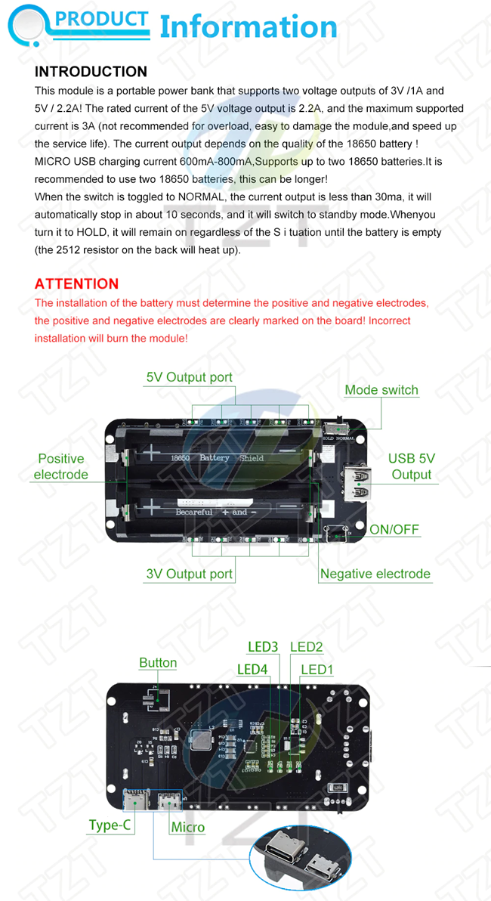

# Power subsystem

**You don't build this subsystem**, just buy one.

## Purpose

The purpose of this subsystem is:

- To provide a regulated power source of 3.3V to the rest of the system, no matter if it is powered through cable, batteries or both.
- If the system is powered through batteries:
  - To charge batteries while the USB cable is plugged in, even if the system is in use.
  - To prevent over charge of the batteries.
  - To prevent over discharge of the batteries.
  - To **prevent your batteries from catching fire or blowing up**.
  - To maximize battery life.

## Power requirements

The system requires a current supply of 500 mA or more from the power source.

## Understanding power plugs

One or more power sources must be attached to your DevKit board, but there are several plugs:

- **USB cable**.
- **`5V0` (or `5V`) and `GND` pins**, called "5V plug" for short.
- **`3V3` and `GND` pins**, called "3V plug" for short.
- **Built-in connector for rechargeable batteries** (where available).

And there are restrictions to them as described below.

### USB cable or 5V plug

The USB cable and the 5V plug are electrically connected, so they are just the same.
For that reason you must **never** attach any power source to both plugs simultaneously.

If a power source is attached, it will feed a built-in [voltage regulator](https://en.wikipedia.org/wiki/Voltage_regulator)
which is connected to the 3V plug, so that plug becomes a power source itself.
For that reason, you must **never** attach another power source to the 3V plug simultaneously.
Otherwise, the DevKit board will get damaged.

If your DevKit board features a built-in battery connector, the power source will also feed a built-in battery charger.

Any power source capable of providing a minimum of 5 volts and **up to 12 volts** will work, even if the voltage is not steady.
However, the higher the voltage, the higher the waste of power and the higher the heat dissipated.
No more than 7 volts is recommended.

### 3V plug

As stated above, if you attach a power source to this plug, you must not attach any other power source to other plugs.
That power source must comply with an extra requirement: a steady and constant voltage between 3.0V and 3.3V, which is uncommon.
However, this is the case when using a powerboost module (see below).

It is unlikely that such a power source can make any built-in battery charger work.

### Battery conector

If your DevKit board features a battery connector, an external battery will work as a secondary power source.
Do not assume any battery will work. Look for a data sheet.
If your DevKit board does not feature a battery connector,
you may still use batteries by purchasing a powerboost module (see below).

## Power from a powerboost module

A a powerboost module/shield (also known as a "power bank") combines a battery pack with a battery charger and a voltage regulator.
This device will act as a power source for the DevKit board, either by attaching it to the 5V plug or the 3V plug.

### Buying guide

Ensure you buy nothing but a *powerboost module/shield* or a *power bank*.
A simple battery charger or any other circuit **is dangerous** even if it works.
The requirements are:

- Current supply of 500mA or more (1A is recommended).
- Capable of 3.0V to 3.3V output voltage. Some powerboost modules provide both 5.0V and 3.3V.

  If your powerboost module is 5.0V-capable, but not 3.3V-capable, you can still use it. Plug the 5.0V output to the 5V0 pin at the DevKit board.
  This works, but it is **a waste of power** (there are two voltage regulators in action), thus not recommended.

- Battery pack with a voltage of 3.2V to 4.3V, which is called "1S". This is, if there are two or more battery cells, they are connected in parallel, not in series.

It is highly recommended, but not mandatory, for the powerboost module to come equipped with a [power latch circuit](../PowerLatch/PowerLatch_en.md).
You now there is a power latch circuit if there is a power on/off momentary push button, but not a (non-momentary) switch.

Check which kind of battery is suitable for the chosen powerboost module and buy one.
Keep in mind how much space is available inside the wheel case to fit all the components, so don't buy an oversize powerboost module.

Some ESP32-based DevKits already integrate a powerboost module, such as the [Adafruit HUZZAH32 – ESP32 Feather Board](https://www.adafruit.com/product/3405).
Adafruit also offers two stand-alone powerboost modules (a bit overpriced, in my opinion), but not 3.3V-capable.

This is the powerboost module used for testing in this project (note there is a latch circuit):

## Firmware customization

Nothing is required.

## Further reading

For an explanation on how how to power the DevKit board, take a look at these articles:

- [How to power your ESP32 dev kit](https://techexplorations.com/guides/esp32/begin/power/)
- [What is the best battery for the ESP32?](https://diyi0t.com/best-battery-for-esp32/)
- [Power Supply for ESP32 with Battery Charger & Boost Converter](https://how2electronics.com/power-supply-for-esp32-with-boost-converter-battery-charger/)