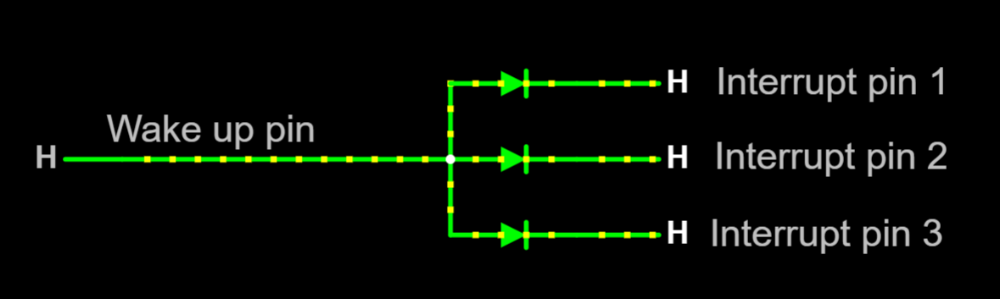

# Power latch subsystem

**You don't build this subsystem**, it may come equipped with your powerboost module/shield.
This subsystem has little sense if there is no battery.

## Purpose

The purpose of this subsystem is to completely **cut power off** to the system when required, thus saving battery charge. This subsystem is **optional**. When not in place, the system will enter [**deep sleep**](https://randomnerdtutorials.com/esp32-deep-sleep-arduino-ide-wake-up-sources/) mode instead, which drains current, but at a lower rate.

- There is no need for a power latch circuit if the system is powered through the wheel's base or any other external power source not based on batteries.
- This subsystem requires a single dedicated output pin (GPIO) at the DevKit board, named `POWER_LATCH`. This pin does not require to be attached to anything, so it can be reserved for future use.

## External power latch circuit

Your powerboost module/shield may come equipped with this subsystem. You know that because there is a push button (**but not a switch**) to turn on/off the module. One of the two terminals where the push button is soldered will work as `POWER_LATCH`, so a wire has to be soldered there. To know which one, just do some testing using a wire. Connect a terminal to `GND` and wait a few seconds. If power goes on/off, that terminal is `POWER_LATCH`.

### Firmware customization for the external power latch circuit

Customization takes place at file [CustomSetup.ino](../../../../src/Firmware/CustomSetup/CustomSetup.ino).
Locate the line that contains `#define POWER_LATCH`, and ensure it is not commented out:

```c
#define POWER_LATCH
```

Then write the assigned GPIO number to `POWER_LATCH` at the right side. For example:

```c
#define POWER_LATCH GPIO_NUM_1
```

## No power latch circuit

A "wake-up source" is mandatory if there is no power latch circuit.
For simplification, a single GPIO pin, active on **low** voltage (pulled-up), is allowed as "wake-up source".
It is recommended to configure a "wake-up source" even if there is a power latch circuit
as a fallback measure in case the power latch is not wired.

Since the "wake-up source" must be user-operated (like a "turn-on" push button),
that GPIO pin depends on the [switches](../Switches/Switches_en.md) subsystem implementation.
But **not all of those implementations** are suitable for this purpose.

Additionally, the desired GPIO pin must be **"RTC-capable"**, otherwise it will not work.
Look for a data sheet or pin-out reference.

You may combine many signals into a single "wake-up" GPIO pin using diodes,
as long as all of them are active at low voltage.
Look at the example for GPIO expanders below.

### RESET button

A "reset" push button will wake up the system from deep sleep:
one terminal wired to `GND` and the other one wired to the `EN` pin at the DevKit Board.
This is **not recommended**, as the reset button may be pushed by accident, thus ruining your race.
No firmware customization is required in this case since no GPIO pin is involved.

### Firmware customization of a "wake-up source"

Customization takes place at file [CustomSetup.ino](../../../../src/Firmware/CustomSetup/CustomSetup.ino).

Locate the line that contains `#define WAKE_UP_PIN`, and ensure it is not commented out:

```c
#define WAKE_UP_PIN
```

Then write the assigned GPIO number to `WAKE_UP_PIN` at the right side. For example:

```c
#define WAKE_UP_PIN GPIO_NUM_3
```

There are some alternatives:

#### Push button directly attached to a GPIO pin

With this choice, a single switch will wake up the system from deep sleep.
Any other pulled-up input may be used, too, for example, a rotary encoder.
`GPIO_NUM_3` (in the ESP32 board) is perfect for this since it is always pulled up.

#### Button Matrix, shift registers or analog multiplexers

Sorry. Those implementations are unable to wake up the system from deep sleep.

#### GPIO expanders

The "interrupt pin" of a GPIO expander is able to wake up the system from deep sleep:

- *PCF8574*: the "interrupt pin" is tagged as `~INT`.
- *MCP23017*: there are two "interrupt pins" tagged as `INTA` and `INTB`.
  Any of them will work.
  You don't need to use both.

Any of the switches attached to the GPIO expander will wake up the system from deep sleep.

Note that "interrupt" pins are active LOW.
You may combine many of them (from different chips) into a single "wake up" GPIO pin using diodes.
The following example combines interrupt signals from three chips:



Test this circuit at [falstad.com](https://falstad.com/circuit/circuitjs.html?ctz=CQAgjCAMB0l3BWcMBMcUHYMGZIA4UA2ATmIxAUgoqoQFMBaMMAKAA8QAWfEFYpBAkK9ieLr04gAkgDsALnQBOigK4AHOQB0AzmoCWMnaw7dy2TigqCQ5pJJSTZC5eq26DOlOy6RJ2YhCClv6S9o7ySqoaOvqG2tgsADI2aDbYwth4fulQ4CAAZgCGADbadNSQLAAmElTYOdip9cKWVXRFKsVyLADutbx4Yg51OZXJjVQogzZZA2JUEEWl5UiVNcNzKZPTre2Fnd0AsilpwkwZo7zQCL39zXezaw9+TbO7HV1JWzN+s5mSCwKJTKFVuG3ujVOUG8KGCKCQYAQLzEYRAAHVCgBrOg6dQxAwsIA)
