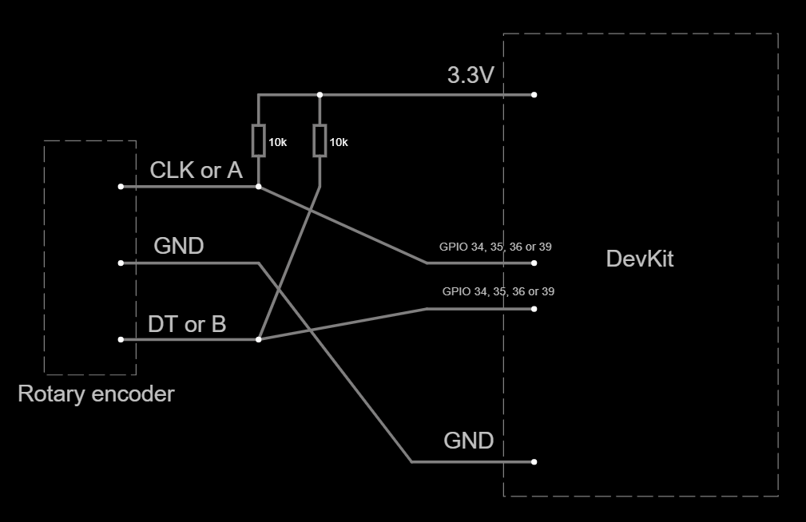

# Subsistema de codificador rotatorio relativo

**No hay circuito involucrado aquí**, solo software y cableado.

## Objetivo

El propósito de este subsistema es proporcionar uno o más codificadores rotatorios relativos como entradas al sistema. Dado que un interruptor funky es una especie de codificador rotatorio, este subsistema también se aplica a ellos. Sin embargo, **solo la rotación es parte de este subsistema**. Cualquier botón incorporado no es parte de este subsistema, consulte el [Subsistema de interruptores](../Switches/Switches_es.md) para eso.

## Cableado

Cada codificador rotatorio requiere dos pines dedicados en la placa DevKit, sin importar si son codificadores rotatorios desnudos o KY-040. Sin contar ningún botón integrado, este es el cableado de un codificador rotatorio:

- Tipo KY-040:
  
  - El pin etiquetado `Vcc` debe conectarse al pin `3V3` en la placa.
  - El pin etiquetado como `GND` debe conectarse al pin `GND` en la placa.
  - El pin etiquetado como `CLK` o `A` debe conectarse a cualquier pin GPIO con capacidad de entrada.
  - El pin etiquetado `DT` o `B` debe conectarse a cualquier pin GPIO con capacidad de entrada.

- Desnudo o funky:
  
  - Hay dos pines etiquetados `GND`. El que se encuentra entre `A` (o `CLK`) y `B` (o `DT`) debe conectarse al pin `GND` en la placa. El otro, a veces denominado `SW GND`, no está relacionado con este subsistema.
  - El pin etiquetado como `CLK` o `A` debe conectarse a cualquier pin GPIO con capacidad de entrada **con resistencias pull-up internas**. De lo contrario, se debe colocar una resistencia pull-up externa.
  - El pin etiquetado como `DT` o `B` debe conectarse a cualquier pin GPIO con capacidad de entrada **con resistencias pull-up internas**. De lo contrario, se debe colocar una resistencia pull-up externa.
  - La mayoría de los GPIO pueden habilitar una resistencia pull-up interna por software, pero los GPIO 34, 35, 36 y 39 carecen de ellos. Se debe colocar una resistencia pull-up externa en esos pines como se muestra en la siguiente imagen. Cualquier resistencia será suficiente, pero se recomienda una alta impedancia.



## Personalización del firmware

La personalización se realiza en el archivo [CustomSetup.ino](../../../../src/Firmware/CustomSetup/CustomSetup.ino).
Edite el cuerpo de `simWheelSetup()` y realice una llamada a `inputs::addRotaryEncoder()` para cada codificador rotatorio como se muestra a continuación.

- El primer parámetro es el GPIO asignado a `CLK` o `A`.
- El segundo parámetro es el GPIO asignado a `DT` o `B`.

Por ejemplo, supongamos que un codificador rotatorio desnudo tiene "A" conectado a GPIO 33 y "B" conectado a GPIO 25:

```c
anular simWheelSetup()
{
   ...
   entradas::addRotaryEncoder(GPIO_NUM_33,GPIO_NUM_25);
   ...
}
```

`inputs::addRotaryEncoder()` devuelve el número de entrada para la rotación en el sentido de las agujas del reloj, siendo el siguiente el número de entrada para la rotación en el sentido contrario a las agujas del reloj.