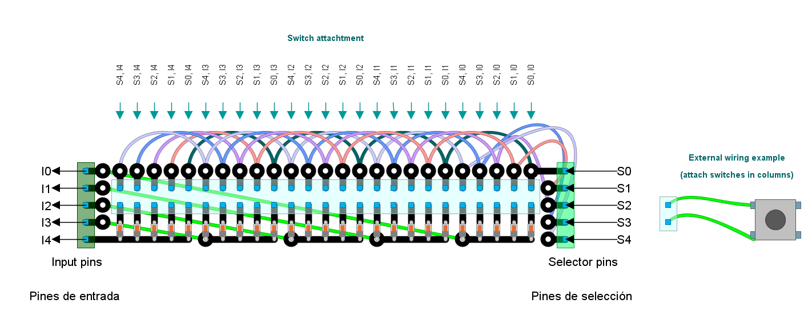
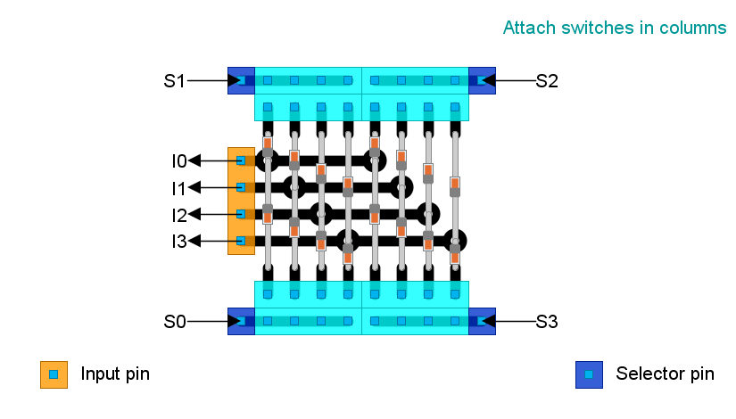

# Switches subsystem

## Purpose

To provide a number of **normally-open momentary switches** to the system, including (when required):

- Push buttons.
- Push levers and roller levers (suitable for shift paddles and clutch paddles).
- Built in push buttons of rotary encoders (both KY-040 and bare bone).
- Directional pads, directional joysticks and funky switches (except for rotation, which behaves like any other [rotary encoder](../RelativeRotaryEncoder/RelativeRotaryEncoder_en.md)).

And also **potentiometers** as digital clutch paddles, in case you are short of GPIO pins. If not, potentiometers as [analog clutch paddles](../AnalogClutchPaddles/AnalogClutchPaddles_en.md) are a better option.

There are several, non-exclusive, **implementation** choices:

- Button matrix
- Analog Multiplexers. This is the recommended way to go, since it requires less wiring, less free space, less available pins and less effort.
- Single switch (or button) attached to a single pin.

Take a look at the article on [input hardware](../../InputHW_en.md) for an introduction.

## Button Matrix implementation

### External wiring of inputs

Before going into design details, take note on how to wire (externally) all inputs to this subsystem:

- **Push buttons, push levers or roller levers**. They have two interchangeable terminals. If there are three terminals, choose the two terminals for the NO (normally open) switch.
  
  - One terminal wired to a selector pin header at the button matrix.
  - Other terminal wired to an input pin header at the button matrix.

- **Built in push button of rotary encoders**:
  
  - **Barebone**: They are wired to the button matrix as any other push button, being `SW` and `SW GND` the involved terminals.
  - **KY-040**. There are two options:
    - *Single pin*: wire `SW` to any input-capable GPIO.
    - *Wired to the button matrix*, using a satellite circuit (see below). Terminals are **not** interchangeable.

- **Directional pads (DPADs) and funky switches (except for rotation)**. Terminals are **not** interchangeable:
  
  - The common terminal must be wired to a single input pin header at the button matrix.
  - Each other terminal wired to a different selector pin header at the button matrix.

- **Potentiometers**: a satellite circuit is required (see below) for each potentiometer. Terminals are **not** interchangeable.

### Circuit designs for a button matrix

You should be able to extrapolate those designs to your needs.

#### Button Matrix (25 inputs)

Needed parts (not counting input hardware like push buttons):

- *Schottky diodes*: x25. Any kind should work but choose low forward voltage ( $V_F$ ). Suggested: [1N4148](https://www.alldatasheet.com/datasheet-pdf/pdf/15021/PHILIPS/1N4148.html) ( $V_F=0.6V$ ).
- *Dupond pin headers* (male or female):
  - 25x2 (=50) for external inputs.
  - 5x1 (=5) for input pins.
  - 5x1 (=5) for selector pins.
- Thin wire.

Open the [circuit design](./BtnMatrix25Inputs.diy) using [DIY Layout Creator](https://github.com/bancika/diy-layout-creator). Inputs are externally wired to the light-blue pin header in columns.



#### Button Matrix (16 inputs)

Needed parts (not counting input hardware like push buttons):

- *Schottky diodes*: x16. Same as above.
- *Dupond pin headers* (male or female): x40.

This [circuit design](./BtnMatrix16Inputs.diy) requires no wiring but takes more space:



#### Satellite circuit for potentiometers (at clutch paddles)

The purpose of this circuit is to transform two analog potentiometers into an "on/off" switch that can be wired to a button matrix. Another soldered potentiometer (called "trimmer") will calibrate the position where on/off switching happens. Please, **follow this calibration procedure in order to minimize battery drainage**:

1. Move the trimmer to an end where the switch is always on, no matter which position the clutch paddle is.
2. Move and hold the clutch paddle to the desired position where it should switch on/off.
3. Slowly move the trimmer towards the other end until switch happens, but no more. If switch does not happen, swap left and right terminals of the clutch's potentiometer, then start again.
4. Forget. No further adjustment is required.

Since clutch paddles come in pairs, the following [electrical circuit (falstad.com)](https://falstad.com/circuit/circuitjs.html?ctz=CQAgjCAMB0l3BWEBmAHAJmgdgGzoRmACzICcpkORICkNNdCApgLRhgBQYW1CR1dPNVR0IYeHRg5UqCAGEANgFcALgGMAFpwDuIEunA466GYdEcA5iBOoz102FIHJHXUPAmQ022E-oOALJeDp5YCAa+tsbQRFw8esgRRnqkOB4+4BKS0GA4yERZhZAGACoaAE5MAM4aAPYKACYcADI0-NYIaXzUyJACUCAAZgCGClVMKNDIUBwAHjRYpCAsZCBYkNMradTiIADKTApMaiq15QA6VQAOAJYAdpfDKpcARqqnD1UAtk-lN7NzGhUZboAxYUHLRx6TIgAAK90u4yOJzOlwaTEuCmGlx+Kj+AC80Riqi9ah9qhx8kNtA1yrUrucAI5ScDgbDEZDhWROWTwdCsLADMAxVAUSCpBDEPr8BDTcwNLzoahEWzuSLWam0+lMqRxXjtXKCJXWAqs8TwKDQdDg3pFCTURSqTT+VrdAZulgqoVDUbjSZyjgKt2GlJpdUGQY0ukM5nQHCBtrUVKh9IayNamO6hXudCQVXG8Oa6M6uOuPTA9VEZPqyCAzoQXq2HgN9jQ3YAeTxtUut0+SOOpwuVXRmOx31+N0Jw+JpPJVTr4OsTjWiSXSB2dAAgncyRomEP+yih73Hs8Se9ap9cX8AfN8EgwBhrFhBY-1zCAOIAOQAIoCTBEYDTEQ6BiLkbZ0CUfwWBY+6XCoFTVHUjQ9mSTB3CoNy1F8TAqPu-64B4gokK+vQQXCaF3GoNwAM84V2RKXEoXwvOUoyMcONzXMMdKAusES0CAsjTGAsrkSU3bnioHw4hOsyXPcVyqD29yAjgWBiDgSCoGJuS2BuICbgoKmfCO4wYWxDRjmZWKyXik4cbOl4UvMZD6Ug4TAfpMKOuoGg9sMDQNEcqF4RhWH0fhrk4GkOAQOEgrAgZsKUdRdG4XSHFHAAbtZxJMCxbEWEoTAcC8KCCUBXh5kJAhlSgVbgE+RiCvgAaues1icjQyAQOgaDkSlYVpfRmXTpiTC5RxBWscMxWlfMBQGKBSwJdYEIGb5mgBUFIXXJRmHYbh+HlUqSzkAwr6dbWQA) is suitable as long as both clutch's potentiometers **are identical**. It is designed for 10K-ohms linear potentiometers, but it will work with anything up to 50K-ohms.


Needed parts (not counting the potentiometer) for one clutch paddle:

- A "vertically operated" 100K-ohms trimmer linear potentiometer. Any impedance, higher than 3 times that of the clutch's potentiometer, should work. These are some examples of trimmer potentiometers: [https://www.bourns.com/docs/technical-documents/technical-library/trimmers/publications/trimpot_handout.pdf](https://www.bourns.com/docs/technical-documents/technical-library/trimmers/publications/trimpot_handout.pdf) 
  
- A *Schottky diode*: the same as for the button matrix.

Needed parts (not counting the potentiometers) for two clutch paddles:

- A "vertically operated" 100K-ohms trimmer linear potentiometer. Any impedance, higher than 3 times that of the clutch's potentiometer, should work.
- Four *Schottky diodes* : the same as for the button matrix.

Open this [circuit layout](./PotentiometerAsSwitch.diy) using [DIY Layout Creator](https://github.com/bancika/diy-layout-creator).


Note that, in case of need, a momentary switch can substitute the potentiometer using the two top pins (single clutch) or the two right-most pins (dual clutch) at the blue header.

This hack is an alternative to this circuit: [https://www.instructables.com/Super-simple-potentiometer-switch-hack/](https://www.instructables.com/Super-simple-potentiometer-switch-hack/)

#### Satellite circuit for a KY-040 (rotary encoder) built in push button

The purpose of this circuit is to avoid the expenditure of a single GPIO pin for a single rotary encoder. Such an input is connected to the button matrix instead. This is the [electrical circuit at falstad.com](https://falstad.com/circuit/circuitjs.html?ctz=CQAgjCAMB0l3BWcMBMcUHYMGZIA4UA2ATmIxAUgoqoQFMBaMMAKACdxiUQUUAWTtzB8BteJBYBnQT34zco8CAAubAK50WAc3mQBYLiGzZCUKCwBKM4QMxCRZqnyrZo2R1GgIWAdxm8BQls5FHYzAJAg2UUwcW0QBj48IxMEpKM8RQkAI3A+CGZTbBRk7BxzAA9wAxA8CGwEAUyQfWSLAHtlAEM2AE8AHUk6ADsAY3aAEzo2Qey1AEsAG2VB+eHZtWVlduGWKoxbBHcwYp4EU1aQAGUAdUGABzWWABk05LAShOYhT6oIADMuoshkY3OYALJfBz8KgMNDJGHhLx7BLYMDvNFfU4nAT6JBXOiLOijbYzSSPdaSLorSRzLY7QYAW2pbHmFRRDDRxHAlASdR57jxIAACmtBkMiST2mSRoNFl0mSz5gAvQZTWadHZ0SQc4rckpIBgYbglZJC0WU9VDYaqLoTBXWuUO5mqFVquga7bDbUclBkHhRJiQchEchCgCSw3umweYqpNOUAAsPbTNl7Fa72X5EgjnG8eHh3iiPgVIEVCH9INzLgAhToAZ8thMG4wm83+81GdulgzYnWp0vm7V8UNseZzPDzoQ4E9N+eMpkr8BYynCclnIS+oL9pFIxrw4hQ7jhsGwu7I-AwkGYfAwjHIsRAU0BamWI4nH2Ss-w4BYQA), which is a simple logic inverter, not counting the rectangle at the right side.


Needed parts (not counting the rotary encoder itself):

- Two 10K-ohms resistors. An higher impedance up to 100K-ohms should work.
- A bipolar junction transistor (x1), PNP type: any kind should work (for example: [BC640](https://www.onsemi.com/pdf/datasheet/bc640-d.pdf)). Pay attention to the pinout. It *may not match* the one shown here.

Open this [circuit layout](./LogicInverter.diy) using [DIY Layout Creator](https://github.com/bancika/diy-layout-creator).


Please, note that a bare bone rotary encoder is a better option since no satellite circuit is required.

## Analog multiplexer implementation

This implementation is based on the widely available [74HC4051N](https://pdf1.alldatasheet.com/datasheet-pdf/view/15612/PHILIPS/74HC4051N.html) analog multiplexer: an *8 to 1* multiplexer. If you want another kind of analog multiplexer (for example, a *16 to 1*), the firmware will work "as-is", but some changes may be needed in the circuit design. In any case, all switches must work in *negative logic*, so their common pole must be attached to `GND`. See below.

The following circuit design provides 24 inputs using 6 pins, which should be enough for most steering wheels. However, this design can be extended easily:

- Add another analog multiplexer.
- Wire `S0`, `S1` and `S2` (selector pins) to the same pin tags at another multiplexer.
- Add a new input pin wired to `(A)`.


Open this [circuit layout](./MultiplexedSwitchesX24.diy) using [DIY Layout Creator](https://github.com/bancika/diy-layout-creator).

Needed parts (not counting input hardware like push buttons):

- Standard-sized perfboard 28x6 holes.
- 74HC4051N analog multiplexer: x3.
- Dupond pin headers (male or female): x42.
- Thin wire.

### External wiring for the analog multiplexers

- There are many redundant `3V3` and `GND` pin headers. Attach one of each to the power source. Use the others as you wish or leave unattached.
- Use at least one of the `GND` pin headers as a common pole for all switches *in a chain* (as shown in the picture above).
- Wire the other terminal of each push button (or switch) to one of the light-blue pins.
- Bare bone rotary encoders: their built-in push button must be wired like any other push button, being `SW` and `SW GND` the involved terminals.
- KY-040 rotary encoders: wire `SW` to any light-blue pin.
- Potentiometers as digital clutch paddles: build this [satellite circuit](https://falstad.com/circuit/circuitjs.html?ctz=CQAgjCAMB0l3BWEBmAHAJmgdgGzoRmACzICcpkORICkNNdCApgLRhgBQA5jeqiOkj8EfAUToSOAJRq4QRYXIlR5dZNGQqJ0BBwCy81HVI4UkaiZWZdBnFnQhLqBY9N1rHMFmp5qLuw5gonRg8NoI5GFR8BAAwgA2AK4ALgDGABacAO68-C4Ici6QHDm+hrKmRZ7eueUKIUTUIWFQ0HzoDgkpGejV1CL8gvxlxNQQofCtyOhgRtFRmgAq6QBOTADO6QD28QAmJSAjjRXgx8U5BaajtdfFAB4gWLTgXiCoCJpBdGN0i1sAOut4gBLLjpZKAgBGSSYgIADsCAHaA9JMACGuyYKw4D3QpCwLwJ4hCgnk4F+AKBoPBUJh8KRKPRmOxDwQYFM6CoNDQAjsZNCIAA4gA5AAiOJoBAEeMO+IE035vxWoK4WMByVWG22e3hW2STERyWBWwAtkx9SzDshNDhSI8pfZFSAuml0vCMbt4rD1nC9QajabzViJWQCRFeA48E6XRl3btPd7ffrDcazRaOEA) which is quite simillar to that of the button matrix. All three potentiometers must have the same impedance. The higher, the better. The trigger threshold potentiometer is a trimmer one. Note that this satellite circuit will drain current at all times.

  

## Single switch attached to a single pin

There is no circuit involved here, just wiring. Attach one terminal to an input-capable GPIO pin. Attach the other terminal to `GND`. An internal pull-up resistor is required since we are using negative logic. If not available, add an external pull-up resistor.

This implementation is best suited for the built-in push button of a *KY-040* rotary encoder. Just wire `SW` to the input-capable GPIO pin.

## Firmware customization

Customization takes place at the body of `simWheelSetup()` inside [CustomSetup.ino](../../../../src/Firmware/CustomSetup/CustomSetup.ino).

### Button matrix

Input pins must be wired to valid input-capable GPIO pins with internal pull-down resistors.  Otherwise, external pull-down resistors must be added to the circuit design. Selector pins must be wired to valid output-capable GPIO pins.

1. Create a constant static array for all the selector's GPIO numbers, let's say `mtxSelectors`.
2. Create another constant static array for all the input's GPIO numbers, let's say `mtxInputs`.
3. Create another constant static array for the assigned input numbers, let's say `mtxNumbers`. All of them in the range from 0 to 63.
4. Call `inputs::addButtonMatrix()`. 
   - First parameter is `mtxSelectors`.
   - Second parameter is the count of GPIOs in `mtxSelectors`.
   - Third parameter is `mtxInputs`.
   - Fourth parameter is the count of GPIOs in `mtxInputs`.
   - Fifth parameter is `mtxNumbers`. The count of items in this array must match the product of the second and fourth parameters.

For example:

```c
void simWheelSetup()
{
    static const gpio_num_t mtxSelectors[] = {GPIO_NUM_24,GPIO_NUM_33,GPIO_NUM_32};
    static const gpio_num_t mtxInputs[] = {GPIO_NUM_15, GPIO_NUM_2, GPIO_NUM_19};
    static const inputNumber_t mtxNumbers[] = {0,1,2,3,4,5,6,20,21};
    ...
    inputs::addButtonMatrix(
      mtxSelectors,
      sizeof(mtxSelectors)/sizeof(mtxSelectors[0]),
      mtxInputs,
      sizeof(mtxInputs)/sizeof(mtxInputs[0]),
      mtxNumbers
      );
    ...
}
```

### Analog multiplexers

Input pins must be wired to valid input-capable GPIO pins with internal pull-up resistors.  Otherwise, external pull-up resistors must be added to the circuit design. Selector pins must be wired to valid output-capable GPIO pins.

Place a call to `inputs::addAnalogMultiplexer()`. Parameters are just the same as shown for `inputs::addButtonMatrix()`. However, the count of items in `mtxNumbers` (fifth parameter) must match $2^{SecondParameter}*{FourthParameter}$.

For example:

```c
void simWheelSetup()
{
    static const gpio_num_t mtxSelectors[] = {GPIO_NUM_24,GPIO_NUM_33};
    static const gpio_num_t mtxInputs[] = {GPIO_NUM_15, GPIO_NUM_2 };
    static const inputNumber_t mtxNumbers[] = {0,1,2,3,4,5,6,7};
    ...
    inputs::addAnalogMultiplexer(
      mtxSelectors,
      sizeof(mtxSelectors)/sizeof(mtxSelectors[0]),
      mtxInputs,
      sizeof(mtxInputs)/sizeof(mtxInputs[0]),
      mtxNumbers
      );
    ...
}
```

### Single switch

Place a call to `inputs::addDigital()`:

- First parameter is the GPIO where the switch is attached to.
- Second parameter: assigned input number for this button.
- Third parameter: always set to `true`.
- Fourth parameter: always set to `true`.

For example:

```c
void simWheelSetup() 
{
   ...
   inputs::addDigital(GPIO_NUM_26, 1, true, true);
   ...
}
```
