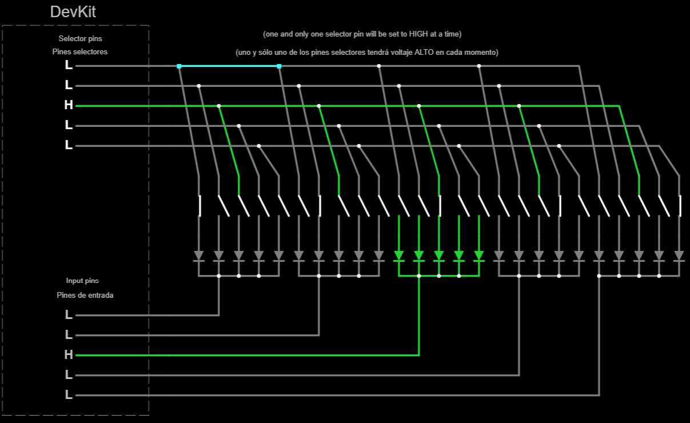
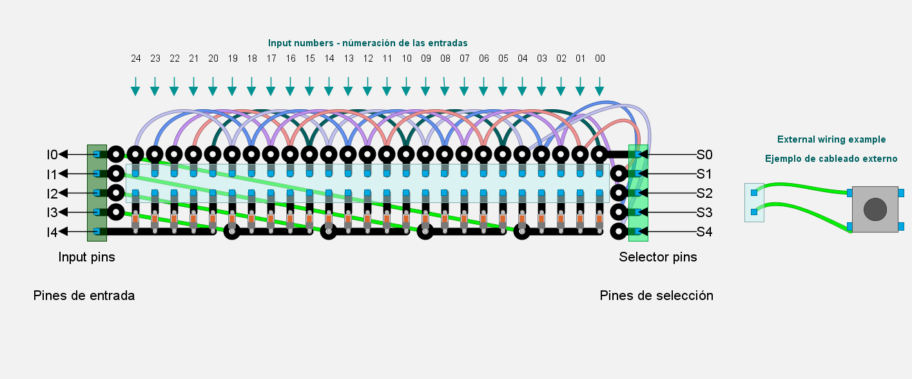
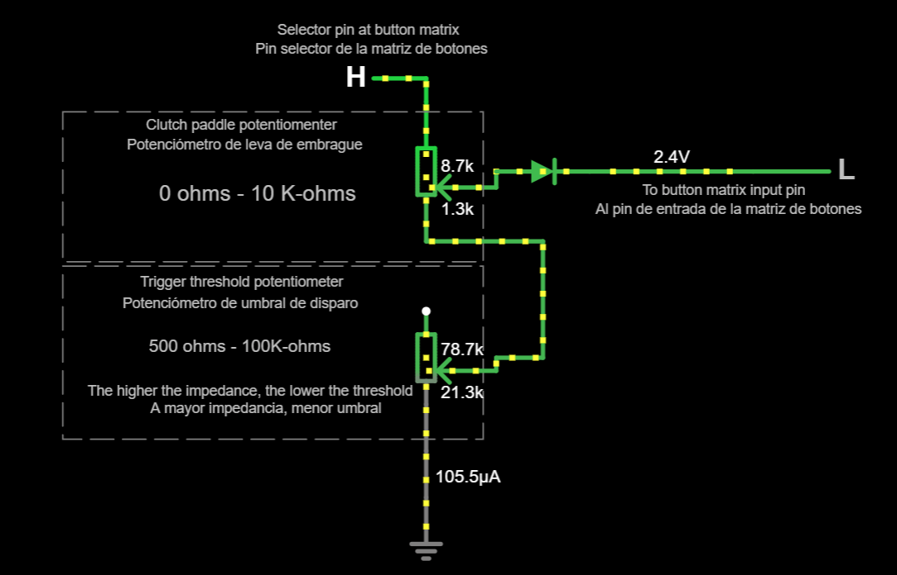
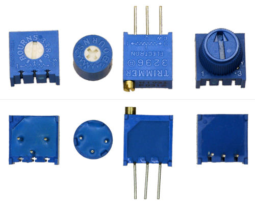
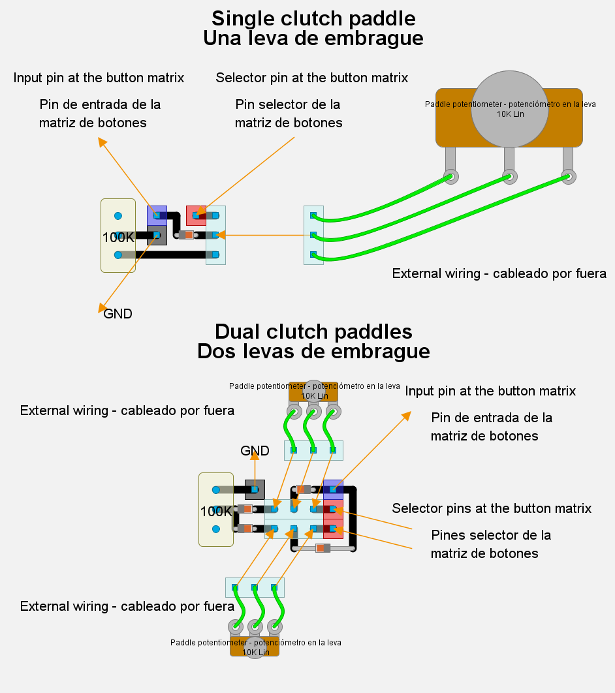
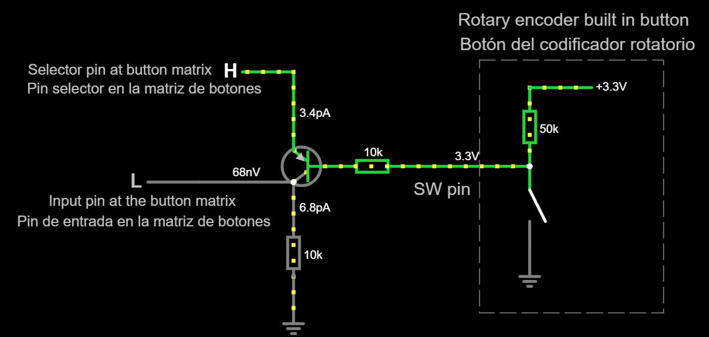
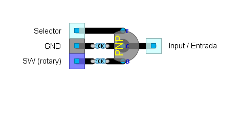

# Subsistema de interruptores

## Objetivo

Proporcionar una cantidad de **interruptores momentáneos normalmente abiertos** al sistema, incluidos (cuando sea necesario):

- Botones pulsadores.
- Palancas de empuje e interruptores de fin de carrera (adecuadas para levas de cambio y levas de embrague).
- Botones integrados de codificadores rotatorios (tanto KY-040 como desnudos).
- Pads direccionales, joysticks direccionales e interruptores funky (excepto la rotación, que se comporta como cualquier otro [codificador rotatorio](../RelativeRotaryEncoder/RelativeRotaryEncoder_es.md)).

Y también **potenciómetros** para algunos tipos de levas de embrague.

Este subsistema se basa en una _matriz de botones_. Eche un vistazo al artículo sobre [hardware de entrada](../../InputHW_es.md) para obtener una explicación. Es altamente personalizable y depende de la disponibilidad de suficientes pines GPIO en la placa DevKit.

## Cableado externo de entradas

Antes de entrar en detalles de diseño, tome nota de cómo cablear (externamente) todas las entradas a este subsistema:

- **Pulsadores, palancas de empuje o interruptores de fin de carrera**. Tienen dos terminales intercambiables. Si hay tres terminales, elija los dos terminales para el interruptor NO (normalmente abierto).
  
  - Un terminal conectado al pin selector en la matriz de botones.
  - Otro terminal conectado al pin de entrada en la matriz de botones.

- **Botón incorporado de codificadores rotatorios**:
  
  - **Desnudos**: Se cablean a la matriz de botones como cualquier otro pulsador, siendo `SW` y `SW GND` los terminales involucrados.
  - **KY-040**. Hay dos opciones:
    - _Pin único_: conecte `SW` a cualquier GPIO con capacidad de entrada.
    - _Conectado a la matriz de botones_, mediante un circuito satelital (ver abajo). Los terminales **no** son intercambiables.

- **Pads direccionales (DPAD) e interruptores funky (excepto para rotación)**. Los terminales **no** son intercambiables:
  
  - El terminal común debe conectarse a un único pin de entrada en la matriz de botones.
  - Cada terminal debe conectarse a un pin selector diferente en la matriz de botones.

- **Potenciómetros**: se requiere un circuito satélital (ver más abajo) para cada potenciómetro. Los terminales **no** son intercambiables.

## Diseño de circuito

Debería poder extrapolar esos diseños a sus necesidades.

### Matriz de botones (25 botones)

Esta es una matriz de botones con 5 pines selectores y 5 pines de entrada, lo que da 25 botones, suficiente para la mayoría de las configuraciones:



[Pruebe este circuito en falstad.com](https://falstad.com/circuit/circuitjs.html?ctz=CQAgjCAMB0l3BWcMBMcUHYMGZIA4UA2ATmIxAUgoqoQFMBaMMAKABkQUAWKvX-qIIBmAQwA2AZzohs0bFBYBZTjxBc+IDeqpUU0BEpW0wKTcdO79h7rS5czFO4L0GAHiEL3VYbPK5-wUwBlOjE6AGMAFwB7ACcAHQkABwBLADsJFncEe0IIMC5TTzVAkAAFdLoJRKkwqLiqrJAMQjUUPECO-wh7ExAASTSkgFdIxNSMpry1BFMwBB6EJF7TCrSqxIATOkS6NMjYkU2Ra1UEFodz1ssDZRsPfAdCR5uWCU48DpQEVvaO7FmgiookkdDeMjQnB+EKoAIs4BAIKk4LhUNaqNRVAgSLB72weHs33RBJkgKxiPEyPeC1MRIofUxCJx4O0aLUGkZwMpuLU6jZdn+ZKZ3JZYF+0K4YtJ8OxIvehAwtOhCtMnIpoPBGEghOhWvsjNlGveOHFrRN0sEhqpzUIX11tot5OZ8tUdM8sKFVp5zztrR9juFRooFzpVwDXvBOR1rSj4fV1rAkGhdMT0LVzpAxHabKzgpl8Z5xGeOeLBoL4NIStalbjGcT3DZ9f1nvL7zwRbZ7fRLYzeGKdL7zfhXKDeGwVc049rcrMumhfA9+eZmw+edXailpm2omGYkiLBX48XMI3vxA25Eu-3h8BGMBkrPF6vB5kJIxJIfnHPdB3e5fn9RT9Py3H9Lz-FcBQtSDgO-X9r3ZY9WRgp9wPpVVARpU8vxQ+DY1RWNkNA58VzDfCLkIuCX39VF-QosD4PdC1GLo4iPEVJj2JY1C9QtHiuPg81UXNfiXxaNcxKwkDKJXBcLVkkSZKnVEx1MBTNGKZTijUrs5I7NTcwtAz9NLQEiyofSs0Myy1KbC1bJspNuzmRzJNg+iWAAd07XRPjZSBPPXADIU-fyvKPLDAKlUKoKlfEvCigK4qwoCEq86CpSQ1KEKwzCQoC3KpQIrKipjcistoqVmPK1RPxVLDorqz8+Ky5qzWwVo8q8iTP3krLetaFT6oCwaeq0vqxoGvSsqMqUzKGry5s-GtOszaypXsrKNtaVMOoSgAjThHkYhgiHAJB-OyXRAnkZYoRAAAROgADcAGkUn3Ly-nABlITpaKkrQLpN2hf7IQKIc-MSwEwAuAGQfyvoYZjJw-oC1lwbQyGvNjQHg1NBQ0r5ZhVI0VG0qlLQ+TJti5guHjqcYjG6up+nHnNBnHmJjxXXh7GLg0f1qcGpH1OjAnZ3AJxBqF-tHh0lmHS52SWfahwJOpmsRdsjXiwxmtqe1zmXI17MubmoWOw0AzqfuUn5x0AKB3MimHfJgbaH5128bV1WNGi80NB0v3He8Povq56Lw76SCI7Rom+n9WOvMTvoJKTm0OjN02+kj7wnHCjHQaxJx0acaLS9yPP7AaquJcL4a4El+w5vrz7vFh6GLn+zuY0RruEdpv12JFhrh-5qcR+GieLk1-u290R4AZeRKSVxnHl+xlG2e1Q6On9nfccHXfxaP3HDb3xLgti4Lg7Cm-dBq2-sqAjRMPL1+w7OHOAqqv0zjLkOthK5AJPo3Hqjcwy5w9u7aB4t7j+gMv6aKiDHgzWuOwIw31TAaAjsIbkMg5AKA4PcDGOCy6BikAQ+Q-liHt3duALueDQRUKIZgw+C895MMobIahTRsDEAgL4ZokByCqxWCAAAFNEdYiQRBpE2IkaRYgACeiiZESFqBEGICRkjpESB5FIYgxCJD2jsDRdAxgSBiIkAAEv0AA4jY2RliRCJEiCkAAtnQAAlHwrg5BCCmBaH6W6fQJHDDSNERIqiNEAGexBRIkBExJ2xEgJOqLo9YGTNH1FiBsKxexNixAAIeJCetEPcIgABWZiACCbAAAqAB5XYaREjhCOK4iQHjoheP2NEXxQA)

Piezas necesarias (sin contar el hardware de entrada como los botones pulsadores):

- *Diodos Schottky*: x25. Cualquier tipo debería funcionar, pero elija un voltaje directo bajo ($V_F$). Sugerido: [1N4148](https://www.alldatasheet.com/datasheet-pdf/pdf/15021/PHILIPS/1N4148.html) ($V_F=0.6V$).
- *Cabezales de pines Dupond* (macho o hembra):
  - 25x2 (=50) para entradas externas
  - 5x1 (=5) para pines de entrada
  - 5x1 (=5) para pines selectores
- Cable fino

Abra el [diseño de circuito](./BtnMatrix25Inputs.diy) usando [DIY Layout Creator](https://github.com/bancika/diy-layout-creator). Las entradas están cableadas externamente al cabezal de pines azul claro en columnas.



### Circuito satelital para potenciómetros (en levas de embrague)

El propósito de este circuito es transformar un potenciómetro analógico en un interruptor de "encendido/apagado". Otro potenciómetro soldado (llamado "trimmer") calibrará la posición donde ocurre el encendido/apagado. Por favor, **siga este procedimiento de calibración para minimizar el drenaje de la batería**:

1. Mueva el tornillo del trimmer a un extremo donde el interruptor esté siempre encendido, sin importar en qué posición esté la leva del embrague.
2. Mueva y sostenga la leva del embrague a la posición deseada donde debe encenderse/apagarse.
3. Mueva lentamente el tornillo del trimmer hacia el otro extremo hasta que se produzca el cambio, pero no más. Si el cambio no sucede, intercambie los terminales izquierdo y derecho del potenciómetro del embrague y luego comience de nuevo.
4. Olvídese. No se requiere ningún ajuste adicional.

Est ees el [circuito eléctrico en falstad.com](https://falstad.com/circuit/circuitjs.html?ctz=CQAgjCAMB0l3BWEBmAHAJmgdgGzoRmACzICcpkORICkNNdCApgLRhgBQYW1x1y6cKUHsR4eHRipc6CXLgQAwgBsArgBcAxgAsOAd3BFq6LCKMpIvDgHND-S3ZTIcUKPpD4XqOs9QhvHhwAsig4fgEkggF0mEQcAB4ewiCkLkSQyCmkILx0ACoA9gA6AM4ARhrqBQB2pQC2AIbqAE4AlvGlrdUADhql3V0JHjh0YJDZRiJggrkgAILK-V2lACZMpUzVLQ0rDavrJcp7JY0trQBe+6VlBVXVTCVDLAgiCNnS4Hg54iB5bdbWJjNUrqbTNB7aArKFb9W6bdStAp1JjqIFPKjgHgpLCYnGzAAKcOqmlaAGfkS1iiU1qVVHUys0GotqQcVq0St0Gs0Ck8yOI6KlxJleEhIKUCto6iVSixSmNSgBpFgSqUcMogNiQJDEbWoTLoDGQJ6oPzodB+FgfdDICCzIpGxKW03IXgujzIPE-PLaA7aVrWH3Akqgg6tOrdJi7YlMAA0IJ9pWUBT0QPjB1B4JKkOhTyISHQRBc7H1RAmPzm9QaAE8CkGwxGoySGnGTpta7T6YzlGqNWMkHywHrDIIHRqiH4EBAMDRqLMVBodP0ditlAdukSEUj4WjHTgIDhtXAQGFvmMQITUcSyRTuVdDkwAG7HGklJidhrWVRMLhYviYovJAWoz8vAUDYKQOLepm2YrO4f7TKaBbgOabgGGavAoehHiQH4RpoUhsh+GAgE4ahjgCI4YAuHhjhAbRphuI6hbYdQWCmpAnrTAwYolCq0olLKJRjJASp8RwAAylEuIKVGuBAABmTKvig0CZKORCCGwvA4C4bC2j8ADKTCrpoVRBgMtQlE01yVDUlZnPEQwmL24CoPmp50PiywlK+JlmXeRz2W0lwstctw1A8HBuvJegrNy3RFAAjjARbgNgxDIC8qDEeawmQOgrA4qM0DjhQ4wHsQlhGAgangBwKxCFEMQIF4MQgDFcUFAlyXQDgHBAA) para una sola leva de embrague. Está diseñado para potenciómetros lineales de 10K-ohms, pero funcionará con cualquier cosa hasta 50K-ohms.



Dado que las levas de embrague van por parejas, el siguiente [circuito eléctrico (falstad.com)](https://falstad.com/circuit/circuitjs.html?ctz=CQAgjCAMB0l3BWEBmAHAJmgdgGzoRmACzICcpkORICkNNdCApgLRhgBQYW1CR1dPNVR0IYeHRg5UqCAGEANgFcALgGMAFpwDuIEunA466GYdEcA5iBOoz102FIHJHXUPAmQ022E-oOALJeDp5YCAa+tsbQRFw8esgRRnqkOB4+4BKS0GA4yERZhZAGACoaAE5MAM4aAPYKACYcADI0-NYIaXzUyJACUCAAZgCGClVMKNDIUBwAHjRYpCAsZCBYkNMradTiIADKTApMaiq15QA6VQAOAJYAdpfDKpcARqqnD1UAtk-lN7NzGhUZboAxYUHLRx6TIgAAK90u4yOJzOlwaTEuCmGlx+Kj+AC80Riqi9ah9qhx8kNtA1yrUrucAI5ScDgbDEZDhWROWTwdCsLADMAxVAUSCpBDEPr8BDTcwNLzoahEWzuSLWam0+lMqRxXjtXKCJXWAqs8TwKDQdDg3pFCTURSqTT+VrdAZulgqoVDUbjSZyjgKt2GlJpdUGQY0ukM5nQHCBtrUVKh9IayNamO6hXudCQVXG8Oa6M6uOuPTA9VEZPqyCAzoQXq2HgN9jQ3YAeTxtUut0+SOOpwuVXRmOx31+N0Jw+JpPJVTr4OsTjWiSXSB2dAAgncyRomEP+yih73Hs8Se9ap9cX8AfN8EgwBhrFhBY-1zCAOIAOQAIoCTBEYDTEQ6BiLkbZ0CUfwWBY+6XCoFTVHUjQ9mSTB3CoNy1F8TAqPu-64B4gokK+vQQXCaF3GoNwAM84V2RKXEoXwvOUoyMcONzXMMdKAusES0CAsjTGAsrkSU3bnioHw4hOsyXPcVyqD29yAjgWBiDgSCoGJuS2BuICbgoKmfCO4wYWxDRjmZWKyXik4cbOl4UvMZD6Ug4TAfpMKOuoGg9sMDQNEcqF4RhWH0fhrk4GkOAQOEgrAgZsKUdRdG4XSHFHAAbtZxJMCxbEWEoTAcC8KCCUBXh5kJAhlSgVbgE+RiCvgAaues1icjQyAQOgaDkSlYVpfRmXTpiTC5RxBWscMxWlfMBQGKBSwJdYEIGb5mgBUFIXXJRmHYbh+HlUqSzkAwr6dbWQA) es otra alternativa siempre que ambos potenciómetros de embrague **sean idénticos**.


Piezas necesarias (sin contar el potenciómetro) para una paleta de embrague:

- Un potenciómetro trimmer lineal de 100K-ohms "operado verticalmente". Cualquier impedancia superior a 3 veces la del potenciómetro del embrague debería funcionar. Estos son algunos ejemplos de potenciómetros de ajuste: [https://www.bourns.com/docs/technical-documents/technical-library/trimmers/publications/trimpot_handout.pdf](https://www.bourns.com/docs/technical-documents/technical-library/trimmers/publications/trimpot_handout.pdf)
 
- Un *diodo Schottky*: lo mismo que para la matriz de botones.

Piezas necesarias (sin contar los potenciómetros) para dos paletas de embrague:

- Un potenciómetro trimmer lineal de 100K-ohms "operado verticalmente". Cualquier impedancia superior a 3 veces la del potenciómetro del embrague debería funcionar.
- Cuatro *diodos Schottky*: los mismos que para la matriz de botones.

Abra este [diseño de circuito](./PotentiometerAsSwitch.diy) usando [DIY Layout Creator](https://github.com/bancika/diy-layout-creator).



Tenga en cuenta que, en caso de necesidad, un interruptor momentáneo puede sustituir el potenciómetro usando los dos pines superiores (embrague simple) o los dos pines más a la derecha (dos embragues) en el cabezal azul.

Este truco es una alternativa a este circuito: [https://www.instructables.com/Super-simple-potentiometer-switch-hack/](https://www.instructables.com/Super-simple-potentiometer-switch-hack/)

### Circuito satelital para un pulsador integrado KY-040 (codificador rotatorio)

El propósito de este circuito es evitar el gasto de un solo pin GPIO para un solo codificador rotatorio. En su lugar, dicha entrada está conectada a la matriz de botones.

Este es el  [circuito eléctrico en falstad.com](https://falstad.com/circuit/circuitjs.html?ctz=CQAgjCAMB0l3BWcMBMcUHYMGZIA4UA2ATmIxAUgoqoQFMBaMMAKACdxiUQUUAWTtzB8BteJBYBnQT34zco8CAAubAK50WAc3mQBYLiGzZCUKCwBKM4QMxCRZqnyrZo2R1GgIWAdxm8BQls5FHYzAJAg2UUwcW0QBj48IxMEpKM8RQkAI3A+CGZTbBRk7BxzAA9wAxA8CGwEAUyQfWSLAHtlAEM2AE8AHUk6ADsAY3aAEzo2Qey1AEsAG2VB+eHZtWVlduGWKoxbBHcwYp4EU1aQAGUAdUGABzWWABk05LAShOYhT6oIADMuoshkY3OYALJfBz8KgMNDJGHhLx7BLYMDvNFfU4nAT6JBXOiLOijbYzSSPdaSLorSRzLY7QYAW2pbHmFRRDDRxHAlASdR57jxIAACmtBkMiST2mSRoNFl0mSz5gAvQZTWadHZ0SQc4rckpIBgYbglZJC0WU9VDYaqLoTBXWuUO5mqFVquga7bDbUclBkHhRJiQchEchCgCSw3umweYqpNOUAAsPbTNl7Fa72X5EgjnG8eHh3iiPgVIEVCH9INzLgAhToAZ8thMG4wm83+81GdulgzYnWp0vm7V8UNseZzPDzoQ4E9N+eMpkr8BYynCclnIS+oL9pFIxrw4hQ7jhsGwu7I-AwkGYfAwjHIsRAU0BamWI4nH2Ss-w4BYQA), que constituye un simple inversor lógico, sin contar el rectángulo del lado derecho.



Piezas necesarias (sin contar el propio codificador rotatorio):

- Dos resistencias de 10K-ohmios. Debería funcionar una impedancia más alta de hasta 100K-ohmios.
- Un transistor de unión bipolar (x1), tipo PNP: cualquiera debería funcionar (por ejemplo: [BC640](https://www.onsemi.com/pdf/datasheet/bc640-d.pdf)). Preste atención al patillaje. *Puede no coincidir* con el que se muestra aquí.

Abra este [diseño de circuito](./LogicInverter.diy) usando [DIY Layout Creator](https://github.com/bancika/diy-layout-creator).




## Personalización del firmware

### Matriz de botones

La personalización se realiza en el archivo [CustomSetup.ino](../../../../src/Firmware/CustomSetup/CustomSetup.ino).
Los pines de entrada deben conectarse a pines GPIO con capacidad de entrada válidos con resistencias pull-down internas. De lo contrario, se deben agregar resistencias pull-down externas al diseño del circuito. Los pines del selector deben conectarse a pines GPIO válidos con capacidad de salida.

1. Abra el archivo **"CustomSetup.ino"** en el editor y edite el cuerpo de `simWheelSetup()`
2. Cree una matriz estática constante para todos los números GPIO del selector, digamos `mtxSelectors`.
3. Cree otra matriz estática constante para todos los números GPIO de entrada, digamos `mtxInputs`.
4. Llame  a `inputs::setButtonMatrix()`.
   - El primer parámetro es `mtxSelectors`.
   - El segundo parámetro es el recuento de GPIO en `mtxSelectors`.
   - El tercer parámetro es `mtxInputs`.
   - El cuarto parámetro es el recuento de GPIO en `mtxInputs`.

Por ejemplo:

```c
void simWheelSetup()
{
    static const gpio_num_t mtxSelectors[] = {GPIO_NUM_24,GPIO_NUM_33,GPIO_NUM_32,GPIO_NUM_26, GPIO_NUM_27};
    static const gpio_num_t mtxInputs[] = {GPIO_NUM_15, GPIO_NUM_2, GPIO_NUM_19, GPIO_NUM_3, GPIO_NUM_23};
    ...
    int btnMtxFirstButtonNumber = inputs::setButtonMatrix(mtxSelectors,5,mtxInputs,5);
    ...
}
```

### Pulsador incorporado de un codificador rotatorio _KY-040_ conectado a un solo pin GPIO (**exclusivamente**)

Cuando no esté conectado a la matriz de botones a través del circuito satelital, haga una llamada a `inputs::addDigital()`:

- El primer parámetro es el GPIO al que se conecta `SW`.
- Segundo parámetro: siempre establecido en `true`.
- Tercer parámetro: siempre establecido en `true`.

Por ejemplo:

```c
void simWheelSetup() 
{
   ...
   inputs::addDigital(GPIO_NUM_26,true,true);
   ...
}
```

El pin GPIO elegido no necesita una resistencia de pull-up interna.