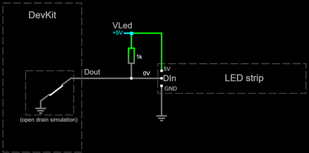

# RGB LED Strips

This project supports RGB LED strips for telemetry display.
You can have multiple "gauges" in the same strip,
which are called **segments** here.
For example, let's say you have an LED strip consisting of 10 pixels.
You could have three segments in this strip:

- A "Rev Lights" segment: pixels 1 to 8.
- A flags light segment: pixel 9.
- Another flags light segment: pixel 10.

The full LED strip also indicates some events:
power on, BLE discovery, host connection and low battery.
"Rev lights" segments show changes in bite point calibration.

The recommended display rate is 50 frames per second.

## Hardware design

These LED strips are controlled by a single output-capable pin labelled `Dout` in this project.
Some LED strips can work with 3.3V logic, others cannot.
If your LED strip does not work with 3.3V logic,
you will need a small "level shifter" circuit, which is described below.

- **No level shifter (3.3V logic)**

  Simply wire `Dout` to `Din` in the first pixel.

  

- **Level shifter (5V logic)**

  `Dout` requires a minimum voltage of 3.5 volts.
  The ESP32 operates at 3.3 volts, which is insufficient.
  To overcome this limitation, a "level shifter" circuit is required.
  We are using the most simple level shifter available:
  a pull resistor attached to a GPIO pin in *open drain* mode (`Dout`).

  

  [Test this circuit at falstad.com](https://falstad.com/circuit/circuitjs.html?ctz=CQAgjCAMB0l3BWcMBMcUHYMGZIA4UA2ATmIxAUgoqoQFMBaMMAKACcQG8rvPenCUZHBYAPTmF4YUEgCzkMSWeEEARAPYBXAC4sA7hMEDDIQssgsASnyrGmYGcapVZtIc+gIxEtJyKcMPD9sEGVJEAA1ABk6ABNvJhC8QTAkPGJQ8CDVAEkAOxYAI05sBEd+SSQUbHILYoYUZVkMlGIqZhkLcQbiIIZZPsbbWSUQX1U6ADcAaQBLXXFmIOSxuBB0zN8ogFFVAB0AZwPtNlmAB30TYiMwFJQgiwBzEwc+25VnKASHU2UZQnIYRkCAi33akBSKUgGSBIAA4gA5VSXYz8Xi8FAoio3HFfAxcHi2NDLZwJbDvMDSCTEMKKTI-AAU6jOdDyh1ibAAhrM2UdZgBbTQAG052lm6jyAEoWAc-Ph1kSqa93CATpo6Cxng0lfc-ErZOYvvVcMozHKZKkHiwgA)

  Needed parts:

  - 1K-ohms resistor (x1)

## Firmware customization

The involved class is `LEDStripTelemetry`. Constructor parameters are:

- 1st: GPIO pin number (or alias) for `Dout`.
- 2nd: The total number of pixels available in the LED strip.
- 3rd:
  - `false` if your LED strip works in 3.3V logic.
  - `true` if your LED strip works in 5V logic
    (so the "level shifter" is in place).
- 4th (optional): Pixel driver. The firmware supports several pixel drivers:
  - Pass `WS2812` (default) for
    [WS2812](https://www.alldatasheet.com/datasheet-pdf/pdf/1134521/WORLDSEMI/WS2812.html) and
    [WS2812B](https://www.alldatasheet.com/datasheet-pdf/pdf/1179113/WORLDSEMI/WS2812B.html)
    drivers.
  - Pass `WS2811` for
    [WS2811](https://www.alldatasheet.com/datasheet-pdf/pdf/1132633/WORLDSEMI/WS2811.html)
    drivers.
- 5th (optional): Pixel data format (byte order):
  - Pass `AUTO` (default) to use the expected pixel format for the given pixel driver.
  - If your LED strip uses another pixel format, use another constant from the
    [pixel_format_t](../../../../src/include/LedStrip.h) enumeration,
    describing the red, green and blue byte order.

For example:

```c++
auto ui = new LEDStripTelemetry(GPIO_NUM_13, 10, true, WS2812, BGR);
```

Create each *segment* as described below,
passing the `LEDStripTelemetry` instance as the first argument.
Other arguments depend on the *segment*.

For example:

```c++
new RevLightsLEDSegment(ui,0,8);
new FlagsLightLEDSegment(ui,8);
new FlagsLightLEDSegment(ui,9);
```

Finally, pass the `LEDStripTelemetry` instance to notify::begin().

**Take into account**:

- All instances must be created with `new`.
  Don't delete.
- Pixels are indexed starting from zero.
- Don't overlap *segments*.
  Use different pixels for each *segment*.

### "Rev lights"

The `RevLightsLEDSegment` class shows an RPM bar.
The colour depends on the maximum torque and power.
It will flash at the rev limiter.

Constructor parameters are:

- 1st: `LEDStripTelemetry` instance.
- 2nd: index of the first pixel.
- 3rd: number of consecutive pixels in this segment.
- 4th (optional): main bar color (RGB).
  Default is green.
- 5th (optional): bar color when maximum torque has been reached (RGB).
  Default is yellow.
- 6th (optional): bar color when maximum power has been reached (RGB).
  Default is red.
- 7th (optional): bar color to notify current bite point (RGB).
  Pass zero to disable. Default is white.
