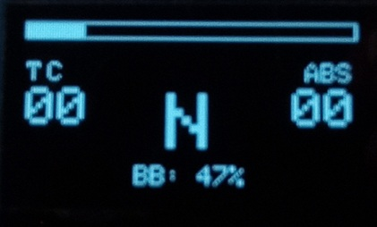

# OLED telemetry display

This telemetry display consist of an OLED with 128x64 pixels.
Stick to this resolution,
as the firmware can not adapt the display to arbitrary resolutions.

It will show the following information thanks to SimHub:

- RPM bar.
- Current gear.
- Low fuel alert.
- TC and ABS engagement alerts.
- Current TC and ABS settings.
- Current brake bias (BB).



## Requirements

- Install the
  [Adafruit GFX library](https://docs.arduino.cc/libraries/adafruit-gfx-library/)
  in Arduino IDE.

- Add `SimWheelUI_gfx.cpp` (**case-sensitive**)
  to the "includes.txt" file in your sketch folder.
  Run the [source code setup procedure](../../../firmware/sourcesSetup_en.md)
  again.

This is mandatory.

## Limitations

OLED telemetry display is CPU and memory intensive.
It **may perform poorly** for what a sim racer expects.
**Be warned**.

If you have GPIO expanders (for switches) in the primary I2c bus,
place your OLED screen in the secondary I2C bus to avoid performance problems.

## Hardware

There are plenty of cheap monochrome OLEDs in the market.
They all look the same, **but they are not**.
Each manufacturer may use a different display controller and significantly
different internal wirings.
The firmware should support all of them,
but requires customization on your part (see below).

Please note that it is impossible to test every screen on the market.
Therefore, consider this feature as untested
and without technical support.

The firmware should work with **SSD1306**, **SH1106** and **SH1107**
display controllers. *SSD1306* was tested.

> [!NOTE]
> Many 128x64 screens use a 132x64 display controller.

## Firmware customization

1. Hardware setup.

   Create and `OLEDParameters` variable to match your actual display controller
   (defined in
   [OutputHardware.hpp](../../../../src/include/OutputHardware.hpp)).
   The most relevant fields are:
   - `flip_horizontal` and `flip_vertical` to match the physical orientation
     of the screen.
   - `start_col`: set to `1` if your display controller is 132x64.
   - `display_offset`: physical row where the first logical row should be
     displayed. Some screens are wired in a such a way that the top row
     is not the first row. Do some trial and error.
   - `COMpins`. This reflects how the controller pins are attached
     to the OLED panel. There are only four valid values because only
     the 4th and 5th bits are taken into account.
   - `oscillator_frequency`. Check the datasheet for information.

   All `OLEDParameters` variables are initialized with default values
   that may work for you.

2. The involved class is `OledTelemetry128x64`.
   The constructor parameters are (from left to right):

   - The `OLEDParameters` variable you declared before.
   - Full I2C address.
     **Omit this parameter** to use the factory-defined address,
     which should work in most cases.
   - The I2C bus. The default and **recommended** value is `I2CBus::SECONDARY`.
   - Enable screen flashing.
     This defaults to `true`.
     Set it to `false` if you think it might cause you to have epileptic fits
     or if you simply don't like it.

### Example

```c++
OLEDParameters my_oled_params;
my_oled_params.flip_horizontal = true;
my_oled_params.flip_vertical = true;
my_oled_params.start_col = 1;
ui::add<OledTelemetry128x64>(my_oled_params, I2CBus::SECONDARY, false);
```

## Notifications

- On startup:

  The battery level will be shown for two seconds,
  or a welcome message if unknown.

- On disconnection:

  The `(((.)))` icon will show until there is a connection.

- On connection:

  The screen will go black.

- On bite point:

  The bite point percentage will be shown for a few seconds.

- On low battery

  A "low battery" icon will show for three seconds.

- On save settings

  A "save" icon will show briefly.
