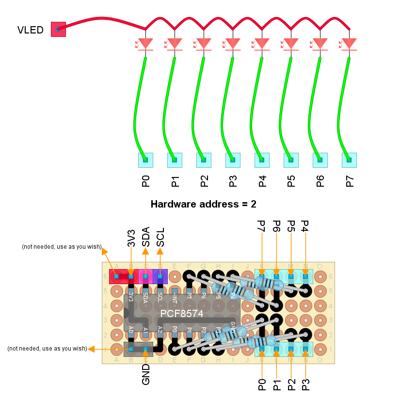

# PCF8574-driven "rev lights"

This telemetry indicator consists of eight single-color LEDs
arranged from left to right.
It displays the current engine RPM and flashes when the RPM limiter is reached.

The recommended display rate is 50 frames per second.

One I2C bus is required and the secondary bus is recommended.

## Hardware design

Edit [this design](./PCF8574RevLights.diy) using DIY Layout Creator.

Components required:

- Single color LEDs (x8).
  Forward voltage ( $V_F$ ) must not exceed 3.2 volts
  if you are wiring `VLED` to `3V3`.
  Red color is recommended ( $V_F=1.6$ ).
- 1 K-ohm resistors (x8).
- [PCF8574](../../esp32reference/PCF8574_datasheet.pdf) GPIO expander.
- Wires.

External wiring:

- `VLED` is wired to the power source.
  Both `3V3` and `5V` will work in this case.
- Attach `SCL` and `SCA` to the corresponding pins at the DevKit board.
  You may configure any output-capable pin as
  `SCL`/`SDA` to work as a secondary I2C bus.

## Firmware customization

The involved class is `PCF8574RevLights`.
Constructor parameters are:

- 1st: I2C *hardware* address (3 bits),
  as configured using pins `A0`, `A1` and `A2`.
  Pass `2` (decimal) when using the above design.
- 2nd: `true` to use the secondary I2C bus (default).
  `false` to use the primary I2c bus.
- 3rd: *factory-defined* I2C address (7 bits).
  Defaults to `20` (hexadecimal) as stated in the data sheet.
  However, the data sheet does not seem to be respected.
  Use the [I2C probe](../../../../src/Firmware/I2C_probe/I2C_probe.ino) to learn
  the actual I2C address.
  I found some chips using  address `38` (hexadecimal).

If you are using the secondary I2C bus,
you must first initialize it to the desired SDA and SCL pins.
See [Overview of telemetry](../../../telemetry_en.md).

See the corresponding
[integration test](../../../../src/QualityControls/UITests/PCF8574RevLights/PCF8574RevLights.ino)
for an example.
