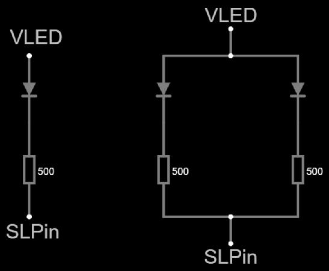

# Simple shift light

This telemetry indicator consists of one or two single color LEDs.
The LED lights up at maximum torque,
then flashes at maximum power,
then flashes faster at the rev limiter.

Only one output pin is required.

## Hardware design

The circuit is fairly straightforward
(choose one or two LEDs, left or right):



- `VLED` is wired to the power source.
  Both `3V3` and `5V` will work in this case.
- `SLPin` is wired to an output-capable GPIO pin.
  This pin will work in *open drain* mode.

Components required:

- One or two single color LEDs.
  Forward voltage ( $V_F$ ) must not exceed 3.2 volts
  if you are wiring `VLED` to `3V3`.
  Red color is recommended ( $V_F=1.6$ ).
- One or two 500 ohm **or higher** resistors.
  1 K-ohm is recommended.
  Lower impedance may damage your DevKit board.
  High impedance will result in dimmer lights.

[See at falstad.com](https://falstad.com/circuit/circuitjs.html?ctz=CQAgjCAMB0l3BWcMBMcUHYMGZIA4UA2ATmIxAUgoqoQFMBaMMAKACcRCAWcQq7kJhRQakFgBNOPPPx5g+gkOLoAzAIYBXADYAXFgA8QXCIULJsnYkcE8AagBkAogBEDIbGZTE8yKrgg8KDwAyvYACgCWAHZumBZcfthIXPE2IA4uEoJBIDLZcgrCyuraehwoOfJUFYEYwrRwsXXuKD7YHu7YAWmhkTGS2HjSfkO81Uqqmrrs7qNVs7X1oiwA7vmCzbiLUKvukNtbezxia4dCCxv1uzW5fvu3O6f3eYPDj0cPh1w+YkA)

## Firmware customization

The involved class is `SimpleShiftLight`.
Pass the `SLPin` as parameter to the constructor.
For example:

```c++
ui::add<SimpleShiftLight>(GPIO_NUM_40);
```

See the corresponding
[integration test](../../../../src/QualityControl/IntegrationTests/TelemetryIntegrationTest/TelemetryIntegrationTest.ino)
for an example.
