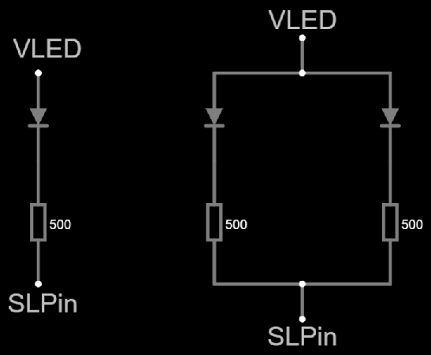

# Simple shift light

This telemetry indicator consists of one or two single color LEDs.
The LED lights up at maximum torque,
then flashes at maximum power,
then flashes faster at the rev limiter.

Only one output pin is required.

The recommended display rate is 50 frames per second.

## Hardware design

Components required:

- One or two single color LEDs.
- One or two 500 ohm or higher resistors.
  Lower impedance may damage your DevKit board.
  High impedance will result in dimmer lights.

The circuit is fairly straightforward (choose one or two LEDs):



- `3V3` is wired to the power source.
- `SLPin` is wired to an output-capable GPIO pin.

[See at falstad.com](https://falstad.com/circuit/circuitjs.html?ctz=CQAgjCAMB0l3BWcMBMcUHYMGZIA4UA2ATmIxAUgoqoQFMBaMMAKACdwU8RCAWT7mAyEoNSCwAmA8MOkoEIlCAl0AZgEMArgBsALiwAeyJJXC9yCbCH4p+2AGrZDyKlyVg+ILkhv8AygAyAAoAlgB2zm4g2MTRttZKvtGOkl7xYMRKKPGYWcpqWnrsafx4rumZopTiRkSx2LjRDU1WSYGhEVLYePwZSt02GHkqGjr6HAMgZdE94JW0cCwA7iVeQ9GQg0riK7hbG3abUMsHa-2zuccr2aVUe1NUO6fTk9NP9y9HvNziQA)

## Firmware customization

The involved class is `SimpleShiftLight`.
Pass the `SLPin` as parameter to the constructor.
For example:

```c++
auto sl = new SimpleShiftLight(GPIO_NUM_40);
```

See the corresponding
[integration test](../../../src/QualityControls/UITests/SimpleShiftLightTest/SimpleShiftLightTest.ino)
for an example.
