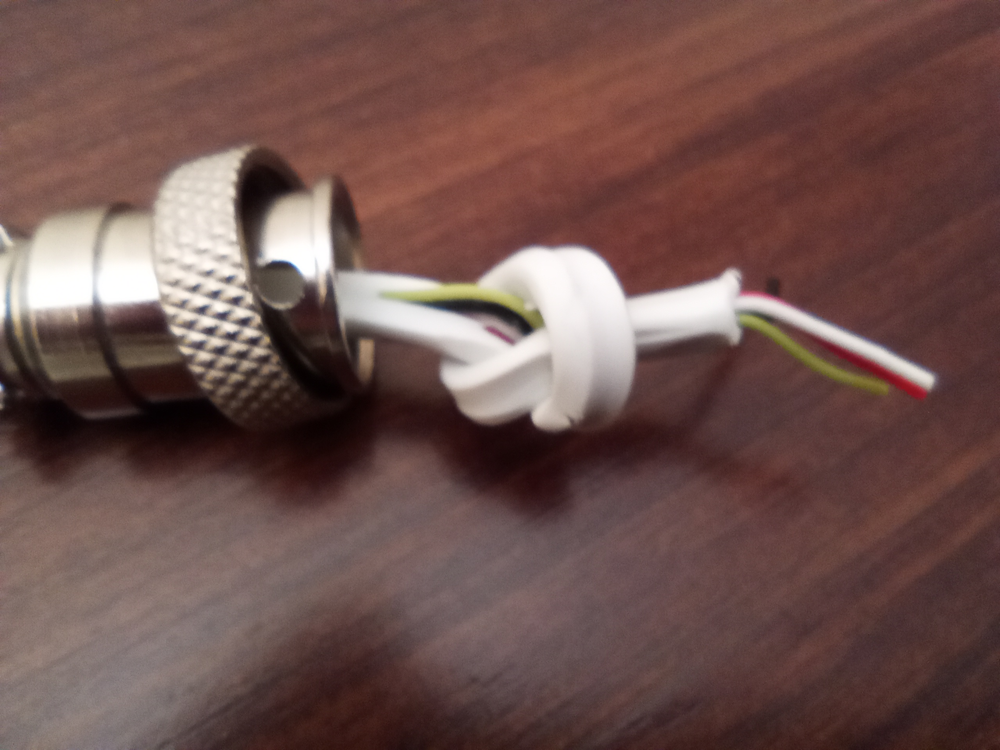

# Overview

There are few basic steps in building a DIY steering wheel or button box:

1. Build or purchase a steering wheel housing (or button box).
2. Build the electronics.
3. Put everything together.
4. Build a battery charging port (if required).

However, those are *not* independent steps.
Enough space is required inside the housing to fit the circuits,
buttons, batteries and cables.
Chosen components may have an effect on housing design and vice versa.

## Wheel housing

There are three choices:

1. **Purchase an already made wheel from a vendor**

   Since the steering wheel is already designed and build,
   there is little space for custom electronics.
   Some well-known vendors are:

   - [3D-Rap](https://www.3drap.it/)

   - [The french simracer](https://www.thefrenchsimracer.com/en/categorie-produit/diy-steering-wheel-kit/)

   - [Pokornyi Engineering](https://pokornyiengineering.com/collections/diy-parts-1)

   If you know other vendors, please, share your knowledge.

2. **Purchase a plan and build it**

   3D-print and CNC files are purchased from a vendor,
   so there is some space for customization if you have the skills.
   Those files may be passed to a local manufacturer for 3D printing or CNC mechanization.
   Some well-known plan vendors are:

   - [Open sim racing](https://opensimracing.com/collections/race-wheel-plans)

   - [Pokornyi Engineering](https://pokornyiengineering.com/collections/diy-designs)

   - [AM Studio projects](https://amstudioprojects.com/steering-wheels/)

   If you know other vendors, please, share your knowledge.

3. **Design and build your own housing**

   You have total control over the design, so everything can fit perfectly.
   However, you need to have the skills...

   If that is your case, please, consider to contribute an open design to the community.

## Build the electronics

This is the main subject of this project. Steps are:

1. Choose a ready-to-deploy circuit design or customize one of them.
   The firmware is flexible enough to fit many needs.
   There are many correct circuit layouts for the same circuit design,
   so there are chances to fit the electronics into your wheel housing.
   However, you have to plan carefully which components to choose.
2. Purchase the required parts.
3. Build the circuit.
4. Setup the Arduino environment.
5. Compile and upload the firmware.
6. Test.

## Put everything together

This is a straight forward step: connect buttons, paddles and the like to the circuit board.

## Build a battery charging port

The charging port is made of a USB cable and
[GX16](https://duckduckgo.com/?q=GX16+plug&iax=images&ia=images)
plugs (male and female).
Cut the USB cable into two pieces, near the micro-USB end.

### Steering Wheel side

1. Attach the GX16 male plug to the housing.
2. Attach the micro-usb end to the powerboost module or the DevKit board (as required).
3. Solder the red and black wires to any two pins, matching the female plug.

### PC side

1. Insert the GX16 cover into the USB cable.

2. Make a knot on the cut end.

   

3. Solder the red and black wires to any two pins, matching the male plug.
