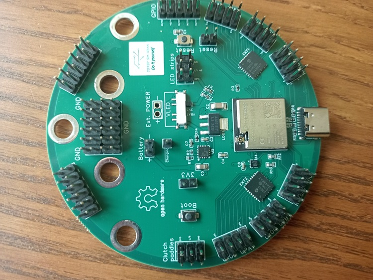
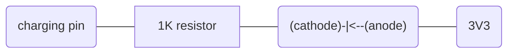
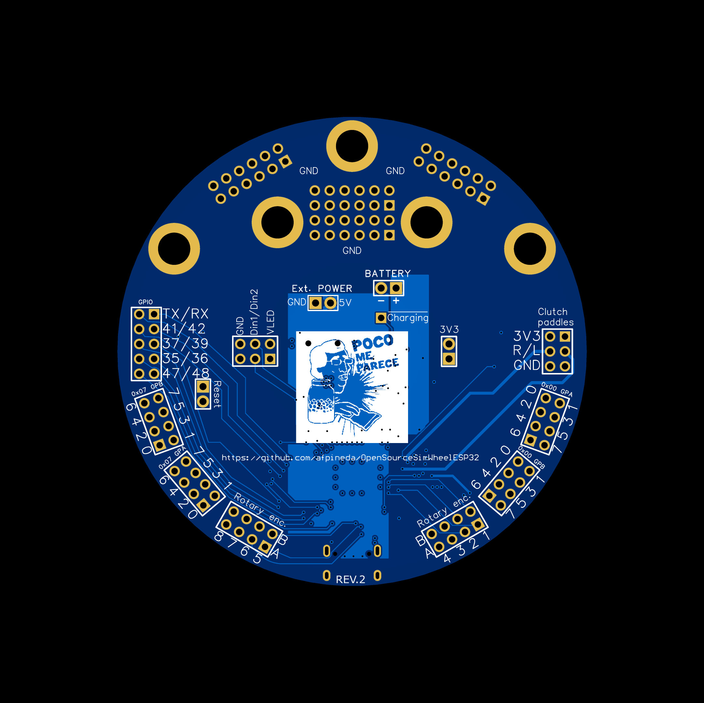

# Custom ESP32-S3 board for simracing



> [!NOTE]
> This board has been manufactured and tested (REV2).
> It works.

## Features

- ESP32-S3.
- 4MB flash and 2MB PS-RAM.
- External power supply (~5V DC) via quick release or cable.
- Optional LiPo/Li-ion battery.
- Battery charger:

  - Supports **safe** battery charging and discharging simultaneously.
    This also enhances battery life.
  - Automatically switches from external power to battery.
  - The charging current is automatically adapted to the state of charge with priority to the ESP32.
    The maximum charging current is 300 mA.
  - LiPo and Li-ion chemistries.

- "Fuel gauge" (state of charge).
- BLE (wireless) or USB (wired) connectivity.
- 32 switches.
- 8 rotary encoders.
  Can also be configured for other uses.
- 2 analog clutch paddles (potentiometers or HE sensors).
- 2 RGB LED strips (user-selected power).
- 10 additional GPIO pins available for customization.
  Can be expended in additional switches, rotary encoders, etc.
- 50.8mm and 70mm quick release mounting holes.
  **Special care must be taken not to crush the PCB with the fastening screws of the quick release**.
  Use additional nuts to prevent this.

## Antenna

An **external antenna** is required (you have to purchase one separately).
The following coaxial connectors are compatible:

- W.FL Series connector from Hirose.
- MHF III connector from I-PEX (also known as IPEX3)
- AMC connector from Amphenol

**Note that U.FL connectors are not compatible**.

It is recommended to select an antenna that meets the following requirements:

- 2.4 GHz band.
- 50 ohm impedance.
- The maximum gain should not exceed 2.33 dBi.

You can find them in the
[Adafruit store](https://www.adafruit.com/product/5445),
AliExpress or other retailers.

## Power supply

There are **three** power plugs in the board:

- `5V` and `GND` pads (for short, "external power").

  **Take care not to swap those terminals**.
  There is no reverse polarity protection.
  Connect this plug to the quick release if available
  or to a power connector housed in the casing.
  If you have a Simagic QR, `GND` is the yellow wire and `5V` is the green one.
  Labeled as `External power` in the board.

- USB cable.

  Under no circumstances should you connect both power plugs simultaneously.
  You could **damage** the board or your simracing gear.
  Detach the *external power* plug before connecting the USB cable.
  Keep this present when uploading firmware.

- Battery `+` and `-` pads ("Battery plug" for short).
  There is reverse polarity protection in the battery charger,
  but **not in the fuel gauge**.
  **Take care not to swap those terminals**.

### Power requirements

- External power plug:
  - DC voltage: min. 4V6, max. 10V.
    There is over voltage protection.
  - Input current: max. 1A.

- Battery (optional):
  - Just one battery is supported.
    Do not attach two or more batteries, not in parallel, nor in series.
  - Only LiPo or Li-ion chemistries are supported.
  - Single-cell "1S" battery, max. 4V7.

## Support for LED strips

Two optional single-wire LED strips are available.
You must choose a power supply for the LED strips
(labeled `VLED`) using the onboard switch:

- **5V**:

  `VLED` is connected directly to the external power plug.
  In such a case, the power supply must meet the requirements of the LED strips,
  which are typically a maximum of 5.3 volts DC.
  This option provides unregulated power, but sufficient voltage.
  It will not work without a permanent external power supply.

- **3V3**

  `VLED` is connected to the 3V3 LDO regulator,
  providing constant voltage and brightness.
  However, the voltage may not be sufficient to display the correct colors.
  You can reduce the global brightness to compensate for this.
  This option works if power is supplied either from the battery
  or from an external source.

- **VBAT**

  If the external power supply is connected,
  this option provides constant brightness at 4.4 regulated volts
  (sufficient for any LED strip).
  If not, this option powers the LED strips directly from the battery.
  The colors will be correct but will fade as the battery runs out.
  Power may fluctuate while the battery is charging.

Please, operate the VLED switch while there is no power supply.

## External wiring

Use `GND` as a common pole for all switches and rotary encoders.
There are more than enough `GND` pads available on the board.
However, you can also chain `GND` from one switch (or rotary encoder) to the next.

There are two `3V3` pads available to power other devices,
but note that the maximum current the board can deliver is 1A to the whole system.

The `Charging` pad works in open-drain mode and is active LOW.
You can attach a LED witness via a 1K-ohm resistor in this way:



The pin out is printed on the back of the board:



## System shutdown

It is recommended to attach a non-momentary switch to one pole of the battery to shutdown the system.
The firmware is also able to enter *deep sleep* mode as a shutdown option.
It will deplete the battery but at a very slow rate.
To wake up the system you can configure one of the RTC pins
(assigned to the rotary encoders)
or attach an external push button to the `Reset` pads.

## GPIO configuration

- RGB LED strips:

  GPIO 40 (`Din1`) and GPIO 38 (`Din2`) **must**
  be configured in *open drain* mode,
  as those pins are pulled up.

- Primary I2C bus

  GPIO 8 (`SDA`) and GPIO 9 (`SCL`) **must** be
  configured as the primary I2C bus.
  The I2C bus has external pullup resistors.
  Two GPIO expanders are attached to this bus.
  Their hardware addresses are `0` and `7` (decimal).

- Rotary encoders:

  | Rotary # |  A pin   |  B pin   |
  |:--------:|:--------:|:--------:|
  |    1     |  GPIO 4  |  GPIO 5  |
  |    2     |  GPIO 7  |  GPIO 6  |
  |    3     |  GPIO 11 |  GPIO 10 |
  |    4     |  GPIO 13 |  GPIO 12 |
  |    5     |  GPIO 17 |  GPIO 18 |
  |    6     |  GPIO 16 |  GPIO 21 |
  |    7     |  GPIO 15 |  GPIO 33 |
  |    8     |  GPIO 14 |  GPIO 34 |

  *Note* that `A` and `B` pins can be customized
  for other uses, for example, additional switches.

- Analog clutch potentiometers (ADC pins)

  - Right clutch paddle: GPIO 1 (potentiometer 1)
  - Left clutch paddle: GPIO 2 (potentiometer 2)

- Other GPIO pins available for customization:

  35, 36, 37, 39, 41, 42, 47, 48, RXD0 and TXD0.

- GPIO pins **not available**:

  - GPIO 3 (bootstrap)
  - GPIO 26 (PSRAM)
  - GPIO 45 (bootstrap)
  - GPIO 46 (bootstrap)

## Manufacturing

Link to project in *Open Source Hardware Labs*:
[https://oshwlab.com/afpineda/simwheelkit_esp32_unified](https://oshwlab.com/afpineda/simwheelkit_esp32_unified).
You can one-click order manufacturing from that site.

Take this information into account when ordering:

- This board is designed for the **JLC04161H-3313** physical stacking.
- Minimum hole (via) size is 0.3mm (12mil).
- PCB thickness is 1.6mm.
- Copper weight:
  - Outer: 1oz
  - Inner: 0.5oz
- You can safely choose the cheapest via covering.
- 4 layers (Signal/power + GND + GND + Signal/power).
- Pin headers are **not included** in the bill of materials (BOM) on purpose.
  You can safely ignore any error message regarding them.
  Direct wire soldering is a better option than pin headers for the intended application,
  but you can choose to mount them:
  open in *EasyEDA PRO*,
  select each pin header and change the property `Add into BOM` to `true`.
- If you choose to include the pin headers in the BOM,
  take into account that `PWRH1` **is mounted on the back**,
  as this is the place where the quick release have the wires.
- Each quick release may require a different connector.

### Files

- [Easy EDA Pro](./CustomDevKit.epro)

  Some parts are designed but not included in the BOM (see notes above).
  *Note:* you can import this file to *KiCAD 9* or later.

- [Bill of materials](./CustomDevKit_BOM.csv)

- [Pick and place](./CustomDevKit_PickAndPlace.csv)

- [Schematic](./CustomDevKit_schematic.pdf)

- [GERBER](./CustomDevKit_GERBER.zip)

## Firmware customization

Arduino's sketch named
[**CustomDevKitFirmware**](../../../src/Firmware/CustomDevKitFirmware/CustomDevKitFirmware.ino)
is the place where you build your own firmware by modifying a few specific lines of code.
You may want to make a copy first to prevent your customized code from being deleted after updating.
To make a working copy:

- Copy the entire folder under a different name.
  Place that copy in the `src/Firmware` folder.
- Make sure that both the folder and the ".ino" file inside it have exactly the same name.

To choose a **connectivity** option:

- Edit the file **"includes.txt"** at your sketch folder.
  Replace the text "hid_NimBLE.cpp" with a filename chosen from this table:

  | Connectivity | Stack         | Filename       |
  | ------------ | ------------- | -------------- |
  | BLE          | NimBLE        | hid_NimBLE.cpp |
  | BLE          | ESP32-Arduino | hid_ESPBLE.cpp |
  | USB          | ESP32-Arduino | hid_USB.cpp    |

  Those file names are case-sensitive if you have Linux or Mac.

- Do not confuse those with "hidCommon.cpp".
  Do not touch that line.
- Run the [sources setup procedure](../../firmware/sourcesSetup_en.md) again.
  **This is mandatory**.

There a few things to customize as noted in the sketch file:

- To configure a custom device name and manufacturer modify the following lines:

  ```c++
  std::string DEVICE_NAME = "Custom steering wheel";
  std::string DEVICE_MANUFACTURER = "Me";
  ```

- If you have BLE connectivity and battery power without a power on/off switch,
  modify `SHUTDOWN_ON_DISCONNECTION` in this way:

  ```c++
  #define SHUTDOWN_ON_DISCONNECTION true
  ```

  Additionally, configure a *wake up* pin in this line:

  ```c++
  #define WAKE_UP_PIN ROT1A
  ```

  which is configured to the first rotary encoder by default.
  For rotary encoders, you can use either the `A` or `B` pins.

  You can also wire an external push button to the `Reset` pads for *wake up*.

- If you have USB connectivity,
  or you have BLE connectivity with external power,
  or you have BLE connectivity with battery power and a power on/off switch,
  leave `SHUTDOWN_ON_DISCONNECTION` in this way:

  ```c++
  #define SHUTDOWN_ON_DISCONNECTION false
  ```

- Configure the LED strips by setting the number of pixels on each.
  If you are not using an LED strip, set it to zero.

  ```c++
  #define LED_STRIP1_COUNT 8
  #define LED_STRIP2_COUNT 0
  ```

  By default *WS2812* pixel drivers are configured,
  but you can [change that](../../hardware/ui/PixelControl_en.md).

- If you don't have battery power,
  modify `ENABLE_BATTERY` in this way:

  ```c++
  #define ENABLE_BATTERY false
  ```

- If you have battery power,
  leave `ENABLE_BATTERY` unmodified:

  ```c++
  #define ENABLE_BATTERY true
  ```

  and choose whether you want the system to shutdown on very low battery levels:

  ```c++
  #define SHUTDOWN_ON_LOW_BATTERY false
  ```

  write `false` or `true` to the right of `SHUTDOWN_ON_LOW_BATTERY`.

You can further customize the firmware at will.
See the
[customization how-to](../../hardware/subsystems/CustomizeHowto_en.md).

## Firmware uploading

No PC driver needs to be installed.
Your board **must** enter *bootloader mode* for the serial port to become available
and Arduino IDE recognizing the board.
To enter *bootloader mode*, press and hold `BOOT`,
then press and release `RESET`, then release `BOOT`.

In Arduino IDE, configure your board in this way (board configuration):

- *Board*: ESP32S3 Dev Module (esp32).
- *Upload mode*: USB-OTG CDC (TinyUSB).

If you have USB connectivity do **not** set *USB CDC on Boot* to "Enabled".

**You must click on the `Reset` button after uploading**.

## Hardware revisions

- REV 2:
  First publicly available PCB.

- REV 1:
  Not publicly available.
