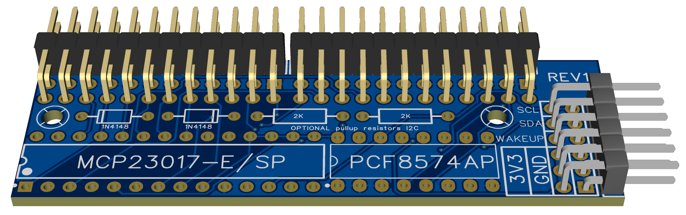

# Module for 24 switches



> [!NOTE]
> This board has been manufactured and tested (REV1).
> It works.

## Features

- 24 external switches.
- Through-hole mounting.
- Pulled up switches (common pole to `GND`).
- Based on GPIO expanders in the I2C bus.

## Parts

This PCB is designed to assemble the components yourself using basic tools.
Thus, you only need to order the fabrication of the board as the price is much lower.

- MCP23017 in though-hole packaging (MCP23017-E/SP): x1
- PCF8574 in though-hole packaging (PCF8574AP): x1
- Diodes: x2

  - You can omit the diodes **only** if you do not need to make use of the `WAKE UP` pin.
  - Pay attention to the orientation of the diodes.
  - Any Schottky type diode with low forward voltage can be used.
    The 1N4148 brand is recommended.

- Resistors (**optional**): x2

  - By default, it is not necessary to solder the resistors.
  - They must be soldered if the capacitance of the wires prevents the correct operation of the I2C bus,
    which is not often the case.
    This can occur when long wires are used and several devices are hooked to the bus.
  - Use any impedance between 1K-ohm and 10K-ohm.
    2K-ohm is recommended.

- Double row bended male Dupond headers (**optional**)

  You can also solder the wires directly to the board (recommended).

  - 2x12P (24 pins total): x2
  - 2x6P (12 pins total): x1

## Manufacturing

This PCB was designed using *Easy EDA Pro*.
If you want to order a PCB to their
[prototyping service](https://jlcpcb.com/?href=easyeda-home),
take into account that parts are not included in the *bill of materials* (BOM).
To include them, edit the *schematic*, select a component (grayed out) and
set the property "Add into BOM" to "true".
If you opt for their assembly service,
you will receive an error message regarding the screws.
They can simply be chosen not to be assembled.

Link to project in *Open Source Hardware Labs*:
[https://oshwlab.com/afpineda/module24switches_th_2025](https://oshwlab.com/afpineda/module24switches_th_2025).
You can one-click order manufacturing from that site.

PCB manufacturing details:

- 2 layers.
- Default physical stacking (there are no choices).
- FR-4 base material (the cheapest, but you may choose another).
- Vias:
  - Minimum hole size is 0.3 mm.
  - Minimum ring diameter is 0.4 mm.
  - Use the cheapest covering.
- Copper weight: 1oz.

### Files

- [Easy EDA Pro](./Module24Switches_TH_2025.epro)

  Parts designed but not included in the BOM (see notes below).
  *Note:* you can import this file to *KiCAD 9* or later.

- [Bill of materials](./Module24Switches_TH_2025-BOM.csv)

  *Note:* not needed unless you want to order components to the manufacturer.

- [Pick and place](./Module24Switches_TH_2025-PickAndPlace.csv)

  *Note:* not need unless you want to order mounting to the manufacturer.

- [Schematic](./Module24Switches_TH_2025.pdf)

- [GERBER](./Module24Switches_TH_2025-Gerber.zip)

## Assembly

Pay close attention to the correct orientation of the chips.
There is a small circle next to the first pin.
This is also marked on the PCB with a square pad, a small dot or a circle.
Ensure that these match.

## Usage

Only **one** module can be attached to a DevKit board,
as the I2C hardware addresses are fixed:

- MCP23017: hardware address 7 (decimal)
- PCF8574: hardware address 0 (decimal)

To enable this module in your custom firmware:

```c++
void simWheelSetup()
{
    ...
    MCP23017Expander chip1;
    PCF8574Expander chip2;

    // Place the input numbers you want
    // This is just an example
    chip1[MCP23017Pin::GPA0]=0;
    ...
    chip1[MCP23017Pin::GPA7]=7;
    chip1[MCP23017Pin::GPB0]=8;
    ...
    chip1[MCP23017Pin::GPB7]=15;
    ...
    chip2[PCF8574Pin::P0]=16;
    ...
    chip2[PCF8574Pin::P7]=23;

    // The following two lines are mandatory
    inputs::addMCP23017Expander(chip1,7);
    inputs::addPCF8574Expander(chip2,0);
    ...
}
```

## External wiring

- There are three `3V3`/`GND` pairs.
  Attach one pair to the power supply,
  and use the others as you wish.
  As a suggestion, wire them to the clutch paddle potentiometers.

- There are two `SCL`, `SDA` and `WAKE UP` pins.
  Wire one of each to the DevKit board and
  use the others as a pass-through to other modules.

- Wire the switches in columns.
  There are printed tags in the back of the board to know which is which.


> [!CAUTION]
> The power supply pins are designed for low current demand,
> **maximum 400 mA**.
> Do not attempt to power power-hungry devices
> through these pins or they will melt.
