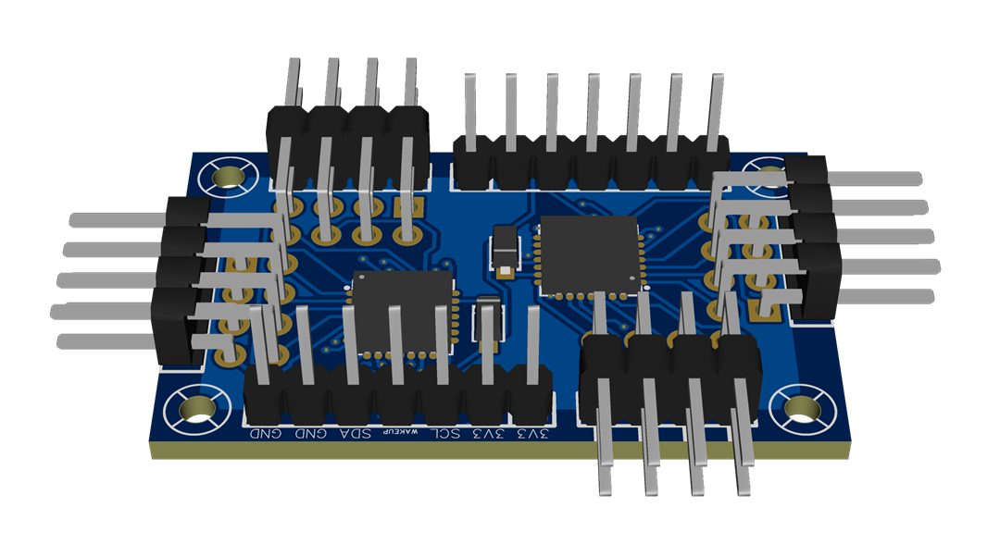

# Module for 32 switches



> [!WARNING]
> This board has not been manufactured or tested.
> It may contain design flaws.
> If you build it, please, give feedback.

## Features

- 32 external switches
- Surface mounting (more expensive but you have a smaller board)
- Pulled up switches (common pole to `GND`)
- Based on GPIO expanders in the I2C bus

## Files

- [Easy EDA Pro](./Module32Switches_SM.epro)

  *Note:* you can import this file to *KiCAD 9* or later.

- [Schematic](./Module32Switches_SM.pdf)
- [GERBER](./Module32Switches_SM_GERBER.zip)
- [Bill of materials (BOM)](./Module32Switches_SM_BOM.csv)
- [Pick & place](./Module32Switches_SM_PickAndPlace.csv)

## Manufacturing

This PCB is designed to be **assembled by a professional supplier**,
except for the optional pin headers (through-hole).
You should solder the wires directly to the board,
but you can use pin headers instead.

### Pin headers (and screws)

The *EasyEDA* project files exclude those parts from the BOM,
but they are part of the design.
The standalone *BOM* file, includes them.

To keep costs low, you should exclude them from the assembly order
and solder them yourself.

- Bended male Dupond headers:

  - 2x4P (8 pins total): x4
  - 1x7P (7 pins): x2.
    *Note*: the design shows straight Dupond headers,
    but you should use bended headers.

## Notes

### Usage

Only **one** module can be attached to a DevKit board,
as the I2C hardware addresses are fixed to 7 and 0 (decimal).
To enable this module in your custom firmware:

```c++
void simWheelSetup()
{
    ...
    MCP23017Expander chip1;
    MCP23017Expander chip2;

    // Place the input numbers you want
    // This is just an example
    chip1[MCP23017Pin::GPA0]=0;
    ...
    chip1[MCP23017Pin::GPA7]=7;
    chip1[MCP23017Pin::GPB0]=8;
    ...
    chip1[MCP23017Pin::GPB7]=15;
    ...
    chip2[MCP23017Pin::GPA0]=16;
    ...
    chip2[MCP23017Pin::GPA7]=22;
    chip2[MCP23017Pin::GPB0]=24;
    ...
    chip2[MCP23017Pin::GPB7]=31;
    ...

    // The following two lines are mandatory
    inputs::addMCP23017Expander(chip1,7);
    inputs::addMCP23017Expander(chip2,0);
    ...
}
```

### External wiring

- There are several `3V3` and `GND` pins.
  Attach one pair to the power supply,
  and use the others as you wish.

- Use one or more `GND` pins as a common pole for all the switches.

- There are two `SCL`, `SDA` and `WAKE UP` pins.
  Wire one of each to the DevKit board and
  use the others as a pass-through to other modules.

### I2C bus

The I2C bus is internally pulled up by the DevKit board.
Due to wire capacitance, I2C operation could fail.
This can occur when long wires are used and several devices are hooked to the bus.
In case of need, wire (externally) an additional resistor between these terminals:

- `3V3` and `SCL`.
- `3V3` and `SDA`.

Use any impedance between 1K-ohm and 10K-ohm.
2K-ohm is recommended.
