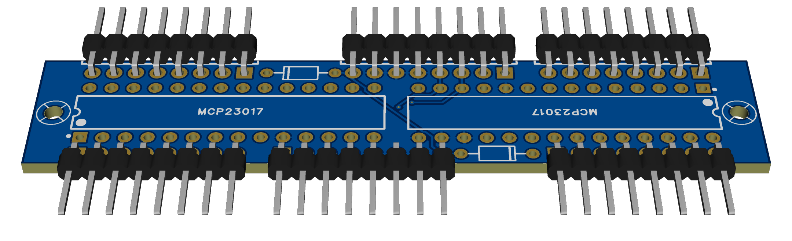
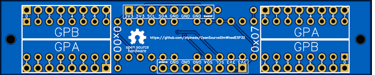

# Module for 32 switches



> [!WARNING]
> This board has not been manufactured or tested.
> It may contain design flaws.
> If you build it, please, give feedback.

## Features

- 32 external switches
- Through-hole mounting
- Pulled up switches (common pole to `GND`)
- Based on GPIO expanders in the I2C bus

## Files

- [Easy EDA Pro](./Module32Switches_TH.epro)

  Parts designed but not included in the BOM (see notes below).
  *Note:* you can import this file to *KiCAD 9* or later.

- [Schematic](./Module32Switches_TH.pdf)
- [GERBER](./Module32Switches_TH_GERBER.zip)

## Parts

This PCB is designed to assemble the components yourself using basic tools.
Thus, you only need to order the fabrication of the board as the price is much lower.

- MCP23017 in though-hole packaging: x2
- Diodes: x2

  - You can omit the diodes **only** if you do not need to make use of the `WAKE UP` pin.
  - Pay attention to the orientation of the diodes.
  - Any Schottky type diode with low forward voltage can be used.
    The 1N4148 brand is recommended.
  - The positive pole is very close to another soldering pad.
    Don't worry. It does not matter if you solder them together
    as they are already connected by a trace.

- Bended male Dupond headers (**optional**)

  You can also solder the wires directly to the board.

  - 1x8P (8 pins): x6

## Notes

### Manufacturing

This PCB was designed using *Easy EDA Pro*.
If you want to order a PCB to their
[prototyping service](https://jlcpcb.com/?href=easyeda-home),
take into account that the components are not included in the *bill of materials* (BOM).
You will receive an error message regarding those.
To include them, edit the *schematic*, select a component (grayed out) and
set the property "Add into BOM" to "true".

### Assembly

Pay close attention to the correct orientation of the chips.
There is a small circle next to the first pin.
This is also marked on the PCB with a square pad, a small dot or a circle.
Ensure that these match.

### Usage

Only **one** module can be attached to a DevKit board,
as the I2C hardware addresses are fixed to 7 and 0 (decimal).
To enable this module in your custom firmware:

```c++
void simWheelSetup()
{
    ...
    MCP23017Expander chip1;
    MCP23017Expander chip2;

    // Place the input numbers you want
    // This is just an example
    chip1[MCP23017Pin::GPA0]=0;
    ...
    chip1[MCP23017Pin::GPA7]=7;
    chip1[MCP23017Pin::GPB0]=8;
    ...
    chip1[MCP23017Pin::GPB7]=15;
    ...
    chip2[MCP23017Pin::GPA0]=16;
    ...
    chip2[MCP23017Pin::GPA7]=22;
    chip2[MCP23017Pin::GPB0]=24;
    ...
    chip2[MCP23017Pin::GPB7]=31;
    ...

    // The following two lines are mandatory
    inputs::addMCP23017Expander(chip1,7);
    inputs::addMCP23017Expander(chip2,0);
    ...
}
```

### External wiring

- There are redundant `3V3` and `GND` terminals.
  Attach one pair to the power supply,
  and use the others as you wish.
  As a suggestion, wire them to the clutch paddle potentiometers.

- Use one or more `GND` pins as a common pole for all the switches.

- There are two `SCL`, `SDA` and `WAKE UP` pins.
  Wire one of each to the DevKit board and
  use the others as a pass-through to other modules.

### I2C bus

The I2C bus is internally pulled up by the DevKit board.
Due to wire capacitance, I2C operation could fail.
This can occur when long wires are used and several devices are hooked to the bus.
In case of need, wire (externally) an additional resistor between these terminals:

- `3V3` and `SCL`.
- `3V3` and `SDA`.

Use any impedance between 1K-ohm and 10K-ohm.
2K-ohm is recommended.

## Pin out

The pin out should be printed in the back of the board.


