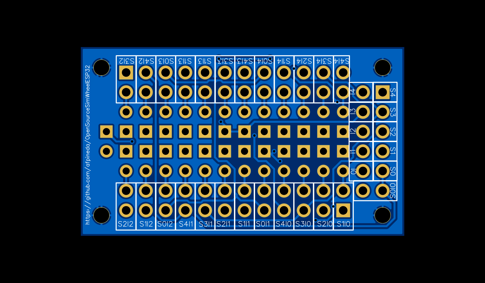

# Module for 25 switches (button matrix)

> [!NOTE]
> This board has been manufactured and tested (REV2).
> It works.

## Features

- 25 external switches.
- Through-hole mounting.
- **No common pole for switches**.
- Based on a button matrix: 5 selector and 5 input pins.

## Files

- [Easy EDA Pro](./ModuleBtnMatrix25sw.epro)

  Parts designed but not included in the BOM (see notes below).
  *Note:* you can import this file to *KiCAD 9* or later.

- [Bill of materials](./ModuleBtnMatrix25sw_BOM.csv)

  *Note:* not needed unless you want to order parts to the manufacturer.

- [Pick and place](./ModuleBtnMatrix25sw_PickAndPlace.csv)

  *Note:* not needed unless you want to order mounting to the manufacturer.

- [Schematic](./ModuleBtnMatrix25sw.pdf)
- [GERBER](./ModuleBtnMatrix25sw_GERBER.zip)

## Parts

This PCB is designed to assemble the components yourself using basic tools.
Thus, you only need to order the fabrication of the board as the price is much lower.

- Diodes (**mandatory**): x25

  - Any Schottky type diode with low forward voltage can be used.
    The 1N4148 brand is recommended.

- Bended male Dupond headers (**optional**)

  You can also solder the wires directly to the board.

  - 2x12P (24 pins): x2
  - 2x6P (12 pins): x1

## Manufacturing

This PCB was designed using *Easy EDA Pro*.
If you want to order a PCB to their
[prototyping service](https://jlcpcb.com/?href=easyeda-home),
take into account that the components are not included in the *bill of materials* (BOM).
You will receive an error message regarding those.
To include them, edit the *schematic*, select a component (grayed out) and
set the property "Add into BOM" to "true".

Link to project in *Open Source Hardware Labs*:
[https://oshwlab.com/afpineda/module25switches_th_matrix](https://oshwlab.com/afpineda/module25switches_th_matrix).
You can one-click order manufacturing from that site.

## Assembly

Pay attention to the orientation of the diodes,
which is printed in the front side.
Place the diodes in vertical position,
so they lay in a minimal surface of the board.

## Pin out

The pin out should be printed in the back of the board.

- Selector pins are tagged as `S<n>`.
- Input pins are tagged as `I<n>`.
- Each switch is tagged as `S<a>I<b>`,
  which means that it is attached to `S<a>` and `I<b>`.

## External wiring

- Wire the switches **in columns** to the lateral headers,
  except for *S0I0*,
  which is placed in the first column of the central header.

- Wire one screw to `GND` to provide shielding (optional).

- The button matrix is designed to work in *positive logic*.
  If you swap the selector and input pins, it works in *negative logic*.

## Usage

See the button matrices in the [switches subsystem](../../hardware/subsystems/Switches/Switches_en.md).
