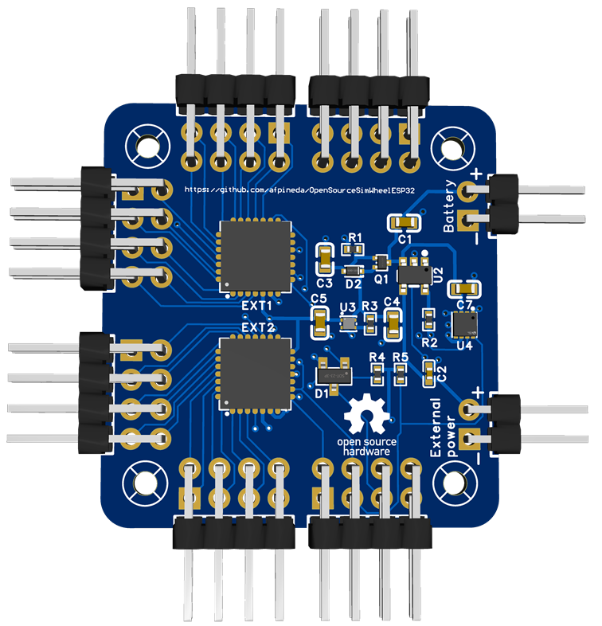
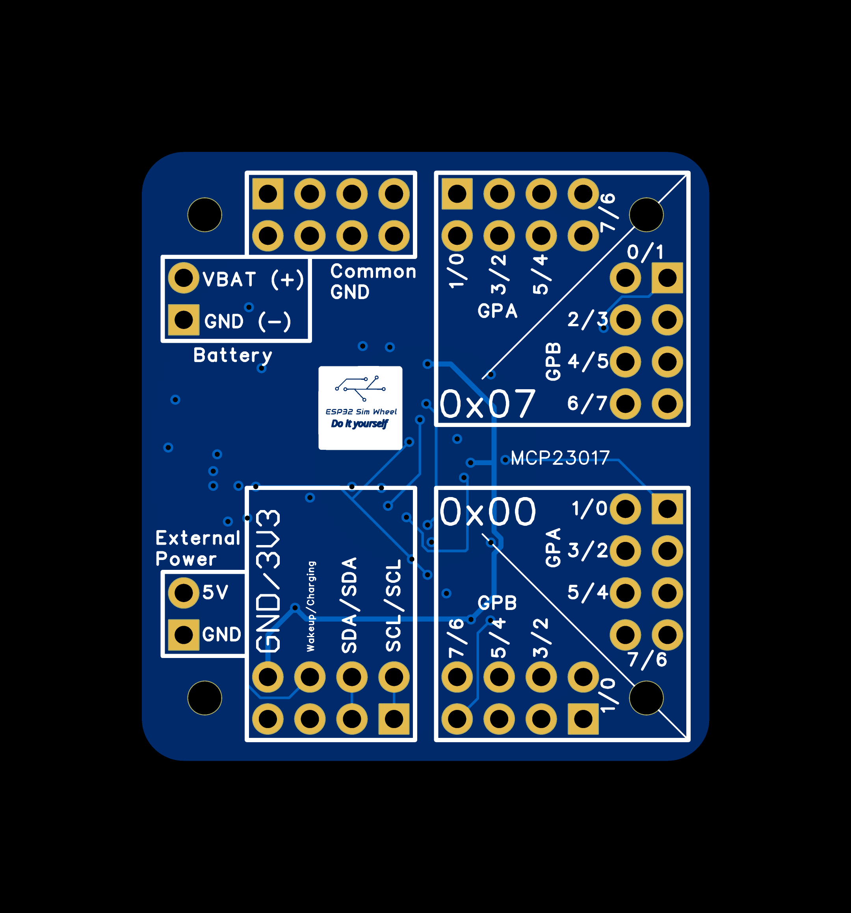
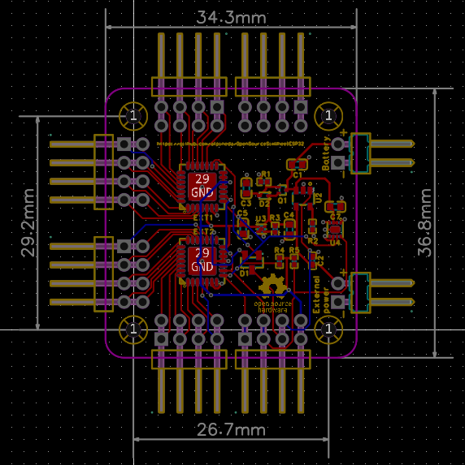

# Play and charge module



> [!WARNING]
> This board has not been manufactured or tested.
> It may contain design flaws.
> If you build it, please, give feedback.

## Features

- 32 external switches (pulled up - common pole to `GND`).
  Based on MCP23017 GPIO expanders in the I2C bus.
- LiPo / Li-ion "1S" battery charger.
- MAX17048 *fuel gauge* in the I2C bus.
- 3V3 power output for your DevKit board.

## Files

- [Easy EDA Pro](./ModulePlayAndCharge.epro)

  *Note:* you can import this file to *KiCAD 9* or later.

- [Schematic](./ModulePlayAndCharge_schematic.pdf)
- [GERBER](./ModulePlayAndCharge_GERBER.zip)
- [Bill of materials (BOM)](./ModulePlayAndCharge_BOM.csv)
- [Pick and place](./ModulePlayAndCharge_PickAndPlace.csv)
- [Layer manager](./ModulePlayAndCharge_layers.json)

## Manufacturing and assembly

You must order assembly for this board as it requires SMD mounting.
You **may want** to exclude the pin headers from the BOM and the assembly.
This way you can solder the wires directly to the pads.
Power and battery headers are already excluded.

This PCB was designed using *Easy EDA Pro*.
If you want to order a PCB to their
[prototyping service](https://jlcpcb.com/?href=easyeda-home),
note that some components are not included in the BOM on purpose.
You may receive an error message regarding those.
The minimum order is 5 units,
but you can choose to assembly only two boards in order to save money.

The manufacturing process is JLC04161H-3313 (4 layers).

## Usage

> [!CAUTION]
> **Maximum output current is 500 mA**.
> Do not attempt to power power-hungry devices
> through these pins or they will melt.

- External power for battery charging:
  - Minimum input voltage: 4.6V.
  - Maximum input voltage: **5.5V**.
    **Higher voltages will damage the board**.
  - The battery charging current is 300mA.

- This module is designed for a **single** "1S" battery,
  maximum 4.7 volts. Do not place batteries in series.

- Only **one** module can be attached to a DevKit board.

- Hardware addresses of GPIO expanders are fixed to 7 and 0 (decimal).

- The I2C bus is pulled up using onboard 10K-ohm resistors
  (labeled `R4` and `R5`).

To enable this module in your custom firmware (just an example):

```c++
void simWheelSetup()
{
    ...
    MCP23017Expander chip1;
    MCP23017Expander chip2;

    // Place the input numbers you want
    // This is just an example
    chip1[MCP23017Pin::GPA0]=0;
    ...
    chip1[MCP23017Pin::GPA7]=7;
    chip1[MCP23017Pin::GPB0]=8;
    ...
    chip1[MCP23017Pin::GPB7]=15;
    ...
    chip2[MCP23017Pin::GPA0]=16;
    ...
    chip2[MCP23017Pin::GPA7]=22;
    chip2[MCP23017Pin::GPB0]=24;
    ...
    chip2[MCP23017Pin::GPB7]=31;
    ...

    // The following two lines are mandatory
    inputs::addMCP23017Expander(chip1,7);
    inputs::addMCP23017Expander(chip2,0);
    ...
}

...


void customFirmware()
{
   ...
   batteryMonitor::configure();
   ...
}
```

## External wiring

- Use one or more `GND` pins as a common pole for all the switches.

- There are two `SCL` and `SDA` pins.
  Wire one of each to the DevKit board and
  use the others as a pass-through to other modules (if required).

- **Take care not to swap the polarity** of the battery or the external power.

- **Take care not to swap battery and external power** wires.

- It is advised not to use pin headers for the battery and external power wires.
  Solder the wires to the pads instead.

## Pin out

The pin out should be printed in the back of the board.



## Board size and mounting holes

