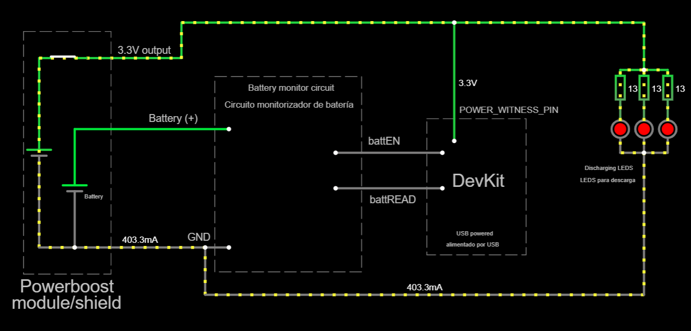

# Battery calibration procedure

**Note**: completing this procedure may take hours or days, however, no human supervision is required. This procedure is **optional**.

## Purpose

Due to non-linearity of battery charge versus battery voltage, only a rough and imprecise estimation can be achieved. This procedure collects calibration data in order to provide an accurate estimation of battery charge for your particular battery.
Data is saved to flash memory, so it can be reused later at any other sketch. This procedure will go through a complete discharge cycle.

As a backup measure, calibration data is also dumped to the serial port, so you can copy-paste it into the [restoration sketch](../../BatteryTools/RestoreBatteryCalibration/README_en.md) in case of need. This way, this procedure does not need to be run more than once.
You may also contribute this data to the community.

## Warning

In this particular case, **under no circumstances should you power the DevKit board with the powerboost module/shield nor the batteries**. The board could get damaged. The system will get power from the USB cable.

## Hardware setup

This procedure uses the same circuit board as a predefined or custom setup, but it can be built into a prototype board too.

Actual GPIO numbers are defined inside the [sketch](./BatteryCalibration.ino), compatible with all predefined setups. You can edit them to fit your custom setup. They are: `BATT_EN_PIN`, `BATT_READ_PIN` and `POWER_WITNESS_PIN`.

### Involved subsystems

- [Power](../../../../doc/hardware/subsystems/Power/Power_en.md). **Do not wire "3V3"** (from the powerboost module) to "3V3" (at the circuit board nor the Devkit board). Instead, wire "3V3" to `POWER_WITNESS` which, by default, is the same pin for `OLED_SCL` (do not wire the OLED, since we are reusing one of its pins). Wire "GND" as usual. Obviously, the powerboost module must not be connected to any USB power source.

- [Battery monitor](../../../../doc/hardware/subsystems/BatteryMonitor/BatteryMonitor_en.md). Wire as usual.

You must provide some load for the sole purpose of battery drainage. A pair of LEDs in parallel will do the job. They drain 100mA each, more or less. However, **ensure that no more than 400mA are drained**. This is the [wiring plan](https://falstad.com/circuit/circuitjs.html?ctz=CQAgjCAMB0l3BWK0AcB2ATATjAZhbgGy6aR64gAslISCktApgLRhgBQAbiM7kSBkgoefQj0rCGDSg1zQKU5Ai48MKYYOHM1wiVH0yq0DPqnRlAdxH9Nq9QKFR2V7ZnFaw1d05c6HHsBNbDgAPEUIgwixVGzcaDBoABQB7C0YAJwAjZOSAZwAXdkyRBDQeFBptXGiEmkh2MNckTxNtenBKJBphACEAQ3z8jIBPBpiGZgRKsARoyYgaTxA5XAA1AB1c5IBXfIAHXbHWfjAsObBIJEETRZoAcQA5ABEjsHt8HkCKSgWOkH7BiNNgAKdZ7ACURR4ZxiIBhCQg9UaU3EIAinyo4BMAKG6WGmwAtskAHYAS3yyXSmwAxqT0tTtuSjigxKcQPYMDcsSAAMJ0hnk5KEkmC9KkgBefQAJpTNlLGJtMgMMgBbvpjC7CKLgdpxP5KwYAUQezk+XmYelY5qwYnqLk8lRtAgS0NtptYgX85QYtnqxTeZVwNFwGAgockY05EECYmw0ewmJdT0YnAA0kz7Z7bB6gm47Z8s3EUD63BwrIRFmovYEI40SBQ46oMFcsDR4jQiVLtgAbRgAelyAAtSYxu1LTZzHbGXRWBJHcGGxER4tFKyBEgB5ADqhoASgB9LcASQAKg9DQBlC-7xJHk1WSeuqjFp-1XLWMQWrQYNxf0wgAAzPpu1yRgNQuDphDAUsEF+JYDXyXdDQAQReINAIsKV0mSPZ1gARzAaAyggLB5AwFg2H0DBUE6NBcCmQgUDOTxIDQOpwHYMB0WoKCxB49kfQwrCcPwwjiP-GAyE47iXy458GBfEwAMw7DcIIojwAk2AOC4kxYJMOT9IEgQhNU0SNMRUxtPYdIqD0OT+N4EwGDwU0JAmJ13JEZy3JfJy7K0EMfAC4yvJffMwukRS8xs+TwD4vygpc3BYqMwzPX85LfImIKjMy7LjKM8KxhkFzIG+QhmkgPj2RAJ5SVyalBz6dIAHNSWJVrNgAGUNJ4LzGapK2kRisW+Wrev6zY9havo5UYRqWta9Uwk5YisFzVksC6WqAFULx6abUgyRhx1WvAHDKNR4gg7oQGA0kCUYYl8mlIVcj2WVcn2npTVnRTHGK3x7EtF89HqIA):

Note that the 13-ohms resistors are part of the LEDs themselves, not external resistors.

Use [Online calculator: Battery discharge time depending upon load](https://planetcalc.com/2283/) to estimate how long will it take to deplete the battery.

## Procedure

1. **Ensure that the battery is fully charged, and not charging, before proceeding**.

2. Turn the powerboost module _off_. If there is not a button/switch, disconnect the "3V3" wire for now.

3. Power the DevKit board through the USB cable, connected to your PC.

4. Upload the sketch ([BatteryCalibration.ino](./BatteryCalibration.ino)) to the DevKit board.

5. Open the serial monitor.

6. Reset.

7. You should see this message:
   
   > [EN] To continue, wire '3V3' (from the powerboost module) to POWER_WITNESS pin.

8. Turn the powerboost module _on_. If there is not a button/switch, connect the "3V3" wire again.

9. The following message should show up:
   
   > [EN] Calibration in progress.

10. Wait for the battery to deplete. All LEDS will go off, and the following message will show at the serial monitor:
    
    > --END--FIN--

The calibration data is now saved to flash memory, however, copy the calibration data from the serial monitor for backup.
