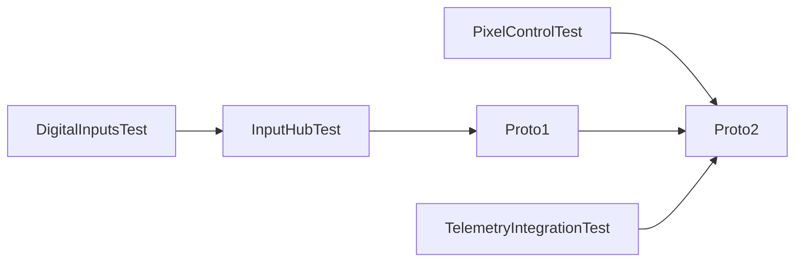

# Manual integration test strategy

Ensure that all unit test have failed before proceeding to integration testing
(*YES, they have to fail, since their purpose is to reveal bugs, but they don't*).

- This is an incremental, bottom-up strategy.
- Just the subsystems being integrated are listed.
  In **bold text** we highlight the subsystems being added
  to the previous tests.
- Since there are automated integration tests in the CD/CI chain,
  this integration strategy is not a step-by-step incremental one.

Run order:

Render this graph at
[mermaid.live](https://mermaid.live/view#pako:eNpljr0OgkAMgF-FdJZBRwYXGTRxMMpkbqlQ4JK7Kzl6UWN4d0_Bn2in_nxf2xuUXBFkUBs-ly16SbZ75ZIYuW60oNm4LkhfUC9Jmi6TZ7kOp0dj5Hb6QmbFTjybN7bzLLwYgW_lM5xP9jP_cwoyZEn8deOEGo-i2f0shxlY8hZ1Fd-_PTQF0kZLQRbTimoMRhQoN0QUg_Dh6krIxAeagefQtJDVaPpYha5CoVxjPGVfSIfuyGwnaLgDPf5kfQ)

## *Test name*: [TelemetryIntegrationTest](./TelemetryIntegrationTest/README.md)

- hid (NimBLE)
- telemetry
- ui:
  - SimpleShiftLight
  - PCF8574RevLights

## *Test name*: [DigitalInputsTest](./DigitalInputsTest/README.md)

- DigitalInput:
  - RotaryEncoderInput
  - ButtonMatrixInput
  - DigitalButton
- inputs

## *Test name*: [PixelControlTest](./PixelControlTest/PixelControlTest.ino)

- hid (NimBLE)
- pixels
- ui:
  - PixelControlNotification

## *Test name*: [InputHubTest](./InputHubTest/README.md)

- DigitalInput
- **AnalogInput**
- inputs
- **inputMap**
- **inputHub**

## *Test name*: [Proto1](./Proto1/README.md)

- DigitalInput:
  - RotaryEncoderInput
  - ButtonMatrixInput
  - DigitalButton
- AnalogInput:
  - AnalogClutchInput
- inputs
- inputHub
- **storage**
- **firmware**
- **hid (NimBLE)**

> [!NOTE]
> This is a working prototype

## *Test name*: [Proto2](./Proto2/README.md)

- DigitalPolledInput:
  - RotaryEncoderInput
  - ButtonMatrixInput
  - DigitalButton
- inputs
- storage
- inputHub
- inputMap
- hid (NimBLE)
- firmware
- **power**
- **batteryMonitor**
- **batteryCalibration**
- **telemetry**
- **ui**
- **pixels**

> [!NOTE]
> This is a system test
