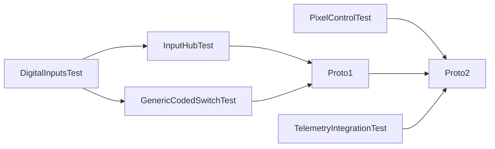

# Manual integration test strategy

Ensure that all unit test have failed before proceeding to integration testing
(*YES, they have to fail, since their purpose is to reveal bugs, but they don't*).

- This is an incremental, bottom-up strategy.
- Just the subsystems being integrated are listed.
  In **bold text** we highlight the subsystems being added
  to the previous tests.
- Since there are automated integration tests in the CD/CI chain,
  this integration strategy is not a step-by-step incremental one.

Run order:

Render this graph at
[mermaid.live](https://mermaid.live/view#pako:eNp9kctuwjAQRX8lmnVAoUkK9qIbqFqkVkKFVZWNGw-JJcdGZiygiH-vk6hAS1Wv5nHPHdtzhNJKBA5rbXdlLRxFL2-FicKZqUqR0HOz8bRd4ZaiweAh6tJn_9EW_tM9oUGnymlwl8udorK-EAu1Rz21hpzVZ2DhLNm7XnA95NIc9c2_nW9kfXxjvUKNDZI7zA1h5QQpa37dAWJo0DVCyfAvxxYrgOpAFcBDKHEtvKYCCnMKUuHJLg-mBE7OYwx-IwXhTIlg3vwsPkpF1n3XnPVVDXwt9DZkG2HerT0D2Elf-910KwoAGoluar0h4HmHAD_CHjhjw3ScsWySp-kkSRmL4QA8S9gwZ_ejPE_GaTLKk-wUw2c3JBlOgv76xFC59sHt-NMXB6ms0Q)

## *Test name*: [TelemetryIntegrationTest](./TelemetryIntegrationTest/README.md)

- hid (NimBLE)
- telemetry
- ui:
  - SimpleShiftLight
  - PCF8574RevLights

## *Test name*: [DigitalInputsTest](./DigitalInputsTest/README.md)

- DigitalInput:
  - RotaryEncoderInput
  - ButtonMatrixInput
  - DigitalButton
- inputs

## *Test name*: [PixelControlTest](./PixelControlTest/PixelControlTest.ino)

- hid (NimBLE)
- pixels
- ui:
  - PixelControlNotification

## *Test name*: [InputHubTest](./InputHubTest/README.md)

- DigitalInput
- **AnalogInput**
- inputs
- **inputMap**
- **inputHub**

## *Test name*: [GenericCodedSwitchTest](./GenericCodedSwitchTest/README.md)

- inputs
- **inputHub**
  (only binary coded switches)

## *Test name*: [Proto1](./Proto1/README.md)

- DigitalInput:
  - RotaryEncoderInput
  - ButtonMatrixInput
  - DigitalButton
- AnalogInput:
  - AnalogClutchInput
- inputs
- inputHub
- **storage**
- **firmware**
- **hid (NimBLE)**

> [!NOTE]
> This is a working prototype

## *Test name*: [Proto2](./Proto2/README.md)

- DigitalPolledInput:
  - RotaryEncoderInput
  - ButtonMatrixInput
  - DigitalButton
- inputs
- storage
- inputHub
- inputMap
- hid (NimBLE)
- firmware
- **power**
- **batteryMonitor**
- **batteryCalibration**
- **telemetry**
- **ui**
- **pixels**

> [!NOTE]
> This is a system test
