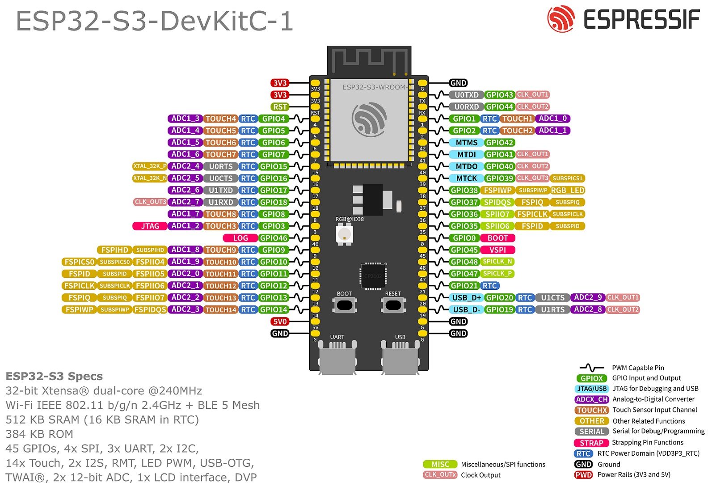

# Quality control (overview)

Starting with version 5.0.0, the
[ESP32S3-DevKitC V1.0](https://docs.espressif.com/projects/esp-idf/en/latest/esp32s3/hw-reference/esp32s3/user-guide-devkitc-1.html)
is the main board for development and testing.
However, all tests should work in a pure ESP32 board, too.

## Pin-out plan (ESP32S3)

| **GPIO** | **Usages**                                       |
| :------: | ------------------------------------------------ |
|    04    | Button matrix I2                                 |
|    05    | Button matrix I1                                 |
|    06    | Button matrix I0                                 |
|    07    | Button matrix S1                                 |
|    15    | Button matrix S0                                 |
|    16    | Multiplexer I1                                   |
|    17    | Multiplexer I2                                   |
|    18    | Power LATCH                                      |
|    08    | Primary I2C bus (SDA)                            |
|    03    | **Reserved (strap pin)**                         |
|    46    | **Reserved (strap pin)**                         |
|    09    | Primary I2C bus (SCL)                            |
|    10    | Rotary encoder SW, WAKE UP pin (power subsystem) |
|    11    | Rotary encoder DT                                |
|    12    | Rotary encoder CLK                               |
|    13    | Potentiometer ADC                                |
|    14    | Potentiometer ADC                                |
|   ---    | ---                                              |
|    19    | **Not usable (USB)**                             |
|    20    | **Not usable (USB)**                             |
|    21    | Multiplexer S0, Secondary SDA                    |
|    47    | Multiplexer S1, Secondary SCL                    |
|    48    | Multiplexer S2                                   |
|    45    | **Reserved (strap pin)**                         |
|    00    | Digital button (BOOT)                            |
|    35    | **Not usable (PSRAM)**                           |
|    36    | **Not usable (PSRAM)**                           |
|    37    | **Not usable (PSRAM)**                           |
|    38    | ALPS Encoder B                                   |
|    39    | Shift register LOAD, DOut (Led Strip)            |
|    40    | Shift register NEXT, Simple shift light pin      |
|    41    | Shift register SERIAL                            |
|    42    | BattEN (Battery monitor enable)                  |
|    02    | BattREAD (Battery monitor ADC)                   |
|    01    | ALPS Encoder A                                   |
| 44 (RX)  | **Not usable (serial port)**                     |
| 43 (TX)  | **Not usable (serial port)**                     |

**Note**: the onboard RGB led (pixel) uses GPIO #38 in revision 1.1,
but GPIO #48 in revision 1.0.
In any case, there is a solder pad that needs to be in short-circuit
for the built-in RGB led to work.
We are not using the built-in pixel for testing,
but we are using both GPIOs for other purposes.

Can not be tested at the same time:

- Shift registers and the LED strip (pixel control)
- Shift registers and the simple shift light (telemetry)
- Analog multiplexers and the PCF8574 LED driver (telemetry)

## Pin-out plan (ESP32)

| **GPIO** | **Usages**                                                  |
| :------: | ----------------------------------------------------------- |
|    36    | Potentiometer ADC, Shift register SERIAL                    |
|    39    | Potentiometer ADC,                                          |
|    34    | Rotary encoder SW, WAKE UP pin (power subsystem)            |
|    35    | Rotary encoder CLK                                          |
|    32    | Rotary encoder DT, Shift register LOAD                      |
|    33    | ALPS Encoder A, Shift register NEXT, Simple shift light pin |
|    25    | ALPS Encoder B                                              |
|    26    | Button matrix I0                                            |
|    27    | Button matrix I1                                            |
|    14    | Button matrix I2                                            |
|    12    | Button matrix S0                                            |
|    13    | Button matrix S1                                            |
|    9     | **Not usable (flash mem)**                                  |
|    10    | **Not usable (flash mem)**                                  |
|    11    | **Not usable (flash mem)**                                  |
|   ---    | ---                                                         |
|    6     | **Not usable (flash mem)**                                  |
|    7     | **Not usable (flash mem)**                                  |
|    8     | **Not usable (flash mem)**                                  |
|    15    | BattREAD (Battery monitor ADC)                              |
|    2     |                                                             |
|    0     | Digital button (BOOT)                                       |
|    4     | Multiplexer I0                                              |
|    16    | Multiplexer I1                                              |
|    17    | BattEN (Battery monitor enable)                             |
|    5     | Multiplexer S0                                              |
|    18    | Multiplexer S1                                              |
|    19    | Multiplexer S2                                              |
|    21    | DOut                                                        |
|    3     | **Not usable (serial port)**                                |
|    1     | **Not usable (serial port)**                                |
|    22    |                                                             |
|    23    | Power LATCH                                                 |

Can not be tested at the same time:

- Shift registers and the ALPS funky switch
- Shift registers and telemetry (simple shift light)

