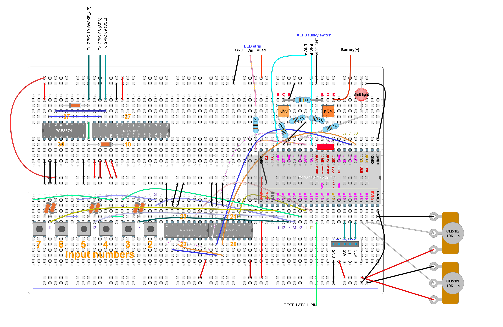

# Unit test: Input from an analog joystick

## Purpose and summary

To test the correct reading of the position of an analog joystick in
the X and Y axes.

## Hardware setup

Use this [test circuit](../../../Protoboards/MainTestBoard.diy):



Optionally, we are replacing the *clutch potentiometers* with
an analog joystick which, in turn, are just two potentiometers.
Those are wired to `TEST_ANALOG_PIN1` and `TEST_ANALOG_PIN2`.

The rest position for both potentiometers must be at the center of their travel.
Keep this in mind during the testing procedure.

Output through the serial monitor at 115200 bauds.

## Procedure and expected output

1. Ensure the joystick/potentiometers are in **rest position**.
2. Reset. Ignore output from the operating system itself.
3. Output must show:

   ```text
   -- READY --
   -- GO --
   ```

4. Ignore other output.
5. Wait for 30 seconds or so.
   There must be no further output.
6. Move the joystick (or the clutch potentiometers) to the "up" position
   and then return to rest.
7. Move the joystick (or the clutch potentiometers) to the "down" position
   and then return to rest.
8. Move the joystick (or the clutch potentiometers) to the "left" position
   and then return to rest.
9. Move the joystick (or the clutch potentiometers) to the "right" position
   and then return to rest.
10. Move the joystick (or the clutch potentiometers) to the "top-left" position
    and then return to rest.
11. Move the joystick (or the clutch potentiometers) to the "top-right" position
    and then return to rest.
12. Move the joystick (or the clutch potentiometers) to the "bottom-left"
    position and then return to rest.
13. Move the joystick (or the clutch potentiometers) to the "bottom-right"
    position and then return to rest.
14. Now look for the following lines in the serial monitor
    **in no particular order**:

    ```text
    0000000000000000000000000000000000000000000000000000000000000001
    0000000000000000000000000000000000000000000000000000000000000010
    0000000000000000000000000000000000000000000000000000000000000100
    0000000000000000000000000000000000000000000000000000000000001000
    0000000000000000000000000000000000000000000000000000000000000110
    0000000000000000000000000000000000000000000000000000000000001001
    0000000000000000000000000000000000000000000000000000000000000101
    0000000000000000000000000000000000000000000000000000000000001010
    ```

15. Check that each line showing any "1" is followed by this line:

    ```text
    0000000000000000000000000000000000000000000000000000000000000000
    ```

16. Check that no other line shows up apart from the previous nine lines.
    In particular, the following lines **must not show up**:

    ```text
    0000000000000000000000000000000000000000000000000000000000000011
    0000000000000000000000000000000000000000000000000000000000001100
    0000000000000000000000000000000000000000000000000000000000001111
    ```
