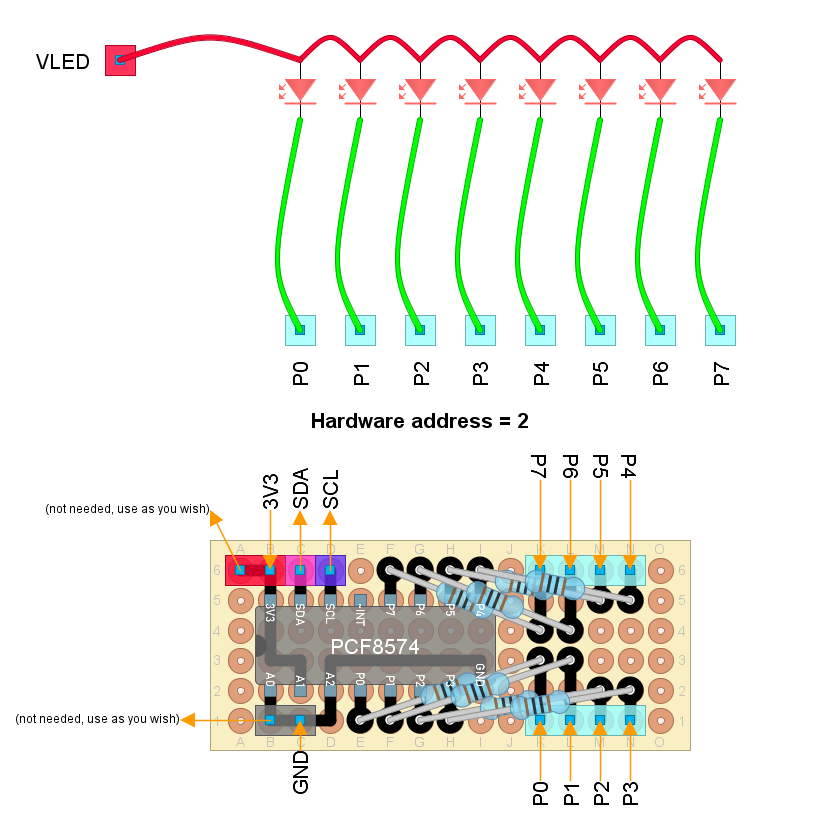

# Unit test: PCF8574-based LED driver

## Purpose and summary

To test that the LED driver is properly interfaced using the secondary I2C bus.

## Hardware setup

We are using the [PCF8574 Rev lights circuit](../../../../../doc/hardware/ui/PCF8574RevLights/PCF8574RevLights.diy):



... in the secondary I2C bus.
Check the constants `TEST_SECONDARY_SDA` and `TEST_SECONDARY_SCL`
to know the proper `SDA` and `SCL` pins.

## Procedure and expected output

To prevent any misundersanding, the sketch will list all
I2C devices in the secondary bus and print their addresses.
Check you are using the correct one.
The sketck uses the I2C hardware address `2`
combined with the I2C factory address `38` (hexadecimal).
Yo must modify the sketch if your PCF8574 uses another address.

1. Reset.
2. Ignore output until:

   ```text
   --GO--
   ```

3. Ensure the chip was detected during auto-discovery
   in the previous step.
4. All LEDs must go on.
   Output must show `All ON`.
5. All LEDs must go off.
   Output must show `All OFF`.
6. The right-most LED must go on.
   Output must show `Shift right`.
7. The lit LED must move slowly to the left-most position.
8. The left-most LED must go on.
   Output must show `Shift left`.
9. The lit LED must move slowly to the right-most position.
10. Both the left-most and the right-most LED must go on.
    Output must show `Extremes ON`.
11. Back to 4.
