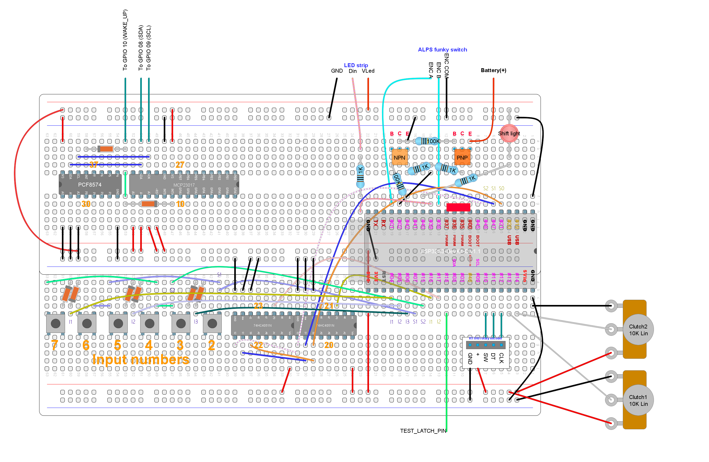

# Unit test: battery monitor

## Purpose and summary

To test that the voltage divider monitor circuit works:

- There is a coherent ADC reading
- The circuit is enabled and disabled when required

Note that there is another automated test unit in the CD/CI chain for the voltage divider monitor,
so this test is simpler than expected.

## Hardware setup

Use this [test circuit](../../../Protoboards/MainTestBoard.diy):



We are using the battery monitor subsystem, only:
`TEST_BATTERY_READ_ENABLE` and `TEST_BATTERY_READ`.

If the resistors in the voltage divider are not the designed ones,
you must modify the parameters to the constructor in `VoltageDividerMonitor`.

`Battery(+)` will be wired to different inputs through this procedure.
Use a wire with Dupond terminals.
Get ready a fully charged battery.
Do not wire the positive terminal yet.

**If the battery is charging** during the test,
you will get altered results,
thus invalidating this test procedure.

> [!CAUTION]
> Do not wire the negative pole of the battery (**risk of fire**)
> when attached to a powerboost/battery charger.
> Wire `GND` from the powerboost module instead.

Output through USB serial port at 115200 bauds.

## Procedure and expected output

1. Ensure `Battery(+)` is not wired.
2. Reset. Ignore output from the operating system itself.
3. The following lines must appear:

   ```text
   --READY--
   Getting battery status...
   Battery presence: false
   Charging: false
   Wired power: true
   SoC: unknown
   Done.
   --GO--
   ```

4. The previous output must repeat at least for 20 seconds.
5. Wire `battery(+)` to `3V3`. Wait for output.
6. The following lines must appear (not literally):

   ```text
   --READY--
   Getting battery status...
   Battery presence: true
   Charging: false
   Wired power: unknown
   SoC: 42
   Done.
   --GO--
   ```

7. The number next to `SoC:` may be different, but close.
   Take note of that number, named "L1" for future reference.
8. Wire `battery(+)` to the positive terminal of the battery.
   Wait for output.
9. Take note of the displayed number next to `SoC:`, named "L2".
10. "L2" must be greater then "L1".
