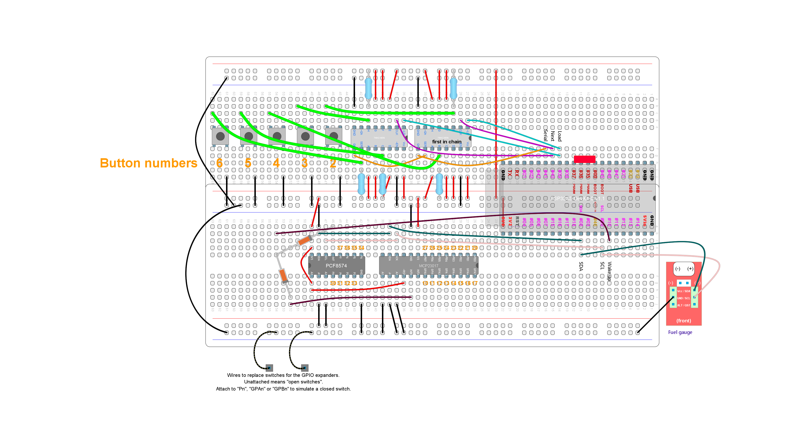

# Integration test: combined input from several buttons (shift registers and GPIO expanders)

## Purpose and summary

To test correct identification and combination of events caused by different kinds of digital inputs.
Individual events are combined into a global state bitmap (one bit for each input).

This is a complementary test for [DigitalInputsTest](../DigitalInputsTest/README.md), which differs
just in the involved hardware. For that reason, this test may seem trivial. However, it's still needed.

## Hardware setup

Actual GPIO numbers are defined at [debugUtils.h](./debugUtils.h).
Use this [test circuit](../../Protoboards/TestBoard2.diy):



This test circuit does not have micro-switches attached to the GPIO expanders due to its excessive number.
Two wires will replace them. For future reference, those wires are called "probe1" and "probe2".
You have to manually wire/unwire them to/from the requested pin to close/open the circuit.

Output through USB serial port at 115200 bauds.

## Procedure and expected output

1. Reset
2. On start, output must match the following:

   ```text
   -- READY (DigitalInputsTest2) --
   -- GO --
   ```

3. Wire "probe1" to #30. Ignore output.
4. Wire "probe2" to #20. The last two lines must show:

   ```text
   STATE : 0000000000000000000000000000000001000000000100000000000000000000
   CHANGE: 0000000000000000000000000000000000000000000100000000000000000000
   ```

5. Press and release switch #6. The last four lines must show:

   ```text
   STATE : 0000000000000000000000000000000001000000000100000000000001000000
   CHANGE: 0000000000000000000000000000000000000000000000000000000001000000
   STATE : 0000000000000000000000000000000001000000000100000000000000000000
   CHANGE: 0000000000000000000000000000000000000000000000000000000001000000
   ```
