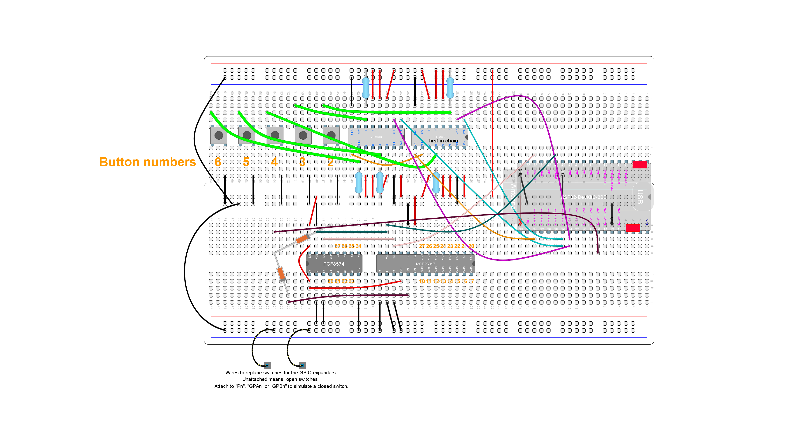

# Integration test: wake up from GPIO expanders

## Purpose and summary

To test that GPIO expanders are able to wake up the system from deep sleep using interrupt signals.

## Hardware setup

Actual GPIO numbers are defined at [debugUtils.h](./debugUtils.h),
except for `TEST_POWER_PIN` which is redefined inside the sketch itself.
Use this [test circuit](../../Protoboards/ESP32-WROOM-DevKitC-2.diy):



Just the GPIO expanders are used.
This test circuit does not have micro-switches attached to the GPIO expanders due to its excessive number.
Two wires will replace them. For future reference, those wires are called "probe1" and "probe2".
You have to manually wire/unwire them to/from the requested pin to close/open the circuit.

Output through USB serial port at 115200 bauds.

## Procedure and expected output

1. Reset. Ignore output from the operating system itself.
2. Output must match the following lines:

   ```text
   Wake up was not caused by deep sleep: 0

   Using GPIO 14 as wake up source. Wake up when LOW
   Please, wait...
   Entering deep sleep mode
   ```

3. Wait for 30 seconds. No output is expected.
4. Wire "probe2" to #20 and unwire immediately.
5. The system must reboot. Ignore output from the operating system itself.
6. Output must match:

   ```text
   Wake up was not caused by deep sleep: 0

   Using GPIO 14 as wake up source. Wake up when LOW
   Please, wait...
   Entering deep sleep mode
   ```

7. Output must match the following, which differs from the previous one:

   ```text
   Wake up caused by external signal using RTC_CNTL

   Using GPIO 14 as wake up source. Wake up when LOW
   Please, wait...
   Entering deep sleep mode
   ```

8. The previous output could be repeated twice. This is OK.
9. Wire "probe2" to #33 and unwire immediately.
10. Output must match the following, which does **not** differ from the previous one:

    ```text
    Wake up caused by external signal using RTC_CNTL

    Using GPIO 14 as wake up source. Wake up when LOW
    Please, wait...
    Entering deep sleep mode
    ```

11. The previous output could be repeated twice. This is OK.
